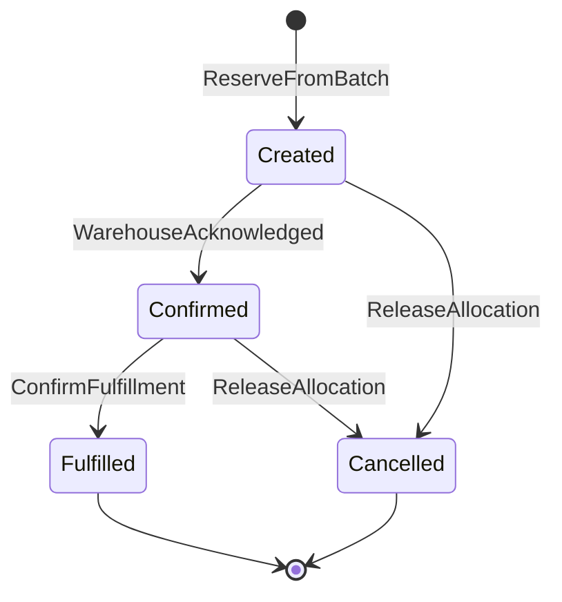

# State Machines: Inventory Management

## AllocationStatus

The lifecycle of a stock reservation from creation through final resolution (fulfillment or cancellation).

### States

| State | Terminal | Description |
|-------|---------|-------------|
| Created | no | Stock decremented; awaiting warehouse acknowledgement |
| Confirmed | no | Warehouse has begun picking; ready for shipment |
| Fulfilled | yes | Stock shipped; allocation permanently closed |
| Cancelled | yes | Reservation released; stock returned to available |

### Transition Table

| From | Event | To | Guard | Effect |
|------|-------|----|-------|--------|
| [new] | ReserveFromBatch | Created | R3, R4 pass | Decrement `batch.availableQuantity`, emit `inventory.InventoryAllocated` |
| Created | WarehouseAcknowledged | Confirmed | — | Internal warehouse confirmation signal |
| Created | ReleaseAllocation | Cancelled | R5 pass | Restore `batch.availableQuantity`, emit `inventory.AllocationReleased` |
| Confirmed | ConfirmFulfillment | Fulfilled | — | Emit `inventory.FulfillmentConfirmed` |
| Confirmed | ReleaseAllocation | Cancelled | R5 pass | Restore `batch.availableQuantity`, emit `inventory.AllocationReleased` |

### Invalid Transitions (must be rejected)

| From | Attempted Event | Why Invalid |
|------|----------------|-------------|
| Fulfilled | ReleaseAllocation | Stock already shipped — cannot be returned |
| Fulfilled | any | Terminal state |
| Cancelled | any | Terminal state — stock already returned |
| Created | ConfirmFulfillment | Must be Confirmed before fulfillment |

### Invariants

| ID | Invariant | Formal |
|----|-----------|--------|
| I1 | Allocated quantity never exceeds original batch quantity | `allocation.quantity <= batch.quantity` |
| I2 | Fulfilled allocations have a fulfillment timestamp | `status == Fulfilled → fulfilledAt != null` |
| I3 | Cancelled allocations have no outstanding stock claim | `status == Cancelled → batch.availableQuantity' == batch.availableQuantity + allocation.quantity` |
| I4 | Total allocated quantity across active allocations ≤ batch quantity | `∑(active allocations for batch) <= batch.quantity` |
| I5 | Created timestamp never changes | `∀ transitions: createdAt' == createdAt` |
