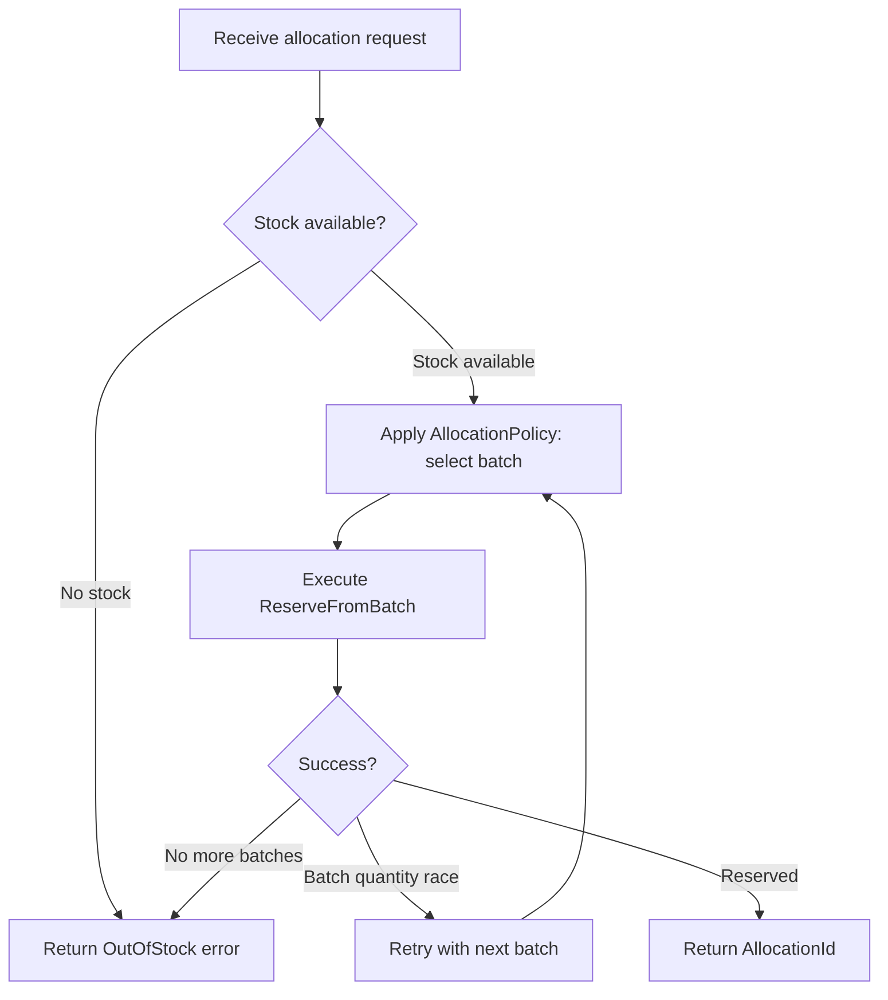

# Workflows: Inventory Management

## AllocateInventoryWorkflow

**Type:** Workflow
**Triggers:** Order Management requests stock allocation (via `InventoryModule.allocate(orderId, productId, quantity)`)
**Orchestrates:** [ReserveFromBatch](operations.md#reservefrombatch), [ReleaseAllocation](operations.md#releaseallocation)
**Compensation Strategy:** saga — if any step fails, all completed reservations for this order are released in reverse order
**Idempotency:** conditional — safe to retry if no allocation exists for `orderId + productId`; duplicate guard enforced by R7

### Steps



### Step Table

| # | Step | Actor | Operation | On Success | On Failure | Compensation |
|---|------|-------|-----------|------------|------------|--------------|
| 1 | Check total available stock | System | — (read) | Go to step 2 | Return INSUFFICIENT_STOCK | — |
| 2 | Select batch via AllocationPolicy | System | — (policy) | Go to step 3 | Return OUT_OF_STOCK if no eligible batch | — |
| 3 | Reserve stock from selected batch | System | [ReserveFromBatch](operations.md#reservefrombatch) | Return AllocationId | If INSUFFICIENT_BATCH_QUANTITY → retry step 2 with next batch | [ReleaseAllocation](operations.md#releaseallocation) |

### Invariants

| ID | Invariant | Formal |
|----|-----------|--------|
| W1 | A successful workflow always produces exactly one allocation | `result.allocationId != null → ∃ exactly 1 allocation for orderId+productId` |
| W2 | Compensation fully restores available stock | `after compensation: stockLevel(productId) == stockLevel before workflow` |
| W3 | No allocation is created when workflow fails | `workflow failure → ∀ created allocations cancelled` |

---

## AllocationPolicy

**Type:** Policy
**Applies To:** [AllocateInventoryWorkflow](#allocateinventoryworkflow) — step 2 (batch selection)
**Trigger Conditions:** Evaluated once per workflow execution after stock availability is confirmed

### Decision Table

| Condition | Selected Behavior | Notes |
|-----------|------------------|-------|
| `product.defaultAllocationMethod == FIFO` | Sort batches by `receivedAt ASC`; select first with `availableQuantity >= requested` | Oldest batch consumed first |
| `product.defaultAllocationMethod == LIFO` | Sort batches by `receivedAt DESC`; select first with `availableQuantity >= requested` | Newest batch consumed first |
| `product.defaultAllocationMethod == NEAREST` | Sort batches by distance from `order.deliveryAddress`; select closest with sufficient quantity | Requires warehouse geo-coordinates |
| No eligible batch found by any method | Workflow fails with `INSUFFICIENT_STOCK` | All batches exhausted or individually insufficient |

### Formula

```
eligibleBatches = batches
  .filter(b => b.productId == productId AND b.availableQuantity >= requestedQuantity)
  .sortBy(sortKey(method))

selectedBatch = eligibleBatches[0]  // first after sort
```

### Configuration Parameters

| Parameter | Type | Default | Description |
|-----------|------|---------|-------------|
| defaultAllocationMethod | AllocationMethod | FIFO | Set per product in `Product.defaultAllocationMethod` |
| nearestWarehouseEnabled | boolean | false | Enables geo-sort; requires warehouse coordinate data |
