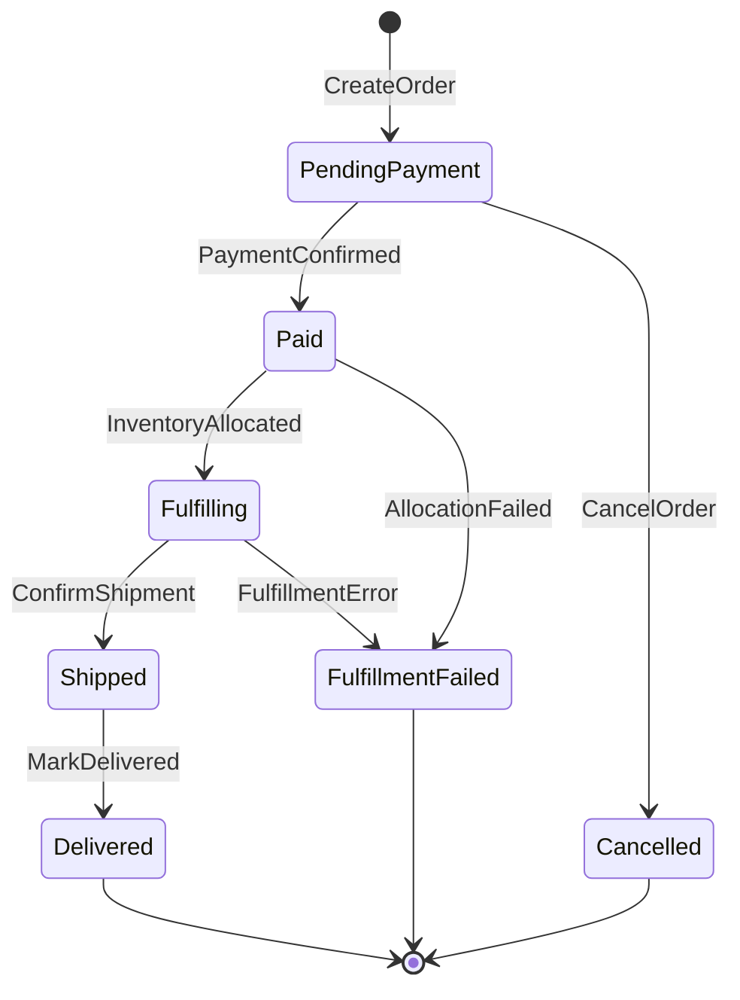
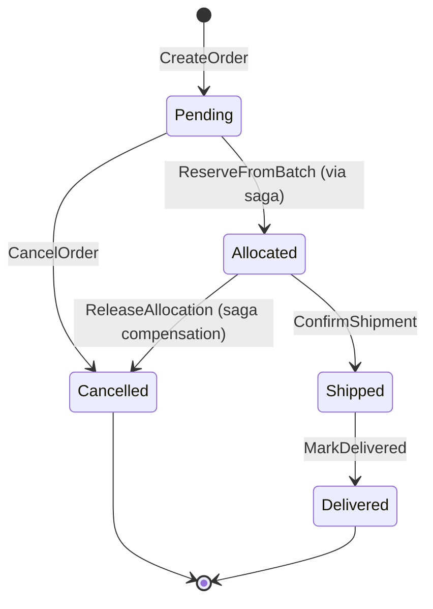

# State Machines: Order Management

## OrderStatus

The lifecycle of an order from placement through final resolution.

### States

| State | Terminal | Description |
|-------|---------|-------------|
| PendingPayment | no | Order submitted; awaiting payment |
| Paid | no | Payment confirmed; ready for fulfillment saga |
| Fulfilling | no | Stock allocated; warehouse picking in progress |
| Shipped | no | All items dispatched |
| Delivered | yes | Delivery confirmed; lifecycle complete |
| Cancelled | yes | Order cancelled before shipment; payment refunded |
| FulfillmentFailed | yes | Saga compensation completed; order cannot proceed |

### Transition Table

| From | Event | To | Guard | Effect |
|------|-------|----|-------|--------|
| [new] | CreateOrder | PendingPayment | R1, R2, R3 pass | Emit `order.OrderCreated`, store order with line items |
| PendingPayment | PaymentConfirmed | Paid | `payment.PaymentCompleted` received | Emit `order.OrderPaid`, store `paymentTransactionId` |
| PendingPayment | CancelOrder | Cancelled | R4 pass | Emit `order.OrderCancelled` |
| Paid | InventoryAllocated | Fulfilling | All line item allocations confirmed | Emit (internal) — all LineItems transition to Allocated |
| Paid | AllocationFailed | FulfillmentFailed | Compensation completed | Emit `order.OrderFulfillmentFailed`, refund triggered |
| Fulfilling | ConfirmShipment | Shipped | All LineItems in Shipped state | Emit `order.OrderShipped` |
| Fulfilling | FulfillmentError | FulfillmentFailed | Compensation completed | Emit `order.OrderFulfillmentFailed` |
| Shipped | MarkDelivered | Delivered | — | Emit `order.OrderDelivered` |

### Invalid Transitions (must be rejected)

| From | Attempted Event | Why Invalid |
|------|----------------|-------------|
| PendingPayment | InventoryAllocated | Payment not yet confirmed |
| Fulfilling | CancelOrder | Stock already allocated — must use saga compensation |
| Shipped | CancelOrder | Cannot cancel after dispatch |
| Delivered | any | Terminal state |
| Cancelled | any | Terminal state |
| FulfillmentFailed | any | Terminal state |

### Invariants

| ID | Invariant | Formal |
|----|-----------|--------|
| I1 | Paid orders always have a payment transaction reference | `status ∈ {Paid, Fulfilling, Shipped, Delivered} → paymentTransactionId != null` |
| I2 | Order total is always consistent | `total == subtotal - discount + tax + shippingCost` |
| I3 | Line item count never changes after creation | `∀ transitions: |lineItems|' == |lineItems|` |
| I4 | Delivered order has all items delivered | `status == Delivered → ∀ li : li.status == Delivered` |
| I5 | Created timestamp never changes | `∀ transitions: createdAt' == createdAt` |

---

## LineItemStatus

Individual fulfilment lifecycle for each product in an order. Progresses in parallel for all items.

### Transition Table

| From | Event | To | Guard | Effect |
|------|-------|----|-------|--------|
| Pending | InventoryAllocated | Allocated | `inventory.InventoryAllocated` received for this lineItem | Store `allocationId` on LineItem |
| Pending | CancelOrder | Cancelled | Parent order cancelled | — |
| Allocated | ConfirmShipment | Shipped | — | — |
| Allocated | ReleaseAllocation | Cancelled | Saga compensation path | — |
| Shipped | MarkDelivered | Delivered | — | — |

### Invariants

| ID | Invariant | Formal |
|----|-----------|--------|
| I6 | Allocated items have an allocation reference | `status == Allocated → allocationId != null` |
| I7 | Shipped items have a prior allocation | `status ∈ {Shipped, Delivered} → allocationId != null` |
