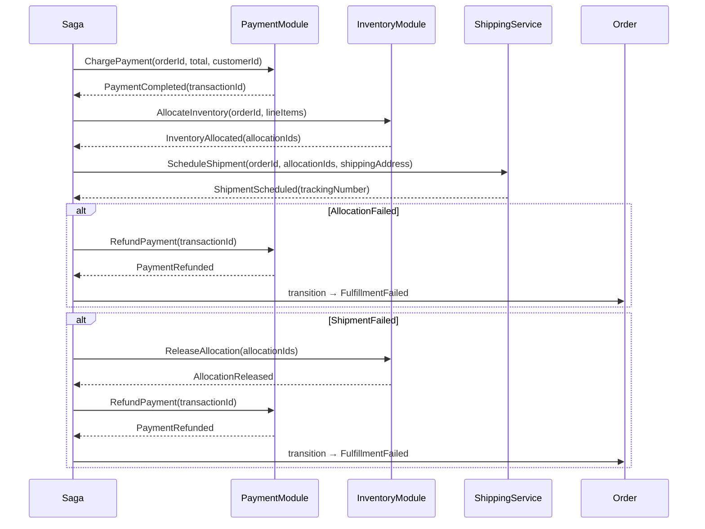

# Workflows: Order Management

## OrderFulfillmentSaga

Coordinates the multi-step progression from a confirmed order through payment, inventory allocation, and shipping logistics. If any step fails after payment, the saga compensates in reverse to restore a consistent state.

**Source:** `order.OrderFulfillmentSaga`
**Type:** Saga
**Compensation Strategy:** Reverse stack — each completed step's compensation is executed in reverse order on failure
**Idempotency:** Steps are guarded by order status; replaying a completed step returns the current state without side effects

### Trigger

`order.OrderCreated` event — saga begins immediately after order is persisted.



### Steps

| Step | Actor | Operation | On Success | On Failure (Compensation) |
|------|-------|-----------|------------|--------------------------|
| 1. ChargePayment | `payment.PaymentModule` | `payment.ProcessPayment` with `amount = order.total` | Order → Paid; store `paymentTransactionId` | — (no prior steps to reverse) → Order → FulfillmentFailed |
| 2. AllocateInventory | `inventory.InventoryModule` | `inventory.AllocateInventory` for each `lineItem` | Order → Fulfilling; LineItems → Allocated | RefundPayment via `payment.RefundPayment(transactionId)` → Order → FulfillmentFailed |
| 3. ScheduleShipment | `ShippingService` (port) | `scheduleShipment(orderId, allocationIds, shippingAddress)` | Store `trackingNumber` | ReleaseAllocation via `inventory.ReleaseAllocation(allocationIds)` → RefundPayment → Order → FulfillmentFailed |

### Compensation Table

| Failed Step | Compensation 1 | Compensation 2 | Final Order State |
|-------------|---------------|---------------|------------------|
| Step 1 (ChargePayment) | — | — | FulfillmentFailed |
| Step 2 (AllocateInventory) | RefundPayment | — | FulfillmentFailed |
| Step 3 (ScheduleShipment) | ReleaseAllocation | RefundPayment | FulfillmentFailed |

### Invariants

| ID | Invariant |
|----|-----------|
| W1 | AllocateInventory is never called before `paymentTransactionId` is persisted |
| W2 | ScheduleShipment is never called unless all LineItems have `status == Allocated` |
| W3 | Compensation steps are always idempotent — a RefundPayment call on an already-refunded transaction is a no-op |
| W4 | Order status transitions during saga are append-only — no step reverts to a previous state |

---

## FulfillmentRoutingPolicy

Selects the preferred warehouse for fulfilling an order's line items based on proximity and available stock.

**Source:** `order.FulfillmentRoutingPolicy`
**Type:** Policy
**Applies To:** Step 2 of `OrderFulfillmentSaga` — used to select `warehouseId` before calling `inventory.AllocateInventory`

### Trigger Conditions

Applied when `OrderFulfillmentSaga` reaches the AllocateInventory step. Fires once per order.

### Decision Table

| Condition | Action |
|-----------|--------|
| `stockAvailable(nearestWarehouse) == true` | Route to nearest warehouse by shipping address zone |
| `stockAvailable(nearestWarehouse) == false && stockAvailable(anyWarehouse) == true` | Route to any warehouse with sufficient stock (lowest shipping cost wins) |
| `stockAvailable(anyWarehouse) == false && product.allowBackorder == true` | Route to primary warehouse; allocation will be a backorder |
| `stockAvailable(anyWarehouse) == false && product.allowBackorder == false` | Halt saga at Step 2; trigger AllocateInventory compensation path |

### Formula

```
preferredWarehouse = argmin(warehousesWithStock, w => shippingCost(order.shippingAddress, w.zone))
```

### Configuration Parameters

| Parameter | Default | Description |
|-----------|---------|-------------|
| nearestZoneThresholdKm | 500 | Distance threshold defining "nearest" warehouse zone |
| allowSplitShipments | false | If true, different line items can ship from different warehouses |
