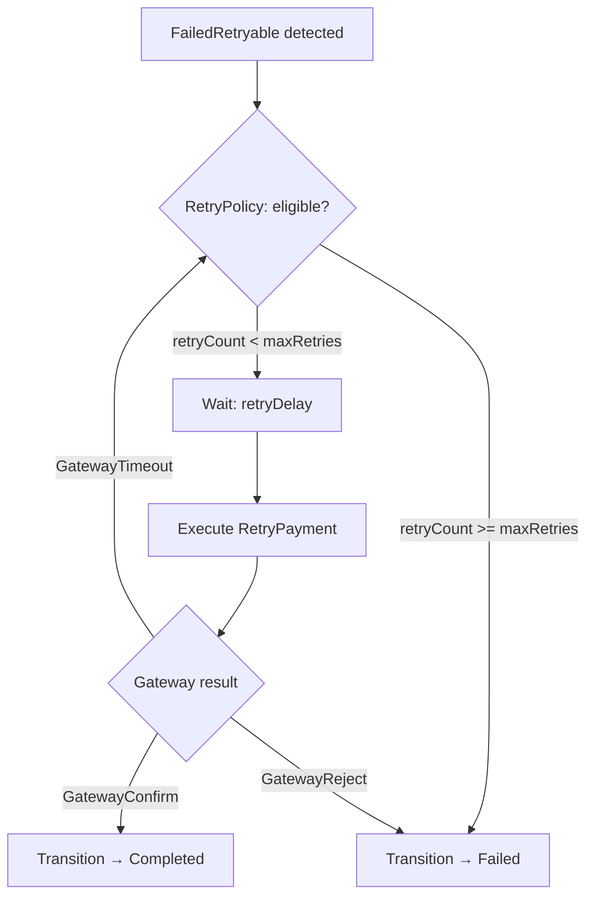

# Workflows: Payment Processing

## RetryPaymentWorkflow

**Type:** Workflow
**Triggers:** `GatewayTimeout` event — PaymentTransaction transitions to `FailedRetryable`
**Orchestrates:** [RetryPayment](operations.md#retrypayment)
**Compensation Strategy:** none — each retry attempt is atomic; no prior step needs reversal
**Idempotency:** yes — scoped to one transaction; `retryCount` prevents over-execution

### Steps



### Step Table

| # | Step | Actor | Operation | On Success | On Failure | Compensation |
|---|------|-------|-----------|------------|------------|--------------|
| 1 | Evaluate retry eligibility | System | — | Go to step 2 | Transition → Failed, emit `payment.PaymentFailed` | — |
| 2 | Wait for retry delay | System | — (timer) | Go to step 3 | — | — |
| 3 | Re-attempt gateway call | System | [RetryPayment](operations.md#retrypayment) | Transition → Completed | Return to step 1 | — |

### Invariants

| ID | Invariant | Formal |
|----|-----------|--------|
| W1 | Retry count never exceeds maximum | `tx.retryCount <= maxRetries` |
| W2 | Completed transactions are never re-queued | `tx.status == Completed → no retries scheduled` |
| W3 | Delay grows monotonically with attempt number | `retryDelay(n+1) >= retryDelay(n)` |

---

## RetryPolicy

**Type:** Policy
**Applies To:** [RetryPaymentWorkflow](#retrypaymentworkflow) — step 1 (eligibility) and step 2 (delay)
**Trigger Conditions:** Evaluated each time a PaymentTransaction enters `FailedRetryable` state

### Decision Table

| Condition | Selected Behavior | Notes |
|-----------|------------------|-------|
| `tx.retryCount < maxRetries` AND `method ∈ {CREDIT_CARD, WALLET}` | Schedule retry after short delay | `baseDelaySeconds.card × backoffExponent^retryCount` |
| `tx.retryCount < maxRetries` AND `method == BANK_TRANSFER` | Schedule retry after long delay | `baseDelaySeconds.bank × backoffExponent^retryCount` |
| `tx.retryCount >= maxRetries` | Transition to `Failed` | Emit `payment.PaymentFailed` with code `MAX_RETRIES_EXCEEDED` |

### Formula

```
retryDelay(n) = baseDelay(method) × backoffExponent^n
```

| Attempt (n) | CREDIT_CARD / WALLET | BANK_TRANSFER |
|-------------|---------------------|---------------|
| 0 | 30s | 5m |
| 1 | 1m | 10m |
| 2 | 2m | 20m |

### Configuration Parameters

| Parameter | Type | Default | Description |
|-----------|------|---------|-------------|
| maxRetries | integer | 3 | Maximum attempts before permanent failure |
| baseDelaySeconds.card | integer | 30 | Base delay (seconds) for CREDIT_CARD and WALLET |
| baseDelaySeconds.bank | integer | 300 | Base delay (seconds) for BANK_TRANSFER |
| backoffExponent | float | 2.0 | Multiplier applied per attempt |
