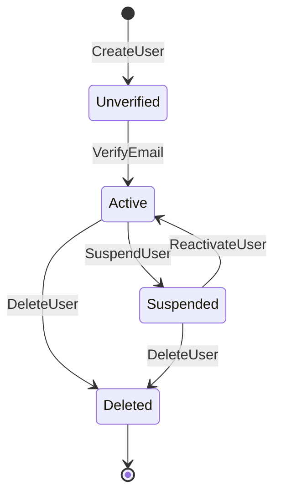
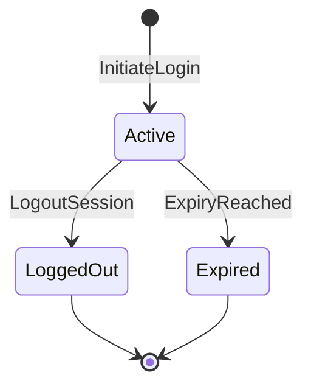

# State Machines: User Account Management

## UserLifecycle

The complete lifecycle of a user account from registration through deletion.

### States

| State | Terminal | Description |
|-------|---------|-------------|
| Unverified | no | Account created; awaiting email confirmation |
| Active | no | Email confirmed; account fully operational |
| Suspended | no | Frozen by admin; cannot log in |
| Deleted | yes | Soft-deleted; no transitions possible |

### Transition Table

| From | Event | To | Guard | Effect |
|------|-------|----|-------|--------|
| [new] | CreateUser | Unverified | R1, R2 pass | Emit `user.UserCreated`, emit `user.EmailVerificationSent`, set `verificationToken` |
| Unverified | VerifyEmail | Active | R4, R5 pass | Clear `verificationToken`, emit `user.UserVerified` |
| Active | SuspendUser | Suspended | actor.role == ADMIN | Emit `user.UserSuspended` |
| Suspended | ReactivateUser | Active | actor.role == ADMIN | Emit `user.UserReactivated` |
| Active | DeleteUser | Deleted | actor == self OR actor.role == ADMIN | Soft-delete record |
| Suspended | DeleteUser | Deleted | actor.role == ADMIN | Soft-delete record |

### Invalid Transitions (must be rejected)

| From | Attempted Event | Why Invalid |
|------|----------------|-------------|
| Unverified | InitiateLogin | Email not yet verified |
| Unverified | SuspendUser | Cannot suspend before verification |
| Suspended | VerifyEmail | Account frozen; verification irrelevant |
| Deleted | any | Terminal state — immutable |

### Invariants

| ID | Invariant | Formal |
|----|-----------|--------|
| I1 | Active users have no verification token | `status == Active → verificationToken == null` |
| I2 | Unverified users always have a token | `status == Unverified → verificationToken != null` |
| I3 | Deleted accounts are never re-activated | `status == Deleted → no further transitions` |
| I4 | Created timestamp never changes | `∀ transitions: createdAt' == createdAt` |
| I5 | Email is immutable after creation | `∀ transitions: email' == email` |

---

## SessionLifecycle

The lifecycle of a single authenticated session. Sessions are short-lived and non-renewable.

### States

| State | Terminal | Description |
|-------|---------|-------------|
| Active | no | Session is valid; bearer token accepted |
| LoggedOut | yes | Explicitly closed by user or admin |
| Expired | yes | Auto-closed when `expiresAt` passed |

### Transition Table

| From | Event | To | Guard | Effect |
|------|-------|----|-------|--------|
| [new] | InitiateLogin | Active | R7, R8 pass | Emit `user.SessionStarted`, set `expiresAt` via `SessionExpiryCalculation` |
| Active | LogoutSession | LoggedOut | R9 pass | Emit `user.SessionLoggedOut` |
| Active | ExpiryReached | Expired | `now >= session.expiresAt` | Emit `user.SessionExpired` |

### Invalid Transitions (must be rejected)

| From | Attempted Event | Why Invalid |
|------|----------------|-------------|
| LoggedOut | any | Terminal state |
| Expired | any | Terminal state |
| Active | InitiateLogin | Already active — create a new session instead |

### Invariants

| ID | Invariant | Formal |
|----|-----------|--------|
| I6 | Active sessions always have a future expiry | `status == Active → expiresAt > now` |
| I7 | Expired sessions have passed their deadline | `status == Expired → expiresAt <= now` |
| I8 | Session always belongs to a valid user | `∃ user : user.id == session.userId ∧ user.status != Deleted` |
