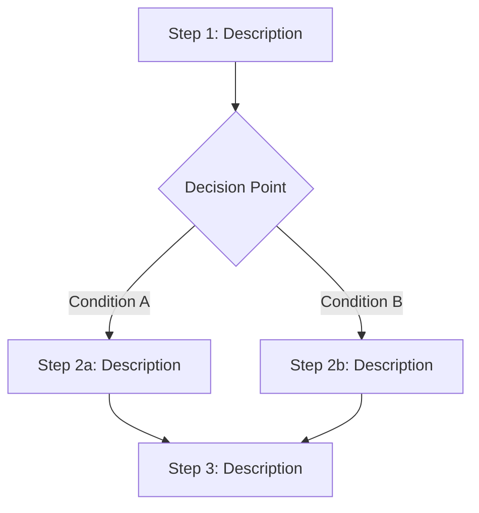

# Workflows: {Feature Name}

<!-- Behavioral concepts: Multi-step orchestrations that coordinate multiple operations.
     Each workflow section documents steps, decision points, and compensation logic.
     Each policy section documents the strategy selection logic applied at decision points. -->

## {WorkflowName}

**Type:** Workflow
**Triggers:** <!-- What initiates this workflow: event, schedule, manual trigger -->
**Orchestrates:** [{Op1}](operations.md#op1), [{Op2}](operations.md#op2)
**Compensation Strategy:** <!-- saga (reverse compensation) | rollback | notify-only | none -->
**Idempotency:** <!-- yes (safe to re-run) | no | conditional: {explain} -->

### Steps



### Step Table

| # | Step | Actor | Operation | On Success | On Failure | Compensation |
|---|------|-------|-----------|------------|------------|--------------|
| 1 | | | [{OperationName}](operations.md#) | Go to step 2 | | — |
| 2 | | | | | | [{CompensationOp}](operations.md#) |

### Invariants

| ID | Invariant | Formal |
|----|-----------|--------|
| | | |

---

## {PolicyName}

**Type:** Policy
**Applies To:** <!-- {WorkflowName} step # or {OperationName} -->
**Trigger Conditions:** <!-- When this policy is evaluated -->

### Decision Table

| Condition | Selected Behavior | Notes |
|-----------|------------------|-------|
| | | |

### Formula (if applicable)

```
<!-- rate, delay, or scoring formula -->
```

### Configuration Parameters

| Parameter | Type | Default | Description |
|-----------|------|---------|-------------|
| | | | |
