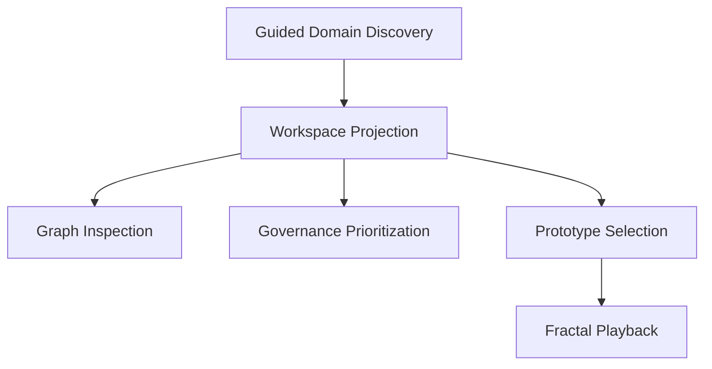

# App Release

## What This Module Owns

This feature owns the first public-facing Harness release workspace for greenfield domain discovery. It defines how a local-only user session moves from interview input to a visible graph, governance queue, prototype direction, and optional fractal playback without leaving one orchestrated screen.

The module boundary includes chat-first orchestration, graph-first inspection, prioritized governance output, and presentation-state handling for the release demo. It does not yet require cloud runtime concerns or semantic coupling between graph structure and fractal playback.

## Module Map

## Phase 1 Surface

The broader capability set below remains the long-term reference. Phase 1 (see [PHASE-1-DESIGN.md](./PHASE-1-DESIGN.md) and [PHASE-1-PLAN.md](./PHASE-1-PLAN.md)) narrows that surface to a single-screen, multi-tab interview workspace backed by `domain_knowledge/`.

**In scope for Phase 1:**

- Guided domain discovery (chat-driven interview, file-writing agent, session lifecycle)
- Workspace projection and inspection (filesystem-derived live graph + 4 metric cards)
- Multi-session multi-tab chat surface
- Embedded ontology graph (same engine as `/visualizations/ontology-visualization`) with expand-to-full-screen action
- Session lifecycle: start, end (with combined-modal confirmation across tabs), browse past, resume from summary

**Deferred for Phase 1** (still listed in the registry below; marked `Phase 1: deferred`):

- Governance and prototype steering (governance queue, prototype variants, stakeholder/role lenses)
- Fractal playback presentation (audio-reactive track surface)
- Code graph (will share the same engine when added)
- Multi-provider model selection
- Cloud / multi-user / multi-project switching

**New concepts introduced in Phase 1** (added to the Concept Registry below):

- `app-release.InterviewSession` — per-tab session entity with `draft → active → ended` lifecycle
- `app-release.EndSession` — operation that runs the session-close skill
- `app-release.ResumeSession` — operation that re-enters `active` and appends `## Resumed at <timestamp>` to the original file
- `app-release.WriteMarkdownNode`, `app-release.AppendSection`, `app-release.UpdateFrontmatter`, `app-release.AddConnection` — the four agent tool operations declared on the Claude Agent SDK
- `app-release.ListPastSessions`, `app-release.GetSessionSummary` — queries powering the "Sessões anteriores" picker and resume flow

## Capabilities

| Capability | What | Key Aspects | Detail |
| --- | --- | --- | --- |
| Guided domain discovery | Turn free-form user goals into structured release context | StartReleaseWorkspace, CaptureInterviewTurn, ReleaseWorkspaceLifecycle | 2 operations, 1 state machine |
| Workspace projection and inspection | Materialize graph, governance, prototype, and metric views from discovered knowledge | GenerateWorkspaceProjection, GetWorkspaceOverview, InspectGraphNode, InterviewTurnToDomainMapUpdate | 3 operations/queries, 1 mapping |
| Governance and prototype steering | Prioritize next decisions and let the user steer presentation direction | PrioritizeGovernanceQueue, ListGovernanceQueue, SelectPrototypeVariant | 2 operations, 1 query |
| Fractal playback presentation | Start local playback and reflect playback state inside the workspace | StartTrackPlayback, GetWorkspaceOverview, TrackPlaybackStarted | 1 operation, 1 event |

### Guided Domain Discovery

Convert a user's initial release goal into a live workspace session with explicit scope, runtime, and graph expectations.

| Aspect | Concept | Summary |
| --- | --- | --- |
| Operation | [StartReleaseWorkspace](operations.md#startreleaseworkspace) | Opens a new local-only release workspace |
| Operation | [CaptureInterviewTurn](operations.md#captureinterviewturn) | Stores interview input and extracts structured signals |
| State/Event | [ReleaseWorkspaceLifecycle](states.md#releaseworkspacelifecycle) | Tracks session progression from draft to demo-ready |
| Workflow | [GuidedReleaseWorkspaceWorkflow](workflows.md#guidedreleaseworkspaceworkflow) | Coordinates interview and projection refresh |

### Workspace Projection And Inspection

Project structured knowledge into visible, inspectable surfaces rather than leaving it trapped in chat.

| Aspect | Concept | Summary |
| --- | --- | --- |
| Operation | [GenerateWorkspaceProjection](operations.md#generateworkspaceprojection) | Refreshes graph, task, and prototype surfaces |
| Query | [GetWorkspaceOverview](queries.md#getworkspaceoverview) | Returns the synchronized release summary |
| Query | [InspectGraphNode](queries.md#inspectgraphnode) | Reveals relationships, workflows, and governing decisions |
| Mapping | [InterviewTurnToDomainMapUpdate](mappings.md#interviewturntodomainmapupdate) | Converts raw interview turns into graph deltas |
| Mapping | [DomainMapToWorkspaceOverview](mappings.md#domainmaptoworkspaceoverview) | Shapes the release read model |

### Governance And Prototype Steering

Show what matters next, why it matters, and how the current product direction should be presented.

| Aspect | Concept | Summary |
| --- | --- | --- |
| Operation | [PrioritizeGovernanceQueue](operations.md#prioritizegovernancequeue) | Reorders release actions by context and confidence |
| Operation | [SelectPrototypeVariant](operations.md#selectprototypevariant) | Records the user's chosen presentation direction |
| Query | [ListGovernanceQueue](queries.md#listgovernancequeue) | Returns actionable decisions and unresolved tradeoffs |
| Event | [GovernanceQueueReprioritized](events.md#governancequeuereprioritized) | Announces updated next actions |

### Fractal Playback Presentation

Provide an experiential output layer tied to the workspace without making it the semantic source of truth.

| Aspect | Concept | Summary |
| --- | --- | --- |
| Operation | [StartTrackPlayback](operations.md#starttrackplayback) | Starts local playback for a provided or uploaded track |
| Event | [TrackPlaybackStarted](events.md#trackplaybackstarted) | Announces active playback state |
| Policy | [LocalPlaybackPolicy](workflows.md#localplaybackpolicy) | Enforces local-only playback behavior for v1 |

## Domain Concepts

| Concept | Type | Key Constraints |
| --- | --- | --- |
| [ReleaseWorkspace](domain.md#releaseworkspace) | Entity | One active scope/runtime/graph decision set per workspace |
| [DomainMap](domain.md#domainmap) | Entity | Must retain traceable source evidence for every generated node |
| [GovernanceQueueItem](domain.md#governancequeueitem) | Entity | Priority must be explainable by context goal and confidence gap |
| [PrototypeVariant](domain.md#prototypevariant) | Entity | Only one selected variant may be active at a time |
| [TrackPlaybackSession](domain.md#trackplaybacksession) | Entity | Playback exists only while workspace is active locally |
| [ReleaseScopeMode](domain.md#releasescopemode) | Enum / Type | `greenfield-only` for v1 |
| [RuntimeMode](domain.md#runtimemode) | Enum / Type | `local-only` for v1 |
| [GraphPriorityMode](domain.md#graphprioritymode) | Enum / Type | `graph-first` for v1 |
| [WorkspaceStatus](domain.md#workspacestatus) | Enum / Type | Ordered lifecycle from draft to demo-ready |

## Concept Registry

| Concept | ID | Type | Phase 1 |
| --- | --- | --- | --- |
| [ReleaseWorkspace](domain.md#releaseworkspace) | app-release.ReleaseWorkspace | Entity | in scope (project container) |
| [InterviewSession](domain.md#interviewsession) | app-release.InterviewSession | Entity | **new in Phase 1** (per-tab session) |
| [DomainMap](domain.md#domainmap) | app-release.DomainMap | Entity | in scope (filesystem-derived index) |
| [GovernanceQueueItem](domain.md#governancequeueitem) | app-release.GovernanceQueueItem | Entity | deferred |
| [PrototypeVariant](domain.md#prototypevariant) | app-release.PrototypeVariant | Entity | deferred |
| [TrackPlaybackSession](domain.md#trackplaybacksession) | app-release.TrackPlaybackSession | Entity | deferred |
| [ReleaseScopeMode](domain.md#releasescopemode) | app-release.ReleaseScopeMode | Enum | in scope |
| [RuntimeMode](domain.md#runtimemode) | app-release.RuntimeMode | Enum | in scope |
| [GraphPriorityMode](domain.md#graphprioritymode) | app-release.GraphPriorityMode | Enum | in scope |
| [WorkspaceStatus](domain.md#workspacestatus) | app-release.WorkspaceStatus | Enum | in scope (narrowed) |
| [SessionStatus](domain.md#sessionstatus) | app-release.SessionStatus | Enum | **new in Phase 1** |
| [StartReleaseWorkspace](operations.md#startreleaseworkspace) | app-release.StartReleaseWorkspace | Operation | in scope (creates session) |
| [CaptureInterviewTurn](operations.md#captureinterviewturn) | app-release.CaptureInterviewTurn | Operation | in scope (streams via SDK) |
| [EndSession](operations.md#endsession) | app-release.EndSession | Operation | **new in Phase 1** |
| [ResumeSession](operations.md#resumesession) | app-release.ResumeSession | Operation | **new in Phase 1** |
| [WriteMarkdownNode](operations.md#writemarkdownnode) | app-release.WriteMarkdownNode | Operation (agent tool) | **new in Phase 1** |
| [AppendSection](operations.md#appendsection) | app-release.AppendSection | Operation (agent tool) | **new in Phase 1** |
| [UpdateFrontmatter](operations.md#updatefrontmatter) | app-release.UpdateFrontmatter | Operation (agent tool) | **new in Phase 1** |
| [AddConnection](operations.md#addconnection) | app-release.AddConnection | Operation (agent tool) | **new in Phase 1** |
| [GenerateWorkspaceProjection](operations.md#generateworkspaceprojection) | app-release.GenerateWorkspaceProjection | Operation | in scope (watcher-triggered) |
| [PrioritizeGovernanceQueue](operations.md#prioritizegovernancequeue) | app-release.PrioritizeGovernanceQueue | Operation | deferred |
| [SelectPrototypeVariant](operations.md#selectprototypevariant) | app-release.SelectPrototypeVariant | Operation | deferred |
| [StartTrackPlayback](operations.md#starttrackplayback) | app-release.StartTrackPlayback | Operation | deferred |
| [GetWorkspaceOverview](queries.md#getworkspaceoverview) | app-release.GetWorkspaceOverview | Query | in scope (graph index + metrics) |
| [InspectGraphNode](queries.md#inspectgraphnode) | app-release.InspectGraphNode | Query | in scope |
| [ListPastSessions](queries.md#listpastsessions) | app-release.ListPastSessions | Query | **new in Phase 1** |
| [GetSessionSummary](queries.md#getsessionsummary) | app-release.GetSessionSummary | Query | **new in Phase 1** |
| [ListGovernanceQueue](queries.md#listgovernancequeue) | app-release.ListGovernanceQueue | Query | deferred |
| [InterviewTurnToDomainMapUpdate](mappings.md#interviewturntodomainmapupdate) | app-release.InterviewTurnToDomainMapUpdate | Mapping | in scope |
| [DomainMapToWorkspaceOverview](mappings.md#domainmaptoworkspaceoverview) | app-release.DomainMapToWorkspaceOverview | Mapping | in scope |
| [GuidedReleaseWorkspaceWorkflow](workflows.md#guidedreleaseworkspaceworkflow) | app-release.GuidedReleaseWorkspaceWorkflow | Workflow | in scope (interview-script skill) |
| [ProjectionRefreshPolicy](workflows.md#projectionrefreshpolicy) | app-release.ProjectionRefreshPolicy | Policy | in scope (debounced watcher) |
| [LocalPlaybackPolicy](workflows.md#localplaybackpolicy) | app-release.LocalPlaybackPolicy | Policy | deferred |
| [InterviewSessionLifecycle](states.md#interviewsessionlifecycle) | app-release.InterviewSessionLifecycle | State Machine | **new in Phase 1** |
| [ReleaseWorkspaceLifecycle](states.md#releaseworkspacelifecycle) | app-release.ReleaseWorkspaceLifecycle | State Machine | in scope (later states deferred) |
| [WorkspaceInitialized](events.md#workspaceinitialized) | app-release.WorkspaceInitialized | Event | in scope |
| [SessionCreated](events.md#sessioncreated) | app-release.SessionCreated | Event | **new in Phase 1** (SSE) |
| [GraphDelta](events.md#graphdelta) | app-release.GraphDelta | Event | **new in Phase 1** (SSE) |
| [TextDelta](events.md#textdelta) | app-release.TextDelta | Event | **new in Phase 1** (SSE) |
| [ToolUseStart](events.md#tool-use-start) | app-release.ToolUseStart | Event | **new in Phase 1** (SSE) |
| [ToolUseResult](events.md#tool-use-result) | app-release.ToolUseResult | Event | **new in Phase 1** (SSE) |
| [ProjectionRefreshed](events.md#projectionrefreshed) | app-release.ProjectionRefreshed | Event | in scope (mapped to graph-delta) |
| [GovernanceQueueReprioritized](events.md#governancequeuereprioritized) | app-release.GovernanceQueueReprioritized | Event | deferred |
| [TrackPlaybackStarted](events.md#trackplaybackstarted) | app-release.TrackPlaybackStarted | Event | deferred |

## Aspect Docs

| Aspect | Contains | Key Concepts |
| --- | --- | --- |
| [Domain](domain.md) | Entities, value objects, enums | ReleaseWorkspace, DomainMap, GovernanceQueueItem |
| [Operations](operations.md) | Mutations, rules, calculations | StartReleaseWorkspace, GenerateWorkspaceProjection, StartTrackPlayback |
| [Interfaces](interfaces.md) | External/local contracts | Workspace API, graph inspection API, playback API |
| [Queries](queries.md) | Read models | GetWorkspaceOverview, InspectGraphNode, ListGovernanceQueue |
| [Mappings](mappings.md) | Data transformations | InterviewTurnToDomainMapUpdate, DomainMapToWorkspaceOverview |
| [Workflows](workflows.md) | Orchestrations and policies | GuidedReleaseWorkspaceWorkflow, ProjectionRefreshPolicy |
| [States](states.md) | State transitions and invariants | ReleaseWorkspaceLifecycle |
| [Events](events.md) | Domain events and consumers | WorkspaceInitialized, ProjectionRefreshed |

## Cross-Feature Dependencies

| Capability | Depends On | Via | Why |
| --- | --- | --- | --- |
| Guided domain discovery | [domainspec-gsd-integration](../../../domainspec/docs/features/domainspec-gsd-integration/SPEC.md) | Operation | Reuses orchestration framing for planner-driven execution |

## Produces For

| Consumer | Consumes Capability | Via | What |
| --- | --- | --- | --- |
| Harness release operator | Guided domain discovery | Interface | A structured workspace session seeded from natural language |
| Graph inspection surface | Workspace projection and inspection | Query | Node, relationship, workflow, and rationale views |
| Governance panel | Governance and prototype steering | Query / Event | Prioritized next actions and tradeoff visibility |
| Fractal playback surface | Fractal playback presentation | Operation / Event | Local playback state and visual activation signal |

## Stories

See [User Stories](STORIES.md) for acceptance scenarios and BDD coverage.

## Decision Record

See [Decision Record](DECISIONS.md) for the resolved v1 scope choices captured during planning.

## Discovery Input

This feature is derived from [App Release Discovery](../../app-release/app-release-discovery.md).
