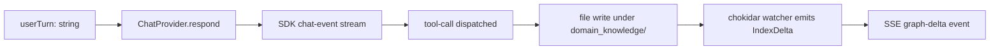

# Mappings: App Release

## Phase 1 Status

| Mapping | Phase 1 |
| ------- | ------- |
| [InterviewTurnToDomainMapUpdate](#interviewturntodomainmapupdate) | in scope (concretized as a six-stage pipeline below) |
| [DomainMapToWorkspaceOverview](#domainmaptoworkspaceoverview) | in scope |

## InterviewTurnToDomainMapUpdate

### Phase 1 Pipeline

Phase 1 makes the abstract mapping concrete. Each interview turn flows through six typed stages; failures at any stage are surfaced as SSE [SseError](events.md#sse-error) events and do not silently drop content.

### Stage Contracts

| # | Stage | Input | Output | Failure Mode |
| - | ----- | ----- | ------ | ------------ |
| 1 | User turn → ChatProvider | `{ sessionId, userTurn }` | begin `respond()` async iterator | session not active → 409 |
| 2 | ChatProvider → SDK chat-event stream | userTurn + interview-script context | `AsyncIterable<ChatEvent>` of `text-delta`, `tool-use-start`, `tool-use-result`, `done`, `error` | OAuth missing → `error` event with code `AUTH_MISSING` |
| 3 | SDK → tool-call dispatched | `tool-use-start { toolName, input }` | one of [WriteMarkdownNode](operations.md#writemarkdownnode), [AppendSection](operations.md#appendsection), [UpdateFrontmatter](operations.md#updatefrontmatter), [AddConnection](operations.md#addconnection) is invoked | tool input violates rules → `tool-use-result { error }` |
| 4 | Tool → file write | tool input | mutated file under `domain_knowledge/` | path-escape (`..`, absolute paths) → tool error |
| 5 | File write → IndexDelta | filesystem event from chokidar | typed `IndexDelta { added, updated, removed }` after debounce window (~150ms) | watcher overflow (single batch > N files) → full re-snapshot + `error` event with `WATCHER_OVERFLOW` |
| 6 | IndexDelta → SSE graph-delta | `IndexDelta` | `graph-delta` SSE event with `metrics` snapshot | client disconnected → buffered for `Last-Event-ID` reconnect |

### Field Mapping (legacy abstract — retained for cross-feature consumers)

**From:** Interview Turn
**To:** [DomainMap](domain.md#domainmap)
**Direction:** Inbound

### Field Mapping

| Source Field | Target Field | Transform | Notes |
| ------------ | ------------ | --------- | ----- |
| turnText | [DomainMap](domain.md#domainmap).nodeCount | computed | Increase when a new concept is extracted |
| turnText | [DomainMap](domain.md#domainmap).edgeCount | computed | Increase when a new relationship is extracted |
| turnText | [DomainMap](domain.md#domainmap).unresolvedAmbiguityCount | computed | Increase when the turn introduces unresolved tradeoffs |
| actorRole | evidence attribution | direct | Preserve role context on extracted evidence |

### Defaults

| Target Field | Default Value | Condition |
| ------------ | ------------- | --------- |
| unresolvedAmbiguityCount | 0 | When no ambiguity is extracted |

### Validation

| Field | Validation | On Failure |
| ----- | ---------- | ---------- |
| turnText | Must produce evidence for each generated concept | Reject update and flag governance gap |
| actorRole | Must be non-empty | Reject update |

## DomainMapToWorkspaceOverview

**From:** [DomainMap](domain.md#domainmap)
**To:** Workspace Overview DTO
**Direction:** Outbound

### Field Mapping

| Source Field | Target Field | Transform | Notes |
| ------------ | ------------ | --------- | ----- |
| [DomainMap](domain.md#domainmap).nodeCount | overview.nodeCount | direct | Graph summary metric |
| [DomainMap](domain.md#domainmap).edgeCount | overview.edgeCount | direct | Relationship summary metric |
| [DomainMap](domain.md#domainmap).unresolvedAmbiguityCount | overview.unresolvedAmbiguityCount | direct | Governance summary metric |
| [ReleaseWorkspace](domain.md#releaseworkspace).status | overview.status | direct | Top-level workspace state |

### Defaults

| Target Field | Default Value | Condition |
| ------------ | ------------- | --------- |
| overview.activePlaybackSessionId | null | When playback has not started |

### Validation

| Field | Validation | On Failure |
| ----- | ---------- | ---------- |
| overview.nodeCount | Must be greater than 0 in graph-first mode | Reject projection refresh |
| overview.status | Must align with [ReleaseWorkspaceLifecycle](states.md#releaseworkspacelifecycle) | Reject overview generation |
