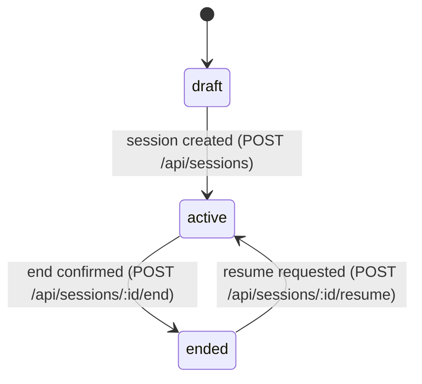

# State Machines: App Release

## Phase 1 Status

| State machine | Phase 1 |
| ------------- | ------- |
| [InterviewSessionLifecycle](#interviewsessionlifecycle) | **new in Phase 1** — governs each chat tab |
| [ReleaseWorkspaceLifecycle](#releaseworkspacelifecycle) | in scope (later states `review-ready`, `demo-ready` are deferred) |

## InterviewSessionLifecycle

Per-tab session state machine. Multiple sessions can be `active` concurrently in the same project; each tab holds one `sessionId`.



### Transition Table

| From | Event | To | Guard | Effect |
|------|-------|----|-------|--------|
| draft | session created | active | — | In-memory session record created; SDK conversation opened with interview-script seed; first agent turn emitted |
| active | end confirmed | ended | Combined modal confirmed and skill invocation succeeded | App-runtime session-close skill writes `domain_knowledge/sessions/<ts>-<slug>.md`; `done` SSE emitted; in-memory state cleared |
| ended | resume requested | active | Session file has a `## Summary` section | Fresh SDK conversation seeded with summary only; `## Resumed at <ISO-timestamp>` section appended in place |

### Invariants

| ID | Invariant | Formal |
|----|-----------|--------|
| I1 | A session never skips `active` | All paths into `ended` require a prior `active` |
| I2 | Resume preserves the original file | `bytes(file_after_resume) >= bytes(file_before_resume)` |
| I3 | `ended` sessions only live on disk; the in-memory map only holds `active` sessions | `inMemoryMap.keys ⊆ {sessions where status = "active"}` |
| I4 | Multi-session concurrency is bounded only by available memory; there is no global session lock | `count(active sessions)` may be > 1 simultaneously |

## ReleaseWorkspaceLifecycle

```mermaid
stateDiagram-v2
    [*] --> draft
    draft --> interviewing : workspace started
    interviewing --> projected : projection refreshed
    projected --> review-ready : governance prioritized
    review-ready --> demo-ready : playback started or presentation locked
    projected --> interviewing : more discovery needed
    review-ready --> interviewing : unresolved ambiguity reopened
```

### Transition Table

| From | Event | To | Guard | Effect |
|------|-------|----|-------|--------|
| draft | workspace started | interviewing | Scope/runtime/graph decisions are valid | Workspace exists for guided discovery |
| interviewing | projection refreshed | projected | Active domain map exists | Panels become synchronized |
| projected | governance prioritized | review-ready | Queue rationale exists for top items | Next actions become visible |
| projected | more discovery requested | interviewing | Ambiguity remains too high | Return to interview loop |
| review-ready | playback started | demo-ready | Local playback policy allows it | Experiential layer becomes active |
| review-ready | ambiguity reopened | interviewing | New blocker or contradiction found | Resume discovery |

> **Phase 1 note:** transitions into `review-ready` and `demo-ready` are deferred. In Phase 1 the workspace stays implicit (a `domain_knowledge/` directory) and the visible lifecycle is per-session via [InterviewSessionLifecycle](#interviewsessionlifecycle).

### Invariants

| ID | Invariant | Formal |
|----|-----------|--------|
| I1 | V1 workspace decisions stay fixed for the whole lifecycle | `scopeMode = "greenfield-only" and runtimeMode = "local-only" and graphPriorityMode = "graph-first"` |
| I2 | Demo-ready implies a prior successful projection | `status = "demo-ready" => previously(status = "projected" or status = "review-ready")` |
| I3 | Review-ready always has at least one visible governance item or an explicit no-open-issues result | `status = "review-ready" => governanceQueueVisible` |
