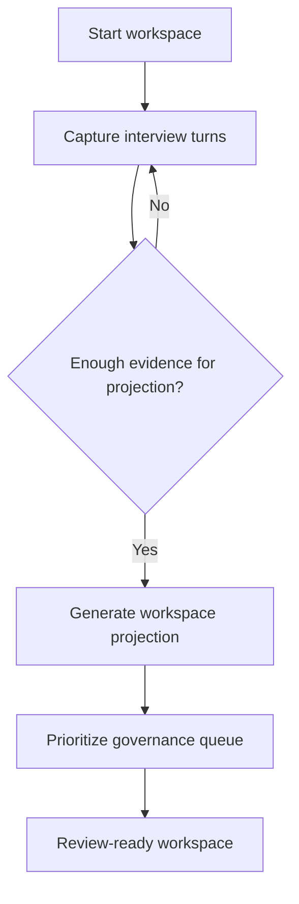

# Workflows: App Release

## Phase 1 Status

| Workflow / Policy | Phase 1 |
| ----------------- | ------- |
| [GuidedReleaseWorkspaceWorkflow](#guidedreleaseworkspaceworkflow) | in scope (interview-script skill drives the loop; later steps narrowed) |
| [ProjectionRefreshPolicy](#projectionrefreshpolicy) | in scope (debounced watcher push, SSE delivery) |
| [LocalPlaybackPolicy](#localplaybackpolicy) | deferred |

## GuidedReleaseWorkspaceWorkflow — Phase 1 Realization

In Phase 1, the workflow is realized as: a per-tab session driven by an external **interview-script skill** authored at `.claude/skills/interview-script/SKILL.md`. The skill defines the question flow (greenfield discovery: domain, intent, actors, workflows, constraints, ambiguities) and decides when to advance, branch, or wrap. The Claude Agent SDK executes the loop; each agent turn may call any of the four agent tool ops in [operations.md](operations.md) (WriteMarkdownNode, AppendSection, UpdateFrontmatter, AddConnection). The user ends the session via the combined-modal end-session UX, which invokes the **app-runtime session-close skill** to write `domain_knowledge/sessions/<ts>-<slug>.md`.

Phase 1 governance/projection/playback steps below are deferred; the Phase 1 workflow stops after the interview-and-write loop.

## GuidedReleaseWorkspaceWorkflow

**Type:** Workflow
**Triggers:** A user starts a new app-release discovery session
**Orchestrates:** [StartReleaseWorkspace](operations.md#startreleaseworkspace), [CaptureInterviewTurn](operations.md#captureinterviewturn), [GenerateWorkspaceProjection](operations.md#generateworkspaceprojection), [PrioritizeGovernanceQueue](operations.md#prioritizegovernancequeue)
**Compensation Strategy:** notify-only
**Idempotency:** conditional: replay is safe for projection refresh, but duplicate interview turns must be deduplicated by turn identity

### Steps



### Step Table

| # | Step | Actor | Operation | On Success | On Failure | Compensation |
| --- | --- | --- | --- | --- | --- | --- |
| 1 | Create workspace with fixed v1 decisions | Harness release operator | [StartReleaseWorkspace](operations.md#startreleaseworkspace) | Go to step 2 | Stop workflow | - |
| 2 | Capture discovery evidence | Harness release operator | [CaptureInterviewTurn](operations.md#captureinterviewturn) | Re-evaluate readiness | Ask for clarification | - |
| 3 | Refresh visible surfaces | Orchestrator | [GenerateWorkspaceProjection](operations.md#generateworkspaceprojection) | Go to step 4 | Retry after resolving policy gap | - |
| 4 | Rank governance actions | Orchestrator | [PrioritizeGovernanceQueue](operations.md#prioritizegovernancequeue) | Enter review-ready state | Flag missing rationale | - |

### Invariants

| ID | Invariant | Formal |
| --- | --------- | ------ |
| I1 | Every projected graph node has evidence | `forall node: exists evidenceLink(node)` |
| I2 | Review-ready workspaces expose graph and governance surfaces together | `status = "review-ready" => graphVisible and governanceVisible` |

---

## ProjectionRefreshPolicy

**Type:** Policy
**Applies To:** [GenerateWorkspaceProjection](operations.md#generateworkspaceprojection)
**Trigger Conditions:** New interview evidence, explicit refresh request, or governance reprioritization

### Decision Table

| Condition | Selected Behavior | Notes |
| --------- | ----------------- | ----- |
| Graph-first mode and node count is zero | Block refresh | Prevents an empty graph-first experience |
| Ambiguity count increased | Refresh governance and metrics surfaces | Keeps next actions current |
| Prototype selection changed | Refresh prototype surface only after full overview sync | Avoids disconnected panels |

### Formula (if applicable)

```text
refresh_priority = (new_evidence * 0.5) + (ambiguity_delta * 0.3) + (ui_selection_delta * 0.2)
```

### Configuration Parameters

| Parameter | Type | Default | Description |
| --------- | ---- | ------- | ----------- |
| minimumNodeCountForProjection | integer | 1 | Smallest valid graph for graph-first mode |
| refreshCooldownSeconds | integer | 0 | Immediate refresh in local v1 mode |
| watcherDebounceMs | integer | 150 | Coalesces filesystem events from a single tool-call batch into one [GraphDelta](events.md#graphdelta) (Phase 1) |
| watcherIgnoreGlobs | array | `[".git/**", "node_modules/**", ".obsidian/**"]` | Paths whose changes do not produce IndexDelta events (Phase 1) |
| watcherBatchOverflow | integer | 500 | If a single debounced batch exceeds this count, do a full re-snapshot and emit `error` with `WATCHER_OVERFLOW` (Phase 1) |

---

## LocalPlaybackPolicy

**Type:** Policy
**Applies To:** [StartTrackPlayback](operations.md#starttrackplayback)
**Trigger Conditions:** The user attempts to start track playback

### Decision Table

| Condition | Selected Behavior | Notes |
| --------- | ----------------- | ----- |
| Workspace runtime is local-only and status is review-ready or demo-ready | Allow playback | Happy path for v1 |
| Workspace runtime is not local-only | Reject playback | Out of scope for v1 |
| Workspace has no projection yet | Reject playback | Presentation cannot outrun system comprehension |

### Formula (if applicable)

```text
playback_allowed = runtime_is_local_only AND workspace_status in {"review-ready","demo-ready"}
```

### Configuration Parameters

| Parameter | Type | Default | Description |
| --------- | ---- | ------- | ----------- |
| requiresProjectionBeforePlayback | boolean | true | Prevents disconnected experiential output |
