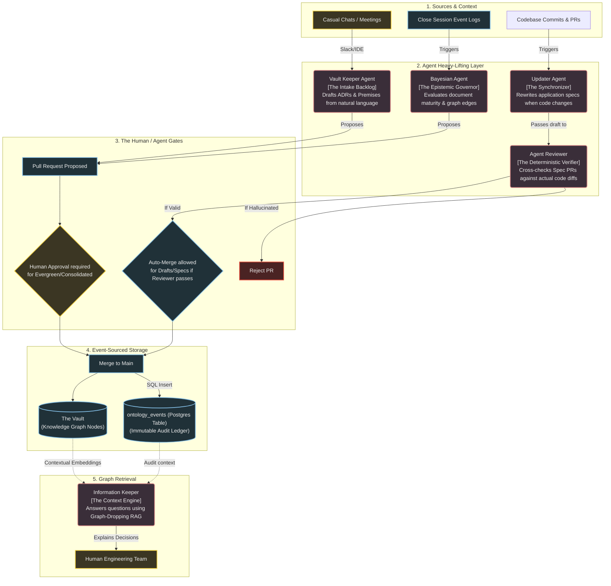

# The Ontology Architecture & Agent Framework

> This document defines the lifecycle of how knowledge enters, matures, and is retrieved from the ZefraHub Vault. It outlines the specialized AI agents responsible for maintaining the graph and the strict trust gates that prevent hallucination and documentation drift.

---

## Objective

This document is the **architectural blueprint** for the ontology system. It answers the question: *"How does the agent-driven vault actually work end-to-end — from intake to storage to querying?"*

It maps the 5-stage flow (Sources → Agent Processing → Trust Gates → Storage → Consumption), defines the four specialized agents and their responsibilities, explains the event-sourcing model, and describes the Graph-Dropping RAG approach for contextual retrieval.

---

## Index

1. [The High-Level Flow](#the-high-level-flow)
2. [Detailed Explanation of the System](#detailed-explanation-of-the-system)
   - [The Agents & Their Roles](#1-the-agents--their-roles)
   - [The Gates of Trust](#2-the-gates-of-trust)
   - [Event Sourcing](#3-event-sourcing)
   - [Graph-Dropping RAG](#4-graph-dropping-rag-contextual-retrieval)
## The High-Level Flow

The Vault is not a passive Wiki. It is an **Event-Sourced Knowledge Graph** actively maintained by a system of agents, but governed by human validation. 

The flow is broken into five continuous stages:
1. **Intake:** Gathering raw context from the real world.
2. **Agent Processing:** Structuring the context into graph nodes.
3. **The Trust Gate:** Human-in-the-loop validation for critical changes.
4. **Storage:** Merging the node and writing an immutable audit log.
5. **Consumption:** Querying the graph via advanced RAG.

---

## Detailed Explanation of the System

### 1. The Agents & Their Roles
To prevent context collapse, the AI workload is divided among specialized personas:
- **The Vault Keeper:** Humans hate writing boilerplate markdown. This agent listens to natural language ("We decided to use Polars") and formats it into the exact schema required by `conventions.md` (creating an Architecture Decision Record). It is the intake funnel.
- **The Updater:** Stale documentation is useless. The Updater watches the codebase repo. When a PR is merged adding a column to the database, the Updater detects this and automatically writes a PR to update `specs/liquidacao.md`.
- **The Reviewer:** A deterministic counter-weight to the Updater. Before the Updater can merge its documentation PR, the Reviewer agent cross-checks the proposed markdown strictly against the Git diff to prevent AI hallucinations. 
- **The Bayesian:** The hardest job. It manages the `confidence-levels.md` lifecycle. It runs periodically, looking at the graph's edges (how many times a document is cited) and code stability (how long a feature survived in production without rollbacks). It proposes upgrading documents to `evergreen` or downgrading them if they are contradicted.
- **The Information Keeper:** The consumption layer. Instead of writing, it reads. It acts as an omnipresent assistant for the team to query why the system is built the way it is.

### 2. The Gates of Trust
The graph is protected by strict validation boundaries:
- **Application Level (Specs, Drafts):** High velocity. Changes here can be auto-merged by agents **if and only if** the Agentic Reviewer loops confirm the docs match the code perfectly.
- **Foundational Level (Evergreen, Consolidated):** Low velocity, high friction. Agents **cannot** merge changes to Axioms or Constitutions. They can only prepare a PR and wait for a Human Founder to explicitly approve the shift in the company's rules.

### 3. Event Sourcing
The Vault cannot be overwritten silently. The system uses two types of logs:
- **The Narrative Log (`/close-session`):** Human-readable context explaining *what* was discussed during a coding session and *why*.
- **The Data Ledger (`ontology_events` SQL Table):** A strict machine-readable ledger of every mutation. Example: `[2026-03-17] [Bayesian_Agent] [PROMOTED docs/axiom-1.md] [Reason: SURVIVED_IN_PROD]`. This ensures we can always "time travel" to see when a specific belief entered the company.

### 4. Graph-Dropping RAG (Contextual Retrieval)
Traditional vector-search RAG fails on ontologies because it chunks paragraphs and loses the structural meaning. 
The **Information Keeper** relies on **Contextual Embeddings**. When embedding a node, it includes the surrounding graph context (what files link to it via `derives-from` or `contradicts`). 
When a user asks a question, an LLM router determines the optimal "Entry Node", drops the Information Keeper into the graph at that exact location, and allows it to crawl the explicitly typed edges to construct a highly accurate answer.
