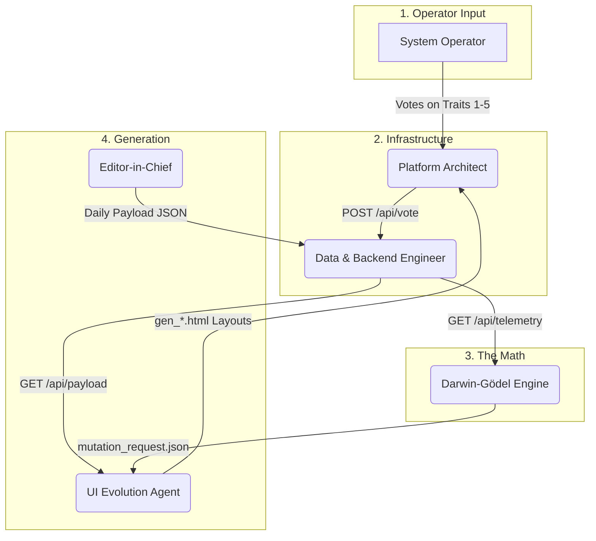

# Gödel Machine Ecosystem & Backlog Overview

This artifact outlines the 6-agent architecture of the Darwin-Gödel Machine, how data flows between agents to evolve the *O Grafo Diário* UI, and the current state of the global backlog.

## The Evolutionary Loop (How it Works)
The system operates as a closed genetic feedback loop. It isolates "content generation" from "layout generation" to accurately measure how cognitive load is affected by layout mutations.

## Agent Profiles & Data Handoffs

### 1. Orchestrator (Context Router)
- **What it does:** The strict border patrol. The Orchestrator does not write code. It acts as the single interface to the Operator, routes tasks to the correct agent, and maintains the overarching system state (`system-state.md` and `evolution-wall.md`).
- **Receives from:** System Operator.
- **Sends to:** System Operator.

### 2. Platform Architect
- **What it does:** Builds the testing environment (`index.html` Matrix/Dashboard) where the actual evaluation happens. It implements the atomic telemetry receiver functions that capture user feedback.
- **Receives from:** The System Operator (via UI clicks in the iframe), UI Evolution (displays generated HTML templates).
- **Sends to:** Data & Backend Engineer (ships `{metric_name, score}` payloads to the API).

### 3. Data & Backend Engineer
- **What it does:** Plumbs the data. Runs `evolution_server.py` and maintains `telemetry_db.json`. Ensures no data is dropped and that schemas adhere to Protocol v1.0.0.
- **Receives from:** Platform Architect (votes), Editor-in-Chief (daily news payloads).
- **Sends to:** Darwin-Gödel (serves aggregated telemetry), Platform Architect (serves news payloads and manifests).

### 4. Darwin-Gödel Engine
- **What it does:** The mathematician. Calculates fitness scores using the telemetry data. Uses a Multi-Armed Bandit strategy to decide whether the system should **Exploit** (minor CSS tweaks) or **Explore** (radical structural changes).
- **Receives from:** Data & Backend (aggregated JSON vote data).
- **Sends to:** UI Evolution Agent (outputs `mutation_request.json` containing the precise trait parameters the next template must satisfy).

### 5. UI Evolution Agent (Frontend)
- **What it does:** The aesthetic translator. Converts mathematical mutation traits into breathtaking HTML/CSS layouts. Only builds visuals, never touches persistence. 
- **Receives from:** Darwin-Gödel (`mutation_request.json`), Data & Backend (dynamically imports the daily payload so templates display real text).
- **Sends to:** Platform Architect (ships `gen_*.html` templates into the `evolution/` folder for the Matrix to render).

### 6. Editor-in-Chief
- **What it does:** Extracts data from the Knowledge Vault and uses LLMs to synthesize complex articles tiered by reading depth (`exec`/`tech`/`graph`). Supplies the text that is poured into the UI Evolution's templates.
- **Receives from:** Vault history/Operator activity.
- **Sends to:** Data & Backend Engineer (ships `daily_payload_YYYY-MM-DD.json`).

---

## Current General Backlog
*(Sourced from `specs/newspaper/backlog.md`)*

> [!IMPORTANT]
> **[P0] Close the Evolutionary Loop End-to-End:** The architecture is fully wired, but the loop has not naturally fired yet. The Darwin Engine needs to ingest the new 1-5 scale telemetry and produce the system's *first real* `mutation_request.json` so the UI Evolution agent can build `gen_015` purely off math, not vibes.

> [!TIP]
> **[P1] Create `generations_manifest.json`:** Set up the metadata file mapping each generation to its evaluated fitness, linking ancestors to children to create a true family tree.

> [!NOTE]
> **[P2] Modularize `index.html`:** The D0 dashboard is approaching 100KB. JS and CSS need to be extracted into modular files.
> **[P2] Formalize Exploit vs. Explore Protocol:** Lock down the mechanical rules for when the engine swaps variables vs. regenerates files.
> **[P3] Prune/Decide on Agent Newsletters:** Decide if the orphaned `newsletter.md` files in each agent's folder should be integrated or deleted.
