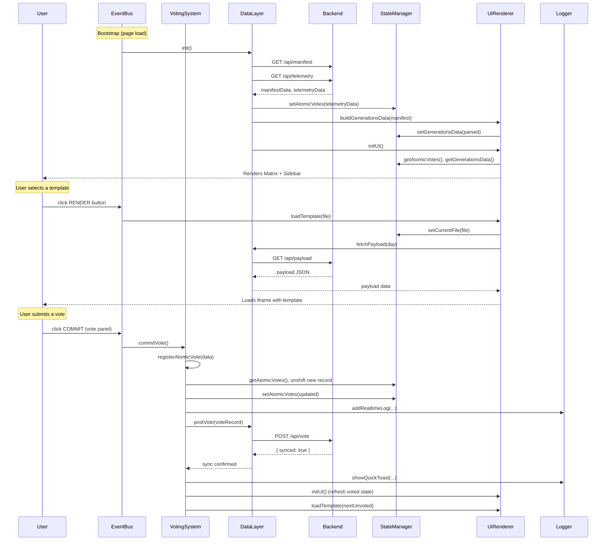

# index.html Refactoring Report

## 1. Executive Summary

The `specs/newspaper/evolution/index.html` file (originally 2120 lines) was a monolithic single-file HTML application powering the Genetic Control Center. All JavaScript logic — state variables, API fetches, DOM rendering, event handling, voting logic, modal management — was written in a single flat `` tag, making the stylesheet non-contiguous.
- **No HTML section markers**: Large HTML blocks (topbar, drawers, modals) had inconsistent inline comments that were hard to grep.
- **UI functions referenced global state directly**: `loadTemplate`, `showMatrixView`, `renderTelemetry`, etc. all read/wrote bare global variables, making them untestable in isolation.

---

## 3. Module Architecture

### StateManager
**Purpose**: Single source of truth for all mutable runtime state.

**Responsibilities**: Owns all six state variables. Exposes typed `get`/`set` accessors for each. No business logic.

**Public API**:
| Method | Description |
|---|---|
| `getCurrentFile()` / `setCurrentFile(v)` | The currently rendered template filename |
| `getGenerationsData()` / `setGenerationsData(v)` | Parsed catalog of all genetic generations |
| `getAtomicVotes()` / `setAtomicVotes(v)` | Array of all recorded vote records |
| `getCurrentTemplateFilter()` / `setCurrentTemplateFilter(v)` | Active filter: `'unvoted'`, `'voted'`, or `'all'` |
| `getActiveDrawer()` / `setActiveDrawer(v)` | Which side drawer is open (`'catalog'`, `'evolution'`, or `null`) |
| `getTypeInterval()` / `setTypeInterval(v)` | The `setInterval` handle for the terminal typewriter effect |
| `getParsedEvoLogs()` / `setParsedEvoLogs(v)` | Parsed evolution wall log entries |

---

### DataLayer
**Purpose**: All network I/O. The only module that calls `fetch()`.

**Responsibilities**: Fetching the generation manifest, telemetry votes, content payloads, the evolution wall markdown, and posting vote records to the backend. Owns the `STORAGE_KEY` constant and the init sequence that loads both manifest and telemetry before bootstrapping the UI.

**Public API**:
| Method | Description |
|---|---|
| `fetchManifest()` | GET `/api/manifest` |
| `fetchTelemetry()` | GET `/api/telemetry` |
| `fetchPayload(day)` | GET `/api/payload?day={date}` |
| `postVote(voteRecord)` | POST `/api/vote` |
| `fetchEvolutionWall()` | GET `../agents/evolution-wall.md` |
| `fetchPublications()` | GET `/api/publications` — returns `[{date, filename}]` sorted newest-first |
| `init()` | Orchestrates manifest + telemetry fetch, builds generations data, calls `UIRenderer.initUI()` |
| `STORAGE_KEY` | Exported constant `'zefracorp_evolution_data_v1'` |

---

### Logger
**Purpose**: All user-visible feedback that is not modal-based.

**Responsibilities**: Writing timestamped entries to the realtime log panel (`#realtimeLogs`) and showing ephemeral toast notifications.

**Public API**:
| Method | Description |
|---|---|
| `addRealtimeLog(message, type)` | Prepends a colored log entry with type `'exploit'`, `'explore'`, `'system'`, or `'default'` |
| `showQuickToast(msg)` | Shows a 2-second dismissing toast at bottom-center |

---

### UIRenderer
**Purpose**: All HTML generation and DOM injection. The largest module.

**Responsibilities**: Owns the static data sets (`agentsDatabase`, `loreDatabase`, `fallbackGenerationsData`, `genealogyTree`, `EVOLUTION_WALL_FALLBACK`). Builds and injects the sidebar catalog, the matrix grid, the genealogy timeline, and the agents metrics overview. Controls which "view" (matrix, iframe, agents, genealogy) is visible. Manages the catalog and evolution wall drawers. Parses and renders evolution wall markdown.

**Public API**:
| Method | Description |
|---|---|
| `initUI()` | Rebuilds the sidebar and matrix grid from `StateManager.getGenerationsData()` and current votes |
| `buildGenerationsData(gens)` | Transforms raw manifest array into grouped generation data stored in `StateManager` |
| `renderAgentMetricsOverview()` | Injects the agent metric responsibility cards into `#agentMetricsOverview` |
| `renderEvoList(entries)` | Renders parsed evolution wall entries into `#evolution-list` |
| `parseEvolutionWallMd(text)` | Converts raw markdown into structured `{ date, title, body, html }` entries |
| `renderGenealogy()` | Renders the genealogy timeline into `#genealogyTimeline` |
| `showMatrixView()` / `showAgentsView()` / `showGenealogyView()` | View switchers |
| `hideAllViews()` | Hides all view containers and resets current file |
| `loadTemplate(fileUrl)` | Switches to iframe view and loads the given template |
| `refreshIframeContext()` | Re-fetches payload for the selected day and reloads the iframe |
| `openFullscreen()` | Opens current template in a new browser tab |
| `toggleDrawer(which)` / `closeAllDrawers()` | Manages catalog and evolution wall drawer state |
| `setTemplateFilter(filter)` / `applyTemplateFilter()` | Controls the unvoted/voted/all filter across sidebar and matrix |
| `openEvoModal(index)` / `closeEvoModal()` | Opens/closes the evolution log reading modal |
| `openAgentModal(agentKey)` / `closeAgentModal()` | Opens/closes the agent details modal |

---

### ModalController
**Purpose**: Open/close logic for all overlay modals except evo and agent modals (which remain in UIRenderer due to data locality).

**Responsibilities**: Telemetry modal, node stats modal, terminal (sync knowledge) modal.

**Public API**:
| Method | Description |
|---|---|
| `openTelemetry()` / `closeTelemetry()` | Telemetry data modal |
| `openNodeStats(file, title, lore, gen, age)` | Node statistics modal with vote topology |
| `closeNodeStats()` | Closes node stats modal |
| `syncKnowledge()` | Opens terminal modal with typewriter effect |
| `closeTerminal()` | Closes terminal modal and clears the interval |

---

### VotingSystem
**Purpose**: All vote-related logic: recording, persisting, syncing, and transitioning.

**Responsibilities**: Registering atomic votes with optimistic local update + backend sync, the floating vote panel UI helpers, transitioning to the next template after a vote, advancing through the unvoted queue, and rendering the telemetry analytics view.

**Public API**:
| Method | Description |
|---|---|
| `registerAtomicVote(data)` | Records a vote, updates `StateManager`, syncs to backend via `DataLayer.postVote()` |
| `commitVote()` | Reads the floating panel state and calls `registerAtomicVote` |
| `transitionToNextTemplate()` | After a vote, refreshes UI and auto-loads the next unvoted template |
| `advanceToNext(previousItem)` | Finds the next visible sidebar item and clicks its RENDER button |
| `renderTelemetry()` | Builds and injects the full telemetry analytics view into `#telemetryList` |
| `exportTelemetry()` | Downloads current votes as JSON |
| `clearTelemetry()` | Purges all votes after confirmation |
| `showVotePanel()` / `hideVotePanel()` | Shows/hides the floating vote pill |
| `toggleVotePanel()` / `selectVpScore(n)` | Floating panel expand/collapse and score selection |

---

### EventBus
**Purpose**: Central registry for all browser event listeners and global wiring.

**Responsibilities**: Registering the `click` (close-drawers-on-outside-click) and two `keydown` (Escape, Arrow navigation) listeners. Firing the simulated initial log messages. Wiring all module methods onto `window.*` so that inline HTML `onclick` attributes can resolve them.

**Public API**:
| Method | Description |
|---|---|
| `init()` | Called once after `DataLayer.init()` resolves. Registers all event listeners and window globals. |

---

## 4. Data Contracts

| # | Method | Path | Request Shape | Response Shape |
|---|--------|------|--------------|----------------|
| 1 | GET | `/api/manifest` | — | `{ generations: Array<{ id: string, title: string, type: "explore"\|"exploit"\|"fossil", created_at: string }> }` |
| 2 | GET | `/api/telemetry` | — | `Array<{ id: string, template: string, generation_id: string, metric_name: string, score: number, comment: string, timestamp: string }>` |
| 3 | GET | `/api/payload` | Query param: `day=YYYY-MM-DD` | `{ metadata: { date: string, stats: { sessions: number, decisions: number, specChanges: number } }, articles: Array<{ id: string, type: string, tag: string, title: string, content: { exec: string, tech?: string }, meta: { impact: number, risk: string } }> }` |
| 4 | POST | `/api/vote` | `{ id: string, template: string, generation_id: string, metric_name: string, score: number, comment: string, timestamp: string }` | `{ synced: boolean }` |
| 5 | GET | `../agents/evolution-wall.md` | — | Raw Markdown with `## [timestamp] Title` section headers |
| 6 | GET | `/api/publications` | — | `Array<{ date: string, filename: string }>` sorted newest-first |

All endpoints fail gracefully: manifest and telemetry fall back to `localStorage` and `fallbackGenerationsData` respectively; payload falls back to `window.currentPayload` mock; evolution wall falls back to the embedded `EVOLUTION_WALL_FALLBACK` constant.

---

## 5. Call Flow Diagram

---

## 6. What Was Preserved / What Was Removed

### Preserved
- All 22 HTML modal structures and all their content
- All CSS rules — zero visual regressions; identical output to the original
- All `agentsDatabase` entries, `loreDatabase` mappings, `fallbackGenerationsData`, `genealogyTree`
- All API endpoints and their fallback behaviors (localStorage, embedded fallback constants)
- All keyboard shortcuts (Escape, Arrow navigation)
- All filter logic (unvoted/voted/all) across both sidebar and matrix grid
- The floating vote panel (pill + expanded form) and its 1–5 score selection
- `window.registerAtomicVote` exposed for iframe child windows
- `window.currentPayload` mock payload for offline use
- All simulated initial log messages
- Backward-compatible vote score format handling (both 1–5 and legacy +1/−1 formats)

### Removed
- **`commitSystemComment()`**: Fully dead code — the entire function body was commented-out. Removed cleanly.
- **Duplicate event listener registrations**: The original code registered `document.addEventListener('click', ...)` and two separate `document.addEventListener('keydown', ...)` in the flat scope. These are now registered once inside `EventBus.init()`.
- **Old flat `Promise.all` bootstrap**: Replaced by `DataLayer.init()` with the same logic.
- **Bare global `let` declarations**: `currentFile`, `generationsData`, `atomicVotes`, `currentTemplateFilter`, `activeDrawer`, `parsedEvoLogs`, `typeInterval` — all moved to `StateManager` private scope.
- **`fetchEvolutionWall()` flat function**: Absorbed into `DataLayer.fetchEvolutionWall()`.
