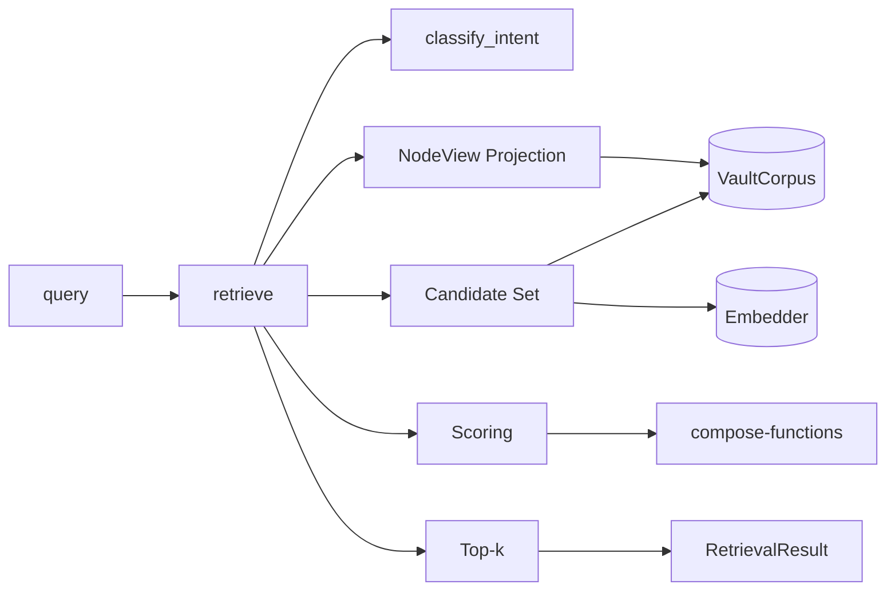
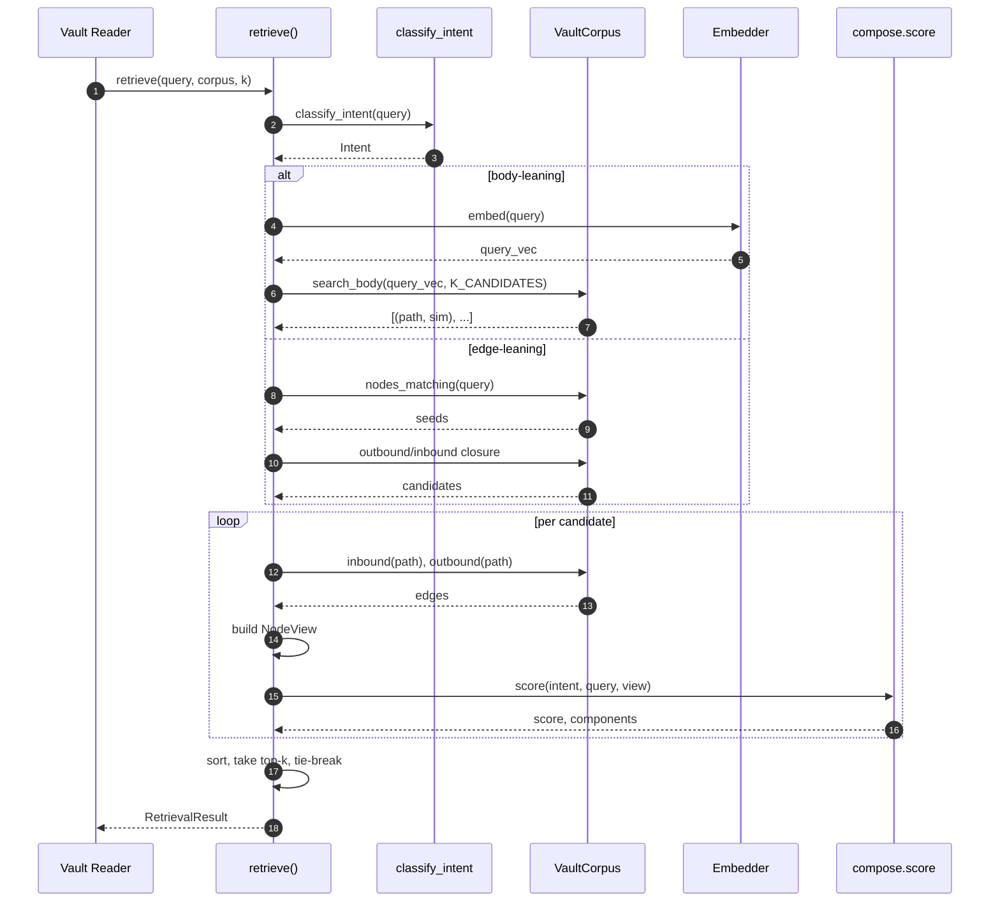

# Two-Layer Retrieval Architecture

This document is the feature-level architecture companion to
[SPEC.md](SPEC.md). It explains the architecture implied by the current
DomainSpec contracts and does not claim implementation completeness
beyond those contracts.

## Architecture Intent

Make retrieval over a graded knowledge vault **faithful** in the
[rules.md](rules.md) sense — typed edges, node types, stages, and
verification provenance must reach the ranking function. The contract
that follows is the minimum machinery to make that possible while
keeping algorithmic complexity local to one file and the backend
swappable.

## Scope Boundary

**Owned:** intent classification, candidate-set construction, NodeView
projection, per-intent scoring, top-k selection, and the two Protocol
seams (`VaultCorpus`, `Embedder`).

**Excluded:**

- Vault mutation. This is a read-only retriever; see
  [TEST-SPEC.md Out of Scope](TEST-SPEC.md#out-of-scope).
- Query rewriting / expansion.
- Multi-corpus federation.
- Caching, persistence, warm-start of the embedding matrix beyond
  [operations.md](operations.md).
- Any UI surface.

**Neighboring:**
[vault_common](../../../../vault_common/) (frontmatter, edges,
embedder); the [vault](../../../../../vault/) tree itself (data source,
not code).

## Source Contracts

| Contract ID | Source | Required | Notes |
| ----------- | ------ | -------- | ----- |
| SC-001 | [SPEC.md](SPEC.md) | yes | Feature capability and aspect index |
| SC-002 | [domain.md](domain.md) | yes | `NodeView`, `Intent`, `VaultCorpus`, `Embedder` definitions |
| SC-003 | [interfaces.md](interfaces.md) | yes | `retrieve` signature, `RetrievalResult` |
| SC-004 | [workflows.md](workflows.md) | yes | Five-step algorithm |
| SC-005 | [rules.md](rules.md) | yes | Faithfulness F1–F5 |
| SC-006 | [../discovery/README.md](../discovery/README.md) | yes | Pointer to canonical discovery in vault |
| SC-007 | [../../../compose.py](../../../compose.py) | yes | Per-intent scorers (reference implementation of lens 04) |
| SC-008 | [../../../intent.py](../../../intent.py) | yes | Intent enum + rule-based classifier |

## Design Goals and Non-Goals

| Type | Item | Why |
| ---- | ---- | --- |
| Goal | Typed-edge preservation end-to-end | F1; the load-bearing reason this feature exists |
| Goal | Backend-agnostic algorithm | `VaultCorpus` Protocol — swap NetworkX → Kuzu in one file |
| Goal | Explainable scores | `score_components` populated by every scorer |
| Goal | Offline-runnable prototype | No API keys, no GPUs; MiniLM + NetworkX |
| Non-goal | Production-grade latency at >10⁴ nodes | Vault scale is 10²–10³; revisit when it grows |
| Non-goal | Multi-intent queries | Discovery open question O3; deferred |
| Non-goal | Calibrated intent confidence | Binary 1.0/0.5 today; forward-compatible schema |

## View 1: Context View

| Actor or System | Relationship to Feature | Contract Source |
| --------------- | ----------------------- | --------------- |
| Vault reader (notebook / REPL / downstream tool) | Caller of `retrieve` | [interfaces.md](interfaces.md) |
| Vault tree (`vault/**/*.md`) | Read-only data source | [domain.md VaultCorpus](domain.md#vaultcorpus) |
| `vault_common.frontmatter` | Frontmatter parsing dependency | NetworkXCorpus impl |
| `vault_common.edges` | Edge extraction dependency | NetworkXCorpus impl |
| `vault_common.embedder` | Embedder Protocol provider | [domain.md Embedder](domain.md#embedder) |
| `sentence-transformers` | External model library | v0.1 binding only |

## View 2: High-Level Structure View

| Component | Primary Contracts | Responsibility |
| --------- | ----------------- | -------------- |
| `retrieve` orchestrator | [interfaces.md](interfaces.md), [workflows.md](workflows.md) | Coordinates the 5 steps; owns no domain logic |
| `intent` module | [domain.md Intent](domain.md#intent) | Classifies query → Intent |
| `compose` module | [rules.md](rules.md), `compose.py` | Per-intent scorers; pure functions on `NodeView` |
| `NetworkXCorpus` | [domain.md VaultCorpus](domain.md#vaultcorpus) | v0.1 backend impl; loads vault into `nx.MultiDiGraph` |
| `SentenceTransformerEmbedder` | [domain.md Embedder](domain.md#embedder) | v0.1 embedder impl |

## View 3: Low-Level Components View

| Component | Owns | Consumes | Collaboration Rule |
| --------- | ---- | -------- | ------------------ |
| `retrieve()` | Workflow shape, error contract | `intent.classify_intent`, `compose.score`, `VaultCorpus`, `Embedder` | Calls all four — never owns domain truth |
| `compose.score_canon` etc. | Per-intent ranking math | `NodeView` only | Pure functions; no I/O, no state |
| `stage_prior` | `_STAGE_PRIOR` table | `status` string | Lookup; default `0.50` for unmarked |
| `verification_prior` | Intent-conditioned ν_i | `verification` list, `intent` | Hard-zero for CANON × `["model-recall"]`; soft-demote elsewhere |
| `NetworkXCorpus` | Graph + body-embedding matrix | `vault_common.frontmatter`, `vault_common.edges`, `Embedder` | Implements `VaultCorpus`; lifecycle in [operations.md](operations.md) |

## View 4: Workflow Process View

| Flow | Happy Path | Failure or Compensation | Contract Source |
| ---- | ---------- | ----------------------- | --------------- |
| Body-leaning | classify → search_body → filter → project → score → top-k | Embedder error → propagate | [workflows.md Step 2a](workflows.md#step-2-candidate-set-construction) |
| Edge-leaning | classify → seed → closure → project → score → top-k | Path-free query → fallback to 2a + note | [workflows.md Step 2b](workflows.md#step-2-candidate-set-construction) |
| LENS_TRIANGULATION | n/a | `NotImplementedError` at step 4 | [TEST-SPEC.md G1](TEST-SPEC.md#g1--lens_triangulation-has-no-scorer) |

## View 5: Decision Flow View

| Decision Point | Options or Branches | Selection Rule | Outcome |
| -------------- | ------------------- | -------------- | ------- |
| Intent | Override? | `intent_override is not None` | Use override, confidence 1.0 |
| Intent | Classifier match? | Any `_RULES` pattern matches | Use matched intent, confidence 1.0 |
| Intent | Classifier fallback | No pattern matches | `Intent.SEMANTIC`, confidence 0.5 |
| Candidate strategy | Body-leaning vs edge-leaning | Intent family per [domain.md Intent](domain.md#intent) | Step 2a or 2b |
| Edge-leaning seed | Path found in query? | Substring match against corpus paths | Step 2b proceeds; else fallback to 2a + note |
| Tie-break | Equal scores | `last_updated_days_ago asc, path asc` | Deterministic ordering |

## View 6: Dependency Interface View

| Dependency or Interface | Direction | Contract | Boundary Rule |
| ----------------------- | --------- | -------- | ------------- |
| `VaultCorpus` | internal (Protocol) | [domain.md VaultCorpus](domain.md#vaultcorpus) | `retrieve` depends on the Protocol, never on `NetworkXCorpus` directly |
| `Embedder` | internal (Protocol) | [domain.md Embedder](domain.md#embedder) | Same rule — Protocol-typed |
| `vault_common.frontmatter` | outbound (impl) | n/a (utility) | Only `NetworkXCorpus` may import it |
| `vault_common.edges` | outbound (impl) | n/a (utility) | Only `NetworkXCorpus` may import it |
| `sentence-transformers` | outbound (impl) | n/a (3rd-party) | Only `SentenceTransformerEmbedder` may import it |
| `retrieve` (the function) | inbound | [interfaces.md](interfaces.md) | Sole entrypoint; no class API in v0.1 |

## Constraints

| Constraint | Source | Impact |
| ---------- | ------ | ------ |
| Read-only (no vault mutation) | [TEST-SPEC.md](TEST-SPEC.md#out-of-scope) | No `operations.md` (no mutations to document) |
| Offline-runnable prototype | Discovery design intent | MiniLM + NetworkX; no API-keyed services in v0.1 |
| Algorithm independent of backend | F1 + Protocol design | New backend = new adapter file, no algorithm change |
| `LENS_TRIANGULATION` has no scorer | `compose.SCORERS` table | `NotImplementedError` at runtime; tracked as gap |

## Dependency And Interface Rules

| Rule ID | Rule | Applies To | Enforcement |
| ------- | ---- | ---------- | ----------- |
| R-001 | `retrieve` may import `VaultCorpus` and `Embedder` Protocols only, never concrete impls | `retrieve()` orchestrator | Code review; import-linter rule (future) |
| R-002 | Scorers in `compose.py` must be pure functions of `(query, NodeView)` — no I/O, no global state | `compose.score_*` | Test: each scorer called twice on same input returns same result |
| R-003 | Every scorer must populate `score_components` | `compose.score_*` | TEST-SPEC future row; check `len(score_components) >= 1` |
| R-004 | `NodeView` projection must preserve all edge types from the corpus | Step 3 of workflow | [TEST-SPEC.md T4](TEST-SPEC.md#t4--f1-typed-edge-preservation) |

## Data and Evidence Artifacts

| Artifact | Produced By | Used For | Contract Source |
| -------- | ----------- | -------- | --------------- |
| `RetrievalResult` | `retrieve()` | Caller consumption + downstream evaluation | [interfaces.md](interfaces.md) |
| `score_components` | `compose.score_*` | Explainability, debugging, observability | [domain.md ScoredNode](domain.md#scorednode) |
| `RetrievalResult.notes` | `retrieve()` step 2b fallback | Operator visibility into degraded behaviors | [interfaces.md](interfaces.md) |
| Vector-only baseline output | T8 test harness | Falsification round vs two-layer | [TEST-SPEC.md T8](TEST-SPEC.md#t8--falsification-round-vector-only-baseline) |

## Extension Points

| Extension Point | Allowed Variation | Guardrail |
| --------------- | ----------------- | --------- |
| `VaultCorpus` impl | New backends (Kuzu, SQLite, …) | Must satisfy Protocol; algorithm in `retrieve` must not change |
| `Embedder` impl | New encoders (OpenAI, Ollama, …) | Must satisfy Protocol; offline default must remain available |
| New intents | Add entry to `Intent` + scorer in `compose.SCORERS` | Must update [TEST-SPEC.md](TEST-SPEC.md) T1 sample set |
| Intent classifier | Replace rule-based with LLM/SetFit | Must keep `(intent, confidence)` shape |

## Trade-offs and Guardrails

| Trade-off | Benefit | Cost | Guardrail |
| --------- | ------- | ---- | --------- |
| NetworkX over Kuzu for v0.1 | Zero install pain, sub-ms traversal at vault scale | No persistence, no concurrent writers | Protocol seam lets us swap later |
| Rule-based intent classifier | Deterministic, debuggable, zero training cost | Brittle on natural phrasing | Confidence 0.5 fallback is visible; upgrade path O1 tracked |
| MiniLM embeddings | Local, fast, free | A few quality points lower than larger models | F1 ensures edges enter ranking regardless of embedding quality |
| Single-intent classification | Simpler implementation | Multi-intent queries collapsed | Tracked as G2 |

## Decision Log

| Decision ID | Decision | Options Considered | Reason |
| ----------- | -------- | ------------------ | ------ |
| D-001 | NetworkX as v0.1 `VaultCorpus` | NetworkX, Kuzu, SQLite | Zero install; algorithm-focused prototype |
| D-002 | MiniLM as v0.1 `Embedder` | MiniLM, OpenAI, Anthropic, Ollama | Offline runnable; no API keys |
| D-003 | Single-function entrypoint `retrieve` | Function vs class | Stateless call surface; lifecycle owned by the `VaultCorpus` impl |
| D-004 | `LENS_TRIANGULATION` ships without scorer | Implement, remove, or defer | Defer with `NotImplementedError`; visible obligation |
| D-005 | Hard-zero `verification_prior` for CANON × `["model-recall"]` | Soft-demote vs hard-zero | F4 demands exclusion, not deprioritization |

## Risks

| Risk ID | Risk | Mitigation | Owner |
| ------- | ---- | ---------- | ----- |
| RK-001 | T8 falsification round shows two-layer == vector-only on test corpus | Re-examine design before scaling; revisit lens 04 weights | victorboscaro |
| RK-002 | NetworkX in-memory load slow on >10⁴ nodes | Switch to Kuzu; Protocol seam exists | victorboscaro |
| RK-003 | Rule classifier misclassifies common phrasings | Track misclass rate via observability; upgrade to LLM classifier (O1) | victorboscaro |
| RK-004 | `LENS_TRIANGULATION` callers hit `NotImplementedError` in production | v0.2 must add scorer or remove intent | victorboscaro |

## Downstream Planning Notes

- **Implementation-plan inputs:** `retriever.py` skeleton wiring
  `classify_intent → candidate set → NodeView → score → top-k`; fixture
  corpus built from `house_project` vault for T2/T8.
- **Test implications:** [TEST-SPEC.md](TEST-SPEC.md) T1–T8.
- **Observability implications:** see [observability.md](observability.md).
- **Documentation implications:** the parent vault discovery is
  load-bearing; this spec must be re-read whenever lens 04 of the
  discovery changes.

## Design Transport Notes

This architecture should be carried into:

- A first `retriever.py` implementing the workflow.
- A `NetworkXCorpus` adapter under `internal_tools/graph_retrieval/`.
- The test file
  `internal_tools/tests/test_two_layer_retrieval.py`.
- The observability spec in [observability.md](observability.md).

## Gate Result

- Status: **pass** (architecture is consistent with SPEC + discovery
  and ready to inform implementation).
- Reason: Six views are populated; faithfulness contract is anchored to
  testable invariants; backend seam is correctly Protocol-typed.
- Required follow-up: implement `retriever.py` + `NetworkXCorpus`; run
  T1–T8 including the T8 falsification round.
