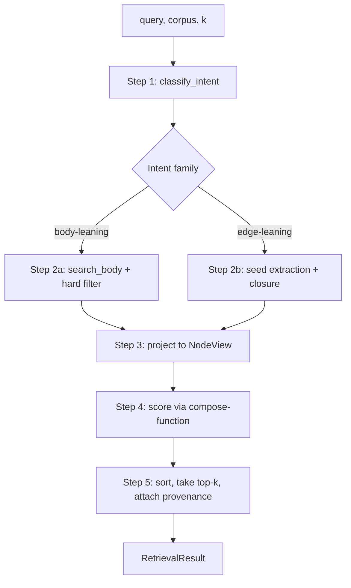

# Workflows: Two-Layer Retrieval

One workflow: the `retrieve(query, corpus, k)` pipeline. Five
sequential steps; no branching at the workflow level — branching lives
inside step 2 (candidate-set construction) and is driven by the intent
family declared in [domain.md#intent](domain.md#intent).

## Retrieve

**Type:** Workflow
**Triggers:** Direct call to [retrieve](interfaces.md#internal-retrieve-top-level-function)
**Orchestrates:** [Intent classification](#step-1-intent-classification),
[Candidate-set construction](#step-2-candidate-set-construction),
[NodeView projection](#step-3-nodeview-projection),
[Scoring](#step-4-scoring),
[Top-k selection](#step-5-top-k-selection)
**Compensation Strategy:** none — read-only, no side effects to compensate
**Idempotency:** yes — same `(query, corpus, k, intent_override)` → same
`RetrievalResult.nodes` (modulo `duration_ms`)

### Steps



### Step 1: Intent classification

Delegates to `intent.classify_intent(query)` at
[../../../intent.py](../../../intent.py). Rule-based MVP; falls back to
[Intent.SEMANTIC](domain.md#intent) on no rule match. Confidence is
reported as `1.0` for rule-match and `0.5` for fallback. Future LLM or
SetFit→LLM hybrid is upgrade path O1 in the discovery.

If `intent_override` is supplied, this step is skipped and
`intent_confidence` is set to `1.0`.

### Step 2: Candidate-set construction

Two strategies, selected by the intent family declared in
[domain.md#intent](domain.md#intent).

**2a — Body-leaning** (`CANON`, `SEMANTIC`, `DEFINITIONAL`, `FRONTIER`):

```text
candidates = corpus.search_body(query, k=K_CANDIDATES)
candidates = [c for c in candidates if passes_hard_filter(c, intent)]
```

`K_CANDIDATES = max(k * 4, 50)` — over-generate so per-intent hard
filters (e.g. CANON's `node_type ∈ {axiom, constitution}`) have room to
prune without starving top-k.

**2b — Edge-leaning** (`PROVENANCE`, `BLAST_RADIUS`, `TENSION`):

```text
seeds = corpus.nodes_matching(query)   # path-substring match per Protocol
candidates = closure_under_edges(seeds, edge_types=intent.relevant_edges, depth=1)
```

Seed extraction is rule-based for v0.1: scan the query for any substring
that matches a known node path. For path-free queries on edge-leaning
intents, fall back to 2a and append a warning to
[RetrievalResult.notes](interfaces.md#output-retrievalresult).

### Step 3: NodeView projection

For each candidate path:

1. Load the `NodeRecord` (frontmatter + body sim).
2. Fetch `inbound_edges` and `outbound_edges` from the corpus.
3. Compute `last_updated_days_ago` from frontmatter.
4. Construct [NodeView](domain.md#nodeview).

The projection must not drop edges. If an edge type is unknown to the
compose-function, it still travels in the `NodeView` — this is
[rules.md F1](rules.md#f1--typed-edge-preservation).

### Step 4: Scoring

Score every candidate via `compose.score(intent, query, node_view)`. The
per-intent functions are at
[../../../compose.py](../../../compose.py) lines 54–98 and mirror lens
04 of the discovery exactly.

Each scorer must populate
[ScoredNode.score_components](domain.md#scorednode) with its individual
terms (e.g. `{"stage_prior": 0.8, "verification": 1.0, "body_sim":
0.71}`) so downstream explainability is free.

### Step 5: Top-k selection

Sort descending by `score`. Take the first `k`. Tie-breakers, in order:

1. `last_updated_days_ago` ascending (newer wins)
2. `path` ascending (deterministic)

### Step Table

| #   | Step | Actor | Operation | On Success | On Failure | Compensation |
| --- | ---- | ----- | --------- | ---------- | ---------- | ------------ |
| 1   | Classify intent | retrieve | `classify_intent(query)` | step 2 | — (always returns SEMANTIC) | none |
| 2a  | Body-leaning candidate set | retrieve | `corpus.search_body` + hard filter | step 3 | propagate `Embedder` error | none |
| 2b  | Edge-leaning candidate set | retrieve | `corpus.nodes_matching` + `corpus.inbound`/`outbound` closure | step 3 | fallback to 2a + add note | none |
| 3   | Project to `NodeView` | retrieve | `corpus.inbound` / `corpus.outbound` | step 4 | propagate | none |
| 4   | Score each candidate | retrieve | `compose.score(intent, query, view)` | step 5 | `NotImplementedError` for `LENS_TRIANGULATION` | none |
| 5   | Sort + take top-k | retrieve | in-process sort | return | — | none |

### Invariants

See [rules.md](rules.md) for the faithfulness invariants F1–F5. Local
flow-level invariants:

| ID  | Invariant | Formal |
| --- | --------- | ------ |
| I1  | Result count never exceeds `k` | `len(result.nodes) <= k` |
| I2  | `candidate_set_size >= len(result.nodes)` | `candidate_set_size >= len(result.nodes)` |
| I3  | Result is sorted by `score` descending | `all(a.score >= b.score for a, b in zip(result.nodes, result.nodes[1:]))` |
| I4  | `intent_confidence` is `1.0` when `intent_override` is set | `intent_override is not None ⇒ intent_confidence == 1.0` |
