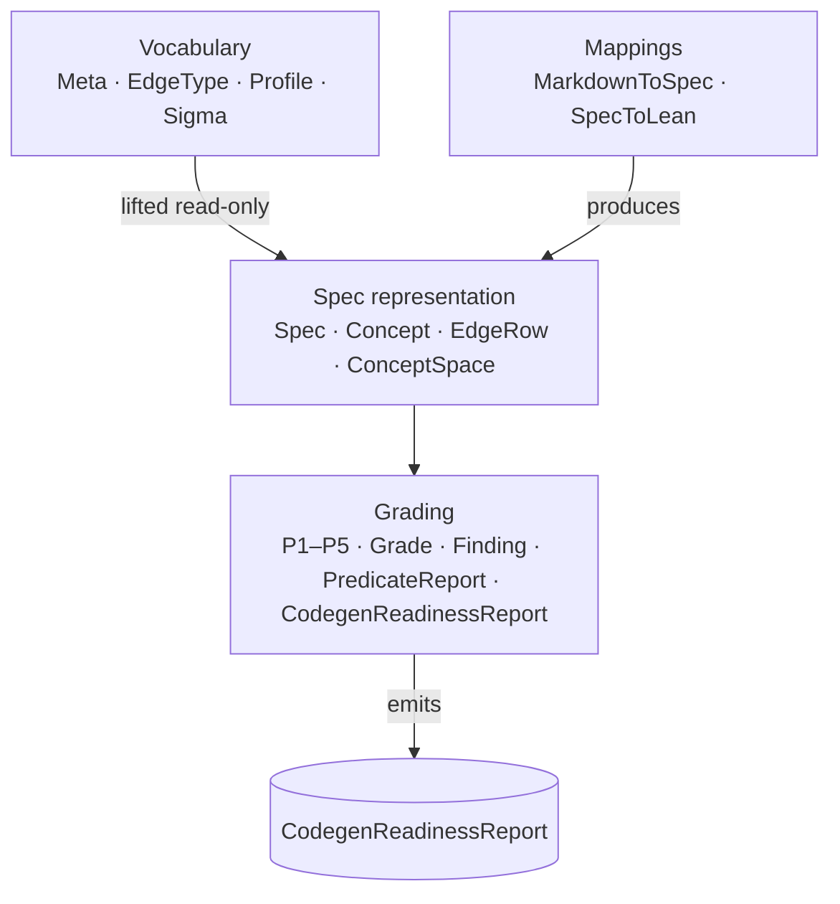

# lean-code-validator (v3)

## What This Module Owns

A Lean 4 grader that consumes a parsed DomainSpec L1 spec and emits a structured codegen-readiness report. This module owns the [Spec](domain.md#spec) data model, the profile-aware [Sigma](domain.md#sigma) vocabulary (25 metas, 29 edges aligned to `domainspec-core`), five decidable grading predicates (P1–P5), and the [CodegenReadinessReport](domain.md#codegenreadinessreport) aggregation. It does **not** own the markdown parser (`audit_richness.py`) — that is an external [MarkdownToSpec](mappings.md#markdowntospec) mapping — nor does it own vocabulary definitions (`domainspec-core` is upstream and canonical).

> **Authority:** [`discovery/INITIAL-DEFINITIONS.md`](../discovery/INITIAL-DEFINITIONS.md) and [`discovery/PROJECT-DECISIONS.md`](../discovery/PROJECT-DECISIONS.md). Every concept below traces to INITIAL-DEFINITIONS. Vocabulary source of truth: `domainspec-core` DEFINITIONS.md DS-D1, DS-D2, DS-D8 and paper Tables 3 & 4.

## Module Map

## Bounded Contexts

| Context | Concern | Authority |
|---|---|---|
| **Vocabulary** | What metas, edges, profiles, and σ-triples exist | `domainspec-core` (lifted into v3 read-only) |
| **Spec representation** | What a parsed L1 spec looks like as Lean data | v3 (`Spec`, `EdgeRow`, `Concept`, …) |
| **Grading** | How a `Spec` is evaluated against predicates and reported | v3 (predicate functions, `CodegenReadinessReport`) |

## Capabilities

| Capability | What | Key aspects |
|---|---|---|
| [VocabularyEncoding](#vocabularyencoding) | 25 metas, 29 edges, 2 profiles encoded as Lean inductive types | [domain.md](domain.md) — `Meta`, `EdgeType`, `Profile`, `Sigma` |
| [SpecRepresentation](#specrepresentation) | Parsed L1 spec as a Lean `structure`; compile-time σ-well-typedness via `EdgeRow` | [domain.md](domain.md) — `Spec`, `Concept`, `EdgeRow`, `ConceptSpace` |
| [GradingEngine](#gradingengine) | Five decidable predicates; graded output (pass/warn/fail) with concrete witnesses | [operations.md](operations.md), [rules.md](rules.md), [domain.md](domain.md) — `CodegenReadinessReport`, `Finding` |
| [ProfileAwareness](#profileawareness) | Profile membership restricts active metas and edges; unsigned R_U edges → WARN | [queries.md](queries.md) — `metaTypesInProfile`, `edgeTypesInProfile`, `sigmaValid` |
| [ParsePipeline](#parsepipeline) | Markdown → typed-graph JSON → Lean `Spec` emission | [mappings.md](mappings.md) — `MarkdownToSpec`, `SpecToLean` |
| [EvalInterface](#evalinterface) | `#eval gradeFor spec` as primary deployment surface | [interfaces.md](interfaces.md) — `LeanEvalInterface`, `CliInterface` |

### VocabularyEncoding (inline)

The full canonical vocabulary from `domainspec-core` is encoded once and shared by both profiles. [Profile](domain.md#profile) membership predicates gate which metas and edges are active: `paperBaseline` enables 24 metas / 26 edges; `compositionExtension` enables 25/29. All 8 R_U edges have no σ-triple in the canonical paper and are encoded with empty σ — any use emits a P2 `WARN`, not a `FAIL` (see D12).

### SpecRepresentation (inline)

A [Spec](domain.md#spec) captures one parsed L1 spec: its [Profile](domain.md#profile), its [ConceptSpace](domain.md#conceptspace) (name-set + `metaOf` classification), its edge list (typed [EdgeRow](domain.md#edgerow)s), and parser metadata (unresolved refs, per-concept counts). [EdgeRow](domain.md#edgerow) carries a compile-time `wellTyped` proof obligation that gates σ-typing at parse/emit time — P2 is therefore free from the data structure.

### GradingEngine (inline)

[gradeFor](operations.md#gradefor) is the single entry point: `Spec → CodegenReadinessReport`. It runs P1–P5 in sequence (P2 is free), aggregates grades by worst-component rule, and attaches structured [Finding](domain.md#finding) records (concept name + message + recommendation) to each predicate report. The tool never rejects a spec — it always runs to completion and emits a [CodegenReadinessReport](domain.md#codegenreadinessreport).

### ProfileAwareness (inline)

Profile lookup is handled by three pure queries ([metaTypesInProfile](queries.md#metatypesinprofile), [edgeTypesInProfile](queries.md#edgetypesinprofile), [sigmaValid](queries.md#sigmavalid)) that all predicate functions call. A spec that declares no frontmatter profile defaults to `paperBaseline`.

### ParsePipeline (inline)

[MarkdownToSpec](mappings.md#markdowntospec) (external, `audit_richness.py`) produces typed-graph JSON from an L1 markdown spec. [SpecToLean](mappings.md#spectolean) (also in `audit_richness.py`) emits the Lean `Spec` instantiation. v3 adds four fields to the emitter output: `profile`, `edgeProvenance`, `unresolvedRefs`, `conceptCount`. No parsing rewrites — these are additive one-line changes.

### EvalInterface (inline)

Primary surface: `#eval gradeFor spec` in any Lean file importing the grader. CLI surface: `lake env lean --run examples/X.lean` — there is no separate CLI wrapper; the CLI is just `lake env lean --run` (see A3 resolution in INITIAL-DEFINITIONS). JSON output is deferred to v4 (D8).
