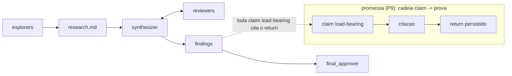
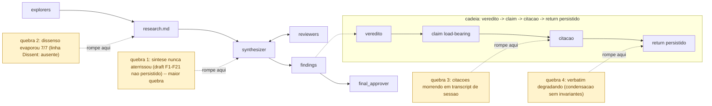
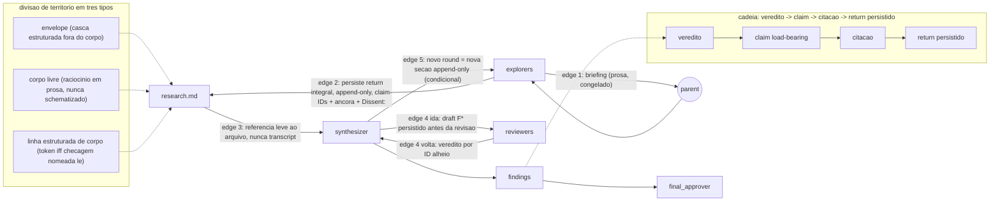
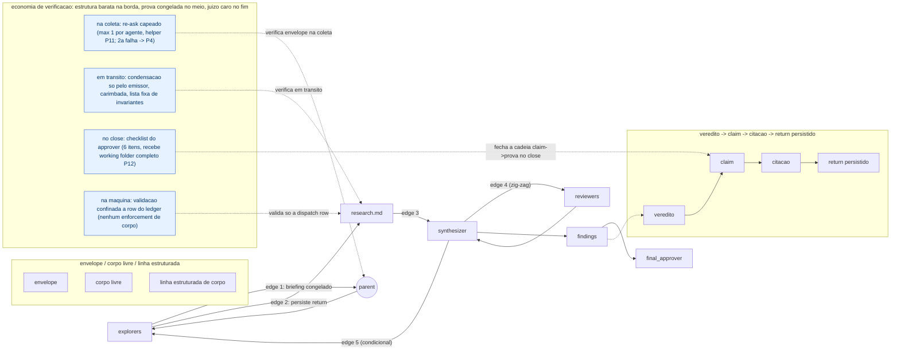
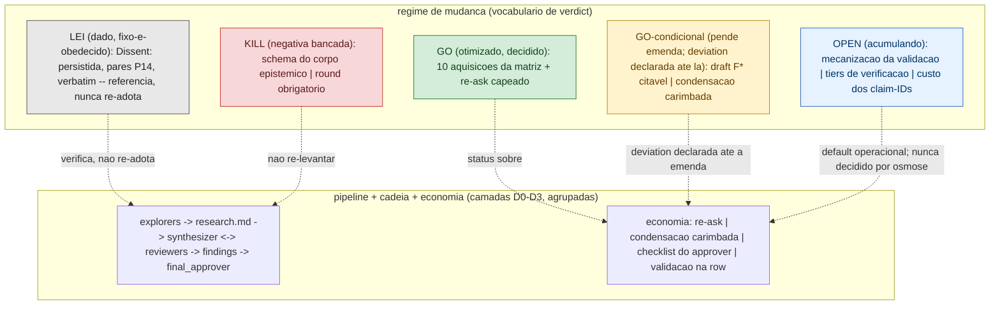

# System View — Contratos de I/O por role do pipeline de research dispatch

> **Para quem chega agora**
>
> **A pergunta deste documento:** quando um time de agentes investiga uma questão (exploradores → relatórios → sintetizador ↔ revisores → conclusões → aprovador), como garantir que cada afirmação da conclusão final seja auditável até a evidência bruta — depois de duas rodadas reais quebrarem essa cadeia em quatro pontos documentados (→ Camada 1)?
>
> **Onde você está:** o documento que fixa o formato dos contratos entre esses agentes — o que cada um recebe, o que entrega, quem confere o quê, e quando.
>
> *Rótulos de status (tradução informal, não definição): [DECIDIDO] = GO; [DECIDIDO, PENDE EMENDA] = GO-condicional (vale só com desvio declarado até a emenda); [ABERTO] = OPEN; [MORTO] = KILL. Vocabulário canônico na Camada 4; termos na discovery §2. Os ponteiros `engineer-view#…` são as rows donas do registro de cada decisão (doc ainda não escrito — handles provisórios, OQ-SV-1).*
>
> **O que ficou definido, e por quê:**
> - **Havia pressão para tipar o raciocínio dos agentes (JSON de claims) para validar por máquina.** Escolha: estrutura só na casca — quem escreveu, qual ângulo — e uns poucos tokens fixos que alguma checagem de fato lê; o raciocínio fica em prosa livre. Porquê: formato imposto degrada exatamente o texto que serve de prova. [DECIDIDO] (→ Camada 2 · `engineer-view#envelope-sobre-corpo-livre`)
> - **Citações morriam em transcript de sessão e relatórios eram resumidos pelo coordenador antes de salvar.** Escolha: todo relatório aterrissa inteiro em arquivo append-only, com ID por afirmação. Porquê: auditar vira conferir arquivo, não confiar em paráfrase. [DECIDIDO] (→ Camada 2, edges 2–3 · `engineer-view#append-only-persist`)
> - **O rascunho do sintetizador nunca era salvo — a conclusão citava um texto que não existia mais (a maior quebra observada).** Escolha: o rascunho persiste como prova citável antes da revisão. [DECIDIDO, PENDE EMENDA] (→ Camada 2, edge 4 · `engineer-view#draft-f-citavel`)
> - **A cada repasse o "verbatim" degradava — e o que se perdia era justamente o dissenso.** Escolha: só o autor condensa o próprio texto, com carimbo e lista fixa do que sobrevive (IDs, dissenso, posições); o coordenador nunca reescreve. [DECIDIDO, PENDE EMENDA] (→ Camada 3 · `engineer-view#rota-de-condensacao`)
> - **Validar tudo automaticamente convida campo-vácuo — campo que ninguém lê é preenchido com lixo e depois cortado (já aconteceu aqui).** Escolha: verificação como economia — estrutura barata na borda, prova congelada no meio, checklist humano de 6 itens no fechamento (emenda candidata, não lei vigente) e 1 repescagem por agente; depois o buraco é registrado como buraco. [DECIDIDO] (→ Camada 3 · `engineer-view#checklist-6-itens`)
> - **Ninguém decidiu como esse contrato vira verificação por máquina.** Três posições vivas — checklist lido × script × linter — com dono externo a este doc. [ABERTO] (→ Camada 3; OQ-SV-3 · `engineer-view#mecanizacao-da-validacao`)
> - **Schematizar o corpo do raciocínio:** morto três vezes, por três investigações independentes — não re-levantar. [MORTO] (→ Camada 2 · resolve em `engineer-view#envelope-sobre-corpo-livre`)
>
> **O que provaria o desenho errado:** um novo dispatch, com os contratos ativos, quebrando a cadeia afirmação→prova num ponto que as quatro quebras não previram.
>
> **Quem decide o quê:** este doc só *nomeia* as posições de design; o registro de cada decisão tem uma única row dona no engineer-view.

*D0 — a altitude máxima: o pipeline de roles e a promessa de lei vigente de que toda claim do findings se ancora num return durável. Os diagramas seguintes (D1–D4) repetem este e só adicionam os conceitos da camada onde aparecem.*

## Objective

Explicar, em altitude de stakeholder e uma camada conceitual por vez, o *shape* e os stakes do sistema de contratos de I/O por role do pipeline de research dispatch (explorer → research.md → synthesizer ↔ reviewers → findings → approver): por que ele existe, como o envelope sobre corpo livre carrega a cadeia claim→prova, quem verifica o quê e quando, e qual o regime de mudança de cada peça. Esta view NOMEIA toda stance load-bearing e NÃO DECIDE NENHUMA — cada stance aponta para exatamente uma futura row de decisão do engineer-view, e o significado de cada termo é deferido à ontology-view (ainda não autorada; vocabulário de trabalho: discovery §2).

## Contexto de fontes (term source + decision inventory)

- **Fonte de termos:** `ontology-view` — **ainda não autorada**. Até lá, todo termo usado aqui (return, envelope, corpo livre, linha estruturada de corpo, claim-ID, âncora, linha `Dissent:`, vocabulário de verdict, contratos por edge, checklist do approver, re-ask helper) é USADO conforme o vocabulário de trabalho da `discovery.md` v1.0.0 §2 (Core Concepts) — nunca redefinido aqui.
- **Inventário de decisões:** `engineer-view` — **ainda não autorado**. Todo handle `stance:<slug> → engineer-view#<stance-slug>` desta view é **PROVISIONAL** e isso é um blocker OQ (ver Open questions). Nenhuma stance é resolvida aqui declarando o verdict no lugar da row.
- **Corpus semente:** `discovery.md` v1.0.0 (este folder) — a fonte que esta view minera; autoridade citável por trás dela: `research/findings.md` (matriz §2, arbitragens §3, contratos por edge §4) e `research/research.md` (returns E1/E2/E3, verbatim).
- **Leitura registrada de uma ambiguidade do SKILL (system-view):** as tabelas "alternative framings we considered" acompanham cada **camada de shape** (Camadas 1–4) — leitura do quality-bar do SKILL; Surface, o mapa de stances e o closing map não são camadas de shape e não carregam tabela. A inconsistência interna do gate (quality-bar por-camada vs Step 8/lane model "per-major-section") está **encaminhada ao dono do skill** — interpretação registrada aqui, não resolvida por esta view.

---

## Surface — o que isto é

Quando uma pergunta é grande demais para um único agente, o pipeline de research dispatch despacha um pequeno time: **explorers** investigam ângulos distintos e entregam returns; um **synthesizer** funde os returns num draft; **reviewers** atacam o draft; um **findings** final carrega os vereditos; e um **final_approver** aceita ou rejeita no close. A promessa que sustenta tudo é simples e exigida por lei vigente (constituição v0.5.2, P9): **toda claim load-bearing do findings tem de citar o return coletado que a sustenta** — uma cadeia claim→prova verificável contra artefato durável, não contra memória de conversa.

Este sistema é o conjunto de **contratos de input/output por role** que faz essa promessa ser mecânica em vez de sorte: o que cada agente recebe, o que cada agente entrega, em que forma, onde isso é persistido, e quem verifica o quê em que momento. O desenho central cabe numa frase (findings §3, primeira linha): **envelope estruturado sobre corpo livre, com a verificabilidade morando na persistência e num check de close — nunca em tipar o raciocínio.**

Para um stakeholder, o stake é este: sem esses contratos, dois dispatches reais já quebraram a cadeia de prova em pontos documentados — e cada quebra significa um veredito final cuja sustentação não pode mais ser auditada. Com eles, a auditoria do resultado é um checklist sobre arquivos no repo, não um ato de fé.

---

## Camada 1 — O problema: a cadeia claim→prova e onde ela quebrava

O findings de um dispatch é um documento de vereditos. Cada veredito se apoia em claims; cada claim load-bearing deve citar o return coletado que a sustenta (P9); e o approver deve checar isso recebendo o working folder completo (P12) — nunca um resumo no lugar dele. Essa é a cadeia: **veredito → claim → citação → return persistido**.

Dois dispatches reais de 2026-06-12 mostraram exatamente onde essa cadeia rompe quando não há contrato (discovery §1, com localização verificada por E1):

1. **Camada de síntese nunca aterrissou** — o draft do synthesizer (F1–F21) nunca foi persistido no research.md; o findings cita F-numbers em quase toda linha, mas o enunciado de F11 só é recuperável por inferência via o veredito de um reviewer. A citação resolve para um *veredito sobre* o claim, não para o claim. A maior quebra observada (findings §2 #12).
2. **Dissenso evaporou 7/7** — nenhum dos sete returns de explorer persistidos termina com a linha `Dissent:` que o type skill exige; o check anti-falso-consenso ficou sem sinal para ler. O dissenso real existiu, mas foi reconstruído a posteriori pela síntese, não declarado pelo emissor.
3. **Citações morrendo em transcript** — cadeias terminando em "full text is in the session transcript": artefato efêmero; a checagem P9 passa a verificar contra paráfrase do parent, não contra o return.
4. **Verbatim degradando monotonicamente** — "verbatim" → "verbatim-in-substance" → "condensed-but-faithful", condensação feita pelo MESMO parent que sintetiza, sem regra do que pode ser perdido; o que não sobreviveu foram exatamente as linhas `Dissent:`.

O diagnóstico que orienta todo o resto do shape: **as quebras não foram de formato nem de falta de tipagem — foram de persistência seletiva e de condensação sem invariantes** (research.md §E1 Dissent, citado pela discovery §1). O sistema de contratos existe para fechar esses quatro buracos em primeiro lugar — mais o relato de identidade no próprio artefato (aquisição deste dispatch, lida contra P3 — o espelho no frontmatter, `stance:espelho-no-frontmatter`): ele não reinventa o briefing (propriedade da constituição §5), não toca o gate humano, e não promulga lei — recomenda emendas.

*D1 — o pipeline de D0 com as quatro quebras documentadas anotadas sobre os pontos exatos da cadeia onde ela rompia sem contrato.*

### Alternative framings we considered (Camada 1)

| Framing alternativo | De onde veio | Por que esta view não o adota como leitura do problema |
|---|---|---|
| "O problema é falta de tipagem do conteúdo" — schematizar claims/evidência resolveria | Limite do design space (discovery §3) — **ninguém o defendeu**; nenhum dos seis precedentes externos o pratica (research.md §E2 "Padronizado" 4) | As quebras documentadas são de persistência e condensação, não de forma (E1 Dissent); a leitura "tipagem" repete o erro do validator v0.3.0 cortado pela própria constituição. A negativa é bancada — o destino formal é row do engineer-view (`stance:envelope-sobre-corpo-livre`) |
| "O problema é processo: bastava disciplina do parent" — confiar na reinvenção feliz por dispatch | Tentação derivada do fato de ter funcionado duas vezes (E1 ev. 1) — **nenhuma fonte o defendeu**: E1 documenta a emergência sem regra como argumento para CODIFICAR o que emergiu (E1 §Elementos), não para confiar na reinvenção | "Deu certo duas vezes" não é garantia (discovery §1): namespaces de claim emergiram por sorte; quando a persistência falhou, a checagem P9 perdeu a base mecânica |
| "O fecho é o close, não um schema executável" — as quebras reais seriam pegas por um checklist no close, **não por um schema executável** (claim comparativo ANTI-mecanização, não tese de que o checklist sozinho basta) | Dissent de E1 (research.md §E1) — que no corpo propõe TAMBÉM contratos de emissão (§Elementos: draft do synthesizer persistido antes da revisão, `Dissent:` imune à condensação, lista de invariantes sob condensação, persistência integral para reviewer/synthesizer) | Absorvida quase inteira: a convergência decidida adotou exatamente checklist E contratos de emissão juntos (findings §3, primeira linha) — o que esta view não toma de E1 é só o alvo do comparativo (o schema executável), que segue dentro do OPEN de mecanização; o peso relativo das duas metades é tensão das rows `stance:checklist-do-approver` e `stance:mecanizacao-da-validacao`, não desta célula |

---

## Camada 2 — O shape da solução: envelope sobre corpo livre, cinco edges como fluxo

A solução não é um schema; é uma **divisão de território em três tipos** (vocabulário: discovery §2 e §4.1, que nomeia o critério vencedor de E3 — um elemento estrutural só entra se uma checagem nomeada o lê). Proveniência do shape vencedor, declarada: ele é, em substância, **majoritariamente o candidato composto de E2** — as peças 1–4 do candidato aterrissam nos GOs — com o critério de admissão de campo vindo de E3 e o diagnóstico das quebras vindo de E1 (discovery §3, convergência); as alternativas da tabela abaixo desafiam um centro com autor, não um produto neutro.

- O **envelope** — a casca estruturada FORA do corpo do return (header de fronteira, frontmatter): identidade, ângulo, montagem determinística. É onde estrutura é barata e o precedente externo é unânime.
- O **corpo livre** — o raciocínio epistêmico em prosa, nunca schematizado.
- A **linha estruturada de corpo** — token com gramática fixa DENTRO do corpo livre (claim-IDs, âncoras, `Dissent:`, posições rotuladas, carimbo de condensação), sancionado *iff* uma checagem nomeada o lê. A terceira categoria é o que torna a fronteira formulável como tipo, não como exceção em prosa.

Esse território é percorrido por **cinco edges** — o fluxo do dispatch, cada um com payload, formato e invariantes (texto canônico: findings §4):

1. **Edge 1: parent → explorer (briefing).** Prosa de briefing dentro do canal existente — congelado; nenhum campo estruturado de input novo. Este edge é propriedade da constituição §5: o contrato o referencia, não o re-decide.
2. **Edge 2: explorer → research.md (persistência do return).** O return aterrissa integral, sob header de fronteira (identidade + ângulo), com claim-IDs em namespace próprio por agente (gramática default do ID: definição do termo na discovery §2; a derivação canônica de `<label>` segue aberta — tensão em `stance:derivacao-de-label`), no mínimo uma âncora resolvível por claim, e a linha `Dissent:` em posição fixa de fecho do return (posição e literais: findings §4 edge 2) — montagem determinística e append-only pela sheet (congelada na dispatch row), com o conteúdo do filho congelado (mecânica de montagem e literais: findings §4 edge 2).
3. **Edge 3: research.md → synthesizer.** Referência leve ao arquivo completo — nunca transcripts. O gatilho de imutabilidade é o *persist*, não a citação: seção persistida nunca é editada; síntese anexa seções novas.
4. **Edge 4: synthesizer ↔ reviewer (zig-zag).** Ida: o draft do synthesizer persistido com IDs próprios (`F*`) como seção append-only ANTES da revisão *(rota GO-condicional — pende emenda de uma linha em P9, §5.1; deviation declarada por dispatch até lá)* — a resposta direta à quebra F11, para que veredito e alvo morem no mesmo artefato durável. Volta: veredito exaustivo por ID alheio em vocabulário fechado, claims novas carimbadas, posições inicial e final declaradas pelo emissor de forma comparável, `Dissent:` final.
5. **Edge 5: synthesizer → explorers (feedback; condicional).** Novo round = nova seção append-only; contador de IDs nunca reinicia; returns persistidos permanecem imutáveis.

E o **close**: o findings com matriz de vereditos como shape default, toda claim load-bearing citando ID, e o checklist do approver fechando a cadeia (Camada 3). O findings espelha a identidade do dispatch no próprio artefato como relato — espelho cuja sanção confronta a frase final de P3 ("no other persistence surface"); a fonte de verdade permanece a row do ledger (campos exatos e tensão: row `stance:espelho-no-frontmatter`; emenda 5). Aplicabilidade honesta: edge 1 aplica sempre; edges 2–5 aplicam iff n ≥ 2; em n = 1 os invariantes de envelope valem dentro do próprio findings.

O que esse shape compra, em uma linha por edge: o edge 2 garante que a prova *existe e é congelada*; o edge 3 garante que a síntese *lê a prova, não um eco dela*; o edge 4 destina a camada de síntese a *também ser prova citável* — fechando o buraco F11 *(pende emenda §5.1 — deviation declarada até lá)* — sem virar prova terminal (guard anti-auto-citação, obrigatório desde já: F-claims carregam suas próprias citações E* — regime próprio, declarado dentro da row `stance:draft-citavel-do-synthesizer`); o edge 5 garante que iteração não apaga história.

*D2 — D1 mais o shape da solução: envelope sobre corpo livre mais a linha estruturada de corpo, percorrido pelos cinco edges que fecham cada quebra da Camada 1.*

### Alternative framings we considered (Camada 2)

| Framing alternativo | De onde veio | Por que esta view não o adota como shape |
|---|---|---|
| **Família message-schema** — tipar o envelope em memória (TypedDict/Pydantic), o canal carrega o objeto | Levantamento de E2: uma das duas famílias reais de contrato (research.md §E2 "Padronizado" 2) | Sistemas de research de longa duração convergem para a outra família (artifact-as-contract): o payload é documento persistente e o canal carrega referência — e a quebra interna observada foi de persistência (E1; diagnóstico: research.md §E1 Dissent); a convergência decidida adotou a família artifact-as-contract (findings §3, primeira linha; formalização na row `stance:envelope-sobre-corpo-livre`) |
| **Contrato mínimo derivado** — fronteira por SEÇÃO, sem IDs nem âncoras por claim: "resolução em nível de seção satisfaz 'cites the return it rests on'; granularidade além disso é **custo sem regra que a exija**" — um shape alternativo completo e concorrente, não uma objeção pontual | Posição inteira de E3 (research.md §E3 R1 + tabela "Síntese do mínimo forçado"; discovery §3(b)) | Dispensa honesta: os namespaces por claim emergiram duas vezes na prática sem regra e foram o que fez a checagem P9 barata (E1 ev. 1) — mas a adoção da granularidade por claim é **decisão de design declarada, não vitória sobre E3** (discovery §4.2): o dissenso permanece vivo e o custo segue OPEN, sem medição (rows `stance:ids-de-claim-com-namespace` e `stance:custo-dos-ids`) |
| **Tipar o corpo epistêmico** — JSON de claims/evidência | O limite do design space: **a alternativa que ninguém defendeu** (discovery §3) — nem E2, cujo próprio Dissent a ataca | Morta três vezes, independentemente, por E1, E2 e E3 (discovery §5 item 1); restrição de formato durante o raciocínio degrada exatamente os agentes cujo output é a superfície de prova. Negativa bancada — formalização na row `stance:envelope-sobre-corpo-livre` |
| **Campos estruturados novos de input** no briefing | Tentação simétrica do lado do input | Morta pelo experimento natural da tabela §7 da constituição: campo estruturado que nenhuma checagem consome é preenchido com vácuo e depois cortado (research.md §E3 §Evidência interna) |
| **Resumo intermediário** entre explorer e checagem (digest ao approver) | Otimização de custo aparente | Cada camada intermediária de resumo reintroduz o telephone effect no ponto onde a verificação acontece (research.md §E3 evidência (b)); P12 exige o working folder completo |
| **Lista de fontes com URL no header** (peça #1 do candidato de E2) | Posição defendida que evaporou entre research e matriz — lacuna registrada (discovery §5 item 9) | Elemento que o findings **não veredita** (lacuna S3); a discovery §5 item 9 registra recomendação revisável de não-adoção (sem checagem nomeada consumidora; prova já coberta pelas âncoras). Nem adotado nem rejeitado por esta view — veredito explícito pertence à spec (dispensa, não-stance; handle: OQ-SV-4) |

---

## Camada 3 — A economia de verificação: quem checa o quê, e quando

O sistema rejeita deliberadamente a fantasia de "validar tudo, automaticamente, em todo lugar". A verificação é uma *economia*: cada checagem tem um dono, um momento e um custo — e estrutura só existe onde uma checagem nomeada a lê.

**No close — o checklist do approver.** A peça sem dono no ecossistema externo (checagem de citação por claim) vira aqui um **checklist de 6 itens**, escopado "aceitação para `dispatch_type: research`", que o final_approver aplica *(no shape proposto; o regime do intervalo pré-emenda é stance aberta — `stance:regime-pre-emenda`)* recebendo o working folder completo. Em substância, o checklist confere, sobre os artefatos persistidos, que toda cadeia claim→prova fecha e que os invariantes de emissão de cada role foram cumpridos — a resolução de citação é mecânica; a sustentação é juízo declarado do approver; itens não aplicáveis em n=1 marcam ausência de role, distinta de aprovação (texto canônico dos itens e dos carimbos: findings §4 Close; row `stance:checklist-do-approver`). O checklist não é um campo preenchível por dispatch — é a definição executável da checagem P9 que P12 já manda o approver fazer; seu destino formal é emenda candidata ao type skill, não aquisição auto-sancionada.

**Na coleta — o re-ask capeado.** Falha de envelope (faltou header? `Dissent:`? IDs?) admite **no máximo 1 re-ask por agente**, classificado como helper (P11): sem row própria (leitura da letra de P11 a confirmar na emenda — discovery §4.4, achado D5), sem gate — re-tentativa única, **contabilizada no bucket `helpers` de `agents_spawned`, campo required da close row (constituição §5), e relatada**; a declaração de desvio que a acompanha mora no **corpo** do close — o erratum A14 governa só as linhas `Deviation:`/`Accepted-unreviewed:`, cujo "campo de desvios da close row" não existe — sem consumir o orçamento de iteração do dispatch. Segunda falha ou return ausente → **P4 literal**: resultado parcial do grupo, com a ausência registrada de forma que preserve a montagem determinística e deixe a lacuna auditável (contabilidade exata e carimbo literal de ausência: findings §3 arbitragem 1 / findings §4 edge 2; row `stance:re-ask-capeado`). A racionalidade: re-ask sem teto contradiz P4 e fura a contabilidade; remoção total joga fora sinal recuperável — o único caso interno de malformação observado (Dissent ausente) é exatamente o que um re-ask barato recupera (findings §3 arbitragem 1).

**Em trânsito — condensação só pelo emissor *(rota GO-condicional — pende emenda §5.2 ao skill; deviation declarada até lá; row dona: `stance:condensacao-carimbada`)*.** Se token_budget forçar condensação, a rota decidida pelo dispatch é: executada somente pelo agente emissor (nunca pelo parent — o conserto silencioso é o canal que comprovadamente degrada), carimbada sob o header, com lista fixa de invariantes preservados (IDs, âncoras, `Dissent:`, posições).

**Na máquina — validação mecânica confinada à row.** O appender do ledger valida a row do dispatch; **nenhum elemento dos contratos de corpo ganha enforcement por tooling** nesta decisão (findings §4 preâmbulo). COMO o contrato deveria ser validado no futuro — checklist lido vs script vs linter — é um dissenso genuíno de três posições, não arbitrado (em uma linha cada: checklist-não-script é o único default constitucionalmente seguro, pois o corte do validator v0.3.0 é lei; mecânica confinada à row até existir witness interna de malformação que um checklist lido não pegue; o juízo "sustenta a claim" é inferramentável por construção — discovery §3(d)), pertencente ao dono do corte do validator v0.3.0 (findings §6.1).

O desenho da economia, em uma frase: **estrutura barata na borda (envelope), prova congelada no meio (persist), juízo caro e humano no fim (checklist + gate)** — e nada de maquinário que convide vácuo.

*D3 — D2 mais a economia de verificação sobreposta ao fluxo: quem checa o quê e quando.*

### Alternative framings we considered (Camada 3)

| Framing alternativo | De onde veio | Por que esta view não o adota como economia |
|---|---|---|
| **Validação mecânica de envelope na coleta** (falha explícita estilo exceção — peça #5 do candidato de E2) | E2 Candidato #5 — rejeição explícita em vez de absorção silenciosa: "o argumento mais forte do levantamento" para validar o envelope mecanicamente (E2 §AutoGen); diretamente pertinente porque degradação silenciosa É o diagnóstico central do problema (E1 ev. 3) | Declínio PROVISÓRIO, não kill ("cheiro v0.3.0"); permanece dentro do OPEN de mecanização. A escolha final pertence à row `stance:mecanizacao-da-validacao` |
| **Checagem de citação como passo/agente dedicado pós-síntese** — um verificador que percorre cada claim do findings e confirma que a âncora citada existe no research.md E sustenta a claim: "é aqui que a verificabilidade mora — não em tipar mais o payload" | Peça #4 do candidato de E2 (research.md §E2 Candidato #4) — o único precedente que trata a peça sem dono (Anthropic CitationAgent + citation accuracy como gate) | Demovida a checklist de close pela convergência (discovery §3) — mas permanece **quarta forma VIVA dentro do OPEN de mecanização**, competidor direto do checklist, não alternativa morta: se o "script" de l3b a subsume, quem fechar o OPEN deve dizê-lo (discovery §6.1, correção S6). Destino: row `stance:mecanizacao-da-validacao` |
| **Remoção total do re-ask** — degradar direto a P4 | Opção (a) da arbitragem 1 (posição constitucional) | Joga fora sinal recuperável; P11 já fornece a classificação sancionada de helper e o freio por relato (findings §3 arbitragem 1). A fronteira helper-vs-dispatch permanece provisória na própria P11 |
| **Conserto silencioso pelo parent** — normalizar/condensar na coleta | Prática observada nos dispatches reais | É o canal exato que E1 ev. 3 mostra degradar; condensação só pelo emissor, carimbada (discovery §5 item 6) |
| **Taxonomia completa de 4 tiers de verificação por claim** | Metade do split do elemento #9 — defendida por E1: a prática inventou o marcador ad-hoc (E1 ev. 2, compensação por campo que não existia) e E1 §Elementos propõe o campo de verification-tier por claim | Sem witness de ausência e sem consumidor não-circular — a dispensa arbitrou contra um witness alegado (a metade carimbo do split TINHA witness; por isso ela é GO — row dona: `stance:carimbo-not-re-reviewed`); promoção futura deve confrontar o corte de `grade` ("never filled in practice"). Tensão viva — row `stance:tiers-de-verificacao` |
| **Anotação inline do parent dentro do return** ("*(Parent verified: ...)*") | Prática registrada (E1 ev. 6) | Colide com o reducer de conteúdo congelado e com a proibição de conserto silencioso — colisão registrada, não decidida (discovery §6); destino na row `stance:verificacao-do-parent` |

---

## Camada 4 — O regime de mudança: dado vs otimizado vs acumulando

Esta é a camada given-vs-optimized da view: o que é **fixo-e-obedecido**, o que é **otimizado-e-decidido**, o que está **condicionado a destrave**, o que **acumula aguardando witness**, e o que é **negativa bancada**. O sistema carrega esse regime explicitamente no seu vocabulário de verdict (discovery §2; semântica: findings §2) — e a *contagem honesta* é, ela mesma, um invariante: a spec que codificar os contratos deve preservá-la (discovery §7).

- **Dado (LEI) — fixo-e-obedecido.** Leis vigentes que o contrato *referencia e verifica, nunca re-adota*: a linha `Dissent:` persistida (teorema por composição de leis do skill), os pares posição-inicial/final por reviewer (P14), e o verbatim. Mudam por governança própria, não por este sistema; o que uma LEI testemunha é violação, não lacuna — e re-adotá-las inflaria a contagem de aquisições sob P10.
- **Otimizado (GO) — decidido por este dispatch.** As dez aquisições GO da matriz (findings §2): envelope sobre corpo livre, header de fronteira, claim-IDs com namespace, âncoras por claim, checklist do approver (como emenda candidata), append-only estendido à síntese, output do reviewer, espelho no frontmatter, shape do findings e input congelado — mais o re-ask capeado, resolvido pela arbitragem 1 **dentro da linha #17 da matriz** (linha cuja parte OPEN — a forma da validação — mora na row `stance:mecanizacao-da-validacao`; split declarado, como no #9). Cada uma com sua base citada; **cada uma com sua row no mapa de stances abaixo**. As duas desambiguações adotadas (A2 — aplicabilidade/n=1; A3 — definição executável de load-bearing) resolvem dentro de rows nomeadas: A2 na row `stance:shape-do-findings`, A3 na row `stance:checklist-do-approver`.
- **Condicionado (GO-condicional) — otimizado, mas com condição declarada na célula.** Duas peças operam sob deviation declarada até a emenda que as destrava: o draft `F*` citável (pende uma linha em P9 — emenda 1) e a rota de condensação carimbada (pende emenda 2 ao skill). A terceira, o split do carimbo `not-re-reviewed` (#9), tem condição de outra espécie: a metade carimbo + cláusula de aceitação é **GO desde já, sem deviation**; a metade taxonomia de 4 tiers é OPEN condicionada a **consumidor futuro não-circular** — nenhuma emenda pendente a destrava (findings §2 #9, §6.2). Rows donas, split declarado: `stance:carimbo-not-re-reviewed` para a metade GO; `stance:tiers-de-verificacao` para a metade OPEN. A regra de honestidade é absoluta: **GO-condicional nunca é apresentado como adquirido** antes de a condição fechar — e a declaração de deviation mora no **corpo** do close do findings: o "campo de desvios da close row" não existe no schema vigente (erratum A14, registrado no fechamento desta view).
- **Acumulando (OPEN) — registrado, aguardando owner/witness/consumidor.** Mecanização da validação (decisão de owner), taxonomia de 4 tiers (sem consumidor não-circular), custo dos claim-IDs (dissenso de E3 vivo; nenhum lado decide sem medição — row `stance:custo-dos-ids`). OPEN nunca vira decidido por osmose.
- **Negativa bancada (KILL) — não re-levantar.** Schema do corpo epistêmico (kill unânime; destino formal: row `stance:envelope-sobre-corpo-livre`) e `round` obrigatório em todo return (destino: row `stance:append-only-estendido`, onde a marcação de seção de round do edge 5 mora; marcador literal: findings §4). KILLs sem stance própria resolvem na row mais próxima, nomeada — nunca ficam sem destino sob a tradução de KILL (negativa tipada registrada; o status legal no conjunto do consumidor é decisão da row `stance:mapa-verdict-status`).

Há ainda um **mapa de tradução proposto** desse vocabulário para os status do engineer-view (GO e as duas adotadas A2/A3 → RESOLVED; GO-condicional → OPEN com gate nomeado, a emenda que destrava — nunca RESOLVED antes dela; OPEN → OPEN, com CRITICAL só se bloquear a spec — nenhum dos três bloqueia, todos têm default operacional; KILL → registrado como negativa tipada com autoridade citada — "RESOLVED-negativo" não é valor do conjunto fechado {RESOLVED, OPEN, CRITICAL} do consumidor, e o status legal é decisão da row; LEI → referência, não row própria) — proposto pela discovery §7 como tradução, não decisão nova; sua adoção é, ela mesma, uma row do engineer-view (`stance:mapa-verdict-status`), e carrega uma tensão nomeada com a legenda do consumidor: RESOLVED, no SKILL do engineer-view, exige **decidido E enforced** — enquanto as emendas 2–4 pendem, a tradução mecânica das 10 aquisições GO produziria OPEN, não RESOLVED (a tensão mora na célula da row, no mapa abaixo).

O stake desta camada para um stakeholder: o sistema *sabe a diferença entre o que obedece, o que escolheu e o que ainda não sabe* — e força essa diferença a sobreviver à escrita da spec. Um sistema que apresentasse os cinco regimes como uma lista uniforme de "regras" perderia exatamente a auditabilidade que motivou tudo.

*D4 — os elementos de D0–D3 agrupados, com o regime de mudança como camadas de status por cima (nenhum verdict de stance individual é desenhado; só os regimes nomeados).*

### Alternative framings we considered (Camada 4)

| Framing alternativo | De onde veio | Por que esta view não o adota como regime |
|---|---|---|
| **Tudo é aquisição** — re-adotar as leis vigentes como regras novas do contrato | Tentação natural ao redigir um contrato "completo" | Infla a contagem sob P10 e re-decide o que já tem dono; a categoria LEI existe precisamente para verificar sem re-adotar (findings §2, semântica). A trilha de revisão derrubou a contagem de ~13 para 10 GO + 3 GO-condicional justamente por isso (findings §3; pela trilha §8, a forma final fecha em L3) |
| **Promulgar pelas findings** — tratar as emendas recomendadas como vigentes | Atalho operacional | O findings recomenda, não promulga (findings §5); P9 é constituição e muda por rito de governança próprio (discovery §7). Operar a rota F* hoje sem deviation declarada violaria a própria checagem de citação do checklist |
| **Checklist auto-sancionado** — aplicar os 6 itens como lei desde já, uniformemente | O close do findings já o aplicou uma vez (witness de aplicação, não de regime) | O regime do intervalo pré-emenda é decisão de quem redigir a emenda; a recomendação registrada (regime dividido por proveniência das tags) está demovida a recomendação revisável. Tensão viva — row `stance:regime-pre-emenda` |
| **Achatar OPEN em default** — tratar o default operacional como decisão tomada | Conveniência de spec | OPEN nunca vira decidido (discovery §6); cada OPEN carrega default operacional e, onde a fonte o nomeia, o dono da decisão futura (só 6.1 tem dono nomeado; 6.2 aguarda consumidor não-circular, 6.3 aguarda medição — ver OQ-SV-3) — colapsar default e fechamento destruiria a trilha de quem decide |

---

## Mapa de stances — nomeadas aqui, decididas no engineer-view

Cada stance load-bearing do shape acima, com a tensão que carrega, apontando para a row do engineer-view que será a única dona do seu **registro** — verdict, status e autoridade citada. Distinção de propriedade (ver OQ-SV-3): a row é sempre dona do REGISTRO da decisão; quando o dono da RESOLUÇÃO é externo a esta cadeia de views (OPENs de fechamento externo), a row registra a tensão, o default operacional e o **encaminhamento** ao fechamento externo — nunca finge fechar o que não é seu. O marcador `[registro + encaminhamento]` é reservado às três rows dos OPENs 6.1–6.3, cujo fechamento OQ-SV-3 rastreia; nas demais rows de dono externo, o encaminhamento é o dono nomeado na própria célula. Rows sem verdict de matriz — oriundas dos abertos-da-discovery (§6) ou da proposta §7 (`stance:derivacao-de-label`, `stance:regime-pre-emenda`, `stance:verificacao-do-parent`, `stance:mapa-verdict-status`) — traduzem como **OPEN com dono nomeado na célula**; nenhuma é CRITICAL (todas carregam recomendação/default na discovery §6/§7). O engineer-view **não existe ainda**: todo handle é **[PROVISIONAL — row not yet authored]** e endereça, onde aplicável, pelo handle canônico da matriz do findings (convenção U3 da discovery §4.7). Esquema único de nomes, declarado: a âncora pública de cada row É o próprio stance-slug — todo ponteiro desta tabela é `engineer-view#<stance-slug>`; a chave interna `decision:#<id>` do SKILL do consumidor e o handle de matriz `#n` endereçam a MESMA row, nunca um terceiro nome. Regra de row-com-split, declarada: quando uma única linha da matriz carrega parte resolvida E parte aberta (#9, #17), cada parte resolve numa row própria e ambas as rows declaram o compartilhamento do handle — preservando "um verdict, um status" por row. As quinze primeiras rows carregam tensão viva; as seis últimas são **GOs estáveis de tensão baixa** — entram com row e ponteiro próprios para que nenhuma aquisição GO fique órfã de dono de registro. A promessa da Camada 4 fecha contra este mapa: toda aquisição GO, todo condicional e todo aberto têm exatamente uma row dona de registro — **21 rows ao todo** (decomposição e conferência aritmética: engineer-view, OQ-SV-1).

| Stance | Tensão (nomeada, não decidida) | Row dona |
|---|---|---|
| `stance:envelope-sobre-corpo-livre` | Verificabilidade barata na casca versus o risco de a estrutura migrar para dentro do raciocínio — onde a fronteira de tipo (envelope / linha estruturada de corpo / schema do corpo) exatamente passa (matriz #5, #6 — discovery §4.1/§4.8) | → engineer-view#envelope-sobre-corpo-livre [PROVISIONAL] |
| `stance:ids-de-claim-com-namespace` | Granularidade por claim versus o dissenso vivo de E3 ("custo sem regra que a exija") — decisão de design declarada, não vitória sobre E3 (matriz #2; o custo, OPEN 6.3, mora na row irmã `stance:custo-dos-ids` — handles de fontes distintas, rows distintas) | → engineer-view#ids-de-claim-com-namespace [PROVISIONAL] |
| `stance:custo-dos-ids` | Custo dos claim-IDs: nenhum custo registrado, mas tampouco medido — o dissenso de E3 R1 permanece vivo e nenhum lado decide sem medição; default operacional mantido enquanto aberto (OPEN 6.3; GO irmão: matriz #2) | → engineer-view#custo-dos-ids [PROVISIONAL; registro + encaminhamento — fechamento aguarda medição, OQ-SV-3] |
| `stance:derivacao-de-label` | `<label>` sem definição apontável nos três vocabulários — derivação canônica e unicidade entre grupos a fixar; enquanto aberto, o guard de unicidade downstream (ontology-view) nasce PLANNED (dono nomeado: autor da spec; autoridade: discovery §4.2 + §6 abertos) | → engineer-view#derivacao-de-label [PROVISIONAL] |
| `stance:draft-citavel-do-synthesizer` | Fechar a quebra F11 persistindo o draft `F*` versus a letra vigente de P9, sob a qual citar `F*` falha o próprio checklist — emenda pendente, deviation até lá; E, **na mesma row, o guard anti-auto-citação** (F-claims carregam suas próprias citações E*), obrigatório desde já: dois regimes declarados — pendente-de-emenda e vigente-já — e a row é dona dos dois (#12; findings §3 arbitragem 2; discovery §4.5) | → engineer-view#draft-citavel-do-synthesizer [PROVISIONAL] |
| `stance:checklist-do-approver` | Definição executável da checagem P9 que P12 já manda versus a família dos campos preenchíveis que o §7 cortou — e o status de emenda candidata, não lei (#7; a definição executável de claim load-bearing, A3, resolve nesta row) | → engineer-view#checklist-do-approver [PROVISIONAL] |
| `stance:regime-pre-emenda` | No intervalo até a emenda 3: regime dividido por proveniência das tags dos itens versus deviation uniforme versus silêncio (silêncio ≠ permissão) (dono nomeado: quem redigir a emenda 3; autoridade: discovery §4.6 + §6 abertos, correção T1) | → engineer-view#regime-pre-emenda [PROVISIONAL] |
| `stance:re-ask-capeado` | Recuperar sinal barato com 1 re-ask helper (P11) versus degradar direto a P4 — sobre uma fronteira helper-vs-dispatch ela mesma provisória (#17, **parte resolvida da linha** — arbitragem 1; a parte OPEN da mesma linha mora em `stance:mecanizacao-da-validacao`; split declarado, como no #9) | → engineer-view#re-ask-capeado [PROVISIONAL] |
| `stance:condensacao-carimbada` | Rota de condensação pelo emissor, carimbada, com lista fixa versus a alternativa coerente registrada (manter proibição + re-ask com budget revisado) — emenda 2 pendente (#11) | → engineer-view#condensacao-carimbada [PROVISIONAL] |
| `stance:mecanizacao-da-validacao` | Checklist lido versus script versus linter versus passo/agente dedicado de checagem de citação (quarta forma viva — E2 #4) — dissenso genuíno, decisão do dono do corte do validator v0.3.0, não da síntese nem da spec (#17, **parte OPEN da linha**, compartilhada com `stance:re-ask-capeado` — split declarado; findings §6.1) | → engineer-view#mecanizacao-da-validacao [PROVISIONAL; registro + encaminhamento — dono externo nomeado, OQ-SV-3] |
| `stance:carimbo-not-re-reviewed` | O carimbo `not-re-reviewed` + cláusula de aceitação como GO desde já, sem deviation — a metade do split que TINHA witness (a compensação ad-hoc da prática, E1 ev. 2/6) — versus deixá-lo implícito na taxonomia (#9, **parte resolvida da linha**, compartilhada com a row irmã `stance:tiers-de-verificacao` — split declarado; findings §2 #9) | → engineer-view#carimbo-not-re-reviewed [PROVISIONAL] |
| `stance:tiers-de-verificacao` | A taxonomia completa de 4 tiers de verificação por claim — OPEN sem consumidor não-circular e confrontando o corte de `grade` (#9, **parte OPEN da linha**, compartilhada com a row irmã `stance:carimbo-not-re-reviewed` — split declarado; OPEN 6.2) | → engineer-view#tiers-de-verificacao [PROVISIONAL; registro + encaminhamento — fechamento aguarda consumidor não-circular, OQ-SV-3] |
| `stance:espelho-no-frontmatter` | A identidade do dispatch espelhada no findings como relato versus a frase final de P3 ("no other persistence surface") — sanção explícita ou demoção a redundância informativa; fonte de verdade permanece a row do ledger (#14, emenda 5; campos exatos: findings §2 #14) | → engineer-view#espelho-no-frontmatter [PROVISIONAL] |
| `stance:verificacao-do-parent` | Onde mora a verificação do parent: anotação inline no return (prática registrada) versus seção própria append-only assinada (reducer puro) — colisão registrada, não decidida (dono nomeado: autor da spec; autoridade: E1 ev. 6; discovery §6 abertos, S4) | → engineer-view#verificacao-do-parent [PROVISIONAL] |
| `stance:mapa-verdict-status` | A tradução GO/GO-condicional/LEI/OPEN/KILL → RESOLVED/OPEN/CRITICAL proposta pela discovery §7 (PROPOSTA — tradução, não decisão nova) versus a legenda do consumidor: o SKILL do engineer-view exige **RESOLVED = decidido E enforced** (gate/autoridade vigente em disco) e OPEN inclui *designed-but-not-built* — as 10 aquisições GO pendem das emendas 2–4, sem gate vigente em disco, logo a tradução mecânica pela legenda produziria **OPEN**, não RESOLVED; e KILL não ganha quarto status: "RESOLVED-negativo" não é valor do conjunto fechado {RESOLVED, OPEN, CRITICAL} — KILL → registrado como negativa tipada com autoridade citada; status legal a decidir pela row. A decisão da tradução pertence a esta row (dono nomeado: autor do engineer-view; autoridade: discovery §7 + engineer-view/SKILL.md, legenda de status) | → engineer-view#mapa-verdict-status [PROVISIONAL] |
| `stance:header-de-fronteira` *(GO estável, tensão baixa)* | Identidade + ângulo iff n≥2, modelo opcional/informativo com fonte canônica na row do ledger, e montagem determinística pela sheet (congelada na dispatch row) — o que entra na casca e os literais do header (matriz #1; literais: findings §4 edge 2/A5) | → engineer-view#header-de-fronteira [PROVISIONAL] |
| `stance:ancoras-por-claim` *(GO estável, tensão baixa)* | Mínimo 1 âncora por claim-ID em formatos fechados (tripla A4) versus prosa livre como âncora; resolver é mecânico, sustentar permanece juízo do approver (matriz #3) | → engineer-view#ancoras-por-claim [PROVISIONAL] |
| `stance:append-only-estendido` *(GO estável, tensão baixa)* | Gatilho de imutabilidade = persist, não citação (A6), estendido às seções de síntese/zig-zag; o KILL do `round` obrigatório resolve aqui — a marcação de round só existe quando o edge 5 dispara (matriz #10, #18; marcador literal: findings §4) | → engineer-view#append-only-estendido [PROVISIONAL] |
| `stance:output-do-reviewer` *(GO estável, tensão baixa)* | Veredito exaustivo sobre TODO ID alheio em vocabulário fechado de três desfechos, claims novas carimbadas, posições declaradas de forma comparável, dissenso declarado — exaustividade versus custo por return (matriz #13; literais e ordem: findings §4 edge 4) | → engineer-view#output-do-reviewer [PROVISIONAL] |
| `stance:shape-do-findings` *(GO estável, tensão baixa)* | Matriz de vereditos como default versus shape equivalente só com deviation declarada; alvo do determinismo = invariantes, não bytes (A13); emenda 4 pendente; a aplicabilidade n=1/edges (A2) resolve nesta row (matriz #15) | → engineer-view#shape-do-findings [PROVISIONAL] |
| `stance:input-congelado` *(GO estável, tensão baixa)* | Congelar o briefing como prosa (KILL para campo estruturado de input novo) num edge cuja propriedade é da constituição §5 — referenciar sem re-decidir (matriz #16) | → engineer-view#input-congelado [PROVISIONAL] |

---

## Open questions

Numeração própria desta view; não-contígua é aceitável.

- **OQ-SV-1 [BLOCKER].** O engineer-view não existe: todos os 21 handles de stance acima são PROVISIONAL. A decomposição aritmética da contagem (e sua conferência contra a matriz do findings) é trabalho do decision inventory, não desta view. Dono: autor do engineer-view deste folder. Insumos disponíveis: esta view + discovery §4/§7. O registro do mapa verdict→status como row própria é o que a discovery §7 já propõe (`stance:mapa-verdict-status`).
- **OQ-SV-2.** A ontology-view não existe: os termos desta view são usados conforme o vocabulário de trabalho da discovery §2, não definidos por um term graph tipado. Dono: autor da ontology-view. Nota herdada (U7 da discovery): enquanto a unicidade de `<label>` for OPEN, o guard de unicidade do claim-ID na ontology-view nasce PLANNED, não LIVE.
- **OQ-SV-3.** Os OPENs do sistema têm condição de fechamento externa a esta cadeia de views — mas a fonte só nomeia dono para um deles: a mecanização (6.1) pertence ao dono do corte do validator v0.3.0 (findings §6.1); a taxonomia de tiers (6.2) aguarda consumidor não-circular + confronto declarado com o corte de `grade`, sem dono nomeado na fonte; o custo dos IDs (6.3) aguarda medição — a discovery explicitamente não prescreve quando nem por quem (preâmbulo do §6: "aguardando owner/witness/consumidor" — disjunção, não dono universal). Distinção de propriedade: a row do engineer-view é dona do **registro** dessas decisões (tensão, default operacional, encaminhamento); o **fechamento** não depende do engineer-view deste folder. Como cada row redige esse encaminhamento é decisão de redação do autor do engineer-view — esta view apenas constata a propriedade externa.
- **OQ-SV-4.** A lista de fontes com URL no header (peça #1 do candidato de E2) é o único elemento defendido que o findings **não veredita** (evaporou entre research e matriz — lacuna S3; discovery §5 item 9). A discovery registra recomendação revisável de não-adoção; o veredito explícito pertence à spec. Dono: autor da spec. Esta view nem adota nem rejeita — este OQ é o handle da dispensa narrada na tabela da Camada 2, para que ela não fique órfã de dono.

---

## What this view does not cover

Esta view para no *shape*. Ela nomeia as stances e não declara nenhum veredito.

- **O engineer-view é dono dos vereditos, dos schemas e da mecânica:** o decision inventory (as 21 rows apontadas acima, com verdict + status RESOLVED/OPEN/CRITICAL + autoridade citada verificada em disco), os contratos literais por edge (literais de header, formatos de âncora, vocabulário fechado do reviewer, texto dos 6 itens — texto canônico hoje: findings §4), o erratum A14 (o "campo de desvios da close row" não existe no schema v0.5.2) e as cinco emendas pendentes com suas marcas de blocker.
- **A ontology-view é dona dos termos:** return, envelope, corpo livre, linha estruturada de corpo, claim-ID, âncora, `Dissent:`, vocabulário de verdict, contratos por edge, checklist do approver, re-ask helper — usados aqui, definidos lá (provisoriamente: discovery §2).
- **A discovery v1.0.0 é a fonte que esta view minera** — caminho para spec (§7), dependências de emendas (§6) e contagem honesta pertencem a ela e ao findings; esta view não os re-decide.
- **Critério de triagem dos abertos da discovery §6, declarado:** só o que esta view narra ganha handle aqui (caso narrado: OQ-SV-4). Os abertos §6 que nenhuma camada assume — a verificação equivalente de P14 para `review`, o witness de conteúdo dos pares P14, e a casa editorial do texto canônico dos contratos por edge — permanecem com a discovery e a spec, triados, não esquecidos.

Toda stance nomeada aqui tem o registro do seu veredito numa única row dona lá — e, onde o fechamento é de dono externo (OQ-SV-3), a row registra o encaminhamento em vez de fingir propriedade. **Nada é decidido duas vezes.**

---

## Connections

| Document | Type | Description |
|----------|------|-------------|
| `internal_tools/subagents-dispatch-hooks/docs/discovery/agents-input-output/discovery.md` | `derives-from` | Corpus semente desta view; reconciliada contra a discovery **version 1.0.0** (baseline de drift — versão da discovery acima desta = view STALE, reconciliar via evolve mode, nunca hand-patch). |
| `internal_tools/subagents-dispatch-hooks/docs/discovery/agents-input-output/research/findings.md` | `cites` | Autoridade citável: matriz §2, arbitragens §3, contratos por edge §4, emendas §5, OPENs §6. (Forward-only — artefato de dispatch fechado.) |
| `internal_tools/subagents-dispatch-hooks/docs/discovery/agents-input-output/research/research.md` | `cites` | Returns E1/E2/E3 verbatim citados via discovery §1/§3/§5. (Forward-only — artefato congelado.) |
