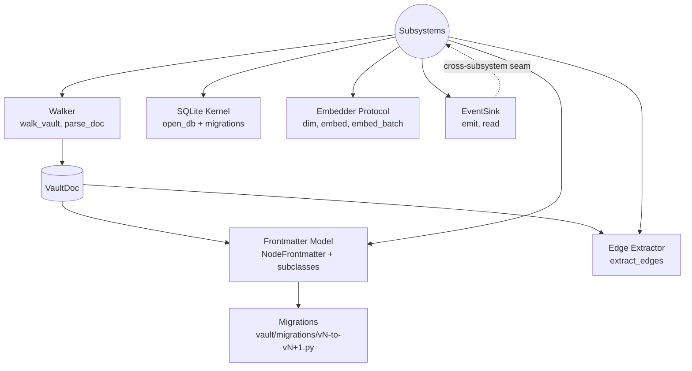

# vault_common — Shared Kernel

## What This Module Owns

`vault_common` is the single Python package every other `/domainspec/internal_tools/` subsystem depends on. It owns six primitives — the read-only **walker**, the Pydantic **Frontmatter model**, the **edge extractor**, the **SQLite kernel**, the provider-agnostic **embedder protocol**, and the append-only JSONL **event sink** — plus the **config/paths** carrier and the **migrations contract** that governs schema evolution. Anything not on this surface is subsystem-private; anything on this surface is review-against-N-downstream-consumers at change time. The kernel is *thin* by mandate: it MUST NOT contain validation rules, telemetry counters, retrieval logic, dispatch logic, or any other subsystem behavior. (Source: [discovery D-1](../../../../vault/discovery/two-layer-platform-architecture/discovery.md#d-1-adopt-the-platform-reframe), [lens 01 §2](../../../../vault/discovery/two-layer-platform-architecture/lenses/01-cross-cutting-analysis/findings.md#2-shared-primitives-spec-vault_common).)

## Module Map

## Capabilities

| Capability | What | Key Aspects | Detail |
| ---------- | ---- | ----------- | ------ |
| **WalkVault** | Read-only iteration over markdown files under one or more vault roots | `walk_vault`, `parse_doc`, `VaultDoc` carrier | Inline below |
| **ParseFrontmatter** | Typed validation of YAML frontmatter against per-`node_type` Pydantic models | `NodeFrontmatter` + 7 subclasses, `parse_frontmatter`, `validate_node`, `schema_version` | Inline below |
| **ExtractEdges** | Surface typed edges declared in frontmatter and `## Connections` blocks | `Edge`, `extract_edges`, `EDGE_TYPES`, bidirectionality + skill/agent + session carve-outs | Inline below |
| **OpenDatabase** | Open/migrate a SQLite file owned by a single subsystem | `open_db`, migration-script list, `foreign_keys=ON` invariant | Inline below |
| **EmbedText** | Provider-agnostic vector embedding of text | `Embedder` Protocol (`dim`, `embed`, `embed_batch`); NO provider-specific names in the protocol | Inline below |
| **EmitEvents** | Append-only JSONL event sink — the only cross-subsystem seam | `EventSink.emit`, `EventSink.read` | Inline below |
| **MigrateSchema** | One-shot, idempotent backfills under `vault/migrations/` keyed to `schema_version` bumps | Naming contract, idempotency invariant | Inline below |

### WalkVault

Iterate the vault as a stream of parsed `VaultDoc` records. Read-only; never mutates files.

| Aspect | Concept | Summary |
| ------ | ------- | ------- |
| Operation | [`walk_vault`](#operation-walkvault) | Yields `VaultDoc` for every non-excluded `.md` under configured roots |
| Operation | [`parse_doc`](#operation-parsedoc) | Reads a single file into a `VaultDoc`, or returns `None` on read/decode failure |
| Entity | [`VaultDoc`](#entity-vaultdoc) | `path`, `text`, `content_hash` (sha256), `frontmatter` (dict or None), `body`, `is_session`, `node_type` |
| Rule | [`R-Walker-ReadOnly`](#rule-r-walker-readonly) | The walker MUST NOT write to disk |
| Rule | [`R-Walker-Excludes`](#rule-r-walker-excludes) | Excludes `Config.exclude_dirs` (defaults: `.git`, `.claude`, `node_modules`, `__pycache__`, `snapshots`, `migrations`, `.pytest_cache`) |
| Rule | [`R-Walker-Hash-Determinism`](#rule-r-walker-hash-determinism) | `content_hash = sha256(text_utf8)`; identical bytes ⇒ identical hash |

### ParseFrontmatter

Type-checked parsing of YAML frontmatter. The Pydantic model is the **executable form** of [`ontology-conventions.md`](../../../../vault/ontology-conventions.md), per [`frontmatter-ownership-constitution.md`](../../../../vault/constitution/frontmatter-ownership-constitution.md).

| Aspect | Concept | Summary |
| ------ | ------- | ------- |
| Operation | [`parse_frontmatter`](#operation-parsefrontmatter) | Splits text into `(fm_dict, body)` |
| Operation | [`validate_node`](#operation-validatenode) | Dispatches by `node_type` to the right subclass and validates |
| Entity | [`NodeFrontmatter`](#entity-nodefrontmatter) | Base: `schema_version: int = 1`, `node_type`, `layer`, `nature`, `status`, `version`, `last_updated`, `tags`, `is_session` |
| Entity | [`Per-Type Subclasses`](#entity-per-type-subclasses) | One subclass per `node_type` (16 values; see Open Questions OQ-A) |
| Rule | [`R-FM-Conditional-Confidence`](#rule-r-fm-conditional-confidence) | `veracidade`/`convicção` REQUIRED on `axiom`, `premise`; OPTIONAL on `discovery`, `audit`; FORBIDDEN elsewhere |
| Rule | [`R-FM-SchemaVersion`](#rule-r-fm-schemaversion) | Every node carries `schema_version: int`; unknown versions are rejected |
| Rule | [`R-FM-Forward-Compat`](#rule-r-fm-forward-compat) | Unknown keys WARN (do not reject) for one full schema version, then become errors |
| Rule | [`R-FM-No-Private-Extensions`](#rule-r-fm-no-private-extensions) | Subsystems MUST NOT subclass or extend frontmatter privately; sibling files only |

### ExtractEdges

Surface typed edges in a uniform shape. The verb taxonomy is the 21 forward edges + their inverses from [`ontology-conventions.md` Appendix C](../../../../vault/ontology-conventions.md#appendix-c-edge-type-catalog).

| Aspect | Concept | Summary |
| ------ | ------- | ------- |
| Operation | [`extract_edges`](#operation-extractedges) | Returns `list[Edge]` from a `VaultDoc` |
| Entity | [`Edge`](#entity-edge) | Immutable `(src, dst, edge_type, source_loc)` record |
| Entity | [`EDGE_TYPES`](#entity-edge-types) | Frozenset of canonical edge verbs (21 forward + symmetric `contradicts` + inverses) |
| Rule | [`R-Edge-Catalog-Closed`](#rule-r-edge-catalog-closed) | An edge whose verb is not in `EDGE_TYPES` is rejected at extraction time |
| Rule | [`R-Edge-Bidirectional`](#rule-r-edge-bidirectional) | Vault-to-vault edges MUST appear on both endpoints (audited by a sibling tool; kernel surfaces violations as data, does not enforce) |
| Rule | [`R-Edge-Skill-Carveout`](#rule-r-edge-skill-carveout) | Edges into `.claude/skills/**` and `.claude/agents/**` are forward-only-by-target; extractor MUST mark them so the auditor skips |
| Rule | [`R-Edge-Session-Carveout`](#rule-r-edge-session-carveout) | Edges whose source has `is_session: true` are forward-only-by-source; extractor MUST mark them so the auditor skips |

### OpenDatabase

A thin contextmanager around `sqlite3`. Each subsystem owns its own `.db` file (`telemetry.db`, `convergence.db`, `vault_index.db`); the kernel never opens a database it does not own and never reads a database owned by a different subsystem. (Source: [discovery D-4](../../../../vault/discovery/two-layer-platform-architecture/discovery.md#d-4-subsystems-communicate-via-events-and-the-read-only-walker--never-by-reaching-into-each-others-stores).)

| Aspect | Concept | Summary |
| ------ | ------- | ------- |
| Operation | [`open_db`](#operation-opendb) | Yields a `sqlite3.Connection` with `foreign_keys=ON` and `row_factory=Row`, after optional migrations |
| Rule | [`R-DB-Per-Subsystem`](#rule-r-db-per-subsystem) | Exactly one subsystem owns any given DB file; kernel does not inspect contents |
| Rule | [`R-DB-No-Cross-Read`](#rule-r-db-no-cross-read) | A subsystem MUST NOT open another subsystem's DB; the kernel itself MUST NOT either |
| Rule | [`R-DB-Foreign-Keys`](#rule-r-db-foreign-keys) | `PRAGMA foreign_keys = ON` is set on every connection |

### EmbedText

A `typing.Protocol` declaring `dim: int`, `embed(text) -> list[float]`, `embed_batch(texts) -> list[list[float]]`. **The protocol declares no provider, no model name, no API key.** Subsystems depend on the protocol; implementations are constructed at the edge.

| Aspect | Concept | Summary |
| ------ | ------- | ------- |
| Interface | [`Embedder`](#interface-embedder) | Protocol with `dim`, `embed`, `embed_batch` |
| Rule | [`R-Embedder-Provider-Agnostic`](#rule-r-embedder-provider-agnostic) | The Protocol MUST NOT name any provider, model, or API in its type signature or docstring |
| Rule | [`R-Embedder-Dim-Stable`](#rule-r-embedder-dim-stable) | `dim` is constant for the lifetime of an Embedder instance; `embed(text)` returns a list of length exactly `dim` |
| Rule | [`R-Embedder-Determinism`](#rule-r-embedder-determinism) | Implementations are not required to be deterministic, but identical text → identical vector if the implementation declares determinism |

### EmitEvents

The single **cross-subsystem seam**. Append-only JSONL at a path the writer owns. Telemetry is the canonical reader; any subsystem may read events emitted by any other subsystem.

| Aspect | Concept | Summary |
| ------ | ------- | ------- |
| Operation | [`EventSink.emit`](#operation-emit) | Appends one JSON object `{ts, kind, **fields}` per call |
| Operation | [`EventSink.read`](#operation-read) | Iterates events, optionally filtered by `kind` |
| Entity | [`Event`](#entity-event) | `{ts: ISO-8601 UTC, kind: str, ...arbitrary fields}` |
| Rule | [`R-Events-Append-Only`](#rule-r-events-append-only) | `emit` MUST open `"a"` mode; the kernel never truncates or rewrites a sink file |
| Rule | [`R-Events-UTC`](#rule-r-events-utc) | `ts` is ISO-8601 UTC with timezone suffix |
| Rule | [`R-Events-Schema-Free`](#rule-r-events-schema-free) | The kernel does NOT validate event payload fields; that is a writer/reader contract per `kind` |

### MigrateSchema

Per [`frontmatter-ownership-constitution.md` §4](../../../../vault/constitution/frontmatter-ownership-constitution.md), schema bumps require a migration script under `vault/migrations/`. The kernel does not run migrations automatically; it provides the **naming contract** and the **invariants** they must respect.

| Aspect | Concept | Summary |
| ------ | ------- | ------- |
| Rule | [`R-Migration-Naming`](#rule-r-migration-naming) | Path is `vault/migrations/v<N>-to-v<N+1>.py` (or `v0-to-v1.py` for bootstrap) |
| Rule | [`R-Migration-One-Shot`](#rule-r-migration-one-shot) | A migration runs once against the corpus; re-running on already-migrated files MUST be a no-op |
| Rule | [`R-Migration-Idempotent`](#rule-r-migration-idempotent) | If interrupted, re-running MUST complete without producing duplicate field writes or doubled values |
| Rule | [`R-Migration-Single-Bump`](#rule-r-migration-single-bump) | One script handles exactly one `schema_version` increment |

## Domain Concepts

| Concept | Type | Key Constraints |
| ------- | ---- | --------------- |
| [`VaultDoc`](#entity-vaultdoc) | Entity | `path`, `text`, `content_hash` (sha256-hex of `text.encode("utf-8")`), `frontmatter` (dict or None), `body`, `is_session` (derived), `node_type` (derived) |
| [`NodeFrontmatter`](#entity-nodefrontmatter) | Entity (Pydantic v2) | Universal fields: `schema_version`, `node_type`, `layer`, `nature`, `status`, `version`, `last_updated`, `tags`, `is_session` |
| [`Edge`](#entity-edge) | Value Object | Immutable, `frozen=True` dataclass; equality by `(src, dst, edge_type)` |
| [`NodeType`](#enum-nodetype) | Enum | The 16 values from [`ontology-conventions.md` Appendix D](../../../../vault/ontology-conventions.md#appendix-d-quick-reference--the-7-labels) (see OQ-A) |
| [`Layer`](#enum-layer) | Enum | `ontology`, `architecture`, `market`, `domain`, `application` (multi-value allowed) |
| [`Nature`](#enum-nature) | Enum | `explanatory`, `procedural`, `reference`, `technical` (multi-value allowed) |
| [`Status`](#enum-status) | Enum | `draft`, `exploratory`, `active`, `consolidated`, `evergreen` |
| [`Veracidade`](#enum-veracidade) / [`Convicção`](#enum-conviccao) | Enum | `high`, `medium`, `low`; applicability rules in [R-FM-Conditional-Confidence](#rule-r-fm-conditional-confidence) |
| [`SchemaVersion`](#field-schemaversion) | Int | Monotonically increasing; current default `1` |
| [`Embedder`](#interface-embedder) | Protocol | `dim: int`, `embed`, `embed_batch`; provider-agnostic |
| [`EventSink`](#entity-eventsink) | Service | Path-owning writer/reader for append-only JSONL |
| [`Config`](#entity-config) | Value Object | `vault_roots`, `exclude_dirs`, `db_root` |

## Concept Registry

| Concept | ID | Type |
| ------- | -- | ---- |
| WalkVault | `vault_common.WalkVault` | Capability |
| ParseFrontmatter | `vault_common.ParseFrontmatter` | Capability |
| ExtractEdges | `vault_common.ExtractEdges` | Capability |
| OpenDatabase | `vault_common.OpenDatabase` | Capability |
| EmbedText | `vault_common.EmbedText` | Capability |
| EmitEvents | `vault_common.EmitEvents` | Capability |
| MigrateSchema | `vault_common.MigrateSchema` | Capability |
| VaultDoc | `vault_common.VaultDoc` | Entity |
| NodeFrontmatter | `vault_common.NodeFrontmatter` | Entity |
| Edge | `vault_common.Edge` | ValueObject |
| Embedder | `vault_common.Embedder` | Interface |
| EventSink | `vault_common.EventSink` | Service |
| Config | `vault_common.Config` | ValueObject |
| `walk_vault` | `vault_common.walk_vault` | Operation |
| `parse_doc` | `vault_common.parse_doc` | Operation |
| `parse_frontmatter` | `vault_common.parse_frontmatter` | Operation |
| `validate_node` | `vault_common.validate_node` | Operation |
| `extract_edges` | `vault_common.extract_edges` | Operation |
| `open_db` | `vault_common.open_db` | Operation |
| `EventSink.emit` | `vault_common.EventSink.emit` | Operation |
| `EventSink.read` | `vault_common.EventSink.read` | Operation |
| R-Walker-ReadOnly | `vault_common.R-Walker-ReadOnly` | Rule |
| R-FM-Conditional-Confidence | `vault_common.R-FM-Conditional-Confidence` | Rule |
| R-FM-SchemaVersion | `vault_common.R-FM-SchemaVersion` | Rule |
| R-Edge-Catalog-Closed | `vault_common.R-Edge-Catalog-Closed` | Rule |
| R-Edge-Skill-Carveout | `vault_common.R-Edge-Skill-Carveout` | Rule |
| R-Edge-Session-Carveout | `vault_common.R-Edge-Session-Carveout` | Rule |
| R-DB-No-Cross-Read | `vault_common.R-DB-No-Cross-Read` | Rule |
| R-Embedder-Provider-Agnostic | `vault_common.R-Embedder-Provider-Agnostic` | Rule |
| R-Events-Append-Only | `vault_common.R-Events-Append-Only` | Rule |
| R-Migration-Idempotent | `vault_common.R-Migration-Idempotent` | Rule |

## Feature Concept Graph

| From | Edge | To | Evidence | Notes |
| ---- | ---- | -- | -------- | ----- |
| `vault_common.WalkVault` | produces | `vault_common.VaultDoc` | this SPEC §WalkVault | every yielded item |
| `vault_common.ParseFrontmatter` | validates | `vault_common.NodeFrontmatter` | this SPEC §ParseFrontmatter | per-node-type dispatch |
| `vault_common.ExtractEdges` | consumes | `vault_common.VaultDoc` | this SPEC §ExtractEdges | reads `## Connections` block + edge frontmatter |
| `vault_common.ExtractEdges` | produces | `vault_common.Edge` | this SPEC §ExtractEdges | one per declared edge |
| `vault_common.EmitEvents` | enforces | `R-Events-Append-Only` | this SPEC §EmitEvents | open-mode invariant |
| `vault_common.MigrateSchema` | enforces | `vault_common.R-FM-SchemaVersion` | this SPEC §MigrateSchema | bump → migration |
| `vault_common.ParseFrontmatter` | governed-by | [`frontmatter-ownership-constitution.md`](../../../../vault/constitution/frontmatter-ownership-constitution.md) | constitution §Rules | single-owner schema |
| `vault_common.ExtractEdges` | governed-by | [`ontology-conventions.md` Appendix C](../../../../vault/ontology-conventions.md#appendix-c-edge-type-catalog) | conventions §Edge Types | 21 forward edges + inverses |
| `vault_common.OpenDatabase` | enforces | `vault_common.R-DB-No-Cross-Read` | discovery D-4 | seam invariant |

## Aspect Docs

| Aspect | Contains | Key Concepts |
| ------ | -------- | ------------ |
| [Architecture](architecture.md) | Six-view architecture companion: context, structure, components, workflow, decisions, dependencies | kernel/subsystem seams, event-sink seam, DB-per-subsystem |
| [Glossary](glossary.md) | Source-linked definitions of every concept above | VaultDoc, NodeFrontmatter, Edge, Embedder, EventSink, SchemaVersion |

## Cross-Feature Dependencies

| Capability | Depends On | Via | Why |
| ---------- | ---------- | --- | --- |
| (none) | (none) | (none) | The kernel sits at the bottom of the DAG. By construction, `vault_common` depends on no other feature in `/domainspec/internal_tools/`. |

## Produces For

| Consumer | Consumes Capability | Via | What |
| -------- | ------------------- | --- | ---- |
| `vault_ctl` | `WalkVault`, `ParseFrontmatter`, `ExtractEdges`, `EmitEvents` | direct import | frontmatter validation, edge resolvability, snapshot CLI, emits `validation.failed` / `promotion.candidate` / `snapshot.taken` events |
| `vault_telemetry` | `WalkVault`, `ParseFrontmatter`, `EmitEvents` (reader), `OpenDatabase` | direct import | residue counters, drift reports, owns `telemetry.db` |
| `convergence_runner` | `WalkVault`, `EmbedText`, `EmitEvents` (writer), `OpenDatabase` | direct import | multi-agent dispatch traces, owns `convergence.db`, emits `convergence.run.completed` |
| `graph_retrieval` | `WalkVault`, `ParseFrontmatter`, `ExtractEdges`, `EmbedText`, `OpenDatabase` | direct import | owns `vault_graph.kuzu` + `vault_index.db` |
| `pipeline` (Lean) | `WalkVault`, `ParseFrontmatter` (specifically `lean_ref` fields), `EmitEvents` | direct import | Lean correspondence, emits `formalization.status.changed` |

## Open Questions

> Open questions are surfaced rather than papered over (Radical Candor). Each notes its current resolution state in code, in discovery, or both.

### OQ-A. `NodeType` enum is currently 6 values in code, 16 in the conventions

**Question.** The Pydantic `NodeType` Literal in `vault_common/frontmatter.py` (current `0.1.0`) enumerates only `premise | constitution | axiom | conceptual | discovery | session`. [`ontology-conventions.md` line 56](../../../../vault/ontology-conventions.md) enumerates 16: also `implementation-plan`, `spec`, `audit`, `test`, `backlog`, `readme`, `research`, `domainspec-subagents-strategy`, `subagents-research`, `subagents-findings`, `discussion`. Should the kernel expand its enum to all 16 before any subsystem ships, or stage the rollout?

**Mismatch.** The constitution at [`frontmatter-ownership-constitution.md` Rule 1](../../../../vault/constitution/frontmatter-ownership-constitution.md) says "When [the conventions and the Pydantic model] disagree, the Pydantic model wins for code; the conventions doc must be updated to match." But the disagreement here is **the Pydantic model is silently narrower than the conventions doc**, which means files with `node_type: spec` would fall through to the base `NodeFrontmatter` (via the `_FRONTMATTER_BY_TYPE.get(..., NodeFrontmatter)` fallback in `validate_node`) and silently parse with no per-type validation. That is the folklore-schema risk the constitution exists to prevent.

**Recommendation.** Expand `NodeType` to all 16 values in the next kernel patch and add per-type subclasses (even if empty initially) so dispatch failure becomes a hard error rather than a silent base-class fallback. Note for the OQ-2 migration: this is a `schema_version` v1 → v2 expansion candidate.

### OQ-B. `validate_node` falls back to base on unknown `node_type`, but constitution Rule 1 implies hard rejection

**Question.** `validate_node` does `_FRONTMATTER_BY_TYPE.get(str(node_type), NodeFrontmatter)`. Should the kernel hard-reject unknown `node_type` values instead?

**Recommendation.** Hard-reject. Pair with OQ-A — once the dispatch table covers all 16 conventions-approved types, anything else is by definition an invalid node and should raise.

### OQ-C. Codebase already contains kernel modules the discovery never sanctioned: `governance`, `cycles`, `amendments`, `bets`

**Question.** `internal_tools/vault_common/` already includes:

- `governance.py` (~123 LOC) — a runtime witness for `governs` edges
- `cycles.py` (~87 LOC) — cycle detection on acyclic edge types
- `amendments.py` (~51 LOC) — frontmatter schema for amendment-log files
- `bets.py` (~61 LOC) — frontmatter schema for bet-ledger files

None are in the [lens 01 §2 kernel API table](../../../../vault/discovery/two-layer-platform-architecture/lenses/01-cross-cutting-analysis/findings.md#2-shared-primitives-spec-vault_common). Two readings:

1. **They are kernel-appropriate** — `cycles.py` is a pure function over `Edge`; `amendments.py` and `bets.py` are extensions of the frontmatter primitive (same authority chain); `governance.py` is the runtime mechanism for `governed-by` already named in the ontology.
2. **They are subsystem creep** — `governance.py` enforces rules, which is `vault_ctl`'s job; `cycles.py` audits the graph, which is `vault_ctl`'s job; ledger schemas could live in a separate `vault_ledger` package.

**Status.** Not resolved in the source discovery. The spec **does not include them** in the canonical capability list above (consistent with lens 01); flagging here so the discovery can ratify or reject.

**Recommendation.** Bring this to the discovery as a v0.3.0 amendment. If kept in kernel, add them as named capabilities in this SPEC; if moved out, plan the relocation alongside `vault_ctl`'s feature spec.

### OQ-D. `NullEmbedder` and `SentenceTransformerEmbedder` ship in the kernel

**Question.** `embedder.py` exports two concrete classes — `NullEmbedder` (deterministic-hash stub) and `SentenceTransformerEmbedder` (loads a HuggingFace model by name). The latter **does name a default model** (`sentence-transformers/all-MiniLM-L6-v2`) and imports `sentence_transformers` (a heavy dep).

**Mismatch.** The user memory `feedback_llm_agnostic_design.md` and discovery lens 01 §2 specify the kernel exposes a **protocol**, not implementations. A concrete `SentenceTransformerEmbedder` couples the kernel to a provider library and a model name.

**Recommendation.** Move `SentenceTransformerEmbedder` out of `vault_common` into either (a) a subsystem-private module of the first consumer, or (b) a sibling kernel-adjacent package `vault_common_impls` that subsystems opt into. Keep `NullEmbedder` in `vault_common` only if its only purpose is testing the Protocol contract; mark it as test-fixture, not production. **The Protocol itself is correct as written** (provider-agnostic, no model names).

### OQ-E. `extract_edges` reads frontmatter fields only — does not parse `## Connections` blocks

**Question.** The current `extract_edges` in `edges.py` only iterates `EDGE_FIELDS` against the frontmatter dict. The ontology specifies edges are declared in `## Connections` table blocks in the body. The spec promises **both**.

**Mismatch.** Code is narrower than the contract.

**Recommendation.** Extend `extract_edges` to also parse the `## Connections` Markdown table. This is required for the discovery's bidirectionality audit to even have something to audit. File as a v0.1.x kernel patch.

### OQ-F. `EventSink.emit` swallows write errors silently if disk fills

**Question.** `emit` opens append-mode and writes; if the disk is full or the file is read-only, `IOError` propagates — good. But there is no `fsync` and no error policy declared. Should `emit` `fsync` after each write to make the cross-subsystem seam durable?

**Recommendation.** Defer. Document the current best-effort durability semantics in the Architecture doc; only escalate to `fsync` if a subsystem reports a real loss event. Premature `fsync` halves the write throughput of any high-volume emitter.

### OQ-G. Carve-out marking on extracted edges is not exposed

**Question.** The ontology has two carve-outs (skill/agent forward-only; session forward-only). The auditor must know which edges are carve-out-exempt. The current `Edge` dataclass has only `(src, dst, edge_type)` — no carve-out flag, no source-loc.

**Recommendation.** Extend `Edge` to `Edge(src, dst, edge_type, source_loc, forward_only_reason: Literal["skill-target", "agent-target", "session-source"] | None)`. The lens 01 table actually specifies `source_loc` is part of the schema; the current code drops it. File alongside OQ-E.

### OQ-H. Pre-commit/CI immutability enforcement is not in kernel

**Status.** Discovery [OQ-3](../../../../vault/discovery/two-layer-platform-architecture/discovery.md#oq-3-immutability-enforcement--hook-ci-or-both) recommends a hook + CI for session/discovery-README immutability. This is **out of kernel scope** (it is filesystem policy, not a kernel primitive). Surface here only to confirm: the spec does **not** add it to the kernel; the hook belongs in `.git/hooks/` and CI.

### OQ-I. `addresses-residue` field is not in the current model

**Status.** Discovery [OQ-5](../../../../vault/discovery/two-layer-platform-architecture/discovery.md#oq-5-do-the-four-predicted-residues-need-first-class-frontmatter-or-can-telemetry-derive-them) recommends an explicit `addresses-residue:` enum on new constitutions. Not in the current Pydantic model. Defer until OQ-1's follow-up constitution amendment ratifies the field — then add to `ConstitutionFrontmatter` in the same schema-version bump.

## Stories

User stories are deferred to `STORIES.md` once a subsystem spec begins consuming this kernel; the kernel itself has no human user surface.

## Change History

| Date | Version | Change |
| ---- | ------- | ------ |
| 2026-05-18 | 0.1.0 | Initial draft. Spec written after the kernel had partial implementation; nine open questions flag drift between code, discovery, and conventions. |

## References

- Discovery: [`../../../../vault/discovery/two-layer-platform-architecture/discovery.md`](../../../../vault/discovery/two-layer-platform-architecture/discovery.md)
- Lens 01: [`../../../../vault/discovery/two-layer-platform-architecture/lenses/01-cross-cutting-analysis/findings.md`](../../../../vault/discovery/two-layer-platform-architecture/lenses/01-cross-cutting-analysis/findings.md)
- Lens 02: [`../../../../vault/discovery/two-layer-platform-architecture/lenses/02-critical-path/findings.md`](../../../../vault/discovery/two-layer-platform-architecture/lenses/02-critical-path/findings.md)
- Constitution: [`../../../../vault/constitution/frontmatter-ownership-constitution.md`](../../../../vault/constitution/frontmatter-ownership-constitution.md)
- Schema text: [`../../../../vault/ontology-conventions.md`](../../../../vault/ontology-conventions.md)
- Architecture companion: [architecture.md](architecture.md)
- Glossary: [glossary.md](glossary.md)
