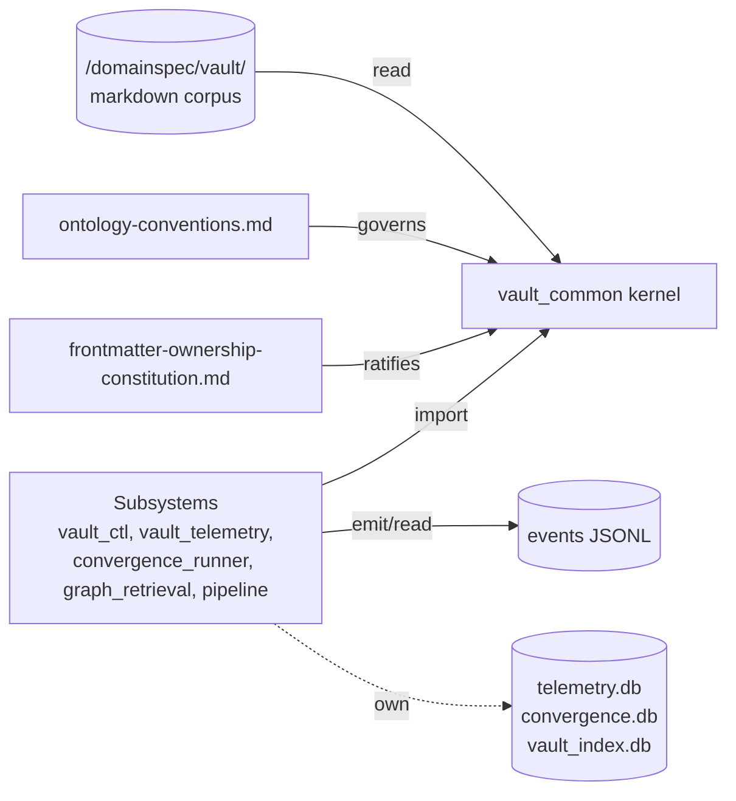
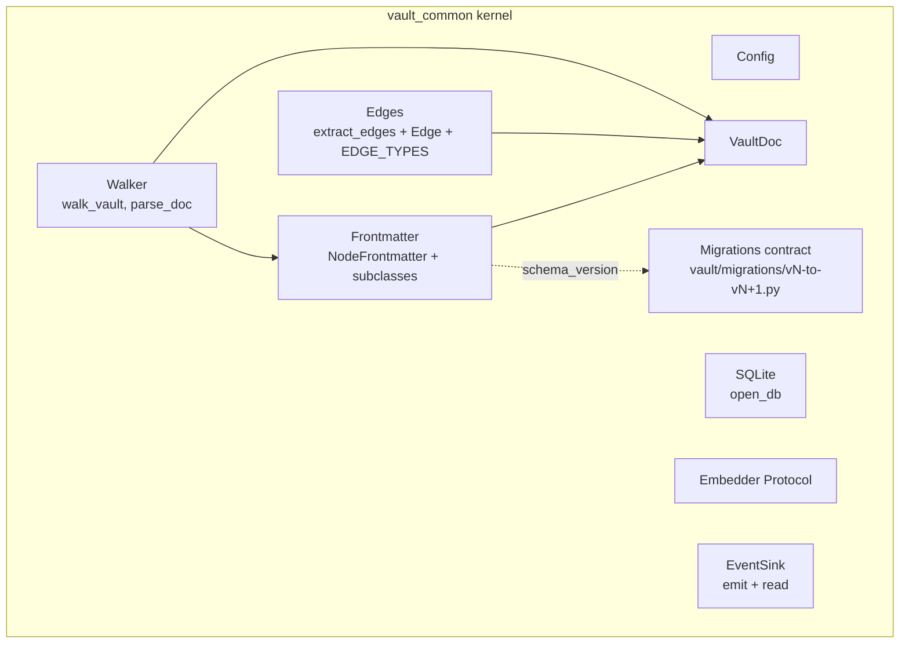
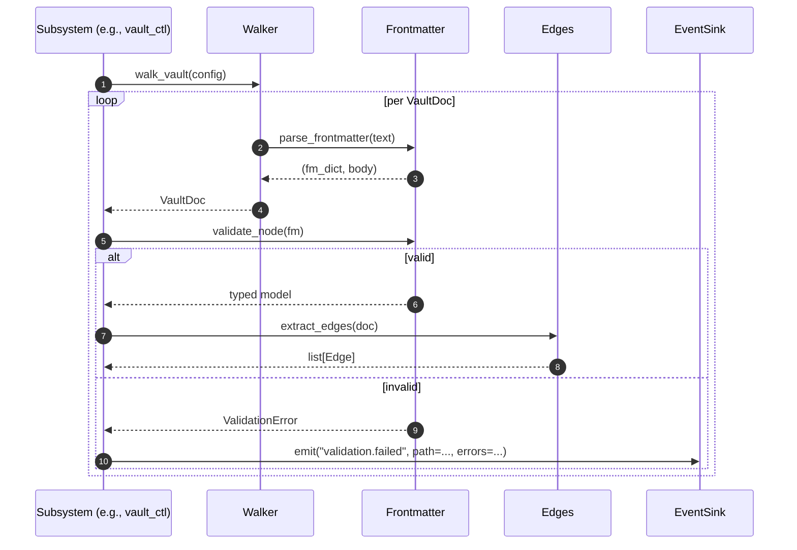

# vault_common Architecture

This document is the feature-level architecture companion to [SPEC.md](SPEC.md). It explains the architecture implied by the kernel's DomainSpec contracts and does not claim implementation completeness beyond those contracts.

## Architecture Intent

Provide a *thin* shared kernel that makes five infrastructure subsystems (`vault_ctl`, `vault_telemetry`, `convergence_runner`, `graph_retrieval`, `pipeline`) buildable as **subsystems on strict seams** rather than five independent tools that each re-implement a walker, a frontmatter parser, and an event sink. The kernel's existence is the mechanical defense against the framework's own residue prediction at infrastructure scale. (Source: [discovery D-1](../../../../vault/discovery/two-layer-platform-architecture/discovery.md#d-1-adopt-the-platform-reframe).)

## Scope Boundary

- **Owned:** walker, frontmatter Pydantic models (single-owner schema), edge extractor over the 21-edge catalog, SQLite open/migrate primitives, embedder Protocol, append-only JSONL event sink, config carrier, migrations naming/idempotency contract.
- **Explicitly excluded:** any validation rule (`vault_ctl`), any metric counter (`vault_telemetry`), any retrieval intent (`graph_retrieval`), any agent dispatch (`convergence_runner`), any Lean correspondence (`pipeline`), any provider-specific embedder implementation, any convergence boundary classifier (gated on [discovery OQ-6](../../../../vault/discovery/two-layer-platform-architecture/discovery.md#oq-6-convergence-boundary-classifier--operational-proxy)).
- **Neighbor packages outside the boundary:** every subsystem under `internal_tools/<name>/`; maestro-trama's `vault_routing/` and `semantic_index/` (independent, not a dependency — see [discovery D-3](../../../../vault/discovery/two-layer-platform-architecture/discovery.md#d-3-greenfield-in-domainspec-not-migration-from-maestro-trama)).

## Source Contracts

| Contract ID | Source | Required | Notes |
| ----------- | ------ | -------- | ----- |
| SC-001 | [SPEC.md](SPEC.md) | yes | Capability and concept source of truth |
| SC-002 | [`two-layer-platform-architecture/discovery.md`](../../../../vault/discovery/two-layer-platform-architecture/discovery.md) | yes | D-1, D-3, D-4 directly shape the boundary; D-2, D-6, D-7 shape sequencing |
| SC-003 | [`lenses/01-cross-cutting-analysis/findings.md` §2](../../../../vault/discovery/two-layer-platform-architecture/lenses/01-cross-cutting-analysis/findings.md#2-shared-primitives-spec-vault_common) | yes | Canonical kernel API table |
| SC-004 | [`frontmatter-ownership-constitution.md`](../../../../vault/constitution/frontmatter-ownership-constitution.md) | yes | Single-owner schema; per-type subclasses; `schema_version`; forward-compat warn policy |
| SC-005 | [`ontology-conventions.md`](../../../../vault/ontology-conventions.md) | yes | 16 node_types, 5 layers, 4 natures, 5 statuses, veracidade/convicção applicability, 21-edge catalog with carve-outs |

## Design Goals and Non-Goals

| Type | Item | Why |
| ---- | ---- | --- |
| Goal | Thin kernel — every primitive has exactly one canonical implementation | Five subsystems must build against the same walker/parser/sink, not five copies |
| Goal | Single-owner frontmatter schema | The ontology is governed by code, not folklore (constitution §Rules) |
| Goal | Cross-subsystem seam is the event sink + read-only walker only | Prevents schema leak across subsystem DB boundaries (D-4) |
| Goal | Provider-agnostic embedder Protocol | LLM-agnostic design discipline (user memory `feedback_llm_agnostic_design.md`) |
| Goal | Migrations contract is named and one-shot | Schema evolution is mechanical, not folklore (constitution §Migration discipline) |
| Non-goal | Validation rules, metric counters, retrieval logic, dispatch logic | Subsystem responsibilities; live outside the kernel |
| Non-goal | Bidirectionality enforcement | Audit policy; kernel surfaces edges as data, sibling tool enforces |
| Non-goal | Cross-repo coordination with maestro-trama | Greenfield directive (D-3) |
| Non-goal | Convergence boundary classifier | Gated on OQ-6; refusing to merge a classifier until the proxy is named |

## View 1: Context View

| Actor or System | Relationship to Feature | Contract Source |
| --------------- | ----------------------- | --------------- |
| The graded vault under `/domainspec/vault/` | Input substrate (read-only) | SC-005 |
| `vault_ctl` | Consumer of `WalkVault`, `ParseFrontmatter`, `ExtractEdges`, `EmitEvents` | SC-002 D-1, lens 01 §3 |
| `vault_telemetry` | Consumer of `WalkVault`, `ParseFrontmatter`, `EmitEvents` (reader), `OpenDatabase` | SC-002 D-1 |
| `convergence_runner` | Consumer of `WalkVault`, `EmbedText`, `EmitEvents` (writer), `OpenDatabase` | SC-002 D-1 |
| `graph_retrieval` | Consumer of full kernel surface incl. `EmbedText` | SC-002 D-1 |
| `pipeline` (Lean) | Consumer of `WalkVault`, `ParseFrontmatter`, `EmitEvents` | SC-002 D-1 |
| maestro-trama `vault_routing/`, `semantic_index/` | **Non-dependency** — independent platform serving maestro-trama only | SC-002 D-3 |

## View 2: High-Level Structure View

| Component | Primary Contracts | Responsibility |
| --------- | ----------------- | -------------- |
| `walker` | [SPEC §WalkVault](SPEC.md#walkvault) | Read-only iteration; yields `VaultDoc` records |
| `frontmatter` | [SPEC §ParseFrontmatter](SPEC.md#parsefrontmatter), SC-004 | Single-owner Pydantic schema; per-type subclasses; `validate_node` dispatch |
| `edges` | [SPEC §ExtractEdges](SPEC.md#extractedges), SC-005 Appendix C | Canonical edge verbs (21 forward + inverses + symmetric `contradicts`); carve-out tagging (per OQ-G) |
| `sqlite` | [SPEC §OpenDatabase](SPEC.md#opendatabase) | Connection lifecycle + migration runner; FK invariant |
| `embedder` | [SPEC §EmbedText](SPEC.md#embedtext) | `typing.Protocol`; provider-agnostic |
| `events` | [SPEC §EmitEvents](SPEC.md#emitevents) | Append-only JSONL; the only cross-subsystem seam |
| `config` | [SPEC §WalkVault](SPEC.md#walkvault) | `vault_roots`, `exclude_dirs`, `db_root` |
| (contract-only) `migrations` | [SPEC §MigrateSchema](SPEC.md#migrateschema), SC-004 §Migration discipline | Naming + idempotency contract; scripts live in `vault/migrations/`, not in the package |

## View 3: Low-Level Components View

| Component | Owns | Consumes | Collaboration Rule |
| --------- | ---- | -------- | ------------------ |
| `walker.parse_doc` | `VaultDoc` construction, sha256 content hash | `frontmatter.parse_frontmatter` | Read-only; returns `None` on read/decode failure rather than raising |
| `walker.walk_vault` | Iteration order (alphabetical via `rglob` + `sorted`) | `Config.vault_roots`, `Config.exclude_dirs`, `parse_doc` | Yields only docs with successful parse; ordering must be stable across runs |
| `frontmatter.parse_frontmatter` | YAML split + body extraction | None (pure) | Returns `(None, text)` on missing/malformed FM; never raises |
| `frontmatter.validate_node` | Dispatch by `node_type` to per-type subclass | `_FRONTMATTER_BY_TYPE` mapping | OQ-A/OQ-B: hard-reject unknown types once OQ-A lands; today silently falls back to base |
| `frontmatter.NodeFrontmatter` and subclasses | Schema validation for the 16 `node_type` values | None | One subclass per `node_type`; constitution Rule 2 |
| `edges.extract_edges` | Edge record construction | `VaultDoc.frontmatter`, body `## Connections` block (per OQ-E) | Verb MUST be in `EDGE_TYPES` (R-Edge-Catalog-Closed) |
| `edges.Edge` | Immutable `(src, dst, edge_type, source_loc, forward_only_reason)` record (post-OQ-G) | None | `frozen=True`; equality by all fields |
| `sqlite.open_db` | Connection lifecycle, FK pragma, migration sequencing | Caller-supplied migration scripts | `with`-scoped commit; closes on exit |
| `embedder.Embedder` | Protocol declaration | None | Names no provider, no model, no API |
| `events.EventSink` | File-owning writer/reader | None | Append-only mode; UTC ts injected by kernel |
| (contract-only) Migrations | Schema-version bump scripts | `vault_common.frontmatter` model versions | One script per increment; one-shot; idempotent |

## View 4: Workflow Process View

The kernel is a **library, not a service** — there is no kernel-owned workflow. The flows below illustrate how subsystems compose its primitives.

| Flow | Happy Path | Failure or Compensation | Contract Source |
| ---- | ---------- | ----------------------- | --------------- |
| Walk + validate | `walk_vault` → `parse_doc` → `validate_node` → typed model | `parse_doc` returns `None` on I/O error (silent skip); `validate_node` raises `pydantic.ValidationError` (subsystem decides what to do) | SPEC §WalkVault, §ParseFrontmatter |
| Edge extraction | `extract_edges(doc)` → `list[Edge]` | Unknown verb raises (R-Edge-Catalog-Closed); session/skill-target carve-outs marked, not rejected | SPEC §ExtractEdges, conventions Appendix C |
| DB lifecycle | `open_db(path, migrations)` → run migrations → yield conn → commit → close | Migration error → exception propagates; `with`-scope guarantees `close()` | SPEC §OpenDatabase |
| Event emit | `EventSink.emit(kind, **fields)` → append JSONL line | I/O error propagates; no fsync today (OQ-F) | SPEC §EmitEvents |
| Schema bump | New `schema_version` released → `v(N)-to-v(N+1).py` written → run once → commit corpus | One-shot, idempotent (R-Migration-One-Shot, R-Migration-Idempotent) | Constitution §Migration discipline |

## View 5: Decision Flow View

| Decision Point | Options or Branches | Selection Rule | Outcome |
| -------------- | ------------------- | -------------- | ------- |
| Where does frontmatter live? | (a) per subsystem (b) `vault_common` (c) external service | Constitution §Why this is a constitution | (b) — single owner |
| What is the cross-subsystem seam? | (a) shared DB (b) events + read-only walker (c) RPC | Discovery D-4 | (b) — events + walker |
| What lives in kernel vs subsystem? | The lens 01 §2 table | "Anything not on this list is subsystem-private" | Walker, FM, Edges, SQLite, Embedder, Events, Config |
| `node_type` unknown to dispatch | (a) silent fallback to base (b) hard reject | Constitution Rule 1 (model wins) | **Today (a); recommended (b)** — OQ-B |
| Unknown frontmatter key | (a) reject (b) warn | Constitution Rule 5 (forward compat) | (b) — for one full schema version, then escalate |
| Embedder provider choice | Kernel decides vs subsystem decides | LLM-agnostic discipline | Subsystem decides — kernel exposes only Protocol |
| Schema-version bump | In place vs migration script | Constitution Rule 4 | Migration script under `vault/migrations/` |
| Bidirectional edge enforcement | Kernel raises vs surfaces data | "Kernel is thin" | Surfaces data; auditor enforces |

## View 6: Dependency Interface View

| Dependency or Interface | Direction | Contract | Boundary Rule |
| ----------------------- | --------- | -------- | ------------- |
| `pydantic` v2 | inbound (Python dep) | external library | Pinned to v2 series (no v1 fallback) |
| `pyyaml` | inbound | external library | Used only by `parse_frontmatter`; never exposed |
| `sqlite3` (stdlib) | inbound | Python stdlib | The only DB engine the kernel speaks |
| `sentence_transformers` | **inbound today, should be outbound** | external library | **Violates LLM-agnostic discipline; see OQ-D** |
| Subsystems → kernel | outbound (kernel is consumer of subsystems' attention) | direct `import vault_common` | Kernel MUST NOT import any subsystem (DAG invariant) |
| Kernel → vault filesystem | outbound (read-only) | `walk_vault` | Read-only; never writes |
| Kernel → DB files | outbound (open + migrate) | `open_db` | One DB file per subsystem; kernel does not own any DB content |
| Cross-subsystem | via EventSink + walker only | SPEC §EmitEvents, D-4 | No direct DB-to-DB reads between subsystems |
| maestro-trama `vault_routing/`, `semantic_index/` | NONE | n/a | Greenfield; the kernel has no edge to maestro-trama (D-3) |
| `vault/migrations/` scripts | outbound (kernel defines naming; scripts live outside the package) | constitution §Migration discipline | One script per `schema_version` bump |

## Constraints

| Constraint | Source | Impact |
| ---------- | ------ | ------ |
| Kernel must be thin | D-1, lens 01 §2 closing line | Any feature creep is OQ-worthy (see OQ-C) |
| Single-owner frontmatter | Constitution Rule 1 | No subsystem-private extensions; ever |
| Cross-subsystem seam = events + walker | D-4 | No subsystem reads another's DB; the kernel must not enable it either |
| LLM-agnostic embedder | User memory `feedback_llm_agnostic_design.md`, lens 01 §2 | Protocol exposes no provider; concrete classes are OQ-D risk |
| 21-edge catalog | conventions Appendix C | New verbs require a discovery + amendment; kernel rejects unknown |
| `schema_version` integer | Constitution Rule 4 | Bumps require migration scripts under `vault/migrations/` |
| Discovery [OQ-6](../../../../vault/discovery/two-layer-platform-architecture/discovery.md#oq-6-convergence-boundary-classifier--operational-proxy) | discovery | Kernel does NOT host a convergence boundary classifier until OQ-6 names a proxy |

## Dependency And Interface Rules

| Rule ID | Rule | Applies To | Enforcement |
| ------- | ---- | ---------- | ----------- |
| R-DAG-001 | Kernel MUST NOT import from any `internal_tools/<subsystem>/` package | every module in `vault_common` | static import audit (sibling tool) |
| R-DAG-002 | Subsystems MUST NOT mutually depend (one-level fan-in/fan-out from kernel only) | every subsystem | static import audit |
| R-SEAM-001 | Cross-subsystem communication MUST go through `EventSink` or `walk_vault` | every subsystem | code review; sibling auditor scans for cross-subsystem imports of `*.db` paths |
| R-SCHEMA-001 | Frontmatter changes MUST land in `vault_common.frontmatter` first; conventions doc updated second | every contributor | constitution Rule 1 |
| R-EMB-001 | The `Embedder` Protocol MUST NOT name a provider, model, or API | `vault_common.embedder` | code review; the spec rejects PRs that name providers in the Protocol |
| R-MIG-001 | One migration script per `schema_version` increment; idempotent | `vault/migrations/` | runtime check on bump; sibling tool dry-runs against the corpus |
| R-EDGE-001 | Edges with verbs not in `EDGE_TYPES` are rejected at extraction time | `extract_edges` | raises at extraction |

## Data and Evidence Artifacts

| Artifact | Produced By | Used For | Contract Source |
| -------- | ----------- | -------- | --------------- |
| `VaultDoc` instances | `walk_vault`, `parse_doc` | Subsystem consumption | SPEC §WalkVault |
| `NodeFrontmatter` (and subclass) instances | `validate_node` | Type-safe field access | SPEC §ParseFrontmatter |
| `Edge` instances | `extract_edges` | Graph build, bidirectionality audit | SPEC §ExtractEdges |
| JSONL event lines | `EventSink.emit` | Cross-subsystem signal | SPEC §EmitEvents |
| Snapshot zero (`vault/snapshots/2026-05-16-v0.json`) | `vault_ctl` (or hand-written) | 30-day residue measurement | discovery D-2 — exists on disk |
| Stable test corpus tag (`vault-corpus-v0`) | git tag | EVōC convergence falsifiability | discovery D-7 |

## Extension Points

| Extension Point | Allowed Variation | Guardrail |
| --------------- | ----------------- | --------- |
| `Embedder` implementations | Any class that satisfies the Protocol | MUST NOT be added to `vault_common` itself (OQ-D); lives in the consuming subsystem or `vault_common_impls` sibling |
| New `node_type` value | Add to ontology + add subclass + bump `schema_version` + migration | Constitution Rule 4; conventions Appendix B |
| New edge verb | Add to ontology Appendix C + add to `EDGE_TYPES` + write any inverse | Conventions Authoring Rule 2 ("Do not invent edges") |
| New migration | New file `vault/migrations/v<N>-to-v<N+1>.py` | R-MIG-001; one-shot; idempotent |
| Sibling frontmatter schema (e.g., `BetFrontmatter`, `AmendmentFrontmatter`) | Live in a sibling module that imports from `frontmatter` | OQ-C — currently in kernel pending discovery ratification |

## Trade-offs and Guardrails

| Trade-off | Benefit | Cost | Guardrail |
| --------- | ------- | ---- | --------- |
| Forward-compat: unknown frontmatter keys WARN, not REJECT | Soft rollout of new fields | Silent acceptance of typos | Escalate to reject after one schema version (constitution Rule 5) |
| `validate_node` falls back to base class on unknown `node_type` | Tolerates pre-migration files | Folklore-schema risk re-enters via the side door | OQ-B: hard-reject after OQ-A expands the dispatch table |
| `EventSink` is append-only JSONL (no DB) | Zero cross-subsystem schema coupling; trivially diffable | No indexed read; readers do full scans | Telemetry can build private indexes over events in its own DB |
| Kernel ships `NullEmbedder` | Subsystem tests don't need real models | Risk of being used in production by accident | Document as test-fixture only (OQ-D) |
| Edge extractor reads frontmatter only today | Simple implementation | Misses `## Connections` block edges → bidirectionality audit cannot run | OQ-E: extend to parse Markdown table |
| Each subsystem owns its DB | Independent release cadence; no schema collision | Cross-subsystem queries require a join over events | D-4: events are the seam; if a join is "needed" frequently, it's a design smell |

## Decision Log

| Decision ID | Decision | Options Considered | Reason |
| ----------- | -------- | ------------------ | ------ |
| D-001 | Thin kernel + thin subsystems | (a) five independent tools (b) monolith (c) kernel + subsystems | (a) re-implements five times; (b) buries separable lifecycles; (c) preserves both. Source: discovery D-1, alternatives A-1 and A-2. |
| D-002 | Single-owner frontmatter in `vault_common` | (a) per-subsystem (b) `vault_common` (c) external service | (b) — constitution ratified; (a) creates folklore schema. Source: constitution §Rules, lens 01 §6. |
| D-003 | Cross-subsystem seam = events + walker | (a) shared DB (b) events + walker (c) RPC | (b) — keeps subsystem DBs private; events are diff-friendly. Source: discovery D-4. |
| D-004 | Provider-agnostic Embedder Protocol | (a) name a default (b) Protocol only | (b) — user memory `feedback_llm_agnostic_design.md`; concrete classes can ship in subsystems. |
| D-005 | Each subsystem owns its own SQLite file | (a) shared schema (b) per-subsystem files | (b) — D-4 invariant; kernel only provides `open_db`. |
| D-006 | Migrations are file-based one-shot scripts under `vault/migrations/` | (a) in-code migrations (b) external scripts | (b) — constitution §Migration discipline; one script per `schema_version` increment. |
| D-007 | Defer convergence boundary classifier | Refuse to merge until OQ-6 names proxy | discovery OQ-6 + alternative A-5: prevents shipping-pressure-driven choice of similarity metric |
| D-008 | Kernel does NOT enforce bidirectionality | (a) kernel raises (b) kernel surfaces, sibling auditor enforces | (b) — keeps kernel thin; auditor lives in `vault_ctl` |

## Risks

| Risk ID | Risk | Mitigation | Owner |
| ------- | ---- | ---------- | ----- |
| RK-001 | `NodeType` enum drift between kernel (6 values) and conventions (16) silently parses unknown types as base class | Expand enum + subclasses + flip `validate_node` to hard-reject (OQ-A, OQ-B); single PR | kernel maintainer |
| RK-002 | Kernel feature creep (`governance`, `cycles`, `amendments`, `bets` already present without discovery sanction) | Bring to discovery as v0.3.0 amendment; ratify or relocate (OQ-C) | kernel maintainer + discovery owner |
| RK-003 | `SentenceTransformerEmbedder` in kernel couples to a provider library | Relocate to `vault_common_impls` sibling or subsystem-private (OQ-D) | kernel maintainer |
| RK-004 | `extract_edges` is narrower than contract — does not parse `## Connections` body | Extend extractor (OQ-E); blocks bidirectionality audit until then | kernel maintainer |
| RK-005 | EventSink durability is best-effort (no fsync) | Document semantics; escalate only if loss is observed (OQ-F) | telemetry maintainer (first reader) |
| RK-006 | Snapshot zero exists on disk but kernel does not own the snapshot CLI yet | `vault_ctl` MVP owns `snapshot`; kernel ships only the walker primitive it builds on | `vault_ctl` maintainer (per discovery D-2) |
| RK-007 | `graph_retrieval` consumes the budget meant for telemetry | Schedule explicitly orders `graph_retrieval` after first telemetry report (discovery §6) | platform schedule |

## Downstream Planning Notes

- **Implementation-plan inputs:** OQ-A through OQ-E should be resolved before `vault_ctl`'s feature spec is written, otherwise `vault_ctl` will inherit the open questions.
- **Test implications:** Every `R-*` rule in SPEC needs a kernel-level unit test. Specifically: a `VaultDoc.content_hash` golden test, a `validate_node` round-trip per `node_type`, an `extract_edges` test that covers the 21 verbs + carve-out marking (after OQ-E/G land), an `EventSink` append-after-restart test, an `open_db` migration-idempotency test.
- **Observability implications:** Kernel emits no metrics itself (it's a library). Subsystems instrument calls into the kernel.
- **Documentation implications:** Glossary ([glossary.md](glossary.md)) must list every concept in the [SPEC Concept Registry](SPEC.md#concept-registry). Any new `node_type` requires a glossary update.
- **Cross-feature spec impact:** Every `vault_*` subsystem spec MUST cite this spec as a Source Contract; departures must be amended *here* first.

## Design Transport Notes

- **Stories:** the kernel itself has no human user; stories should be authored by the first consuming subsystem (`vault_ctl`) and reference this spec.
- **Tests:** see Downstream Planning Notes above; TEST-SPEC.md belongs to the consuming subsystem and references kernel test obligations.
- **Observability:** none in kernel; subsystem observability specs should declare any kernel-call metrics (e.g., walker throughput, validation failure rate) per OBSERVABILITY.md derivation rules.
- **UI:** N/A — kernel is a library.
- **Implementation tasks:** the nine open questions in SPEC §Open Questions form the natural backlog. Suggested order: OQ-A + OQ-B together (one PR), then OQ-E + OQ-G together, then OQ-D, then OQ-C as a discovery amendment.

## Gate Result

- **Status:** flag
- **Reason:** The spec is internally consistent and aligned with the source discovery and constitution, but **nine open questions document real mismatches between the discovery/constitution and the current code**. Three of those (OQ-A, OQ-B, OQ-D) are constitution violations as written. Spec is good enough to be the source of truth, but the kernel is not ready to declare v1.0.0 against this spec until OQ-A, OQ-B, OQ-D, OQ-E, and OQ-G are resolved.
- **Required follow-up:** (1) Resolve OQ-A + OQ-B in one kernel patch. (2) Resolve OQ-D by relocating `SentenceTransformerEmbedder`. (3) Resolve OQ-E + OQ-G in one kernel patch. (4) File OQ-C as a discovery v0.3.0 amendment to ratify or remove `governance`, `cycles`, `amendments`, `bets` from kernel.
