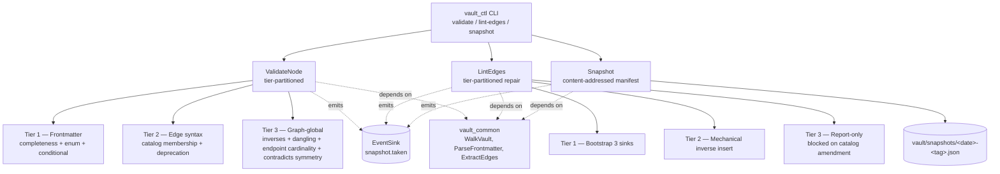

# vault_ctl — Validator, Edge-Linter, Snapshotter

## What This Module Owns

`vault_ctl` is the platform's mechanical-enforcement subsystem for the vault metadata constitution. It owns three orthogonal jobs and nothing else:

1. **`vault_ctl validate`** — frontmatter and edge-catalog validation, tier-partitioned so a pre-commit hook can run Tier 1+2 cheaply and CI can run Tier 3 (graph-global) once per push.
2. **`vault_ctl lint-edges`** — the inverse-edge repair pass: bootstrap the three high-traffic sinks, insert the ~90 reciprocal rows on vault-internal targets, report (do not write) the catalog-blocked rows.
3. **`vault_ctl snapshot`** — content-addressed manifest of `vault/**` to `vault/snapshots/<date>-<tag>.json`. **Day-1 artifact** per discovery [D-2](../../../../vault/discovery/two-layer-platform-architecture/discovery.md#d-2-vault_ctl-is-foundational-snapshot-zero-on-day-1); the first run is tagged `vault-corpus-v0` (per [D-7](../../../../vault/discovery/two-layer-platform-architecture/discovery.md#d-7-stable-test-corpus-is-non-negotiable)) and pins the stable test corpus all subsystems read against.

Per [D-5](../../../../vault/discovery/two-layer-platform-architecture/discovery.md#d-5-re-scope-vault_ctl-absorb-promotiondemotion-into-vault_telemetry-route-session-close-to-the-existing-skill), `vault_ctl` is the **rescoped** subsystem: promotion/demotion flagging is `vault_telemetry`'s job, session-close stays in the existing `close-session` skill, and the catalog amendment work belongs to `vault/discovery/domainspec-vault-edges/`. The current on-disk module bundles those concerns; this spec defines the rescope.

`vault_ctl` is a producer-of-events via the kernel's `EventSink` ([D-4](../../../../vault/discovery/two-layer-platform-architecture/discovery.md#d-4-subsystems-communicate-via-events-and-the-read-only-walker--never-by-reaching-into-each-others-stores)). It does **not** open another subsystem's database, does **not** invoke `vault_telemetry`, and does **not** mutate the 21-edge catalog.

## Module Map

## Capabilities

| Capability | What | Key Aspects | Kernel Dependency | Kernel-Debt |
| ---------- | ---- | ----------- | ----------------- | ----------- |
| **ValidateFrontmatterTier1** | Per-file frontmatter completeness, enum-value, and conditional-confidence checks (F7, F8, F10) | `validate_local`, `Finding`, `Tier1Surface` | [`ParseFrontmatter`](../../../vault_common/features/spec/SPEC.md#parsefrontmatter) | **Blocked on `vault_common` [OQ-A](../../../vault_common/features/spec/SPEC.md#oq-a-nodetype-enum-is-currently-6-values-in-code-16-in-the-conventions) + [OQ-B](../../../vault_common/features/spec/SPEC.md#oq-b-validate_node-falls-back-to-base-on-unknown-node_type-but-constitution-rule-1-implies-hard-rejection)** — without all 16 `node_type` subclasses and hard-reject behavior, files with `node_type: spec` silently parse as base and Tier 1 cannot detect F7 on the new types. |
| **ValidateEdgeCatalogTier2** | Per-file edge-name validity against the 21-edge catalog; deprecated-edge detection (F4, F5) | `validate_edge_syntax`, `DEPRECATED_EDGES`, `Tier2Surface` | [`ExtractEdges`](../../../vault_common/features/spec/SPEC.md#extractedges), [`EDGE_TYPES`](../../../vault_common/features/spec/SPEC.md#extractedges) | Partial — requires kernel `extract_edges` to read `## Connections` body (kernel [OQ-E](../../../vault_common/features/spec/SPEC.md#oq-e-extract_edges-reads-frontmatter-fields-only--does-not-parse--connections-blocks)). Currently frontmatter-only. |
| **ValidateGraphTier3** | Cross-file: missing-inverse audit with skill/agent/session carve-outs, dangling targets, endpoint `node_type` cardinality per Appendix C, symmetric `contradicts` (F1, F2, F3, F6, F9) | `validate_graph`, `MissingInverseReport`, `DanglingTargetReport`, `EndpointMismatchReport`, `ContradictsAsymmetryReport`, `Tier3Surface` | [`WalkVault`](../../../vault_common/features/spec/SPEC.md#walkvault), [`ExtractEdges`](../../../vault_common/features/spec/SPEC.md#extractedges) | Requires kernel `Edge.forward_only_reason` field (kernel [OQ-G](../../../vault_common/features/spec/SPEC.md#oq-g-carve-out-marking-on-extracted-edges-is-not-exposed)) to skip carve-out edges; otherwise the auditor double-counts skill/agent/session edges as F1 violations. |
| **LintEdgesTier1Bootstrap** | Add canonical `## Connections` table header to the three high-traffic sinks (`vault/ontology-conventions.md`, `vault/confidence-levels.md`, `vault/ontology-architecture-draft.md`) | `bootstrap_sinks`, `THREE_SINKS`, `BootstrapResult` | [`WalkVault`](../../../vault_common/features/spec/SPEC.md#walkvault) (read), filesystem write | None — pure file edit |
| **LintEdgesTier2InsertInverses** | Insert reciprocal rows on now-bootstrapped vault-internal targets for the ~90 Category-4 forward edges where forward+inverse are uncontested catalog names | `insert_inverses`, `InverseCandidate`, `Tier2Result`, scoped to vault-internal targets only | [`ExtractEdges`](../../../vault_common/features/spec/SPEC.md#extractedges) | Requires kernel `Edge.forward_only_reason` (kernel OQ-G) to skip the ~10 forward-only edges into `.claude/skills/**` / `.claude/agents/**` and the session-source carve-out. |
| **LintEdgesTier3Report** | Enumerate rows blocked on the catalog-amendment work (off-catalog names, contested inverses, dangling targets); emit as a report, never write | `report_blocked`, `BlockedReason`, `Tier3Report` | [`ExtractEdges`](../../../vault_common/features/spec/SPEC.md#extractedges) | None — read-only |
| **Snapshot** | Content-addressed manifest of `vault/**` written to `vault/snapshots/<date>-<tag>.json`; first invocation tagged `vault-corpus-v0` | `take_snapshot`, `Manifest`, `ManifestEntry`, `MANIFEST_SCHEMA_VERSION` | [`WalkVault`](../../../vault_common/features/spec/SPEC.md#walkvault), [`VaultDoc.content_hash`](../../../vault_common/features/spec/SPEC.md#walkvault) | None — but per D-2 the manifest format MUST be specifiable as hand-writeable if the CLI itself is not yet ready. |
| **EmitValidationEvents** | Append-only stream of `validation.failed`, `validation.completed`, `edges.lint.bootstrapped`, `edges.lint.inserted`, `edges.lint.reported`, `snapshot.taken` to the kernel `EventSink` | `EventKind`, payload contract per kind | [`EmitEvents`](../../../vault_common/features/spec/SPEC.md#emitevents) | None |

### ValidateFrontmatterTier1

Per-file frontmatter validation. Closes failure modes F7, F8, F10 ([source: documents-metadata-enforcement §3](../../../../vault/discovery/documents-metadata-enforcement/documents-metadata-enforcement.md#3-failure-modes-the-discipline-gap-admits)). Runs on the **changed-files subset** at pre-commit time and the **whole corpus** in CI; both surfaces invoke the same validator core.

| Aspect | Concept | Summary |
| ------ | ------- | ------- |
| Operation | [`validate_local`](#operation-validatelocal) | Validate one `VaultDoc`'s frontmatter; returns `list[Finding]` |
| Entity | [`Finding`](#entity-finding) | `(path, tier, code, message, source_loc)`; immutable |
| Rule | [`R-V-T1-Required-Fields`](#rule-r-v-t1-required-fields) | Every node MUST carry the universal frontmatter fields; missing field → Finding(F7) |
| Rule | [`R-V-T1-Enum-Values`](#rule-r-v-t1-enum-values) | Values for `node_type`, `layer`, `nature`, `status` MUST be in their enum; out-of-enum → Finding(F7) |
| Rule | [`R-V-T1-Conditional-Confidence`](#rule-r-v-t1-conditional-confidence) | `veracidade`/`convicção` REQUIRED on `axiom`, `premise`; OPTIONAL on `discovery`, `audit`; FORBIDDEN on every other `node_type` → Finding(F8) (source: [conventions §veracidade and convicção](../../../../vault/ontology-conventions.md#veracidade-and-convicção--the-two-dimensions-of-confidence); kernel [R-FM-Conditional-Confidence](../../../vault_common/features/spec/SPEC.md#parsefrontmatter)) |
| Rule | [`R-V-T1-Frontmatter-First-Line`](#rule-r-v-t1-frontmatter-first-line) | The opening `---` MUST be on line 1; BOM/blank-line/comment prefix → Finding(F10) |
| Rule | [`R-V-T1-NodeType-Hard-Reject`](#rule-r-v-t1-nodetype-hard-reject) | An unknown `node_type` is a hard reject, not a base-class fallback. **Blocked on kernel [OQ-A](../../../vault_common/features/spec/SPEC.md#oq-a-nodetype-enum-is-currently-6-values-in-code-16-in-the-conventions) + [OQ-B](../../../vault_common/features/spec/SPEC.md#oq-b-validate_node-falls-back-to-base-on-unknown-node_type-but-constitution-rule-1-implies-hard-rejection)**: this rule cannot be enforced until the kernel stops silently accepting unknown `node_type` values. |

### ValidateEdgeCatalogTier2

Per-file edge-syntax validation. Closes F4 (invalid edge name) and F5 (deprecated-edge usage). The deprecated-edge list is sourced verbatim from [conventions Appendix C "Edges deprecated by this catalog"](../../../../vault/ontology-conventions.md#edges-deprecated-by-this-catalog). The current vault contains at least one observed F5: [`vault/discovery/domainspec-vault-foundations/epistemic-chain.md:428-429`](../../../../vault/discovery/domainspec-vault-foundations/epistemic-chain.md) uses `provenance-for`.

| Aspect | Concept | Summary |
| ------ | ------- | ------- |
| Operation | [`validate_edge_syntax`](#operation-validateedgesyntax) | For each `Edge` from a doc: verify verb ∈ `EDGE_TYPES`; verify verb ∉ `DEPRECATED_EDGES` |
| Entity | [`DEPRECATED_EDGES`](#entity-deprecatededges) | Frozenset of edge names retired by conventions Appendix C: `resolves`, `references`, `contextualizes`, `exemplifies`, `depends-on`, `questions`, `updates`, `deprecates`, `produces`, `produced-by`, `provenance-for`, `grounds`, `grounded-by` |
| Rule | [`R-V-T2-Catalog-Closed`](#rule-r-v-t2-catalog-closed) | Edge verb not in `EDGE_TYPES` → Finding(F4) |
| Rule | [`R-V-T2-No-Deprecated`](#rule-r-v-t2-no-deprecated) | Edge verb in `DEPRECATED_EDGES` → Finding(F5) with the catalog-recommended replacement in the message |
| Rule | [`R-V-T2-No-Catalog-Mutation`](#rule-r-v-t2-no-catalog-mutation) | `vault_ctl` MUST NOT modify the catalog. The 21-edge catalog and the deprecated-edge list are inputs; amendments go through `vault/discovery/domainspec-vault-edges/` |

### ValidateGraphTier3

Cross-file (graph-global) validation. Closes F1, F2, F3, F6, F9 — including the **headline bidirectionality gap**. Requires loading the full vault into memory; per discovery [§4 A-1](../../../../vault/discovery/documents-metadata-enforcement/documents-metadata-enforcement.md#a-1--pre-commit-hook-githookspre-commit-or-pre-commit-framework), this is the tier that exceeds the pre-commit budget at vault scale, so it is the **CI surface** only. The pre-commit hook composes Tier 1 + Tier 2 on changed files; CI composes Tier 1 + Tier 2 + Tier 3 on the whole corpus.

| Aspect | Concept | Summary |
| ------ | ------- | ------- |
| Operation | [`validate_graph`](#operation-validategraph) | Loads every `VaultDoc`, extracts every `Edge`, runs all four sub-checks |
| Operation | [`audit_inverses`](#operation-auditinverses) | For each forward edge A→B: verify the inverse B→A exists, **unless** the edge carries a carve-out reason (skill-target, agent-target, session-source) |
| Operation | [`audit_dangling`](#operation-auditdangling) | For each edge: verify `dst` resolves to a file or to a `.claude/skills/**` / `.claude/agents/**` path that exists |
| Operation | [`audit_endpoint_cardinality`](#operation-auditendpointcardinality) | For each edge: read source and target frontmatter; verify the `(source_node_type, target_node_type)` pair satisfies Appendix C cardinality for the edge verb |
| Operation | [`audit_contradicts_symmetry`](#operation-auditcontradictssymmetry) | For each `contradicts A→B`: verify `contradicts B→A` exists (and is not `refutes` or anything else) |
| Entity | [`MissingInverseReport`](#entity-missinginversereport) | List of `(src, dst, edge_type, expected_inverse, target_has_connections_block: bool)` |
| Entity | [`DanglingTargetReport`](#entity-danglingtargetreport) | List of `(src, dst, edge_type)` with unresolved `dst` |
| Entity | [`EndpointMismatchReport`](#entity-endpointmismatchreport) | List of `(src, dst, edge_type, expected_source_types, expected_target_types, actual_source_type, actual_target_type)` |
| Entity | [`ContradictsAsymmetryReport`](#entity-contradictsasymmetryreport) | List of `(src, dst)` where `contradicts` is one-sided or replied to with a non-`contradicts` verb |
| Rule | [`R-V-T3-Bidirectional`](#rule-r-v-t3-bidirectional) | Every vault-to-vault forward edge MUST have its declared inverse on the target's `## Connections` block (kernel [R-Edge-Bidirectional](../../../vault_common/features/spec/SPEC.md#extractedges)) |
| Rule | [`R-V-T3-Skill-Agent-Carveout`](#rule-r-v-t3-skill-agent-carveout) | Edges whose target is under `.claude/skills/**` or `.claude/agents/**` are **forward-only by design** and MUST NOT be reported as F1 violations (source: [conventions §8 Carve-out](../../../../vault/ontology-conventions.md#edge-types-connections-section); resolved per OQ-1 in [documents-metadata-enforcement §7](../../../../vault/discovery/documents-metadata-enforcement/documents-metadata-enforcement.md#oq-1--are-skill-files-claudeskillscustommd-and-agent-files-claudeagentsmd-legal-edge-endpoints----resolved-2026-05-03)) |
| Rule | [`R-V-T3-Session-Source-Carveout`](#rule-r-v-t3-session-source-carveout) | Edges with `is_session: true` source are forward-only-by-source; auditor MUST skip them (kernel [R-Edge-Session-Carveout](../../../vault_common/features/spec/SPEC.md#extractedges)) |
| Rule | [`R-V-T3-Contradicts-Symmetric`](#rule-r-v-t3-contradicts-symmetric) | `contradicts` is the only symmetric verb in the catalog; both sides MUST declare it using the same edge name (source: [conventions Appendix C universal edges](../../../../vault/ontology-conventions.md#universal-edges)) |
| Rule | [`R-V-T3-Endpoint-Cardinality`](#rule-r-v-t3-endpoint-cardinality) | The `(source.node_type, target.node_type)` pair MUST satisfy [Appendix C](../../../../vault/ontology-conventions.md#appendix-c-edge-type-catalog) per-edge constraints (e.g. `codified-as` requires source ∈ {premise, axiom, discovery}, target = constitution) |

### LintEdgesTier1Bootstrap

Add a canonical `## Connections` table header (header only, no rows) to the three high-traffic vault sinks. Per [inverse-edge-fix §3.1](../../../../vault/discovery/inverse-edge-fix/inverse-edge-fix.md#31-tier-1--bootstrap-the-three-high-traffic-sinks-low-risk-high-leverage), this is the highest-leverage early move — it unblocks the rest of the inverse sweep by giving ~20 inbound rows somewhere to land.

| Aspect | Concept | Summary |
| ------ | ------- | ------- |
| Operation | [`bootstrap_sinks`](#operation-bootstrapsinks) | For each path in `THREE_SINKS`: if no `## Connections` heading exists, append the canonical header |
| Entity | [`THREE_SINKS`](#entity-three-sinks) | Frozenset: `vault/ontology-conventions.md`, `vault/confidence-levels.md`, `vault/ontology-architecture-draft.md` |
| Entity | [`BootstrapResult`](#entity-bootstrapresult) | `(path, action: "bootstrapped" | "already-present", header_lineno)` |
| Rule | [`R-L-T1-Idempotent`](#rule-r-l-t1-idempotent) | Re-running on an already-bootstrapped sink MUST be a no-op (action="already-present"); no duplicate headers |
| Rule | [`R-L-T1-Header-Only`](#rule-r-l-t1-header-only) | Bootstrap writes the heading + canonical three-column table header **and no rows**; row insertion is Tier 2 |
| Rule | [`R-L-T1-Canonical-Header`](#rule-r-l-t1-canonical-header) | The header is `\| Document \| Type \| Description \|\n\|----------\|------\|-------------\|` per [inverse-edge-fix §3.1](../../../../vault/discovery/inverse-edge-fix/inverse-edge-fix.md#31-tier-1--bootstrap-the-three-high-traffic-sinks-low-risk-high-leverage) |

### LintEdgesTier2InsertInverses

Mechanically insert the inverse row on the target for every Category-4 forward edge where (i) the forward verb is in `EDGE_TYPES`, (ii) the target file exists, (iii) the target now carries a `## Connections` block (post-Tier-1), and (iv) the inverse verb is uncontested ([§3.2](../../../../vault/discovery/inverse-edge-fix/inverse-edge-fix.md#32-tier-2--low-risk-inverse-additions-mechanical)). The dispatch found ~90 such rows.

| Aspect | Concept | Summary |
| ------ | ------- | ------- |
| Operation | [`insert_inverses`](#operation-insertinverses) | For each `InverseCandidate`: append a row to the target's `## Connections` block naming the source and the inverse verb |
| Operation | [`is_uncontested_inverse`](#operation-isuncontestedinverse) | Returns True iff the forward→inverse mapping is one-to-one in the catalog (excludes `derives-from` ↔ `codified-as` ambiguity flagged in [inverse-edge-fix OQ-1](../../../../vault/discovery/inverse-edge-fix/inverse-edge-fix.md#oq-1--how-are-forward--inverse-pairs-reconciled-when-each-side-uses-a-different-catalog-name)) |
| Entity | [`InverseCandidate`](#entity-inversecandidate) | `(source_path, target_path, forward_verb, inverse_verb, source_loc)`; only built when all four §3.2 conditions hold |
| Entity | [`Tier2Result`](#entity-tier2result) | Per-target list of inserted rows; idempotent on re-run |
| Rule | [`R-L-T2-Vault-Internal-Only`](#rule-r-l-t2-vault-internal-only) | Scope is strictly **vault-internal targets**. Carve-outs apply: forward-only into `.claude/skills/**`, `.claude/agents/**`; forward-only from `vault/sessions/**` (source side) |
| Rule | [`R-L-T2-Idempotent`](#rule-r-l-t2-idempotent) | Re-running after a vault edit MUST produce an empty diff if no asymmetry remains. An existing inverse row (by `(source_path, forward_verb)`) is skipped, not duplicated |
| Rule | [`R-L-T2-No-Catalog-Mutation`](#rule-r-l-t2-no-catalog-mutation) | `lint-edges` MUST NOT modify the catalog. Off-catalog-edge reconciliation is deferred to `vault/discovery/domainspec-vault-edges/` |
| Rule | [`R-L-T2-Uncontested-Only`](#rule-r-l-t2-uncontested-only) | Skip rows where the natural inverse is contested (per inverse-edge-fix OQ-1); those are Tier 3 (report-only) |
| Rule | [`R-L-T2-Leaf-First-Ordering`](#rule-r-l-t2-leaf-first-ordering) | Process targets in leaf → mid-graph → top-of-graph order per [inverse-edge-fix §4.1](../../../../vault/discovery/inverse-edge-fix/inverse-edge-fix.md#41-inside-step-5--leaf-first-ordering-inside-vault) (discipline, not measured rule) |

### LintEdgesTier3Report

Enumerate rows that are **blocked on upstream work** and emit them as a report. Never auto-writes. Per [inverse-edge-fix §3.3](../../../../vault/discovery/inverse-edge-fix/inverse-edge-fix.md#33-tier-3--medium--high-risk-inverse-additions-deferred-to-backlog), the blocked population includes ~24 off-catalog edge types in active use (waiting on the catalog amendment) plus forward/inverse-name disagreements and dangling-or-renamed targets.

| Aspect | Concept | Summary |
| ------ | ------- | ------- |
| Operation | [`report_blocked`](#operation-reportblocked) | Build `Tier3Report` listing every row that fails any Tier 2 precondition |
| Entity | [`BlockedReason`](#entity-blockedreason) | Enum: `off-catalog-forward`, `contested-inverse`, `dangling-target`, `target-without-connections-block`, `endpoint-cardinality-violation` |
| Entity | [`Tier3Report`](#entity-tier3report) | `(blocked_rows: list[(source_path, target_path, verb, reason, suggested_workstream)])` |
| Rule | [`R-L-T3-Read-Only`](#rule-r-l-t3-read-only) | This tier MUST NOT mutate any file |
| Rule | [`R-L-T3-Workstream-Attribution`](#rule-r-l-t3-workstream-attribution) | Each blocked row carries `suggested_workstream` pointing at the downstream discovery (`domainspec-vault-edges/`, dangling-targets sweep in `_backlog.md`, cross-repo workstream) per inverse-edge-fix §5 |

### Snapshot

Content-addressed manifest of every non-excluded file under `vault/**`. Written to `vault/snapshots/<date>-<tag>.json`. **Day-1 artifact** per [D-2](../../../../vault/discovery/two-layer-platform-architecture/discovery.md#d-2-vault_ctl-is-foundational-snapshot-zero-on-day-1) — the manifest format MUST be specifiable as hand-writeable so snapshot zero can land even if the CLI is not ready (this matches D-2's operational guarantee that there is no acceptable trajectory where snapshot zero is delayed for tooling readiness). The first snapshot is tagged `vault-corpus-v0` per [D-7](../../../../vault/discovery/two-layer-platform-architecture/discovery.md#d-7-stable-test-corpus-is-non-negotiable) and pins the stable test corpus that every other subsystem reads against by default.

| Aspect | Concept | Summary |
| ------ | ------- | ------- |
| Operation | [`take_snapshot`](#operation-takesnapshot) | Walk vault, build `Manifest`, write JSON, emit `snapshot.taken` event |
| Entity | [`Manifest`](#entity-manifest) | `{schema_version, tag, created_at (ISO-8601 UTC), description, file_count, corpus_hash, entries: list[ManifestEntry]}` |
| Entity | [`ManifestEntry`](#entity-manifestentry) | `(relative_path, sha256, mtime, frontmatter_node_type, schema_version)` per the user-supplied format |
| Entity | [`MANIFEST_SCHEMA_VERSION`](#entity-manifest-schema-version) | Integer; `1` for v0.1.0. Bumps require backward-compat read-support for previous versions |
| Rule | [`R-S-Hand-Writeable`](#rule-r-s-hand-writeable) | The manifest format MUST be hand-writeable in JSON; no required field requires CLI introspection beyond fields visible in the source file (path, sha256 of bytes, mtime, frontmatter node_type, schema_version) |
| Rule | [`R-S-First-Tag-Vault-Corpus-V0`](#rule-r-s-first-tag-vault-corpus-v0) | The first snapshot ever taken (or hand-written) MUST be tagged `vault-corpus-v0` per D-7 |
| Rule | [`R-S-Content-Addressed`](#rule-r-s-content-addressed) | `ManifestEntry.sha256` MUST equal kernel `VaultDoc.content_hash` for the same file at the same revision; `Manifest.corpus_hash` MUST be the deterministic hash of the sorted `(relative_path, sha256)` list |
| Rule | [`R-S-Atomic-Write`](#rule-r-s-atomic-write) | The manifest MUST be written atomically (temp-file + rename) so a partial snapshot never lands at the target path |
| Rule | [`R-S-No-Overwrite`](#rule-r-s-no-overwrite) | If `<date>-<tag>.json` already exists, the command MUST fail rather than overwrite; the tag advances by adding a new file, never by mutating an old one |

### EmitValidationEvents

The only sanctioned cross-subsystem seam ([D-4](../../../../vault/discovery/two-layer-platform-architecture/discovery.md#d-4-subsystems-communicate-via-events-and-the-read-only-walker--never-by-reaching-into-each-others-stores)). `vault_ctl` is a **producer**; `vault_telemetry` is the canonical consumer (derives the promotion/demotion candidate flag from these events plus `WalkVault`).

| Aspect | Concept | Summary |
| ------ | ------- | ------- |
| Operation | [`emit_event`](#operation-emitevent) | Thin wrapper over kernel [`EventSink.emit`](../../../vault_common/features/spec/SPEC.md#operation-emit); injects `subsystem: "vault_ctl"` |
| Entity | [`EventKind`](#entity-eventkind) | Enum: `validation.failed`, `validation.completed`, `edges.lint.bootstrapped`, `edges.lint.inserted`, `edges.lint.reported`, `snapshot.taken` |
| Rule | [`R-E-Append-Only`](#rule-r-e-append-only) | Inherits kernel [R-Events-Append-Only](../../../vault_common/features/spec/SPEC.md#emitevents); MUST NOT truncate or rewrite |
| Rule | [`R-E-Payload-Per-Kind`](#rule-r-e-payload-per-kind) | Each `EventKind` has a documented payload contract (Events Aspect below); kernel does not validate payload, `vault_ctl` self-disciplines |
| Rule | [`R-E-No-DB-Cross-Read`](#rule-r-e-no-db-cross-read) | `vault_ctl` MUST NOT open `telemetry.db`, `convergence.db`, or `vault_index.db`; reads are kernel-walker + events only (kernel [R-DB-No-Cross-Read](../../../vault_common/features/spec/SPEC.md#opendatabase)) |

## Domain Concepts

| Concept | Type | Key Constraints |
| ------- | ---- | --------------- |
| [`Finding`](#entity-finding) | Value Object | Immutable `(path, tier: Literal[1,2,3], code: str, message: str, source_loc: int \| None)`; equality by all fields |
| [`Tier`](#enum-tier) | Enum | `1` (frontmatter-local), `2` (edge-syntax-local), `3` (graph-global) |
| [`MissingInverseReport`](#entity-missinginversereport) | Value Object | List of unfilled inverse edges, post-carve-out |
| [`DanglingTargetReport`](#entity-danglingtargetreport) | Value Object | Edges whose `dst` does not resolve to an existing file or carve-out path |
| [`EndpointMismatchReport`](#entity-endpointmismatchreport) | Value Object | Edges whose `(src.node_type, dst.node_type)` violates Appendix C |
| [`ContradictsAsymmetryReport`](#entity-contradictsasymmetryreport) | Value Object | Asymmetric or wrong-verb `contradicts` declarations |
| [`InverseCandidate`](#entity-inversecandidate) | Value Object | A row eligible for `LintEdgesTier2InsertInverses` |
| [`BlockedReason`](#entity-blockedreason) | Enum | `off-catalog-forward`, `contested-inverse`, `dangling-target`, `target-without-connections-block`, `endpoint-cardinality-violation` |
| [`Manifest`](#entity-manifest) | Value Object | Snapshot manifest with `corpus_hash` |
| [`ManifestEntry`](#entity-manifestentry) | Value Object | `(relative_path, sha256, mtime, frontmatter_node_type, schema_version)` |
| [`THREE_SINKS`](#entity-three-sinks) | Constant | Frozenset of three vault paths bootstrapped in Tier 1 |
| [`DEPRECATED_EDGES`](#entity-deprecatededges) | Constant | Frozenset of retired edge verbs from conventions Appendix C |
| [`EventKind`](#entity-eventkind) | Enum | The six event verbs `vault_ctl` may emit |

## Concept Registry

| Concept | ID | Type |
| ------- | -- | ---- |
| ValidateFrontmatterTier1 | `vault_ctl.ValidateFrontmatterTier1` | Capability |
| ValidateEdgeCatalogTier2 | `vault_ctl.ValidateEdgeCatalogTier2` | Capability |
| ValidateGraphTier3 | `vault_ctl.ValidateGraphTier3` | Capability |
| LintEdgesTier1Bootstrap | `vault_ctl.LintEdgesTier1Bootstrap` | Capability |
| LintEdgesTier2InsertInverses | `vault_ctl.LintEdgesTier2InsertInverses` | Capability |
| LintEdgesTier3Report | `vault_ctl.LintEdgesTier3Report` | Capability |
| Snapshot | `vault_ctl.Snapshot` | Capability |
| EmitValidationEvents | `vault_ctl.EmitValidationEvents` | Capability |
| Finding | `vault_ctl.Finding` | ValueObject |
| Tier | `vault_ctl.Tier` | Enum |
| MissingInverseReport | `vault_ctl.MissingInverseReport` | ValueObject |
| DanglingTargetReport | `vault_ctl.DanglingTargetReport` | ValueObject |
| EndpointMismatchReport | `vault_ctl.EndpointMismatchReport` | ValueObject |
| ContradictsAsymmetryReport | `vault_ctl.ContradictsAsymmetryReport` | ValueObject |
| InverseCandidate | `vault_ctl.InverseCandidate` | ValueObject |
| BlockedReason | `vault_ctl.BlockedReason` | Enum |
| Manifest | `vault_ctl.Manifest` | ValueObject |
| ManifestEntry | `vault_ctl.ManifestEntry` | ValueObject |
| THREE_SINKS | `vault_ctl.THREE_SINKS` | Constant |
| DEPRECATED_EDGES | `vault_ctl.DEPRECATED_EDGES` | Constant |
| EventKind | `vault_ctl.EventKind` | Enum |
| `validate_local` | `vault_ctl.validate_local` | Operation |
| `validate_edge_syntax` | `vault_ctl.validate_edge_syntax` | Operation |
| `validate_graph` | `vault_ctl.validate_graph` | Operation |
| `audit_inverses` | `vault_ctl.audit_inverses` | Operation |
| `audit_dangling` | `vault_ctl.audit_dangling` | Operation |
| `audit_endpoint_cardinality` | `vault_ctl.audit_endpoint_cardinality` | Operation |
| `audit_contradicts_symmetry` | `vault_ctl.audit_contradicts_symmetry` | Operation |
| `bootstrap_sinks` | `vault_ctl.bootstrap_sinks` | Operation |
| `insert_inverses` | `vault_ctl.insert_inverses` | Operation |
| `report_blocked` | `vault_ctl.report_blocked` | Operation |
| `take_snapshot` | `vault_ctl.take_snapshot` | Operation |
| `emit_event` | `vault_ctl.emit_event` | Operation |
| R-V-T1-Required-Fields | `vault_ctl.R-V-T1-Required-Fields` | Rule |
| R-V-T1-Enum-Values | `vault_ctl.R-V-T1-Enum-Values` | Rule |
| R-V-T1-Conditional-Confidence | `vault_ctl.R-V-T1-Conditional-Confidence` | Rule |
| R-V-T1-Frontmatter-First-Line | `vault_ctl.R-V-T1-Frontmatter-First-Line` | Rule |
| R-V-T1-NodeType-Hard-Reject | `vault_ctl.R-V-T1-NodeType-Hard-Reject` | Rule |
| R-V-T2-Catalog-Closed | `vault_ctl.R-V-T2-Catalog-Closed` | Rule |
| R-V-T2-No-Deprecated | `vault_ctl.R-V-T2-No-Deprecated` | Rule |
| R-V-T2-No-Catalog-Mutation | `vault_ctl.R-V-T2-No-Catalog-Mutation` | Rule |
| R-V-T3-Bidirectional | `vault_ctl.R-V-T3-Bidirectional` | Rule |
| R-V-T3-Skill-Agent-Carveout | `vault_ctl.R-V-T3-Skill-Agent-Carveout` | Rule |
| R-V-T3-Session-Source-Carveout | `vault_ctl.R-V-T3-Session-Source-Carveout` | Rule |
| R-V-T3-Contradicts-Symmetric | `vault_ctl.R-V-T3-Contradicts-Symmetric` | Rule |
| R-V-T3-Endpoint-Cardinality | `vault_ctl.R-V-T3-Endpoint-Cardinality` | Rule |
| R-L-T1-Idempotent | `vault_ctl.R-L-T1-Idempotent` | Rule |
| R-L-T1-Header-Only | `vault_ctl.R-L-T1-Header-Only` | Rule |
| R-L-T1-Canonical-Header | `vault_ctl.R-L-T1-Canonical-Header` | Rule |
| R-L-T2-Vault-Internal-Only | `vault_ctl.R-L-T2-Vault-Internal-Only` | Rule |
| R-L-T2-Idempotent | `vault_ctl.R-L-T2-Idempotent` | Rule |
| R-L-T2-No-Catalog-Mutation | `vault_ctl.R-L-T2-No-Catalog-Mutation` | Rule |
| R-L-T2-Uncontested-Only | `vault_ctl.R-L-T2-Uncontested-Only` | Rule |
| R-L-T2-Leaf-First-Ordering | `vault_ctl.R-L-T2-Leaf-First-Ordering` | Rule |
| R-L-T3-Read-Only | `vault_ctl.R-L-T3-Read-Only` | Rule |
| R-L-T3-Workstream-Attribution | `vault_ctl.R-L-T3-Workstream-Attribution` | Rule |
| R-S-Hand-Writeable | `vault_ctl.R-S-Hand-Writeable` | Rule |
| R-S-First-Tag-Vault-Corpus-V0 | `vault_ctl.R-S-First-Tag-Vault-Corpus-V0` | Rule |
| R-S-Content-Addressed | `vault_ctl.R-S-Content-Addressed` | Rule |
| R-S-Atomic-Write | `vault_ctl.R-S-Atomic-Write` | Rule |
| R-S-No-Overwrite | `vault_ctl.R-S-No-Overwrite` | Rule |
| R-E-Append-Only | `vault_ctl.R-E-Append-Only` | Rule |
| R-E-Payload-Per-Kind | `vault_ctl.R-E-Payload-Per-Kind` | Rule |
| R-E-No-DB-Cross-Read | `vault_ctl.R-E-No-DB-Cross-Read` | Rule |

## Feature Concept Graph

| From | Edge | To | Evidence | Notes |
| ---- | ---- | -- | -------- | ----- |
| `vault_ctl.ValidateFrontmatterTier1` | consumes | [`vault_common.ParseFrontmatter`](../../../vault_common/features/spec/SPEC.md#parsefrontmatter) | this SPEC §ValidateFrontmatterTier1 | every file goes through kernel `validate_node` |
| `vault_ctl.ValidateFrontmatterTier1` | produces | `vault_ctl.Finding` | this SPEC §ValidateFrontmatterTier1 | one per detected violation |
| `vault_ctl.ValidateEdgeCatalogTier2` | consumes | [`vault_common.ExtractEdges`](../../../vault_common/features/spec/SPEC.md#extractedges) | this SPEC §ValidateEdgeCatalogTier2 | reads `Edge` records |
| `vault_ctl.ValidateGraphTier3` | consumes | [`vault_common.WalkVault`](../../../vault_common/features/spec/SPEC.md#walkvault) | this SPEC §ValidateGraphTier3 | full corpus load |
| `vault_ctl.ValidateGraphTier3` | enforces | `vault_ctl.R-V-T3-Bidirectional` | this SPEC §ValidateGraphTier3 | the headline gap |
| `vault_ctl.LintEdgesTier1Bootstrap` | enforces | `vault_ctl.R-L-T1-Idempotent` | this SPEC §LintEdgesTier1Bootstrap | re-run is no-op |
| `vault_ctl.LintEdgesTier2InsertInverses` | refines | [`inverse-edge-fix §3.2`](../../../../vault/discovery/inverse-edge-fix/inverse-edge-fix.md#32-tier-2--low-risk-inverse-additions-mechanical) | this SPEC §LintEdgesTier2InsertInverses | executable form of the Tier-2 plan |
| `vault_ctl.LintEdgesTier3Report` | governed-by | [`vault/discovery/domainspec-vault-edges/`](../../../../vault/discovery/_backlog.md) | this SPEC §LintEdgesTier3Report | blocked rows wait on the catalog amendment |
| `vault_ctl.Snapshot` | enforces | `vault_ctl.R-S-First-Tag-Vault-Corpus-V0` | this SPEC §Snapshot | per D-7 |
| `vault_ctl.Snapshot` | governed-by | [`two-layer-platform-architecture D-2`](../../../../vault/discovery/two-layer-platform-architecture/discovery.md#d-2-vault_ctl-is-foundational-snapshot-zero-on-day-1) | discovery | hand-writeable day-1 guarantee |
| `vault_ctl.EmitValidationEvents` | consumes | [`vault_common.EmitEvents`](../../../vault_common/features/spec/SPEC.md#emitevents) | this SPEC §EmitValidationEvents | the only cross-subsystem seam |
| `vault_ctl.ValidateGraphTier3` | governed-by | [`ontology-conventions.md` Appendix C](../../../../vault/ontology-conventions.md#appendix-c-edge-type-catalog) | conventions | endpoint cardinality + carve-outs |
| `vault_ctl.ValidateFrontmatterTier1` | governed-by | [`frontmatter-ownership-constitution.md`](../../../../vault/constitution/frontmatter-ownership-constitution.md) | constitution | per-`node_type` validation is the constitution's executable form |

## Aspect Docs

| Aspect | Contains | Key Concepts |
| ------ | -------- | ------------ |
| [Architecture](architecture.md) | Six-view architecture companion: context, structure, components, workflow, decisions, dependencies. Gate result. | Tier 1+2 vs Tier 3 surface split, event seam topology, kernel-debt blockers |
| [Glossary](glossary.md) | Source-linked definitions of every concept above | Tier, Finding, THREE_SINKS, DEPRECATED_EDGES, InverseCandidate, BlockedReason, Manifest, EventKind |

## Cross-Feature Dependencies

| Capability | Depends On | Via | Why |
| ---------- | ---------- | --- | --- |
| All `Validate*` capabilities | [`vault_common.WalkVault`](../../../vault_common/features/spec/SPEC.md#walkvault), [`ParseFrontmatter`](../../../vault_common/features/spec/SPEC.md#parsefrontmatter), [`ExtractEdges`](../../../vault_common/features/spec/SPEC.md#extractedges) | direct import | Source-of-truth iteration + typed schema + edge records |
| `ValidateFrontmatterTier1` | kernel [OQ-A](../../../vault_common/features/spec/SPEC.md#oq-a-nodetype-enum-is-currently-6-values-in-code-16-in-the-conventions) + [OQ-B](../../../vault_common/features/spec/SPEC.md#oq-b-validate_node-falls-back-to-base-on-unknown-node_type-but-constitution-rule-1-implies-hard-rejection) resolution | (blocker) | Cannot enforce R-V-T1-NodeType-Hard-Reject until kernel expands `NodeType` to all 16 and flips `validate_node` to hard-reject |
| `ValidateEdgeCatalogTier2` | kernel [OQ-E](../../../vault_common/features/spec/SPEC.md#oq-e-extract_edges-reads-frontmatter-fields-only--does-not-parse--connections-blocks) resolution | (blocker for body edges) | `extract_edges` must parse `## Connections` table; today only frontmatter |
| `ValidateGraphTier3`, `LintEdgesTier2InsertInverses` | kernel [OQ-G](../../../vault_common/features/spec/SPEC.md#oq-g-carve-out-marking-on-extracted-edges-is-not-exposed) resolution | (blocker for carve-out handling) | `Edge.forward_only_reason` field is required to skip skill/agent-target and session-source carve-outs without double-counting |
| All capabilities | [`vault_common.EmitEvents`](../../../vault_common/features/spec/SPEC.md#emitevents) | direct import | The only cross-subsystem seam |
| `Snapshot` | [`vault_common.VaultDoc.content_hash`](../../../vault_common/features/spec/SPEC.md#walkvault) | direct import | `ManifestEntry.sha256` MUST equal `VaultDoc.content_hash` |
| `ValidateGraphTier3` (endpoint cardinality) | [`ontology-conventions.md` Appendix C](../../../../vault/ontology-conventions.md#appendix-c-edge-type-catalog) | parsed reference | Per-edge `(source_node_type, target_node_type)` constraints |
| `ValidateEdgeCatalogTier2` (deprecation list) | [`ontology-conventions.md` "Edges deprecated"](../../../../vault/ontology-conventions.md#edges-deprecated-by-this-catalog) | parsed reference | Source of `DEPRECATED_EDGES` |

## Produces For

| Consumer | Consumes Capability | Via | What |
| -------- | ------------------- | --- | ---- |
| `vault_telemetry` | `EmitValidationEvents` (reader) | kernel [`EventSink.read`](../../../vault_common/features/spec/SPEC.md#operation-read) | Reads `validation.failed`, `validation.completed`, `edges.lint.*`, `snapshot.taken` to compute residue counters and the promotion/demotion candidate signal (per D-5) |
| Pre-commit hook (consumer-side) | `ValidateFrontmatterTier1`, `ValidateEdgeCatalogTier2` | CLI subcommand on changed files | Fast surface; Tier 1+2 only |
| CI (consumer-side) | All `Validate*` + `LintEdgesTier3Report` | CLI subcommand on full corpus | Authoritative surface; Tier 3 graph load runs here |
| Future `graph_retrieval` | `Snapshot` (manifest) | reads `vault/snapshots/<date>-<tag>.json` | Corpus pinning for reproducible retrieval runs |
| `convergence_runner` | `Snapshot` (manifest) | reads `vault-corpus-v0` by default | EVōC convergence falsifiability (per D-7) |

## Anti-Capabilities (Out of Scope)

This section is normative: each item is **deliberately excluded** by the discoveries cited.

| Excluded Capability | Owner | Source |
| ------------------- | ----- | ------ |
| Promotion / demotion candidate flagging | `vault_telemetry` | [D-5](../../../../vault/discovery/two-layer-platform-architecture/discovery.md#d-5-re-scope-vault_ctl-absorb-promotiondemotion-into-vault_telemetry-route-session-close-to-the-existing-skill) |
| Session-close workflow | `close-session` skill | [D-5](../../../../vault/discovery/two-layer-platform-architecture/discovery.md#d-5-re-scope-vault_ctl-absorb-promotiondemotion-into-vault_telemetry-route-session-close-to-the-existing-skill) |
| Residue counters, drift reports, dashboards | `vault_telemetry` | [D-6](../../../../vault/discovery/two-layer-platform-architecture/discovery.md#d-6-empirical-floor--vault_ctl--vault_telemetry-residue-counter-only--convergence_runner-dispatch-and-log-only) |
| Catalog amendment (add/rename/collapse edges) | `vault/discovery/domainspec-vault-edges/` | [inverse-edge-fix §1 deferral](../../../../vault/discovery/inverse-edge-fix/inverse-edge-fix.md#1-objective) |
| Off-catalog edge reconciliation | `vault/discovery/domainspec-vault-edges/` | [inverse-edge-fix §3.3](../../../../vault/discovery/inverse-edge-fix/inverse-edge-fix.md#33-tier-3--medium--high-risk-inverse-additions-deferred-to-backlog) |
| Cross-repo path / dangling-target sweeps | `vault/discovery/_backlog.md` | [inverse-edge-fix §5](../../../../vault/discovery/inverse-edge-fix/inverse-edge-fix.md#5-out-of-scope) |
| Immutability enforcement on sessions / discovery READMEs | pre-commit hook + CI | [documents-metadata-enforcement OQ-3](../../../../vault/discovery/documents-metadata-enforcement/documents-metadata-enforcement.md#oq-3--how-should-the-linter-handle-pre-existing-non-conformant-documents-during-rollout) and platform [OQ-3](../../../../vault/discovery/two-layer-platform-architecture/discovery.md#oq-3-immutability-enforcement--hook-ci-or-both) |
| CI runner configuration | consumer-side | this spec defines the validator core + CLI; wiring is downstream |
| Kernel primitives (walker, FM model, edge extractor, EventSink) | `vault_common` | [kernel SPEC](../../../vault_common/features/spec/SPEC.md) |
| Convergence boundary classifier | (deferred until [platform OQ-6](../../../../vault/discovery/two-layer-platform-architecture/discovery.md#oq-6-convergence-boundary-classifier--operational-proxy)) | A-5 |

## Cleanup Backlog (existing violations the validator will flag on first run)

Per [documents-metadata-enforcement §6](../../../../vault/discovery/documents-metadata-enforcement/documents-metadata-enforcement.md#6-cleanup), known violations already in the repo:

- [`vault/discovery/domainspec-vault-foundations/epistemic-chain.md:428-429`](../../../../vault/discovery/domainspec-vault-foundations/epistemic-chain.md) — uses deprecated `provenance-for`; should be `created-by`.
- [`vault/discovery/domainspec-subagents-strategy-definitions/domainspec-subagents-strategy.md:394-403`](../../../../vault/discovery/domainspec-subagents-strategy-definitions/domainspec-subagents-strategy.md) — uses non-catalog edges (`proposes`, `mode-of`, `aligns-with`, `instantiates`).
- Every `## Connections` block in the vault — none has been audited for inverse-side declaration. The first `validate --strict` will produce the canonical list (Tier 3).

Per documents-metadata-enforcement [OQ-3](../../../../vault/discovery/documents-metadata-enforcement/documents-metadata-enforcement.md#oq-3--how-should-the-linter-handle-pre-existing-non-conformant-documents-during-rollout), the spec recommends **advisory-then-enforcing** with a deadline: `validate` ships emitting findings but `--strict` is not wired to CI until the known violations are cleaned up.

## Open Questions

> Open questions are surfaced rather than papered over. Each notes current resolution state.

### OQ-1. CLI shape — single `vault-ctl` Typer app, or separate scripts?

**Question.** The existing on-disk module is one Typer app with subcommands; D-5's rescope removes `cycles`, `bets`, `amendments`, `governance` from the canonical surface (their fate is kernel-side [OQ-C](../../../vault_common/features/spec/SPEC.md#oq-c-codebase-already-contains-kernel-modules-the-discovery-never-sanctioned-governance-cycles-amendments-bets)). Should the post-rescope CLI keep the single-Typer-app shape with `validate`, `lint-edges`, `snapshot` subcommands, or split into three binaries?

**Recommendation.** Single Typer app. Three subcommands is the natural unit and matches the spec; the operational surface is small enough that splitting buys nothing.

### OQ-2. Where does `DEPRECATED_EDGES` live?

**Question.** The deprecated-edge list is currently a Markdown table in [conventions Appendix C](../../../../vault/ontology-conventions.md#edges-deprecated-by-this-catalog). The validator needs it as data. Three options: (a) parse the table at lint time, (b) duplicate as a YAML/JSON manifest, (c) generate the manifest from the table in a build step.

**Recommendation.** (c) — generate from the table. Matches the parallel recommendation in [documents-metadata-enforcement OQ-2](../../../../vault/discovery/documents-metadata-enforcement/documents-metadata-enforcement.md#oq-2--should-the-catalog-manifest-live-as-a-parseable-file-or-stay-prose-in-ontology-conventionsmd) for the 21-edge catalog. Keeps Appendix C authoritative; gives the validator a structured input; the build step itself is a Tier-1 check that the table is well-formed. Lock in the implementation-plan.

### OQ-3. What does `validate --strict` exit code mean across tiers?

**Question.** Should `--strict` exit non-zero on **any** Finding, or only on Tier 1+2 findings (because Tier 3 needs a cleanup ramp per documents-metadata-enforcement OQ-3)?

**Recommendation.** Default `--strict` fails on Tier 1+2 only; `--strict-all` adds Tier 3. This lets the pre-commit hook be aggressive on cheap checks while CI controls the Tier-3 ramp.

### OQ-4. How does `lint-edges` represent the inverse-row write before/after the kernel's `## Connections` body parser lands?

**Question.** [Kernel OQ-E](../../../vault_common/features/spec/SPEC.md#oq-e-extract_edges-reads-frontmatter-fields-only--does-not-parse--connections-blocks) is unresolved; until it lands, `extract_edges` returns only frontmatter-declared edges. `lint-edges` writes rows in the `## Connections` Markdown table. Until OQ-E, `lint-edges` can write rows that the kernel cannot then re-read for idempotence.

**Recommendation.** Defer the `lint-edges` implementation until kernel OQ-E is closed; gate the implementation in the work-pack on that dependency. The Tier 1 bootstrap (header only) can proceed independently.

### OQ-5. Does `snapshot` follow symlinks?

**Question.** A symlinked vault path under `vault/` would either be followed (and hashed at the symlink target) or recorded as a symlink. Either choice has consequences for `corpus_hash` determinism.

**Recommendation.** Do not follow symlinks; record them as a `ManifestEntry` with `kind: "symlink"` and `sha256` = sha256 of the symlink target string. Keeps `corpus_hash` deterministic regardless of mount layout.

### OQ-6. Does `validate` walk only `vault/**`, or include sibling roots (`templates/`, `docs/`)?

**Question.** Kernel `Config.vault_roots` is a tuple; the kernel allows multiple roots. The discoveries are scoped to `vault/**`. Should `vault_ctl` honor multi-root config or scope to `vault/`?

**Recommendation.** Honor `Config.vault_roots`. The validator's only mandatory frame is "validate every node the kernel produces"; restricting to `vault/` would silently misalign with kernel iteration. If the operational concern is "do not flag template files," exclude them via `Config.exclude_dirs`, not via a `vault_ctl`-private filter.

### OQ-7. What is the precise `Finding.code` namespace?

**Question.** The discoveries use `F1`–`F10`. The spec needs stable, machine-parseable codes so downstream tooling (telemetry dashboards, future PR-comment bots) can group findings.

**Recommendation.** Use `V-T<tier>-F<n>` (e.g. `V-T1-F7`, `V-T3-F1`) keyed to the discovery's failure-mode numbers. Extra checks introduced by this spec (e.g. catalog-mutation guard) get `V-T<tier>-X<n>` codes outside the discovery's numbered range so origin is unambiguous.

### OQ-8. Does `lint-edges` write a `## Connections` row when the source itself is a session?

**Question.** Per [R-V-T3-Session-Source-Carveout](#rule-r-v-t3-session-source-carveout), session-source edges are forward-only-by-source; the auditor skips them. Does `lint-edges` still attempt to write the inverse on the target (i.e., the discovery names the session in `created-by`)?

**Recommendation.** Yes — the session-source carve-out means the **session file** is not expected to receive inverses, but the discovery target IS expected to declare `created-by <session-path>`. This is consistent with [conventions Appendix C session-specific edges](../../../../vault/ontology-conventions.md#session-specific-edges). The carve-out applies to bidirectionality auditing of the session, not to inverse declarations on non-session targets.

### OQ-9. How does `snapshot` interact with the existing on-disk `snapshot` command?

**Question.** The current [`cli.py:snapshot`](../../../vault_ctl/cli.py) writes `{tag, created_at, description, file_count, corpus_hash, entries: {path: {sha256, bytes}}}`. This spec defines `ManifestEntry` as `(relative_path, sha256, mtime, frontmatter_node_type, schema_version)`. The on-disk format is narrower.

**Recommendation.** Treat the on-disk format as `MANIFEST_SCHEMA_VERSION=0` and bump to `1` with the fields in this spec. Provide a one-shot reader that accepts both. Snapshot zero (`vault-corpus-v0`), if already hand-written or CLI-produced in the v0 shape, MUST be re-readable by the v1 implementation — that is the operational guarantee from D-2.

## Stories

| Story ID | Actor | Capability | Outcome |
| -------- | ----- | ---------- | ------- |
| S-001 | Vault contributor at `git commit` | `ValidateFrontmatterTier1` + `ValidateEdgeCatalogTier2` (pre-commit hook surface) | Sees Tier 1+2 findings on changed files in their terminal before push |
| S-002 | CI bot on PR open | All three `Validate*` (CI surface) | Blocks merge on Tier 3 findings (per OQ-3 ramp) |
| S-003 | Vault maintainer running cleanup | `LintEdgesTier1Bootstrap`, then `LintEdgesTier2InsertInverses`, then `LintEdgesTier3Report` | Sinks bootstrapped, ~90 inverses inserted on uncontested vault-internal targets, blocked rows surfaced for catalog-amendment work |
| S-004 | Platform operator on day 1 of `/domainspec/internal_tools/` | `Snapshot` (or hand-written manifest per R-S-Hand-Writeable) | `vault/snapshots/<date>-vault-corpus-v0.json` exists; the 30-day residue clock starts |
| S-005 | `vault_telemetry` consumer | `EmitValidationEvents` (reader) | Reads JSONL events to compute promotion/demotion candidate signal (D-5) |

## Change History

| Date | Version | Change |
| ---- | ------- | ------ |
| 2026-05-18 | 0.1.0 | Initial draft. Spec written against the kernel SPEC contract, not the drifted kernel code; three capabilities explicitly blocked on kernel OQ-A/OQ-B/OQ-E/OQ-G. Rescoped per platform D-5 — `cycles`, `bets`, `amendments`, `governance` (currently in `vault_ctl/`) are out of the canonical surface and tracked under kernel [OQ-C](../../../vault_common/features/spec/SPEC.md#oq-c-codebase-already-contains-kernel-modules-the-discovery-never-sanctioned-governance-cycles-amendments-bets). |

## References

- Source discovery (validator): [`vault/discovery/documents-metadata-enforcement/documents-metadata-enforcement.md`](../../../../vault/discovery/documents-metadata-enforcement/documents-metadata-enforcement.md)
- Source discovery (lint-edges): [`vault/discovery/inverse-edge-fix/inverse-edge-fix.md`](../../../../vault/discovery/inverse-edge-fix/inverse-edge-fix.md)
- Platform discovery (D-2, D-5, D-7): [`vault/discovery/two-layer-platform-architecture/discovery.md`](../../../../vault/discovery/two-layer-platform-architecture/discovery.md)
- Kernel SPEC: [`internal_tools/vault_common/features/spec/SPEC.md`](../../../vault_common/features/spec/SPEC.md)
- Conventions (catalog + carve-outs + deprecation list): [`vault/ontology-conventions.md`](../../../../vault/ontology-conventions.md)
- Constitution (frontmatter ownership): [`vault/constitution/frontmatter-ownership-constitution.md`](../../../../vault/constitution/frontmatter-ownership-constitution.md)
- Architecture companion: [architecture.md](architecture.md)
- Glossary: [glossary.md](glossary.md)
