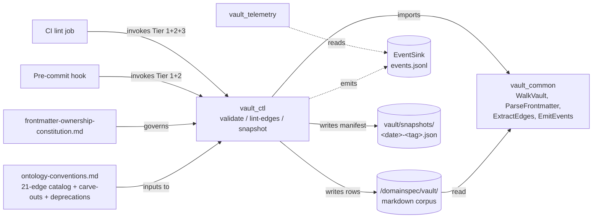
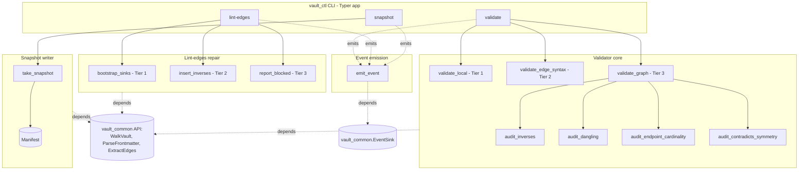
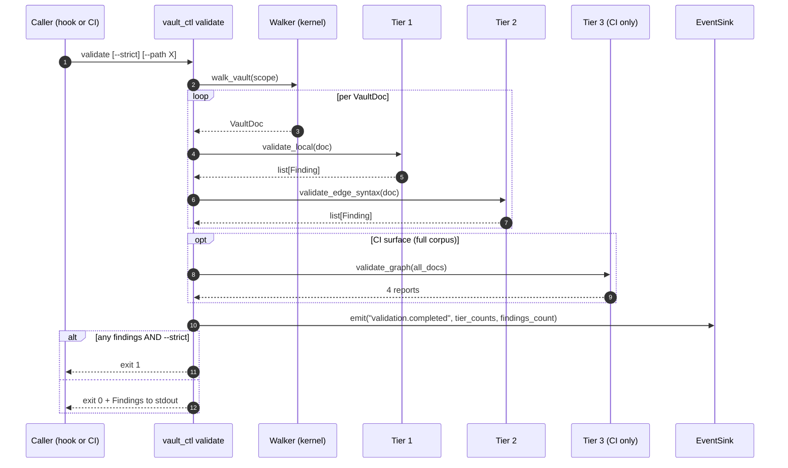
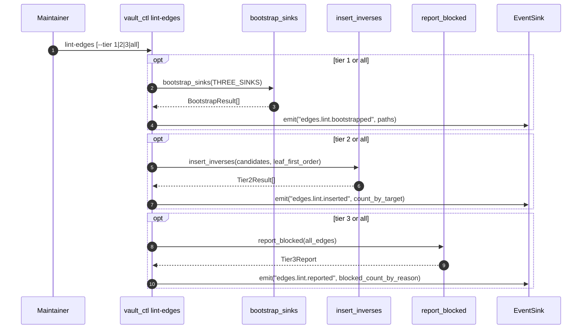
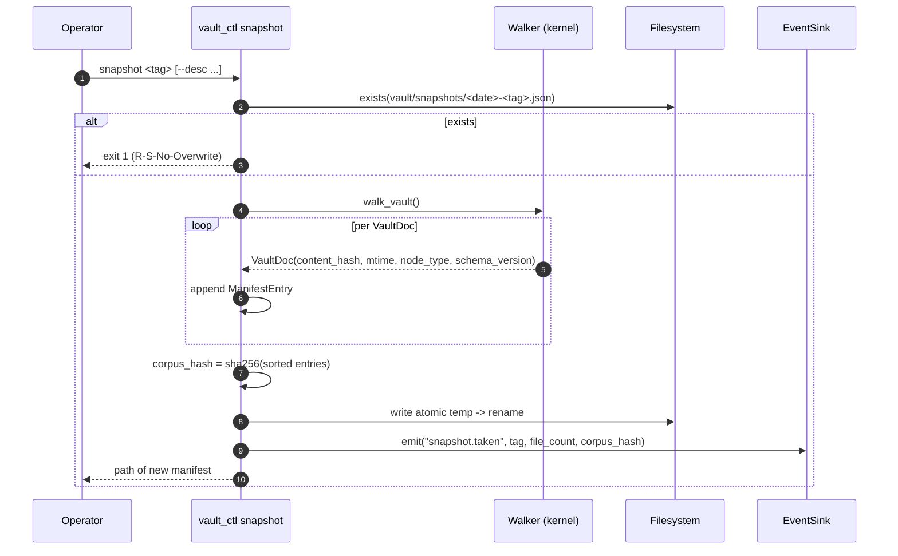

# vault_ctl Architecture

Feature-level architecture companion to [SPEC.md](SPEC.md). Explains the architecture implied by the spec's DomainSpec contracts; does not claim implementation completeness beyond those contracts.

## Architecture Intent

Convert the vault's currently-discipline-only metadata rules into mechanically enforced ones by composing kernel primitives into three orthogonal CLI commands — `validate`, `lint-edges`, `snapshot`. The subsystem exists so that `vault/ontology-conventions.md` can keep the word "rule" honestly (per the user's `feedback_epistemic_honesty.md` memory: "a vault 'rule' that is unverifiable must be demoted to discipline"). The `snapshot` command additionally exists to start the 30-day residue clock from [discovery D-2](../../../../vault/discovery/two-layer-platform-architecture/discovery.md#d-2-vault_ctl-is-foundational-snapshot-zero-on-day-1) on day 1 — hand-writeable if the CLI is not ready.

## Scope Boundary

- **Owned:** frontmatter + edge-catalog + graph-global validation core; the `lint-edges` repair pass (bootstrap, mechanical inverse insert, blocked-row report); the content-addressed snapshot manifest writer; the event emission contract for the six `EventKind` values.
- **Explicitly excluded** (per D-5 and the discoveries): promotion/demotion candidate flagging (→ `vault_telemetry`); session-close workflow (→ `close-session` skill); residue counters / drift reports / dashboards (→ `vault_telemetry`); catalog amendment (→ `vault/discovery/domainspec-vault-edges/`); cross-repo path normalization, dangling-target rename sweeps (→ `vault/discovery/_backlog.md`); immutability enforcement on sessions and discovery READMEs (→ pre-commit + CI per platform OQ-3); CI runner configuration (→ consumer side).
- **Neighbor packages outside the boundary:** [`vault_common`](../../../vault_common/features/spec/SPEC.md) (upstream — direct dependency), `vault_telemetry` (downstream — reads emitted events via kernel `EventSink.read`), pre-commit hook and CI runner (downstream consumers of the CLI binaries).

## Source Contracts

| Contract ID | Source | Required | Notes |
| ----------- | ------ | -------- | ----- |
| SC-001 | [SPEC.md](SPEC.md) | yes | Capability and concept source of truth |
| SC-002 | [`documents-metadata-enforcement/documents-metadata-enforcement.md`](../../../../vault/discovery/documents-metadata-enforcement/documents-metadata-enforcement.md) | yes | F1–F10 failure modes; three validation tiers; the A-3 (`vault-lint` CLI) recommendation in §5 is the validator command |
| SC-003 | [`inverse-edge-fix/inverse-edge-fix.md`](../../../../vault/discovery/inverse-edge-fix/inverse-edge-fix.md) | yes | ~90 missing-inverse population; three-sinks bootstrap; three risk tiers; leaf-first ordering |
| SC-004 | [`two-layer-platform-architecture/discovery.md`](../../../../vault/discovery/two-layer-platform-architecture/discovery.md) | yes | D-2 (foundational, snapshot day 1), D-4 (event seam), D-5 (rescope), D-6 (empirical floor), D-7 (`vault-corpus-v0`) |
| SC-005 | [`vault_common/features/spec/SPEC.md`](../../../vault_common/features/spec/SPEC.md) | yes | Kernel API contract. Capabilities consume `WalkVault`, `ParseFrontmatter`, `ExtractEdges`, `EmitEvents` |
| SC-006 | [`ontology-conventions.md`](../../../../vault/ontology-conventions.md) | yes | 16 node_types, 21-edge catalog with carve-outs, deprecation list, conditional-confidence rules — the **rules the validator enforces** |
| SC-007 | [`frontmatter-ownership-constitution.md`](../../../../vault/constitution/frontmatter-ownership-constitution.md) | yes | Single-owner schema; validator is the runtime witness for the constitution |

## Design Goals and Non-Goals

| Type | Item | Why |
| ---- | ---- | --- |
| Goal | Three orthogonal commands; one shared validator core | D-5 — bundling forces co-deployment of unrelated changes |
| Goal | Pre-commit hook surface = Tier 1+2; CI surface = Tier 1+2+3 | documents-metadata-enforcement §5 layering recommendation; Tier 3 graph load exceeds the commit budget |
| Goal | Snapshot manifest hand-writeable | D-2 — "there is no acceptable trajectory where snapshot zero is delayed for tooling readiness" |
| Goal | Idempotent repair operations | inverse-edge-fix §3 — re-run after a vault edit produces an empty diff if no asymmetry remains |
| Goal | Read-vault, write-events (+ write-vault only via `lint-edges`); never read another subsystem's DB | D-4 — cross-subsystem seam is events + walker only |
| Non-goal | Catalog amendment | inverse-edge-fix §1 + R-V-T2-No-Catalog-Mutation — belongs to `domainspec-vault-edges/` |
| Non-goal | Promotion/demotion logic | D-5 — `vault_telemetry` derives this from emitted events |
| Non-goal | Session-close, immutability enforcement | D-5 + platform OQ-3 |
| Non-goal | CI configuration | this spec defines the validator core and CLI; wiring is consumer-side |
| Non-goal | Re-implementing kernel primitives | All walker/FM/edge/event work goes through `vault_common` imports |

## View 1: Context View

| Actor or System | Relationship to Feature | Contract Source |
| --------------- | ----------------------- | --------------- |
| The graded vault under `/domainspec/vault/` | Input substrate (read by validator + lint-edges + snapshot; lint-edges also writes `## Connections` rows) | SC-006 |
| `vault_common` kernel | Upstream library dependency (walker, FM model, edge extractor, EventSink) | SC-005 |
| `ontology-conventions.md` | Source of the catalog, carve-outs, deprecated-edge list — the rules the validator enforces | SC-006 |
| `frontmatter-ownership-constitution.md` | Governs the validator's behavior (per-node-type subclass dispatch is the constitution's executable form) | SC-007 |
| `vault_telemetry` | Downstream reader of emitted events; derives promotion/demotion signal | SC-004 D-5 |
| Pre-commit hook (consumer-side) | Invokes Tier 1+2 on changed files | SC-002 §5 |
| CI lint job (consumer-side) | Invokes Tier 1+2+3 on full corpus; authoritative surface | SC-002 §5 |
| `vault/snapshots/` | Output destination for the snapshot manifest | SC-004 D-2 |

## View 2: High-Level Structure View

| Component | Primary Contracts | Responsibility |
| --------- | ----------------- | -------------- |
| `cli` (Typer app) | [SPEC §Capabilities](SPEC.md#capabilities) | Surface the three commands; parse flags; route to core |
| `validate.tier1` | [SPEC §ValidateFrontmatterTier1](SPEC.md#validatefrontmattertier1) | Per-file frontmatter validation; closes F7, F8, F10 |
| `validate.tier2` | [SPEC §ValidateEdgeCatalogTier2](SPEC.md#validateedgecatalogtier2) | Per-file edge-syntax + deprecation; closes F4, F5 |
| `validate.tier3` | [SPEC §ValidateGraphTier3](SPEC.md#validategraphtier3) | Graph-global audits; closes F1, F2, F3, F6, F9 |
| `lint_edges.bootstrap` | [SPEC §LintEdgesTier1Bootstrap](SPEC.md#lintedgestier1bootstrap) | Add `## Connections` header to the three sinks |
| `lint_edges.insert` | [SPEC §LintEdgesTier2InsertInverses](SPEC.md#lintedgestier2insertinverses) | Mechanical inverse-row insert on uncontested vault-internal targets |
| `lint_edges.report` | [SPEC §LintEdgesTier3Report](SPEC.md#lintedgestier3report) | Read-only enumeration of blocked rows |
| `snapshot.writer` | [SPEC §Snapshot](SPEC.md#snapshot) | Walk vault, build `Manifest`, atomic write |
| `events.emit` | [SPEC §EmitValidationEvents](SPEC.md#emitvalidationevents) | Thin wrapper over kernel `EventSink.emit` |

## View 3: Low-Level Components View

| Component | Owns | Consumes | Collaboration Rule |
| --------- | ---- | -------- | ------------------ |
| `validate.tier1.validate_local` | `Finding` construction for F7/F8/F10 | kernel `validate_node`, kernel per-`node_type` Pydantic subclass | Pure function on one `VaultDoc`; raises nothing — returns `list[Finding]` |
| `validate.tier2.validate_edge_syntax` | F4/F5 detection, `DEPRECATED_EDGES` lookup | kernel `extract_edges`, `EDGE_TYPES` | Pure function on one `VaultDoc`; deprecated-edge message includes the catalog-recommended replacement |
| `validate.tier3.validate_graph` | F1/F2/F3/F6/F9 detection | All four sub-auditors below, kernel `WalkVault` + `ExtractEdges` | Loads the full vault once; runs four audits in parallel-safe order; returns aggregated reports |
| `validate.tier3.audit_inverses` | Missing-inverse detection (F1) | Edge list with `forward_only_reason` populated (kernel OQ-G) | Skips skill-target / agent-target / session-source carve-out edges; emits `MissingInverseReport` |
| `validate.tier3.audit_dangling` | Broken-target detection (F3) | Filesystem `Path.exists()` | Carve-out paths (`.claude/skills/**`, `.claude/agents/**`) are valid targets if they exist on disk |
| `validate.tier3.audit_endpoint_cardinality` | F6 detection | `(src.node_type, dst.node_type)` per edge, conventions Appendix C cardinality table | Requires per-edge cardinality manifest (per OQ-2) |
| `validate.tier3.audit_contradicts_symmetry` | F9 detection | Edge list filtered to `contradicts` | The only edge in the catalog where forward = inverse verb |
| `lint_edges.bootstrap.bootstrap_sinks` | `BootstrapResult`; idempotent | `THREE_SINKS` constant, filesystem read+write | Appends only the canonical header (no rows); idempotent on re-run |
| `lint_edges.insert.insert_inverses` | `Tier2Result`; idempotent | `InverseCandidate`s, `is_uncontested_inverse`, target file write | Writes one row per candidate; existing matching rows are skipped, not duplicated |
| `lint_edges.report.report_blocked` | `Tier3Report` | Edge list, deferred-workstream attribution table | Read-only; never writes |
| `snapshot.writer.take_snapshot` | `Manifest` construction, atomic write | kernel `WalkVault`, `VaultDoc.content_hash` | Atomic via temp-file + rename; refuses to overwrite existing `<date>-<tag>.json` |
| `events.emit.emit_event` | `EventKind` payload contract | kernel `EventSink.emit` | Injects `subsystem: "vault_ctl"`; payload per `EventKind` documented in Events Aspect |

## View 4: Workflow Process View

The CLI is the **outer loop**; the validator core is invoked from both pre-commit and CI surfaces.

### Validate workflow

### Lint-edges workflow

### Snapshot workflow

| Flow | Happy Path | Failure or Compensation | Contract Source |
| ---- | ---------- | ----------------------- | --------------- |
| Validate | walk → tier 1+2 per doc → (CI) tier 3 → emit `validation.completed` | Tier-1 unparseable frontmatter → `Finding(F7/F10)`; tier-3 carve-out absent → would emit false F1 (blocked on kernel OQ-G) | SPEC §Capabilities |
| Lint bootstrap | for each sink: append header if absent | If file is open by another process: fail rather than mangle (atomic write) | inverse-edge-fix §3.1 |
| Lint insert | for each candidate: append row if not present | Target rename mid-run: re-resolve paths (per inverse-edge-fix OQ-2 working rule); refuse if path no longer resolves | inverse-edge-fix §3.2 |
| Lint report | full enumeration | Read-only; no compensation | inverse-edge-fix §3.3 |
| Snapshot | walk → build → atomic write → emit | File already exists → exit 1 (R-S-No-Overwrite); disk full → propagate `IOError` from kernel `EventSink` | D-2, this SPEC §Snapshot |

## View 5: Decision Flow View

| Decision Point | Options or Branches | Selection Rule | Outcome |
| -------------- | ------------------- | -------------- | ------- |
| Validator surface for a given check | (a) pre-commit (b) CI (c) both | Tier — 1+2 fit in pre-commit budget; 3 does not (per documents-metadata-enforcement §4 A-1) | T1+T2 → both surfaces; T3 → CI only |
| Where does `DEPRECATED_EDGES` come from? | (a) parse Appendix C at lint time (b) duplicate manifest (c) generated manifest | documents-metadata-enforcement OQ-2 + this SPEC OQ-2 | (c) — generated; build step is itself a Tier-1 check |
| `--strict` exit semantics | (a) any finding fails (b) tier-1+2 only (c) configurable | Cleanup-ramp recommendation (documents-metadata-enforcement OQ-3) | (b) by default; `--strict-all` opts into Tier 3 |
| Unknown `node_type` encountered | (a) silent base-class fallback (b) hard reject | Constitution Rule 1 + this SPEC R-V-T1-NodeType-Hard-Reject | (b) — **blocked on kernel OQ-A + OQ-B** |
| Edge targeting `.claude/skills/**` | (a) report as missing inverse (b) skip per carve-out | conventions §8 carve-out + this SPEC R-V-T3-Skill-Agent-Carveout | (b) — skip |
| Tier-2 inverse-row writing eligibility | (a) any forward verb (b) only catalog-clean uncontested forwards | inverse-edge-fix §3.2 | (b) — uncontested only; rest go to Tier 3 report |
| Snapshot file already exists | (a) overwrite (b) refuse | R-S-No-Overwrite | (b) — refuse; tags advance by adding files |
| Snapshot uses CLI vs hand-written manifest | (a) wait for CLI (b) hand-write allowed | D-2 operational guarantee | (b) — hand-writeable per R-S-Hand-Writeable |
| Catalog mutation by validator/lint | (a) allowed (b) forbidden | this SPEC R-V-T2-No-Catalog-Mutation + R-L-T2-No-Catalog-Mutation | (b) — belongs to `domainspec-vault-edges/` |
| Cross-subsystem DB read | (a) allowed for convenience (b) forbidden | D-4 + kernel R-DB-No-Cross-Read + this SPEC R-E-No-DB-Cross-Read | (b) — events + walker only |

## View 6: Dependency Interface View

| Dependency or Interface | Direction | Contract | Boundary Rule |
| ----------------------- | --------- | -------- | ------------- |
| `vault_common` (kernel) | inbound (Python import) | [kernel SPEC](../../../vault_common/features/spec/SPEC.md) | Only sanctioned import; this is what makes `vault_ctl` "thin" |
| `typer` | inbound (Python dep) | CLI framework | Pinned to a stable major; CLI is the only consumer |
| `pydantic` v2 (transitively, via kernel) | inbound | external library | Not directly imported by `vault_ctl`; the kernel re-exports the model |
| `pyyaml` (transitively, via kernel) | inbound | external library | Same — kernel-owned |
| `vault/**` filesystem | outbound (read by all 3 commands; write by `lint-edges` and `snapshot`) | conventions + this SPEC | Read-only for `validate`; bounded write for `lint-edges` (only `## Connections` blocks) and `snapshot` (only `vault/snapshots/`) |
| `vault/snapshots/<date>-<tag>.json` | outbound (write) | this SPEC §Snapshot | Atomic; no-overwrite; first tag MUST be `vault-corpus-v0` |
| `vault_telemetry` | NONE (no import; no DB cross-read) | n/a | `vault_telemetry` consumes via kernel `EventSink.read` only |
| `vault_telemetry.db`, `convergence.db`, `vault_index.db` | NONE | n/a | R-E-No-DB-Cross-Read |
| `.claude/skills/**`, `.claude/agents/**` | outbound (target-only of forward-only edges) | conventions §8 carve-out | Treated as valid edge targets if they exist; never edited; no `## Connections` expected on them |
| `EventSink` (kernel) | outbound (write) | kernel [§EmitEvents](../../../vault_common/features/spec/SPEC.md#emitevents) | Append-only; UTC ts; payload contract per `EventKind` documented in this SPEC |
| Pre-commit hook, CI job | outbound (CLI invocation) | this SPEC §Stories | `vault_ctl` is a binary; configuration is consumer-side |

## Constraints

| Constraint | Source | Impact |
| ---------- | ------ | ------ |
| `vault_ctl` MUST be thin (three commands, no creep) | D-5 | Promotion/demotion, residue counters, session-close are out — bringing them back is a discovery amendment |
| Pre-commit Tier 3 is out of budget | documents-metadata-enforcement §4 A-1 | The validator core MUST be invokable in a "Tier 1+2 only on changed files" mode |
| Snapshot zero MUST land day 1 | D-2 operational guarantee | Manifest format MUST be hand-writeable; CLI readiness MUST NOT block snapshot zero |
| First snapshot tag is `vault-corpus-v0` | D-7 | Hard-coded R-S-First-Tag-Vault-Corpus-V0; non-negotiable |
| Cross-subsystem seam is events + walker only | D-4 | No direct DB reads; no direct imports of sibling subsystems |
| Catalog is read, never written | inverse-edge-fix §1 + R-V-T2-No-Catalog-Mutation + R-L-T2-No-Catalog-Mutation | Catalog amendment belongs to `domainspec-vault-edges/` |
| Skill/agent-target and session-source carve-outs | conventions §8 + kernel R-Edge-Skill-Carveout / R-Edge-Session-Carveout | Both `validate` audits and `lint-edges` writes MUST respect them |
| Idempotency on repair operations | inverse-edge-fix §3 | Re-run must produce empty diff if no asymmetry remains |

## Dependency And Interface Rules

| Rule ID | Rule | Applies To | Enforcement |
| ------- | ---- | ---------- | ----------- |
| R-DAG-001 | `vault_ctl` MUST NOT import from any other `internal_tools/<subsystem>/` package | every module | static import audit (sibling tool) |
| R-DAG-002 | `vault_ctl` MAY import only from `vault_common` and the standard library + `typer` | every module | static import audit |
| R-DAG-003 | `vault_ctl` MUST NOT open `telemetry.db`, `convergence.db`, `vault_index.db`, or any other subsystem-owned DB | every module | code review; sibling auditor scans for cross-subsystem DB paths |
| R-DAG-004 | The Typer app exposes exactly three commands in the canonical surface: `validate`, `lint-edges`, `snapshot`. Additional commands (existing `cycles`, `bets`, `amendments`, `governance`) require a discovery amendment (tracked under kernel [OQ-C](../../../vault_common/features/spec/SPEC.md#oq-c-codebase-already-contains-kernel-modules-the-discovery-never-sanctioned-governance-cycles-amendments-bets)) | `cli.py` | spec review |
| R-EMIT-001 | All events MUST go through `events.emit_event` (no raw `EventSink.emit` calls scattered across modules) | every emitter | code review |
| R-WRITE-001 | The only files `vault_ctl` may write are (a) under `vault/snapshots/`, (b) `## Connections` blocks of vault `.md` files via `lint-edges`. No other writes | every module | code review; sibling auditor scans for filesystem writes |
| R-CAT-001 | `EDGE_TYPES` and `DEPRECATED_EDGES` are inputs only; `vault_ctl` MUST NOT mutate either | every module | code review |
| R-SCOPE-001 | `lint-edges` Tier 2 inserts inverses only on vault-internal targets; the skill/agent-target carve-out and the session-source carve-out MUST be honored | `lint_edges.insert` | unit tests on carve-out fixtures |

## Data and Evidence Artifacts

| Artifact | Produced By | Used For | Contract Source |
| -------- | ----------- | -------- | --------------- |
| `Finding` records (stdout + event payloads) | All `Validate*` capabilities | Hook/CI failure reporting; telemetry counters | SPEC §ValidateFrontmatterTier1, §ValidateEdgeCatalogTier2, §ValidateGraphTier3 |
| `MissingInverseReport`, `DanglingTargetReport`, `EndpointMismatchReport`, `ContradictsAsymmetryReport` | `ValidateGraphTier3` | Tier-3 stdout output; basis for `lint-edges` Tier 2 candidates | SPEC §ValidateGraphTier3 |
| New `## Connections` headers on three sinks | `LintEdgesTier1Bootstrap` | Targets for subsequent inverse rows | inverse-edge-fix §3.1 |
| New inverse rows on vault-internal targets | `LintEdgesTier2InsertInverses` | Close the bidirectionality gap on uncontested edges | inverse-edge-fix §3.2 |
| `Tier3Report` (stdout / file) | `LintEdgesTier3Report` | Backlog input for `domainspec-vault-edges/` | inverse-edge-fix §3.3 |
| Snapshot manifest (`vault/snapshots/<date>-<tag>.json`) | `Snapshot` | 30-day residue measurement; corpus pinning for `convergence_runner`, `graph_retrieval` | D-2, D-7 |
| JSONL event lines | `EmitValidationEvents` | `vault_telemetry` consumption | SPEC §EmitValidationEvents, kernel §EmitEvents |

## Extension Points

| Extension Point | Allowed Variation | Guardrail |
| --------------- | ----------------- | --------- |
| New `Finding` code | Add code under `V-T<tier>-X<n>` namespace (per SPEC OQ-7) | Codes prefixed `F<n>` are reserved for discovery-numbered failure modes |
| New `BlockedReason` | Add enum value if a new class of Tier-3 blocker emerges | Each new value MUST have a `suggested_workstream` (R-L-T3-Workstream-Attribution) |
| New `EventKind` | Add to enum + document payload contract | Kernel does not validate payload; this spec is the source of truth |
| Manifest schema bump | Bump `MANIFEST_SCHEMA_VERSION`; provide backward-compat reader (per SPEC OQ-9) | Snapshot zero (`vault-corpus-v0`) MUST remain re-readable; no in-place migration |
| Alternative validator surfaces (e.g., editor LSP plugin) | Wrap the validator core (`validate_local`, `validate_edge_syntax`, `validate_graph`) | The core is the API; CLI is one of N surfaces |

## Trade-offs and Guardrails

| Trade-off | Benefit | Cost | Guardrail |
| --------- | ------- | ---- | --------- |
| Pre-commit runs Tier 1+2 only | Fast inner loop; commits stay under the friction budget | F1/F2/F3/F6/F9 caught only at PR time | CI is the authoritative surface; pre-commit is a fast-feedback supplement, not a guarantee |
| `--strict` default = Tier 1+2 fail only | Lets Tier 3 land in advisory mode during cleanup ramp | Pre-merge bypass possible if Tier 3 is not in CI's gating set | `--strict-all` exists; CI configures it once the cleanup backlog is empty |
| Manifest hand-writeable | Day-1 snapshot zero is unblocked even before code lands | Inconsistent hand-formatted manifests possible | `MANIFEST_SCHEMA_VERSION` + reader validates on read; bad manifests fail loud at first use |
| `lint-edges` writes vault content | Closes the ~90-edge bidirectionality gap mechanically | Filesystem mutation in a "linter" surprises some readers | Tier separation is explicit; `--dry-run` flag (per OQ-N implementation choice) recommended |
| `lint-edges` defers off-catalog rows | Avoids writing inverses that the catalog amendment will rewrite | The bidirectionality gap stays partially open until `domainspec-vault-edges/` lands | Tier 3 report makes the deferred population visible and attributable |
| Validator depends on kernel OQ-A/B/E/G resolution | Spec is correct against the constitution rather than the drifted kernel | Implementation blocked until kernel patches land | Kernel-debt blockers are explicit in SPEC §Cross-Feature Dependencies; work-pack must gate on them |

## Decision Log

| Decision ID | Decision | Options Considered | Reason |
| ----------- | -------- | ------------------ | ------ |
| D-001 | Three orthogonal commands (`validate`, `lint-edges`, `snapshot`); not one bundled command | (a) one command (b) three commands (c) three binaries | (b) — D-5 rescope says the three jobs are orthogonal but small enough to share a process; SPEC OQ-1 recommends single Typer app over three binaries. |
| D-002 | Pre-commit surface = Tier 1+2; CI surface = Tier 1+2+3 | (a) one surface (b) two-tier surface | (b) — documents-metadata-enforcement §5 layering. Tier 3 graph load exceeds the commit budget. |
| D-003 | A-3 (`vault-lint` CLI) as the building block, wired into A-1 (pre-commit) and A-2 (CI) | A-1–A-5 alone or in combinations | A-3 first: every other surface ultimately calls it. (documents-metadata-enforcement §5 recommendation.) |
| D-004 | Three-sinks bootstrap is the highest-leverage early move | (a) per-row insert (b) bootstrap + per-row insert | (b) — adding the empty header once is cheaper than 20 row additions across three targetless files. (inverse-edge-fix §3.1.) |
| D-005 | Tier-2 inverse insert is **vault-internal only**; skill/agent/session carve-outs honored | (a) all targets (b) vault-internal only | (b) — conventions §8 + the OQ-1 resolution. (inverse-edge-fix §2.1.) |
| D-006 | Tier 3 of `lint-edges` is report-only | (a) auto-write blocked rows (b) report-only | (b) — off-catalog rows wait on the catalog amendment; writing inverses that the amendment will rewrite is wasted work. (inverse-edge-fix §3.3.) |
| D-007 | Snapshot manifest MUST be hand-writeable | (a) CLI-only (b) hand-writeable JSON spec | (b) — D-2 operational guarantee; the 30-day residue clock does not pause for tooling readiness. |
| D-008 | First snapshot tagged `vault-corpus-v0` | (a) date-only (b) tag-required first run | (b) — D-7 non-negotiable; falsifiability of EVōC convergence depends on it. |
| D-009 | `vault_ctl` does NOT enforce immutability on `vault/sessions/**` or `vault/discovery/*/README.md` | (a) include in validator (b) defer to pre-commit + CI per platform OQ-3 | (b) — filesystem policy, not vault-data primitive; out of `vault_ctl` scope. |
| D-010 | Promotion/demotion, residue counters, session-close are excluded from `vault_ctl` | (a) bundle (b) exclude per D-5 | (b) — D-5 ratified the rescope; bundling forces co-deployment of unrelated changes. |
| D-011 | Spec is written against the kernel SPEC contract, not the on-disk kernel code | (a) match drifted kernel (b) match constitution | (b) — user directive; kernel OQ-A/B/D are constitution violations; do not soften the spec to ratify drift. |

## Risks

| Risk ID | Risk | Mitigation | Owner |
| ------- | ---- | ---------- | ----- |
| RK-001 | Kernel OQ-A/OQ-B unresolved → `node_type: spec` files silently parse as base; Tier 1 cannot enforce R-V-T1-NodeType-Hard-Reject; F7 detection regresses on the 10 new types | Gate the `vault_ctl` implementation work-pack on kernel OQ-A + OQ-B landing in a single PR; do not ship `validate --strict` until then | `vault_common` maintainer + `vault_ctl` maintainer |
| RK-002 | Kernel OQ-E unresolved → `extract_edges` only sees frontmatter edges; Tier 2 syntax checks and Tier 3 graph audits miss `## Connections`-declared edges; the bidirectionality audit cannot run | Gate Tier 2 and Tier 3 on kernel OQ-E; Tier 1 (frontmatter) and `Snapshot` can ship independently | `vault_common` maintainer |
| RK-003 | Kernel OQ-G unresolved → `Edge` carries no `forward_only_reason`; audits double-count skill/agent-target and session-source edges as F1 violations; signal-to-noise plummets and the validator becomes noise | Gate `audit_inverses` + `LintEdgesTier2InsertInverses` on kernel OQ-G; document the workaround (post-hoc path-prefix filtering) only if OQ-G slips | `vault_common` maintainer + `vault_ctl` maintainer |
| RK-004 | The catalog amendment (`domainspec-vault-edges/`) takes longer than expected → ~24 off-catalog edges stay in `Tier3Report` indefinitely; the bidirectionality gap stays partially open | Tier 3 report makes the deferred population visible and attributable; user/maintainer decides whether to escalate the amendment work or accept a smaller initial closure | `vault/discovery/domainspec-vault-edges/` owner |
| RK-005 | Existing `vault_ctl/{cycles,bets,amendments,governance}.py` modules are not removed → readers conflate the rescoped surface with the current bundled CLI | Mark current modules as kernel-OQ-C-tracked; either ratify (move to kernel) or relocate (to a different subsystem); do not silently leave drift | `vault_common` maintainer + `vault_ctl` maintainer |
| RK-006 | Snapshot zero not taken on day 1 because everyone waits for the CLI → 30-day residue clock starts late; D-2 operational guarantee is broken | R-S-Hand-Writeable + this spec's `Manifest` schema enable hand-write; surface this as a day-1 checklist item separate from CLI readiness | platform operator |
| RK-007 | `lint-edges` writes a malformed `## Connections` row (e.g., wrong inverse, dangling target) and corrupts a target file | Idempotency rule (R-L-T2-Idempotent) + uncontested-only rule (R-L-T2-Uncontested-Only) + leaf-first ordering + `--dry-run` flag; per-target unit tests on golden fixtures before any production run | `vault_ctl` maintainer |
| RK-008 | Cleanup backlog (existing F5/F4 violations) is too large to clean up under the pre-commit-gating threshold → CI ratchet (`--strict-all`) never flips on; rules stay disciplines | Advisory-then-enforcing rollout with a deadline (per documents-metadata-enforcement OQ-3 recommendation); deadline owned by user, not the spec | user / vault maintainer |
| RK-009 | Snapshot v0 (current on-disk format) and v1 (this spec) diverge; reproducibility of corpus pinning breaks | SPEC OQ-9 backward-compat reader requirement; `MANIFEST_SCHEMA_VERSION` bump rule prevents silent format drift | `vault_ctl` maintainer |

## Downstream Planning Notes

- **Implementation-plan inputs:** Kernel OQ-A, OQ-B, OQ-E, OQ-G are sequenced **before** `vault_ctl` work begins. Sequence: (kernel OQ-A + OQ-B in one PR) → (kernel OQ-E + OQ-G in one PR) → `vault_ctl` validator core → `vault_ctl` snapshot → `vault_ctl` lint-edges → CLI wiring → CI integration.
- **Test implications:** Every `R-*` rule in SPEC needs a unit test. Specifically: golden fixtures for each `Finding` code; carve-out fixtures (skill-target, agent-target, session-source) that MUST produce zero F1 findings; idempotency tests for `bootstrap_sinks` and `insert_inverses`; manifest round-trip test (write → read → identical `corpus_hash`); existing-violation regression test using [`epistemic-chain.md:428-429`](../../../../vault/discovery/domainspec-vault-foundations/epistemic-chain.md) as the F5 canary.
- **Observability implications:** `vault_ctl` emits structured events but does not own metrics. `vault_telemetry` derives counters (validation.failed rate per `node_type`, lint actions per run, snapshot cadence) from the event stream.
- **Documentation implications:** [glossary.md](glossary.md) lists every SPEC Concept Registry entry. Any new `EventKind` requires a glossary update and a payload-contract row in this architecture doc.
- **Cross-feature spec impact:** `vault_telemetry`'s feature spec MUST cite this spec as a Source Contract (it is the producer of the events telemetry consumes). The promotion/demotion candidate flag spec belongs in `vault_telemetry`, not here (per D-5).

## Design Transport Notes

- **Stories:** authored in SPEC §Stories (S-001 through S-005). The pre-commit hook story (S-001) and CI story (S-002) are the load-bearing ones — they define the two operational surfaces.
- **Tests:** TEST-SPEC.md is downstream of this spec; it must cover all `R-*` rules. Special attention to: (a) the ten F1–F10 fixtures, (b) carve-out fixtures producing zero false F1, (c) idempotency on `lint-edges`, (d) `vault-corpus-v0` round-trip read.
- **Observability:** events emitted are documented in SPEC §EmitValidationEvents. Per-kind payload contracts go in this architecture doc when promoted out of OQ.
- **UI:** N/A — CLI subsystem.
- **Implementation tasks:** the nine SPEC open questions form the backlog. Suggested order: (1) wait on kernel OQ-A+B+E+G, (2) build validator core (Tier 1 → 2 → 3), (3) build `snapshot` (independent of validator), (4) build `lint-edges` (depends on validator core), (5) CLI wiring, (6) cleanup-ramp coordination with user.

## Gate Result

- **Status:** flag
- **Reason:** The spec is internally consistent and accurately codifies the three source discoveries (documents-metadata-enforcement F1–F10 + tier model, inverse-edge-fix three-tier plan + three-sinks bootstrap + ~90-edge population, platform D-2/D-5/D-7). However, **four kernel-debt dependencies** (kernel OQ-A, OQ-B, OQ-E, OQ-G) block actual implementation of capabilities the spec defines as load-bearing. The kernel itself returned `flag` for these same reasons; `vault_ctl`'s gate must mirror that until the kernel catches up. Additionally, the on-disk `vault_ctl/{cycles,bets,amendments,governance}.py` modules are outside the rescoped surface (per D-5) but have not been ratified or removed — this is tracked under kernel OQ-C and is a precondition for declaring `vault_ctl` v1.0.0 against this spec.
- **Required follow-up:**
  1. Resolve kernel OQ-A + OQ-B in one kernel patch (16 `node_type` subclasses + hard-reject in `validate_node`).
  2. Resolve kernel OQ-E + OQ-G in one kernel patch (`## Connections` body parser + `Edge.forward_only_reason` field).
  3. Decide kernel OQ-C: either ratify `cycles`/`bets`/`amendments`/`governance` as kernel surface (then re-spec here as additional `vault_ctl` capabilities consumed from kernel) or relocate them (then remove from `vault_ctl/`).
  4. Open SPEC OQ-2 implementation question: where does the generated `DEPRECATED_EDGES` + `EDGE_CARDINALITY` manifest live, and what is the build step that regenerates it from `ontology-conventions.md`?
  5. User decision on documents-metadata-enforcement OQ-3 (cleanup ramp deadline) — this spec defers to user; deadline is operational not architectural.
  6. Coordinate snapshot zero as a day-1 task **separate** from `vault_ctl` CLI readiness; hand-write the v1-format manifest if the CLI is not done by the day-1 deadline (per R-S-Hand-Writeable + D-2).
