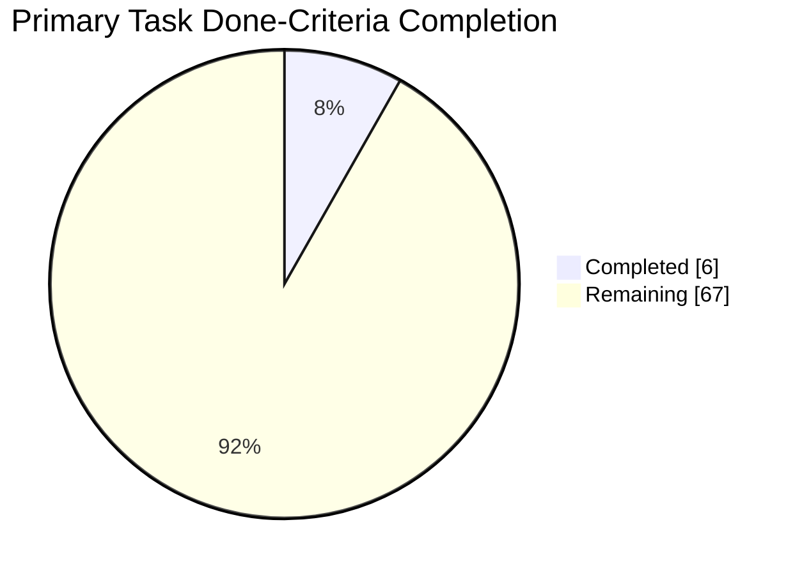
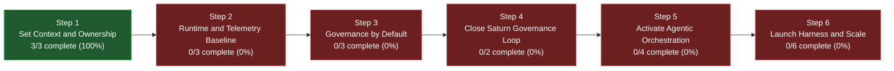

# Plan Completeness Dashboard

## Purpose

Provide a single visual status surface for implementation-plan completion.

## Snapshot

- Date: 2026-04-29
- Scope: primary execution tasks (`CTX-*`, `INF-*`, `HAR-*`, `AGT-*`, `GOV-*` with task headers)
- Completion rule: task is `complete` only when all `Done Criteria` checkboxes are checked.

## Overall Completion

- Completed done-criteria items: 6
- Remaining done-criteria items: 67
- Overall completion: 8%

## Step Progress

Step details:

| Step   | Items complete | Total items | Completion |
| ------ | -------------- | ----------- | ---------- |
| Step 1 | 3              | 3           | 100%       |
| Step 2 | 0              | 3           | 0%         |
| Step 3 | 0              | 3           | 0%         |
| Step 4 | 0              | 2           | 0%         |
| Step 5 | 0              | 4           | 0%         |
| Step 6 | 0              | 6           | 0%         |

Notes:

- Step 1 owner-role assignment artifact: [context/CTX-03-owner-role-assignment-cycle-001.md](context/CTX-03-owner-role-assignment-cycle-001.md).

## Stream Progress

| Stream     | Completed criteria | Total criteria | Completion |
| ---------- | ------------------ | -------------- | ---------- |
| Context    | 6                  | 9              | 66%        |
| Infra      | 0                  | 12             | 0%         |
| Harness    | 0                  | 15             | 0%         |
| Agentic    | 0                  | 22             | 0%         |
| Governance | 0                  | 15             | 0%         |

## Task Status Matrix

| Task                                                              | Status      | Done criteria |
| ----------------------------------------------------------------- | ----------- | ------------- |
| [CTX-01](context/CTX-01-context-objective-prioritization.md)      | complete    | 3/3           |
| [CTX-02](context/CTX-02-knowledge-mapping-tutorial.md)            | not-started | 0/3           |
| [CTX-03](context/CTX-03-initiative-vision-tracker.md)             | complete    | 3/3           |
| [INF-01](infra/INF-01-runtime-dispatch-gateway.md)                | not-started | 0/3           |
| [INF-02](infra/INF-02-agent-telemetry-saturn.md)                  | not-started | 0/3           |
| [INF-03](infra/INF-03-ci-governance-loop.md)                      | not-started | 0/3           |
| [INF-04](infra/INF-04-infra-security-baseline.md)                 | not-started | 0/3           |
| [HAR-01](harness/HAR-01-domain-graph-chain-explorer.md)           | not-started | 0/3           |
| [HAR-02](harness/HAR-02-role-workspace-views.md)                  | not-started | 0/3           |
| [HAR-03](harness/HAR-03-owner-task-board.md)                      | not-started | 0/3           |
| [HAR-04](harness/HAR-04-prototyping-selector-godel.md)            | not-started | 0/3           |
| [HAR-05](harness/HAR-05-org-metrics-dashboard.md)                 | not-started | 0/3           |
| [AGT-01](agentic/AGT-01-orchestrator-interface.md)                | not-started | 0/3           |
| [AGT-02](agentic/AGT-02-interviewer-greenfield.md)                | not-started | 0/3           |
| [AGT-03](agentic/AGT-03-interviewer-brownfield.md)                | not-started | 0/3           |
| [AGT-04](agentic/AGT-04-agent-skill-composition-matrix.md)        | not-started | 0/3           |
| [AGT-05](agentic/AGT-05-cross-project-skills-repository.md)       | not-started | 0/3           |
| [AGT-06](agentic/AGT-06-agent-skill-mutation-pipeline.md)         | not-started | 0/3           |
| [AGT-07](agentic/AGT-07-dynamic-goal-amendment.md)                | not-started | 0/4           |
| [GOV-01](governance/GOV-01-axioms-constitution-tags-execution.md) | not-started | 0/3           |
| [GOV-02](governance/GOV-02-governance-validation-scripts.md)      | not-started | 0/3           |
| [GOV-03](governance/GOV-03-blocking-gates-policy.md)              | not-started | 0/3           |
| [GOV-04](governance/GOV-04-adlc-closure-scorecard.md)             | not-started | 0/3           |
| [GOV-05](governance/GOV-05-victor-material-intake.md)             | not-started | 0/3           |

## Refresh Procedure

1. Recompute task-level `Done Criteria` counts for all primary task files.
2. Update overall, step, and stream aggregates.
3. Update this dashboard before phase transitions or completion reviews.
