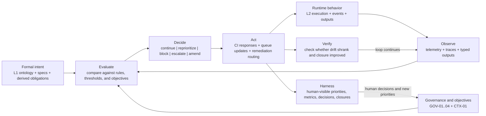

# Saturn L-System

## Canonical Definition

Saturn L-system is the continuous control loop of DomainSpec.

Canonical related operational reference:

- [../DRIFT-CONVERGENCE.md](../DRIFT-CONVERGENCE.md)

It observes runtime behavior, evaluates that behavior against formal domain intent, governance rules, and active objectives, decides what must happen next, executes that response through the operational stack, and verifies whether the system is converging or drifting.

Loop stages:

- Observe
- Evaluate
- Decide
- Act
- Verify
- Repeat

## Visual Model

This section documents the Saturn operational loop as a dedicated control-flow view.

Scope:

- formal intent as the reference baseline
- runtime behavior and telemetry as observed evidence
- governance rules and active objectives as evaluation inputs
- decision, action, and verification as the control sequence
- Harness as the downstream decision surface and feedback path

Relationship to broader architecture diagrams:

- [../docs/meta-model.mmd](../docs/meta-model.mmd) describes the business-side layer model.
- [../docs/meta-model-operational.mmd](../docs/meta-model-operational.mmd) describes the operational-side layer model.
- The diagram below isolates Saturn specifically, so the control loop can be read without traversing the full layer topology.

Element Definitions:

- `Intent` is the formal source of truth Saturn is trying to preserve in operation.
- `Runtime` and `Telemetry` are the live evidence Saturn observes.
- `Evaluation` is where live evidence meets governance rules and active objectives.
- `Decision` and `Action` are where Saturn becomes operational instead of descriptive.
- `Verification` determines whether the response actually reduced drift.
- `Harness` is downstream of Saturn, but also feeds new human decisions back into the loop.

## Purpose

DomainSpec can formalize domain meaning and derive tests, but without Saturn L-system those artifacts remain mostly static.

Saturn exists to keep the live system aligned with intended behavior after execution begins.

It turns:

- telemetry into governance evidence
- governance evidence into decisions
- decisions into prioritized action
- prioritized action into measurable closure

## Operational Significance

Saturn L-system is important because it is the bridge between specification and operational control.

If absent:

- drift can be detected but not consistently corrected
- telemetry remains informational instead of actionable
- governance becomes advisory instead of operational
- prioritization is weaker because it is not continuously informed by live system evidence
- Harness becomes a surface over disconnected signals rather than a trustworthy execution cockpit

When active:

- DomainSpec becomes a self-correcting execution system
- objective changes can influence execution order through real signals
- governance can block, escalate, or redirect based on measured conditions
- closure can be tracked as convergence instead of intuition

## Core Loop

### 1. Observe

- collect invocation telemetry
- measure latency, cost, errors, and governance-relevant signals
- capture typed outputs and execution traces

### 2. Evaluate

- compare observed behavior to formal contracts and thresholds
- assess governance status, risk posture, and objective alignment
- determine whether current behavior is converging or drifting

### 3. Decide

- continue
- reprioritize
- escalate
- block
- amend goals
- request remediation

### 4. Act

- execute CI governance responses
- update queues and closure artifacts
- route work to the right agentic or human workflow

### 5. Verify

- confirm whether the chosen action reduced drift
- update closure state and trend signals
- feed the result back into the next loop

## Required Building Blocks in This Plan

- `INF-02`: telemetry foundation for Saturn metrics and costs
- `GOV-01`: executable governance chain
- `GOV-02`: validation automation
- `GOV-03`: blocking and escalation policy
- `INF-03`: closed governance loop in CI
- `GOV-04`: closure scorecard and evidence tracking
- `CTX-01`: objective-driven prioritization for Saturn/ADLC convergence

These tasks make Saturn measurable, enforceable, and operational.

## Critical-Path Status

Saturn is not a secondary reporting feature. It is the mechanism that makes DomainSpec adaptive in real operation.

The implementation plan treats Saturn-related tasks as critical because:

- they unlock trustworthy governance enforcement
- they make telemetry decision-relevant
- they enable convergence tracking instead of passive status reporting
- they provide the signal/control substrate needed before Harness can be fully credible at scale

## Relationship to Harness

Harness is the human-facing cockpit.
Saturn is the control loop behind that cockpit.

Harness shows:

- graph state
- priorities
- metrics
- decisions
- closures

Saturn makes those surfaces trustworthy by continuously generating the signals and control outcomes they depend on.

## Relationship to ADLC Convergence

In this plan, Saturn is paired with ADLC convergence because both require explicit evidence, controlled closure, and measurable progress.

Saturn addresses:

- operational alignment in live execution

ADLC convergence addresses:

- evidence-backed closure of required implementation gaps

Together they create the current execution profile: `saturn-l-adlc-convergence`.

## One-Sentence Summary

Saturn L-system is the observe-evaluate-decide-act-verify loop that turns DomainSpec from a formal model into a continuously governed, self-correcting operational system.
