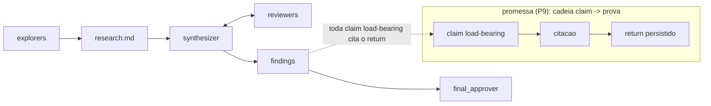
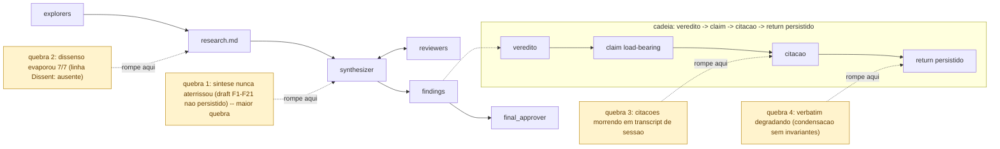
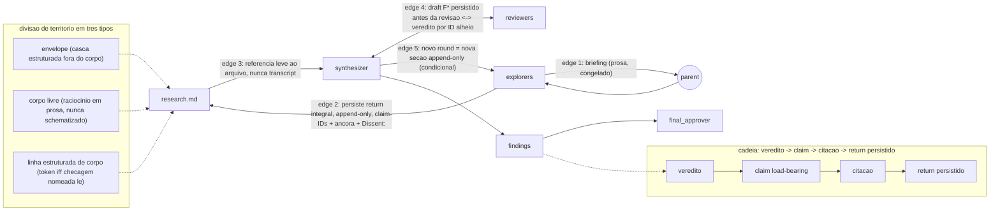
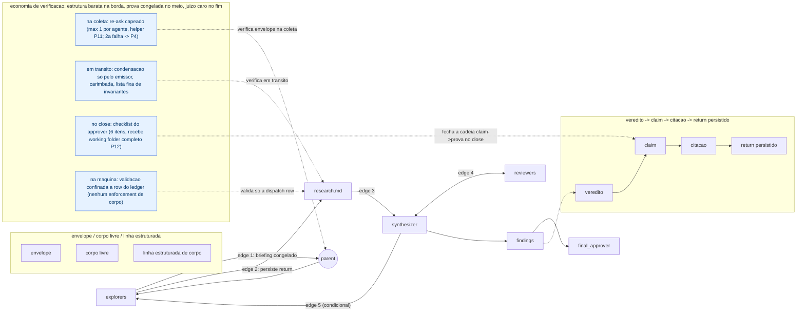
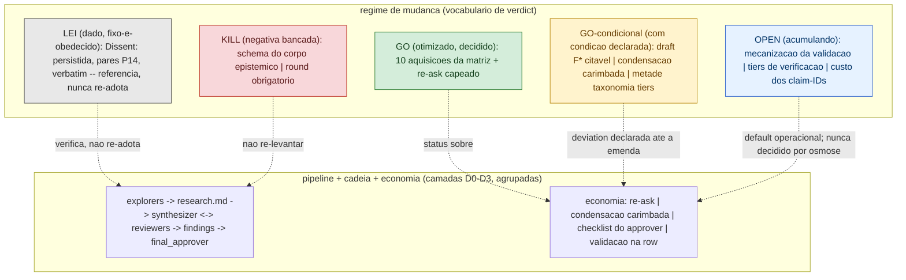

# Draft v1 — diagramas progressivos (Penrose) — dispatch 2026-06-12-systemview-progressive-diagrams

Persistido pelo parent antes da revisão; conteúdo do writer congelado (verbatim).

---

## D0

ÂNCORA: inserir logo APÓS o blockquote "Para quem chega agora" (antes de `## Objective`).

Legenda (D0): A altitude máxima — o pipeline de roles e a promessa de lei vigente de que toda claim do findings se ancora num return durável.

---

## D1

ÂNCORA: inserir ao final da Camada 1, APÓS o parágrafo de diagnóstico (antes de `### Alternative framings we considered (Camada 1)`).

Legenda (D1): O mesmo pipeline com as quatro quebras documentadas anotadas sobre os pontos exatos da cadeia onde ela rompia sem contrato.

---

## D2

ÂNCORA: inserir ao final da Camada 2, APÓS "O que esse shape compra, em uma linha por edge..." (antes de `### Alternative framings we considered (Camada 2)`).

Legenda (D2): O shape da solução — envelope sobre corpo livre mais a linha estruturada de corpo, percorrido pelos cinco edges que fecham cada quebra da Camada 1.

---

## D3

ÂNCORA: inserir ao final da Camada 3, APÓS "O desenho da economia, em uma frase..." (antes de `### Alternative framings we considered (Camada 3)`).

Legenda (D3): A economia de verificação sobreposta ao fluxo — quem checa o quê e quando.

---

## D4

ÂNCORA: inserir ao final da Camada 4, APÓS "O stake desta camada para um stakeholder..." (antes de `### Alternative framings we considered (Camada 4)`).

Legenda (D4): O regime de mudança como camadas de status sobre os elementos já desenhados (nenhum verdict de stance individual é desenhado; só os regimes nomeados).

---

Notas de conformidade do writer: monotonicidade preservada (D2→D4 agrupa em subgraph; salto gradual ~9 → +4 → +3 → +4 → +5); nenhum verdict desenhado; só termos do doc; sintaxe conservadora (IDs ASCII, labels com acento entre aspas, flowchart LR/TB).
