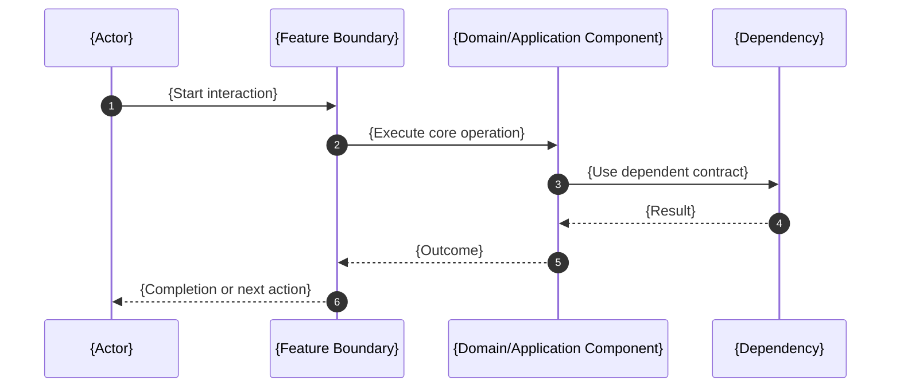

# {Feature Name} Architecture

This document is the feature-level architecture companion to [SPEC.md](SPEC.md). It explains the architecture implied by the current DomainSpec contracts and does not claim implementation completeness beyond those contracts.

## Architecture Intent

{what this architecture must make possible for the feature}

## Scope Boundary

Describe the owned behavior, explicit exclusions, and neighboring features or systems that remain outside this feature boundary.

## Source Contracts

| Contract ID | Source                   | Required | Notes                                          |
| ----------- | ------------------------ | -------- | ---------------------------------------------- |
| SC-001      | [SPEC.md](SPEC.md)       | yes      | Feature capability and concept source of truth |
| SC-002      | {aspect doc or decision} | yes / no | {notes}                                        |

## Design Goals and Non-Goals

| Type     | Item | Why |
| -------- | ---- | --- |
| Goal     |      |     |
| Goal     |      |     |
| Non-goal |      |     |
| Non-goal |      |     |

## View 1: Context View

Describe the external actors, neighboring systems, and ownership boundary.

| Actor or System | Relationship to Feature        | Contract Source |
| --------------- | ------------------------------ | --------------- |
| {actor/system}  | {producer/consumer/dependency} | {source}        |

## View 2: High-Level Structure View

Describe the major parts and their responsibilities. Link each part to the DomainSpec aspect that defines its behavior.

```mermaid
graph LR
    A[{Actor or Trigger}] --> B[{Feature Boundary}]
    B --> C[{Core Component}]
    C --> D[{Dependent Contract}]
```

| Component   | Primary Contracts   | Responsibility   |
| ----------- | ------------------- | ---------------- |
| {component} | {SPEC/aspect links} | {responsibility} |

## View 3: Low-Level Components View

Describe internal components, local collaboration rules, and the contracts each component owns or consumes.

| Component   | Owns                         | Consumes     | Collaboration Rule |
| ----------- | ---------------------------- | ------------ | ------------------ |
| {component} | {concept/rule/operation IDs} | {dependency} | {rule}             |

## View 4: Workflow Process View

Describe the main flows, state transitions, failure paths, and compensation behavior.



| Flow   | Happy Path | Failure or Compensation | Contract Source |
| ------ | ---------- | ----------------------- | --------------- |
| {flow} | {steps}    | {failure/compensation}  | {source}        |

## View 5: Decision Flow View

Describe policies, decision points, branching rules, and selected outcomes.

| Decision Point   | Options or Branches | Selection Rule | Outcome   |
| ---------------- | ------------------- | -------------- | --------- |
| {decision point} | {options}           | {rule/source}  | {outcome} |

## View 6: Dependency Interface View

Describe internal and external dependencies, interface contracts, and boundary rules.

| Dependency or Interface | Direction                     | Contract | Boundary Rule |
| ----------------------- | ----------------------------- | -------- | ------------- |
| {dependency/interface}  | inbound / outbound / internal | {source} | {rule}        |

## Constraints

| Constraint   | Source   | Impact   |
| ------------ | -------- | -------- |
| {constraint} | {source} | {impact} |

## Dependency And Interface Rules

| Rule ID | Rule   | Applies To               | Enforcement |
| ------- | ------ | ------------------------ | ----------- |
| R-001   | {rule} | {component or interface} | {check}     |

## Data and Evidence Artifacts

| Artifact   | Produced By | Used For | Contract Source |
| ---------- | ----------- | -------- | --------------- |
| {artifact} | {producer}  | {use}    | {source}        |

## Extension Points

List bounded variation points that are intentionally allowed by the current contracts. If none exist, say so explicitly.

| Extension Point   | Allowed Variation | Guardrail   |
| ----------------- | ----------------- | ----------- |
| {extension point} | {variation}       | {guardrail} |

## Trade-offs and Guardrails

| Trade-off   | Benefit   | Cost   | Guardrail   |
| ----------- | --------- | ------ | ----------- |
| {trade-off} | {benefit} | {cost} | {guardrail} |

## Decision Log

| Decision ID | Decision   | Options Considered | Reason   |
| ----------- | ---------- | ------------------ | -------- |
| D-001       | {decision} | {options}          | {reason} |

If no architecture decisions are open or newly selected, state that explicitly and link to the source decision artifact when one exists.

## Risks

| Risk ID | Risk   | Mitigation   | Owner   |
| ------- | ------ | ------------ | ------- |
| RK-001  | {risk} | {mitigation} | {owner} |

## Downstream Planning Notes

- Implementation-plan inputs: {needed inputs}
- Test implications: {checks or TEST-SPEC obligations}
- Observability implications: {metrics or signals}
- Documentation implications: {follow-on docs}

## Design Transport Notes

Describe how this architecture should be carried into follow-on DomainSpec artifacts, including stories, tests, observability, UI specs, or implementation tasks.

## Gate Result

- Status: pass / flag / block
- Reason: {gate result summary}
- Required follow-up: {none or follow-up action}
