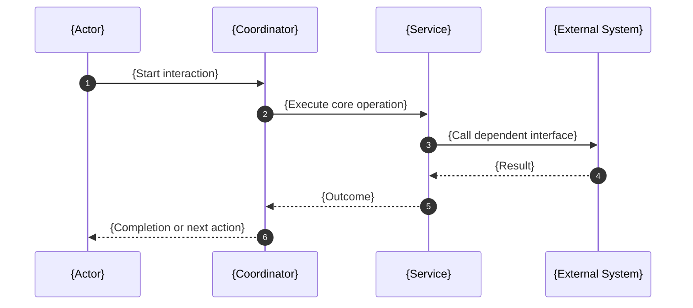

# {Feature Name} Architecture

This document is an architecture-level explanation of the {Feature Name} feature specification.

Scope note: this is a docs-first design document aligned to current feature contracts. It does not claim implementation completeness beyond what is defined in [SPEC.md](SPEC.md).

## Architecture Overview

<!--
1-3 short paragraphs:
- explain the feature's overall operating model,
- identify the governing control point or architectural authority,
- describe the balance between business outcomes, governance, and delivery constraints.
-->

## Design Goals and Non-Goals

| Type     | Item | Why |
| -------- | ---- | --- |
| Goal     |      |     |
| Goal     |      |     |
| Non-goal |      |     |
| Non-goal |      |     |

## Logical Architecture

<!--
Use this section to name the main architecture components, bounded responsibilities,
and the authoritative aspect docs that define their contracts.
-->

```mermaid
graph LR
    A[{Component A}] --> B[{Component B}]
    B --> C[{Component C}]
    C --> D[{Component D}]
```

| Component | Primary contracts | Responsibility |
| --------- | ----------------- | -------------- |
|           |                   |                |
|           |                   |                |

## End-to-End Flow Architecture

<!--
Summarize the main feature flow from trigger to completion. Prefer stage names that match
operations, workflows, interfaces, or policies defined in the feature docs.
-->



## State, Control, and Guardrail Model

<!--
Describe checkpoints, gates, retries, invariants, stop conditions, or lifecycle controls
that materially shape feature behavior. Delete this section if the feature has no control model.
-->

## Data and Evidence Artifacts

| Artifact | Produced by | Used for |
| -------- | ----------- | -------- |
|          |             |          |
|          |             |          |

## Extension Points

<!--
List bounded variation points that are intentionally allowed by the current contracts.
If none exist, say so explicitly.
-->

## Trade-offs and Guardrails

| Trade-off | Benefit | Cost |
| --------- | ------- | ---- |
|           |         |      |

Guardrails that must remain true:

-
-
