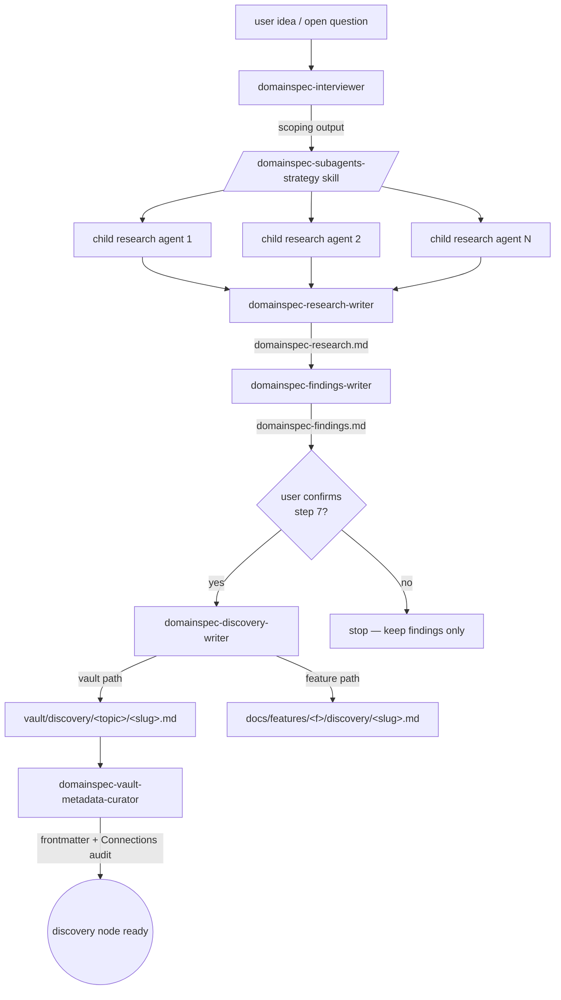
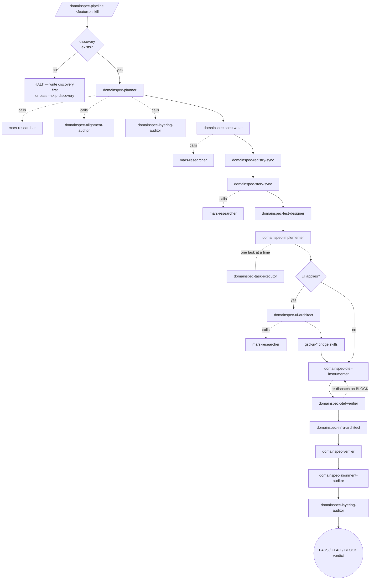
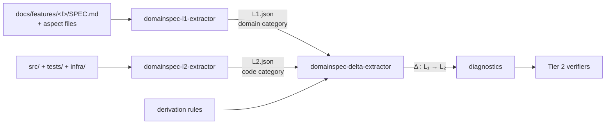
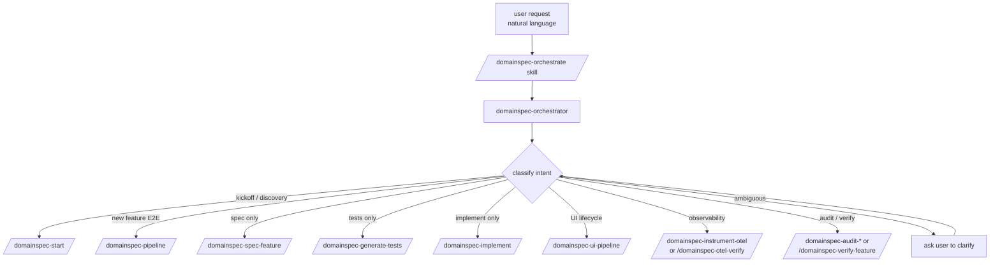

# Agents Overview

## Objective

This document is a **single-source mental model** for every `domainspec-*` and `mars-*` agent installed in this project. It answers three questions, in order:

1. *What is each agent for?* (one-line purpose)
2. *When is each agent invoked, and by whom?* (trigger + caller)
3. *How do the agents compose into pipelines?* (the lifecycle stories)

It is intentionally a **conceptual map**, not a how-to. Operational details — flags, prompts, output contracts — live in each agent's `.claude/agents/<name>.agent.md` file and the corresponding `.claude/skills/<name>/SKILL.md`. This document points at those files; it does not duplicate them.

## Context

The DomainSpec agent surface has grown organically. As of `2026-05-04` there are **23 `domainspec-*` agents** and **1 `mars-*` agent** (`mars-researcher`) installed under `.claude/agents/`. **Every agent is directly invocable** — by the user via the Task tool or natural language, by another agent as a sub-dispatch, or transitively by a skill that wraps the agent. Agents are not internal/private; "is there a skill for this?" and "can I invoke the agent directly?" are both valid questions, and the answer to the second is always yes.

What separates the agents in practice is not invocability but *role* and *tool surface*:

- **Routing / entrypoint role.** `domainspec-orchestrator` exists to classify natural-language requests and dispatch to the right specialist. Useful when the user doesn't want to memorise command names — but the user can always skip it.
- **Writers and auditors.** Agents that read, reason, and mutate files — planner, spec-writer, implementer, verifier, alignment-auditor, etc. They carry the heavy tool set (`Edit`, `Write`, `Bash`, `Task`).
- **Mechanical assemblers and research substrate.** Agents with deliberately restricted tools (`Read`, `Write`, `Bash`, sometimes `Edit`) — `research-writer`, `findings-writer`, `discovery-writer`, `l1-extractor`, `l2-extractor`, `delta-extractor`, and `mars-researcher`. The tool restriction is the *contract*: these agents cannot synthesise new claims into a file, only persist what their caller (parent agent or user) already decided. They are still directly invocable; the contract is enforced by tools, not by access control.

Three structural rules fall out of these roles and are load-bearing:

1. **Discovery before spec.** No `domainspec-pipeline` run proceeds past Step 0 without a discovery file under `vault/discovery/<topic>/<slug>.md` (knowledge scope) or `docs/features/<f>/discovery/<slug>.md` (application scope). The pipeline halts otherwise; `--skip-discovery <reason>` is the only override and is recorded in the SPEC frontmatter.
2. **Synthesis happens in the caller, persistence in the assembler.** The mechanical writers (`research-writer`, `findings-writer`, `discovery-writer`) are tool-restricted on purpose — they cannot reason new content into the file. This keeps the audit chain (research → findings → discovery) honest regardless of who invokes them (user or parent agent).
3. **MARS is a research substrate.** `mars-researcher` is the one and only `mars-*` agent, and its job is to research *technical* decisions (lib choice, adapter shape, framework idiom) without polluting the spec layer with implementation reasoning. It is *typically* dispatched as a sub-agent by four DomainSpec writers (`domainspec-planner`, `domainspec-spec-writer`, `domainspec-story-sync`, `domainspec-ui-architect`) — but the user can invoke it directly when they want a tech-decision write-up outside any of those flows.

The rest of this document explains the pipelines that compose these agents.

## Pipelines

There are four pipelines worth knowing. They are independent — discovery does not block categorical verification; readiness audits can run on any feature regardless of which pipeline produced it.

### Pipeline 1 — Discovery (knowledge stage)

Goal: turn an idea or open question into a vault-grade discovery node, citing research and findings, with a Connections block.

Key constraints on this pipeline:

- Inside the `/domainspec-subagents-strategy` skill, `domainspec-discovery-writer` is dispatched **only** after explicit user confirmation in step 7 — never auto-promoted from findings. (The agent itself is still directly invocable; the gate lives in the skill, not the agent.)
- The fork after the gate (vault vs. feature folder) is the **knowledge vs. application** classification. The interviewer and the user decide this together; the writer mechanically persists it.
- `domainspec-vault-metadata-curator` runs in three modes (bootstrap, audit, repair). It is the only agent that touches `## Connections` blocks programmatically.

### Pipeline 2 — Feature pipeline (application stage)

Goal: turn an approved discovery into specified, tested, implemented, observable, and verified code.

Notes worth internalising:

- The dotted lines (`-. calls .->`) are sub-agent dispatches, not sequential steps. `mars-researcher` is invoked **inside** the writer that needs it; it does not appear as a pipeline stage on its own.
- `domainspec-task-executor` is an alternative entry into implementation — it runs **one** task at a time with interactive decision packs and gates, instead of letting `domainspec-implementer` rip through the full plan. Use it when the task carries a non-trivial trade-off you want to surface.
- The `otel-verifier → otel-instrumenter` re-dispatch loop is bounded (max 3 iterations in the pipeline skill) and produces `OBSERVABILITY-REPORT.md` change requests as the contract between the two agents.
- The audit pair at the end (`alignment-auditor`, `layering-auditor`) runs again post-implementation. The same auditors are also called by the planner up-front — they are **idempotent diagnostic agents**, safe to invoke at any point.

### Pipeline 3 — Categorical verification (formal layer)

Goal: produce a machine-checkable proof that the implementation realises the documented domain — by extracting both as categories and reconstructing the compilation functor between them.

This pipeline is independent of the feature pipeline. It can run on any feature whose specs and code are stable enough to extract. The three extractor agents are deliberately Read+Write only — no reasoning, no editing — because the JSON they produce is the audit artefact, and an auditor that mutates its own evidence is not an auditor.

### Pipeline 4 — Routing and governance (always available)

Goal: classify a user's natural-language request and dispatch it to the right pipeline above, without requiring the user to memorise command names.

The orchestrator's contract is narrow: it routes to one specialist skill, and it never bypasses planner-preflight for mutation-capable routes. A direct `/domainspec-spec-feature foo` invocation is treated as advanced/internal and runs unchanged.

## Three takeaways

1. **Don't memorise the agent list — memorise the pipelines.** The agents are leaves; the pipelines are the trunk. If you know the four pipelines above, the right agent is implied by where you are in the flow.
2. **Mechanical writers are non-negotiable.** When a future agent needs to *both* reason and persist, split it into two — keep the audit chain honest. The contract is enforced by tool restriction, not by hiding the agent.
3. **Skills wrap pipelines; agents do work.** A skill (`/domainspec-pipeline`, `/domainspec-subagents-strategy`) bakes in ordering, gates, and propagation rules. An agent does one thing well. Both are first-class — invoke the skill when you want the lifecycle, invoke the agent when you want the unit of work.

## Connections

| Document | Type | Description |
|----------|------|-------------|
| `.claude/agents/domainspec-orchestrator.agent.md` | `cites` | Routing pipeline (Pipeline 4) is the orchestrator's externalised contract. |
| `.claude/agents/domainspec-planner.agent.md` | `cites` | Planner is the entry writer for the feature pipeline (Pipeline 2). |
| `.claude/agents/mars-researcher.agent.md` | `cites` | MARS sub-agent invoked from four DomainSpec writers; load-bearing for the "research substrate" claim. |
| `.claude/agents/domainspec-discovery-writer.agent.md` | `cites` | Step-7 confirmation gate in Pipeline 1 is fixed by this agent's frontmatter. |
| `.claude/agents/domainspec-l1-extractor.agent.md` | `cites` | Tier-1 entry into the categorical verification pipeline (Pipeline 3). |
| `.claude/agents/domainspec-l2-extractor.agent.md` | `cites` | Tier-1 entry into the categorical verification pipeline (Pipeline 3). |
| `.claude/agents/domainspec-delta-extractor.agent.md` | `cites` | Tier-2 functor reconstruction in Pipeline 3. |
| `.claude/skills/domainspec-pipeline/SKILL.md` | `cites` | Pipeline 2 is the externalised lifecycle of this skill. |
| `.claude/skills/domainspec-orchestrate/SKILL.md` | `cites` | Pipeline 4 is the externalised contract of this skill. |
| `vault/conceptual/epistemic-principles.md` | `cites` | "Synthesis in parent, persistence in assembler" applies Occam + epistemic-honesty principles to the agent layering. |
