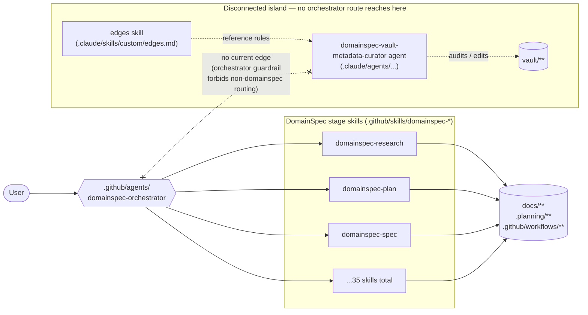
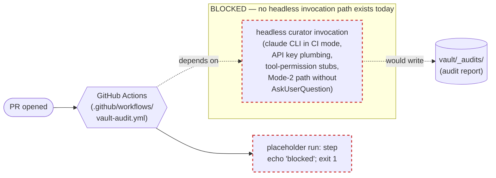
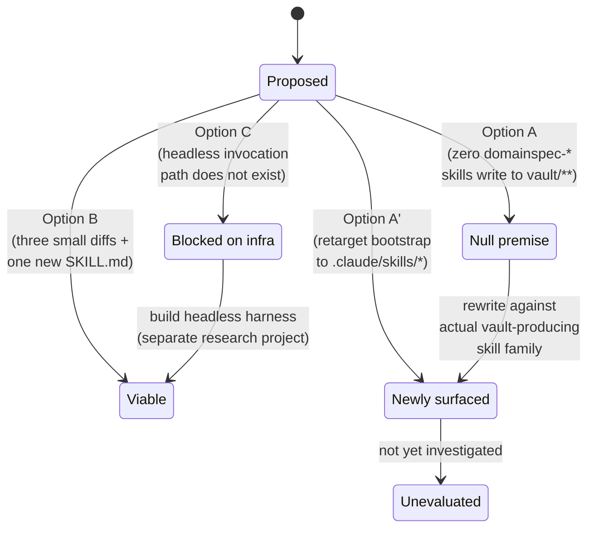

# Discovery — Wiring the domainspec-vault-metadata-curator and edges skill into the DomainSpec pipeline

> Three wiring options were investigated against the actual codebase: A) bootstrap-on-write inline insertion into `domainspec-*` stage skills, B) promote the curator into a `domainspec-vault-curate` skill the orchestrator can route to, and C) PR-gate audit via `.github/workflows/`. Only Option B survived contact with evidence intact. Option A as framed was a null set. Option C's headline cost (a YAML file) hides a research project (a headless Claude Code harness that does not exist). This discovery records the explored design space — including a derived Option A' (bootstrap retargeted to the actual vault-producing skills under `.claude/skills/`) — so the wiring decision can be taken later by the user with the evidence in front of them. **No wiring decision is committed in this document.**

---

## Objective

Map the wiring design space for the `domainspec-vault-metadata-curator` agent (`.claude/agents/domainspec-vault-metadata-curator.agent.md`) and the `edges` skill (`.claude/skills/custom/edges.md`) into the DomainSpec pipeline. Preserve every option's actual cost and viability against the current codebase, distinguish framing failures from infrastructure gaps, and surface the open questions that block any single option from becoming an implementation-plan. The discovery stops at the design-space map; the choice of wiring belongs to the user (or to a follow-up dispatch).

---

## Index

1. [Context](#1-context)
2. [Visual Flows (schematic)](#2-visual-flows-schematic)
3. [Alternatives Considered](#3-alternatives-considered)
4. [Tensions and Cross-Cutting Observations](#4-tensions-and-cross-cutting-observations)
5. [Open Questions](#5-open-questions)
6. [Notes on Forward-Only Edges (resolved)](#6-notes-on-forward-only-edges-resolved)
7. [Connections](#7-connections)
8. [Source Dispatch](#8-source-dispatch)

---

## 1. Context

The DomainSpec orchestrator (`.github/agents/domainspec-orchestrator.agent.md`) is a natural-language router with an explicit guardrail forbidding routing to anything outside the `domainspec-*` skill family. The `domainspec-vault-metadata-curator` agent and the `edges` skill were authored to govern vault-document hygiene (frontmatter completeness, edge bidirectionality, deprecated-edge avoidance, dangling-target detection) but currently have **no orchestrator-visible entry point**. They operate as disconnected islands relative to the pipeline — invocable by the user directly but never reached through normal routing.

In a working session on 2026-05-02 three wiring options surfaced from the user and were sent into a parallel evidence-gathering dispatch (`curator-pipeline-wiring-2026-05-02`, three children, all sonnet-4.6, see `.planning/research/curator-pipeline-wiring/research/domainspec-subagents-findings.md`):

- **Option A** — bootstrap-on-write: each vault-producing DomainSpec stage skill calls the curator inline as part of its own write step.
- **Option B** — promote the curator into a new `domainspec-vault-curate` skill so the orchestrator can route to it through its existing intent-classification mechanism.
- **Option C** — PR-gate audit: a GitHub Actions workflow runs the curator on every PR and posts the audit report into `vault/_audits/`.

Each option was investigated by a dedicated child agent. The findings are graded `(judgment)` on coverage, independence, and fidelity components per R22 of `domainspec-subagents-strategy-constitution.md`; only the cost-discipline component is mechanical (and was poor — 11× over the declared budget, uniform across children, suggesting the budget was set unrealistically rather than that any child misbehaved).

This discovery synthesizes those findings into the design-space map. It does **not** commit to a wiring choice.

---

## 2. Visual Flows (schematic)

> All four diagrams below are **schematic** — they illustrate component relationships drawn from the source files cited in §7, not runtime telemetry or an instrumented trace. They are reading aids, not measurements.

### Diagram 1 — Current state

**Caption:** The orchestrator routes user intent only to `domainspec-*` skills, and every one of those 35 skills writes to `docs/`, `.planning/`, or `.github/workflows/` — never to `vault/**` (verified by Child A's grep across all SKILL.md files; see findings F1). The curator and `edges` skill exist on the right as a disconnected island: they read and write `vault/**`, but no orchestrator-routed path reaches them. The "no current edge" annotation between the orchestrator and the curator is the wiring gap this discovery is about.

### Diagram 2 — Option B wiring

```mermaid
flowchart LR
    User([User])
    Orchestrator{{".github/agents/<br/>domainspec-orchestrator"}}

    subgraph ExistingPath ["Existing path — unchanged"]
        DS1["domainspec-research"]
        DS2["domainspec-plan"]
        DSn["...other domainspec-* skills"]
    end

    subgraph NewPath ["New path — Option B"]
        VaultCurate["domainspec-vault-curate<br/>(new thin SKILL.md,<br/>.github/skills/...)"]
        Curator["domainspec-vault-metadata-curator agent<br/>(.claude/agents/...)"]
    end

    Docs[("docs/**<br/>.planning/**")]
    Vault[("vault/**")]

    User --> Orchestrator
    Orchestrator --> DS1
    Orchestrator --> DS2
    Orchestrator --> DSn
    DS1 --> Docs
    DS2 --> Docs
    DSn --> Docs

    Orchestrator ==>|"NEW EDGE<br/>vault-hygiene intent class"| VaultCurate
    VaultCurate ==> Curator
    Curator ==> Vault

    classDef newEdge stroke:#0a8,stroke-width:3px
    class VaultCurate,Curator newEdge
```

**Caption:** Option B preserves every existing `domainspec-*` route (left subgraph, unchanged) and adds one new route (right subgraph, highlighted). The new SKILL.md follows the `agent:`-delegation pattern already established by `domainspec-audit-alignment` → `domainspec-alignment-auditor` (per Child B's diff inspection). The orchestrator change is three small diffs plus a one-line guardrail clarification permitting *additions* to the namespace; no rename or removal of existing skills (per findings F2). The conceptual stretch — folding "vault knowledge-graph maintenance" under "DomainSpec intent" — is the load-bearing judgment call this option asks the user to take, not the diff size (per tension T2).

### Diagram 3 — Option C wiring

**Caption:** Option C looks like a 15-line YAML change but actually depends on infrastructure that does not exist in this repo (per findings F3 and tension T3): no `.github/workflows/` directory at all, no pre-commit framework, no husky/lefthook, no headless `claude` CLI invocations anywhere in scripts or workflows. The dashed boxes mark the blocking dependencies; until a headless invocation harness is built (or until audit logic is ported to plain Python/Node, dropping the LLM-as-curator design), the workflow's `run:` step is a stub that exits 1. The cost is dominated entirely by the headless harness, not the YAML.

### Diagram 4 — Option lifecycle states

**Caption:** The four options' current states. Option A is a null premise as originally framed; salvaging it requires retargeting to `.claude/skills/*` (the actual vault-producing surface), which produces the new, unevaluated Option A'. Option B is the only one that arrived viable. Option C is blocked on infrastructure that would itself need a separate dispatch to scope. The diagram preserves the "two of three options were not what they appeared to be" cross-cutting observation from the source findings.

---

## 3. Alternatives Considered

### A-1 — Option A (bootstrap-on-write, inline in `domainspec-*` stage skills)

**Status:** Null premise as originally framed.

**Description:** Each vault-producing DomainSpec stage skill (`.github/skills/domainspec-*/SKILL.md`) calls the curator inline as part of its own write step, so the curator runs synchronously at the moment a vault document is created or modified.

**Why it failed:** Child A's mechanical scan of all 35 `domainspec-*` SKILL.md files found that **zero** of them write to `vault/**`. Every captured output path lives under `docs/`, `.github/workflows/`, or `.planning/`. Verified by `grep -oE "(docs|vault|\.planning|\.github)/..."` across the skill family — the string `vault` does not appear in any `.github/skills/domainspec-*/` file. The proposal "add an inline curator call to each vault-producing stage" therefore has no insertion site in the current codebase.

**Evidence:** `domainspec-subagents-findings.md` F1 → `domainspec-subagents-research.md` §Agent 1.

### A-2 — Option A' (bootstrap retargeted to `.claude/skills/*`)

**Status:** Newly surfaced by the dispatch; **not yet evaluated.**

**Description:** Apply Option A's spirit — synchronous curator invocation at the moment of write — but retarget it to the *actual* vault-producing skill family. The vault is populated by `.claude/skills/domainspec-subagents-strategy/*`, `.claude/skills/close-session/*`, and similar — not by `.github/skills/domainspec-*/`. A bootstrap-on-write inserted into those skills would be a real proposal with real insertion sites.

**What is unknown:** The cost of editing `.claude/skills/*` SKILL.md files (some of which are user-authored discipline documents, not orchestrator-routed skills); whether synchronous invocation interleaves cleanly with the writing skill's own tool calls; whether the curator's Mode-1 `AskUserQuestion` interactivity is acceptable inline (or whether a non-interactive mode is needed). This option requires its own evidence dispatch before it can be compared against B and C on equal footing.

### A-3 — Option B (promote curator into a `domainspec-vault-curate` skill)

**Status:** Viable. Mechanically cheap; conceptually stretched.

**Description:** Add a new thin SKILL.md at `.github/skills/domainspec-vault-curate/SKILL.md` that follows the established `agent:`-delegation pattern (identical shape to `domainspec-audit-alignment` → `domainspec-alignment-auditor`). Add three small diffs to `domainspec-orchestrator.agent.md` (lines 75–82, 64–70, 85–89) introducing a "vault hygiene" intent class and clarifying the guardrail to permit *additions* to the namespace. The new skill takes a `<mode>` argument matching the curator's three modes.

**Why mechanically cheap:** No rename, no removal, no reinterpretation of any existing `domainspec-*` command — the `<compatibility-guardrails>` clause holds verbatim. The naming `domainspec-vault-curate` preserves the `domainspec-vault-*` namespace (parallels `domainspec-vault-audit` if that ever lands), matches the agent's own framing, and lets the three curator modes map naturally to the `<mode>` argument.

**Why conceptually stretched:** The orchestrator's `<routing-policy>` currently treats "DomainSpec intent" as implicitly "project/feature workflow." Folding "vault knowledge-graph maintenance" under the same label is a taxonomy stretch that the diff justification names explicitly ("broadens the 'DomainSpec intent' definition so the vault skill stops being conceptually out of scope"). The user's load-bearing judgment is whether the orchestrator's intent taxonomy *should* include vault-graph maintenance — not whether the diff fits.

**Evidence:** `domainspec-subagents-findings.md` F2, T2 → `domainspec-subagents-research.md` §Agent 2.

### A-4 — Option C (PR-gate audit via `.github/workflows/`)

**Status:** Blocked on infrastructure that does not exist.

**Description:** A GitHub Actions workflow runs the curator on every PR, posts the audit report into `vault/_audits/`, and either blocks the PR (BLOCK exit code), warns (WARN), or escalates to a human reviewer (NEEDS_HUMAN).

**Why blocked:** The dispatch found no `.github/workflows/` directory in the repo at all, no pre-commit framework, no husky or lefthook, and **no headless invocation path for Claude Code subagents anywhere in the codebase**. The only existing hook is a single bash `prettier --write` script at `.githooks/pre-commit`. The 15 lines of YAML are trivial; the load-bearing cost is standing up a headless harness — CLI flags, API key plumbing, tool-permission stubs, deterministic exit codes for BLOCK/WARN/NEEDS_HUMAN, and a Mode-2 path that does not call `AskUserQuestion` (the curator's Mode 1 calls it explicitly, which is interactive-only and incompatible with CI).

**Cost:** Medium, dominated entirely by the headless harness. Drops to low only if a non-Claude reimplementation of audit logic in plain Python or Node is acceptable — which would change the proposal substantively (the auditor would no longer be the LLM-defined curator, it would be a separate static linter that reuses the curator's rules).

**Evidence:** `domainspec-subagents-findings.md` F3, T3 → `domainspec-subagents-research.md` §Agent 3 Part 1.

---

## 4. Tensions and Cross-Cutting Observations

### T-1 — The parent's three-options framing was not a balanced trilemma

Two of the three originally-framed options were not what they appeared to be. Option A is a null set against the codebase. Option C's headline cost is wrong by an order of magnitude. Only Option B's framing survived contact with evidence intact. This is a strong reframing signal: the trilemma as stated was *one viable option, one rewrite-disguised-as-an-edit, and one infrastructure-research-project disguised as a YAML file*. Future dispatches at this complexity should baseline at ~30–40k tokens per child rather than the ~3k that was budgeted (the actual ~110k spend was 11× the budget; uniform across children, indicating budget mis-set, not child misbehavior).

### T-2 — OQ-1 / OQ-B resolved: vault → `.claude/skills/*` edges are formally legal

The dispatch found exactly **three** vault → `.claude/skills/*` edges that exist today, all carrying user-authored edge types (`operationalized-by`, `cites`, `proposes-edit`). **The user has resolved OQ-1 / OQ-B (2026-05-03):** edges into `.claude/skills/**` and `.claude/agents/**` are legal-by-design forward-only — these are not bugs to skip, they are the canonical pattern. The curator audit must accept (PASS) these edges, not flag them. The audit report wording is now "accepted: N forward-only edges into `.claude/skills/**` / `.claude/agents/**` (legal-by-design carve-out)" rather than any "skipped" framing.

### T-3 — Wiring decision is now decoupled from a resolved OQ-1

Option B can ship with `vault/**` scoping for vault-internal bidirectionality checks while accepting forward-only edges into `.claude/skills/**` and `.claude/agents/**` as PASS under the formal carve-out. OQ-1 / OQ-B are resolved; no separate dispatch is required for them. The wiring decision now stands on its own merits.

### T-4 — Cross-repo / out-of-tree edges (OQ-C) remain a *separate* gap

The dispatch found eight additional edges pointing either to sibling projects via `file:///Users/victorboscaro/house_project/...`, to repo-escaping relative paths (`../../../CLAUDE.md`, `../../business-philosopher/...`), or to spec/thesis docs that do not exist in the repo. Conflating these with OQ-1 will produce a confused fix — they are an ontology gap (cross-repo / dangling-target edges), not a curator-scope question.

---

## 5. Open Questions

### OQ-A — Should Option A be redirected to `.claude/skills/` and re-evaluated?

Option A as originally framed is null. Option A' (bootstrap inserted into the actual vault-producing skill family — `.claude/skills/domainspec-subagents-strategy/*`, `.claude/skills/close-session/*`) is a real proposal with real insertion sites but has not been investigated. Should a follow-up dispatch evaluate Option A' against B on equal footing, or is the user satisfied that the orchestrator-routed approach (Option B) is preferable to inline bootstrap regardless of the skill family targeted?

### OQ-B — Cross-boundary edges (vault → .claude/skills/*, vault → .claude/agents/*) — ✅ RESOLVED (2026-05-03)

**Resolution:** Forward-only edges from vault docs into `.claude/skills/**` and `.claude/agents/**` are **legal-by-design**. The target files are operational artifacts, not vault graph nodes — they carry no `## Connections` block and no inverse is required. The curator audit must PASS these (not skip, not flag). The three existing vault edges (`operationalized-by`, `cites`, `proposes-edit`) are conformant under the carve-out. See:
- `.claude/skills/custom/edges.md` — "Exception" section.
- `vault/ontology-conventions.md` Section 8 — "Carve-out: edges into skill and agent files".
- `vault/discovery/documents-metadata-enforcement/documents-metadata-enforcement.md` §7 OQ-1 (RESOLVED) — the same decision recorded from the enforcement angle.

OQ-B is closed by the same user decision that closed OQ-1. The `.planning/**`, `.github/**`, and sibling-repo questions remain distinct — see OQ-C.

### OQ-C — Cross-repo and outside-repo edges: ontology gap or stale paths?

Eight edges point outside the repo (`file:///Users/victorboscaro/house_project/...`) or to documents that do not exist (`specs/ontology/.../robot-talks-discovery.md`, `docs/business-philosopher/.../tese-orquestracao-por-pulso.md`). Are these all stale paths to be cleaned up (a one-off migration), or does the catalog need a `cross-repo` edge type for the legitimate sibling-project references? Distinct from OQ-B; collapsing them produces a confused fix.

### OQ-D — When should the `domainspec-subagents-strategy` skill and `domainspec-vault-metadata-curator` agent be RECOMMENDED to the user, vs. invoked only on explicit request?

The user has flagged this for later, possibly via the interviewer agent. Recommendation logic is upstream of any wiring decision — even Option B (orchestrator-routed) does not specify *when* the orchestrator should suggest the vault-curate route as opposed to waiting to be asked. This question is parked, not closed.

#### Initial recommendation (2026-05-03) — discipline, not a decision

Captured in this session as a starting point for future review. Authored conversationally by a single agent (no fan-out dispatch); the trigger sets below are heuristics, not measurements. They should be revised after observing how often each trigger actually fires versus how often the user accepts or declines the recommendation. The discovery's charter ("no wiring decision is committed in this document") still holds — this is *recommendation logic*, separable from the wiring decision.

**Stance** (consistent with `project_curator_invocation_triggers.md` in user memory): **recommend, never auto-invoke**. The user always confirms before either skill or agent runs.

**Hosting surface.** Two complementary recommendation surfaces, with different user-facing contexts:

- The `domainspec-interviewer` agent — natural home for *ambiguous* greenfield/brownfield discovery requests where multiple paths are plausible.
- The `domainspec-orchestrator` routing table — natural home for *direct* user requests that pattern-match to a specialist command but where a recommendation precedes routing.

Both surfaces apply the same trigger sets below. Neither auto-invokes; both surface a single conversational line and wait.

**For `domainspec-subagents-strategy` — recommend when ANY of:**

- The user's request implies *exploring* options (verbs like "compare", "evaluate", "research", "investigate before deciding", "explore design space").
- During conversation, ≥2 viable approaches surface and the user has not committed to one.
- The user is about to make a decision that closes off alternatives (architecture, taxonomy, schema, edge catalog).

**Do NOT recommend for**: factual lookups; single-path execution; mechanical edits; scope small enough that fan-out cost > value (rule of thumb: investigation budget under ~30 min).

**For `domainspec-vault-metadata-curator` — three different triggers per mode:**

- **bootstrap**: recommend immediately after any writer agent (`domainspec-{discovery,findings,research}-writer`) creates a new vault file whose initial connections block was not validated against the canonical catalog. Also when the user manually authors a vault file and asks for help with frontmatter.
- **audit**: recommend at session start if `git status` shows unstaged vault changes, or at session end if any `vault/**` file was touched. Also when the user says "check the vault", "audit metadata", or asks about edge correctness.
- **repair**: never auto-recommend — repair is downstream of `audit` having produced findings. The user explicitly opts in after reading the audit report.

**Caveats and known limits.**

- The trigger set is unverified. There is no measurement of false-positive or false-negative rates yet; treating these as "rules" would be a category error per the user's epistemic-honesty stance.
- This recommendation logic is itself a design space — it could legitimately be the subject of a follow-up `domainspec-subagents-strategy` dispatch (a recursive use of the very skill being recommended). That dispatch is *not* committed here.
- Wiring decision (Options A'/B/C) and recommendation logic remain separable per T-3. Choosing recommendation triggers does not constrain or imply a wiring choice; it only governs *when* whichever wiring path lands gets surfaced to the user.
- The bootstrap trigger overlaps with the writer agents' own frontmatter/connections logic (the writers already emit an initial block). This raises a related open question — should writers *delegate* to the curator instead of duplicating the schema knowledge? — that is not resolved here and may warrant its own dispatch.

---

## 6. Notes on Forward-Only Edges (resolved)

OQ-B and the parallel OQ-1 are now **RESOLVED** (2026-05-03 user decision). Forward-only edges from vault documents into `.claude/skills/**` and `.claude/agents/**` are **legal-by-design** — these targets are operational artifacts, not vault graph nodes, and they carry no `## Connections` block. No inverse is written or expected; the audit script must PASS these forward-only edges.

The following targets in §7 are formally exempt from bidirectionality under this carve-out:

- `.claude/agents/domainspec-vault-metadata-curator.agent.md` — agent file under the carve-out.
- `.claude/skills/custom/edges.md` — skill file under the carve-out.

The following targets are **not** under the skills/agents carve-out and remain a separate question (OQ-C):

- `.github/agents/domainspec-orchestrator.agent.md` — `.github/**` is outside the formal carve-out scope; treat as forward-only pending OQ-C resolution.
- `.planning/research/curator-pipeline-wiring/research/domainspec-subagents-findings.md` and `domainspec-subagents-research.md` — `.planning/**` working-folder artifacts (R15 of `domainspec-subagents-strategy-constitution.md`); forward-only pending OQ-C resolution. These are dispatch-time scratch records rather than long-lived vault nodes, so the asymmetry is less load-bearing.

---

## 7. Connections

| Document | Type | Description |
|----------|------|-------------|
| [`.planning/research/curator-pipeline-wiring/research/domainspec-subagents-findings.md`](../../../.planning/research/curator-pipeline-wiring/research/domainspec-subagents-findings.md) | `derives-from` | The synthesis findings from the `curator-pipeline-wiring-2026-05-02` dispatch; this discovery is a vault-layer promotion of that findings document. **Forward-only pending OQ-C (`.planning/**` outside the skills/agents carve-out).** |
| [`.planning/research/curator-pipeline-wiring/research/domainspec-subagents-research.md`](../../../.planning/research/curator-pipeline-wiring/research/domainspec-subagents-research.md) | `cites` | The raw evidence (three child agents' reports) the findings synthesize; cited transitively for grep results, diff lines, and CI-infra inventory. **Forward-only pending OQ-C (`.planning/**` outside the skills/agents carve-out).** |
| [`vault/discovery/documents-metadata-enforcement/documents-metadata-enforcement.md`](../documents-metadata-enforcement/documents-metadata-enforcement.md) | `cites` | Sibling discovery on the rule-vs-discipline gap for vault metadata; OQ-1 of that discovery and OQ-B of this discovery named the same cross-boundary-edge surface from different angles — both are now RESOLVED by the same user decision (skills/agents carve-out). Inverse `cited-by` to be written on the target document. |
| [`.github/agents/domainspec-orchestrator.agent.md`](../../../.github/agents/domainspec-orchestrator.agent.md) | `cites` | The orchestrator file whose `<compatibility-guardrails>` and `<routing-policy>` clauses are the gating constraint for Option B; the three small diffs identified by Child B target lines 75–82, 64–70, and 85–89 of this file. **Forward-only pending OQ-C (`.github/**` outside the skills/agents carve-out).** |
| [`.claude/agents/domainspec-vault-metadata-curator.agent.md`](../../../.claude/agents/domainspec-vault-metadata-curator.agent.md) | `cites` | The curator agent whose wiring is the subject of this discovery. **Forward-only by design** under the OQ-1 / OQ-B resolution (skills/agents carve-out); no inverse on the agent file. |
| [`.claude/skills/custom/edges.md`](../../../.claude/skills/custom/edges.md) | `cites` | The skill that operationalizes the bidirectionality and catalog rules the curator enforces. **Forward-only by design** under the OQ-1 / OQ-B resolution (skills/agents carve-out); no inverse on the skill file. |
| [`vault/sessions/2026-05-03-0326-claude-harness-curator-and-interviewer-wiring.md`](../../sessions/2026-05-03-0326-claude-harness-curator-and-interviewer-wiring.md) | `question-closed-by` | The 2026-05-03 harness-wiring session resolved OQ-D by adding the "Initial recommendation" block (trigger sets for `domainspec-subagents-strategy` and the curator's three modes); the charter "no wiring decision is committed" is preserved. |
| [`vault/sessions/2026-05-03-0334-cross-boundary-rule-and-edges-hygiene-dispatch.md`](../../sessions/2026-05-03-0334-cross-boundary-rule-and-edges-hygiene-dispatch.md) | `question-closed-by` | The 2026-05-03 cross-boundary-rule + edges-hygiene session resolved OQ-B by recording the user's "skills/agents are not vault graph nodes" ruling (forward-only edges to `.claude/skills/**` and `.claude/agents/**` are legal-by-design). |
| [`vault/sessions/2026-05-03-0334-cross-boundary-rule-and-edges-hygiene-dispatch.md`](../../sessions/2026-05-03-0334-cross-boundary-rule-and-edges-hygiene-dispatch.md) | `modified-by` | Same session updated this discovery's §6 / OQ-B prose to mark OQ-B RESOLVED with cross-references to the carve-out's canonical statement. |

> Inverse-side declarations on `vault/discovery/documents-metadata-enforcement/documents-metadata-enforcement.md` (a `cited-by` row pointing back to this discovery) are required by the vault-internal bidirectionality rule and should be added in the next sweep that touches that document. The two `.claude/...` targets are formally exempt under the resolved skills/agents carve-out — no inverses required. The two `.planning/...` and one `.github/...` targets remain forward-only pending OQ-C; see §6.

---

## 8. Source Dispatch

This discovery is the vault-layer promotion of the `curator-pipeline-wiring-2026-05-02` dispatch.

- **Dispatch findings (synthesis):** [`.planning/research/curator-pipeline-wiring/research/domainspec-subagents-findings.md`](../../../.planning/research/curator-pipeline-wiring/research/domainspec-subagents-findings.md)
- **Dispatch research (raw evidence, three child agents):** [`.planning/research/curator-pipeline-wiring/research/domainspec-subagents-research.md`](../../../.planning/research/curator-pipeline-wiring/research/domainspec-subagents-research.md)
- **Dispatch mode:** task-fan-out (R19 of `domainspec-subagents-strategy-constitution.md`); three children, all sonnet-4.6, parallel, no shared scratch.
- **User confirmation timestamp:** 2026-05-02 (this session); explicit opt-in to vault promotion at lifecycle step R6b.
- **Findings grade (R21):** Coverage 0.95 `(judgment)`, Independence 0.95 `(judgment)`, Fidelity 0.95 `(judgment)`, Cost discipline 0.10 (mechanical — 11× over declared budget). The aggregate is not a measurement (R22).

Provenance is preserved so any claim in §3, §4, or §5 can be traced back to a specific child's evidence in `domainspec-subagents-research.md`.
