# `/research-promote` — Corpus Promotion as the Boundary Contract

> The promote sub-skill is the *only* step in the `research` lifecycle that mutates the public corpus; everything before it is provenance under `research/<corpus>/<topic-slug>/`. Discipline at the promote boundary is what keeps `research-*/` referenceable instead of dump-shaped.

## Objective

Document `/research-promote` as the user-gated sub-skill that lifts a reviewed `research/<corpus>/<topic-slug>/` artifact to a SCHEMA-conformant findings file under `research-{corpus}/`. Its end-state: a deterministic-path file with frontmatter, `## Referências`, and `## Dispatch trail` footnote, written only after explicit user confirm. The discipline gate it enforces is *closure-mark integrity* — five specific anti-patterns blocked at the corpus boundary because no upstream step touches the corpus.

## 1. Business Context

### Why now

The `research` skill is a 10-step lifecycle that ends with promotion (`/research/SKILL.md:28` step 10). Steps 1–9 compose, validate, dispatch, collect, and review — all reading and writing within `research/<corpus>/<topic-slug>/`, which is gitignored per R15 of [`research-constitution.md`](../../../constitution/research-constitution.md). Layer 3 (the committed public finding) appears only at step 10. Without a typed promotion step, the only options are (a) leave findings stranded under `research/<corpus>/<topic-slug>/` forever, breaking R17's "committed public finding" contract, or (b) hand-copy them into `research-*/` with no schema check, breaking the corpus's typed-closure invariant. `/research-promote` is the boundary contract that makes step 10 mechanical and auditable.

### What's broken

- **SCHEMA conformance has no enforcement point in the run lifecycle until promote.** `research-validate` gates the spec (no artifacts yet); `research-review` (`/research-review/SKILL.md:18-26`) audits per-agent files and the writer's references but does not check corpus SCHEMA — it cannot, because per-agent files have their own schema (R12), not the corpus one. The first moment a file is shaped *as* a corpus artifact is at promote. Without a sub-skill, SCHEMA conformance is best-effort.
- **`closure_mark` values demand corpus-specific evidence that no upstream step verifies.** The five anti-patterns enumerated in `/research-promote/SKILL.md:29-36` — `closed-borrowing` without `external_program` + canonical reference, `closed-contribution` without a named external problem, `closed-proof` without Lean file pointer, conjecture without non-vacuity witness, non-SCHEMA frontmatter — map directly to the closure vocabulary in [`research-bridges/SCHEMA.md`](../../../../domainspec-theorem/research-bridges/SCHEMA.md) §"Vocabulário de closure". A misuse is harmless until publication; promote is where it becomes corruption.
- **The writer artifact lives inside the run folder, not the corpus.** Step 7 collects per-agent files under `research/<corpus>/<topic-slug>/agents/` (`/research/SKILL.md:25`); the LEDGER and writer prose live under `research/<corpus>/<topic-slug>/LEDGER.md` (constitution R16). None of these are `research-*/` files. Promote is what crosses the boundary, and the boundary is single-cross: no other step writes to the corpus.
- **Provenance back-link is load-bearing for future audit but has no creator other than promote.** A finding without a `## Dispatch trail` footnote pointing to `research/<corpus>/<topic-slug>/LEDGER.md` is unrepliable. Constitution R17's "citations resolve to Layer 2 (LEDGER) and through it to Layer 1" is enforced by the promote step composing that footnote (`/research-promote/SKILL.md:24`); no earlier step has reason to.

### What stays the same

- **Spec gating** stays with `/research-validate`. Promote does not re-litigate `goal`, `success_metric.type`, role ordering, or anti-bias tension (validator checklist items 1–9 at `/research-validate/SKILL.md:18-26`).
- **Per-agent file audit** stays with `/research-review`. Promote does not re-check frontmatter conformance, dissent capture, references-subset, or claim-vs-evidence (review checklist items 1–8 at `/research-review/SKILL.md:18-25`).
- **Substance of findings** stays untouched. Promote is a packaging step. It does not edit the writer's prose, re-grade the closure_mark against substance, or relitigate skeptic objections. R14 (per-agent file is authored by the agent) carries through — promote does not ghostwrite.
- **Upstream `research/<corpus>/<topic-slug>/` artifacts** stay frozen. R15 keeps them gitignored; promote reads them, the corpus file references them by path. Nothing in `research/<corpus>/<topic-slug>/` is rewritten by promotion.
- **The two user-gate moments** (R5 pre-dispatch, R6 pre-promotion in the base engine) carry through unchanged. Promote inherits the R6 gate as its load-bearing step 4.

## 2. Core Concepts

### Deterministic path computation

The promote skill maps `(corpus, node_type, slug)` to a single fixed path. The table at `/research-promote/SKILL.md:19-23` enumerates: `audit` → `research-{corpus}/audits/<slug>.md`, `bridge` → `research-{corpus}/bridges/<slug>.md`, `conjecture` → `research-{corpus}/conjectures/<slug>.md`, `track-entry` → `research-bridges/tracks/<external-program>/<slug>.md`. Why this design: removes a judgment call at the boundary; the user gate at step 4 reviews path-as-output, not path-as-decision.

### SCHEMA-conformant frontmatter

The composed frontmatter follows `research-{corpus}/SCHEMA.md`. For `research-bridges`, that means at minimum `name`, `description`, `type`, `external_program`, `status`, `last_updated`, plus `closure_mark` and `closure_ref` when the document is closed or promoted ([`research-bridges/SCHEMA.md`](../../../../domainspec-theorem/research-bridges/SCHEMA.md) §"Frontmatter obrigatório"). Why typed frontmatter: downstream tooling (corpus indexers, the project's connection-discovery passes) consumes the metadata; a free-form header is unusable for these consumers.

### User gate at promote (not elsewhere)

Step 4 of the skill (`/research-promote/SKILL.md:25`) shows path + frontmatter + first 30 lines of body, then waits on confirm / revise / abandon. Why concentrate the gate here: this is the only step in the lifecycle that mutates the public corpus. Validator and reviewer audits change opinion (`accept | reject-with-fixes`); promote changes the repo's committed state. Constitution R5–R6 user-gate discipline names the two human checkpoints; promote owns the second.

### Dispatch trail footnote + LEDGER cross-link

The body composition (step 3) appends `## Referências` and `## Dispatch trail` sections, the latter linking to `research/<corpus>/<topic-slug>/LEDGER.md`. Why load-bearing: R17 requires Layer 3 citations to resolve to Layer 2; without a back-link a future audit cannot reconstruct provenance, and the gitignored runs folder cannot be referenced from outside the repo. The footnote is the public side of the bridge to private provenance.

### Five anti-patterns blocked at the boundary

The list at `/research-promote/SKILL.md:31-35` is not a style guide — each item names a closure-mark misuse that would corrupt the corpus's typed-closure invariant if published. They are caught here because upstream steps do not parse closure vocabulary against corpus SCHEMA. Why concentrate the checks at promote rather than spread them: the misuse is harmless until publication, so spreading them earlier costs validator-cycle time on properties that no artifact yet has.

## 3. Mechanism

```mermaid
flowchart TD
    input[&lt;corpus&gt;/&lt;topic-slug&gt;/ passed review] --> classify[Step 1: read corpus, node_type, closure_mark from spec]
    classify --> compute[Step 2: compute path deterministically from node_type]
    compute --> compose[Step 3: compose frontmatter + body + Referências + Dispatch trail]
    compose --> gate{Step 4: user gate - show path, frontmatter, first 30 lines}
    gate -->|abandon| abort[no write, no persist]
    gate -->|revise path| compute
    gate -->|confirm| write[Step 5: write to research-&#123;corpus&#125;/...]
    write --> memory[Step 6: optional MEMORY.md entry]
    memory --> done[promotion complete]
```

### Step 1 — Classify

Read three fields from `research/<corpus>/<topic-slug>/dispatch.yaml`: `corpus`, `node_type`, `closure_mark`. The validator (R26 + research-validate checklist item 9) already ensured `corpus` is one of the allowed values; promote re-reads rather than re-derives.

### Step 2 — Compute path

Deterministic by node_type per the table:

| `node_type` | path |
|---|---|
| `audit` | `research-{corpus}/audits/<slug>.md` |
| `bridge` | `research-{corpus}/bridges/<slug>.md` |
| `conjecture` | `research-{corpus}/conjectures/<slug>.md` |
| `track-entry` | `research-bridges/tracks/<external-program>/<slug>.md` |

The skill's classify step lists `track-readme` as a fifth node_type (`/research-promote/SKILL.md:18`) but the path table does not enumerate it. Flagged in Open Questions.

### Step 3 — Compose

Body = writer artifact (read from `research/<corpus>/<topic-slug>/`, typically the LEDGER's "Finding" section) + `## Referências` (citations the writer collected) + `## Dispatch trail` footnote linking to `research/<corpus>/<topic-slug>/LEDGER.md`. Frontmatter follows the target corpus's `SCHEMA.md`, with the closure-mark vocabulary from that same schema.

### Step 4 — User gate

The skill presents path + frontmatter + first 30 lines of body. User responds with confirm / revise path / abandon. Confirm is the only branch that proceeds to step 5; revise loops back to step 2 with a new path; abandon halts the dispatch with nothing persisted (matching R5–R6 user-gate discipline).

### Step 5 — Write

The first and only filesystem write to `research-*/`. After this step, the artifact is in the corpus and subject to corpus-level review (PR review, future audits) rather than dispatch-level review.

### Step 6 — Optional memory write

Propose 0–1 MEMORY.md entry if the promotion captures a surprising decision worth recalling across conversations. Explicitly skippable — most promotions are routine and do not warrant a memory entry. No threshold is specified in SKILL.md; flagged in Open Questions.

## 4. Anti-Patterns Blocked at the Boundary

| Anti-pattern | Why caught here, not earlier |
|---|---|
| Frontmatter not SCHEMA-conformant | The first moment a file is shaped *as* a corpus artifact is at promote; upstream files use the per-agent R12 schema, not the corpus SCHEMA. |
| `closed-borrowing` without `external_program` + canonical reference | The vocabulary lives in [`research-bridges/SCHEMA.md`](../../../../domainspec-theorem/research-bridges/SCHEMA.md) §"Marcas novas deste corpus"; the validator does not parse it, the reviewer audits the LEDGER's per-agent files, not corpus vocabulary. |
| `closed-contribution` without naming a specific external problem | Same logic: the SCHEMA requires "identificar um problema específico no programa externo" — only the corpus boundary verifies this. |
| `closed-proof` without Lean file pointer | The closure-mark vocabulary (inherited from `research-emergence` and `research-gpt`) requires a verifiable artifact; promote is where the pointer is checked because that's where the public claim is made. |
| Conjecture without non-vacuity witness | R28 (non-vacuity gate) is enforced in dispatch, but its evidence lives in per-agent files; promote re-checks that the public conjecture artifact carries the witness reference. Belt-and-suspenders against the reviewer missing it. |

The shared structural reason: all five concern *what the public artifact claims to be*. Upstream steps reason about what agents produced; only promote reasons about what the corpus will now contain.

## 5. Relationship to `research-validate` and `research-review`

| Sub-skill | What it gates | When it fires | What it mutates |
|---|---|---|---|
| `research-validate` | The spec (pre-dispatch) | `/research` step 3 (before any agent is dispatched) | Nothing on disk — returns accept/reject in chat. |
| `research-review` | Per-agent files and the run's internal consistency | `/research` step 8 (after fan-out, before promotion) | Nothing on disk — annotations only; agent files are R14-protected. |
| `research-promote` | The public corpus artifact (closure-mark + SCHEMA + path) | `/research` step 10 (after review accept + user confirm) | `research-{corpus}/<...>/<slug>.md` — the only sub-skill that writes to `research-*/`. |

The asymmetry is intentional: validation and review are read-only audits whose output is opinion; promotion is a write whose output is repo state. Concentrating mutation in one sub-skill is what makes the lifecycle replay-able.

## 6. Open Questions

### OQ-1 — `track-readme` node_type has no path-table entry

**Question.** `/research-promote/SKILL.md:18` lists `track-readme` among the node_types read from spec, but the path table at lines 19–23 covers only `audit`, `bridge`, `conjecture`, `track-entry`. What path should `track-readme` resolve to?

**Recommendation.** `research-bridges/tracks/<external-program>/README.md` (singleton per external-program track). The naming matches the existing track structure under `research-bridges/tracks/`. Add the row to the path table in the next SKILL.md revision; until then, the user gate (step 4) handles it by accepting a manual path on revise.

### OQ-2 — Corpus SCHEMA field list in SKILL.md is shorter than `research-bridges/SCHEMA.md` actually requires

**Question.** SKILL.md line 24 enumerates `profile, node_type, layer, status, version, last_updated, closure_mark, veracidade, convicção`. The actual SCHEMA at [`research-bridges/SCHEMA.md`](../../../../domainspec-theorem/research-bridges/SCHEMA.md) §"Frontmatter obrigatório" requires `name`, `description`, `type`, `external_program`, `status`, `last_updated`, plus `closure_mark` + `closure_ref` when closed. The two lists overlap but neither is a subset of the other.

**Recommendation.** Strip the enumeration from SKILL.md and replace with an authoritative-link to `research-{corpus}/SCHEMA.md`. Listing fields in two places guarantees drift; the SCHEMA is the source of truth for that corpus, and corpora may differ (a future `research-physics/SCHEMA.md` will not match `research-bridges/SCHEMA.md` field-for-field).

### OQ-3 — Memory-write step has no threshold

**Question.** Step 6 ("Memory write — optional") gives no criterion for when to propose a MEMORY.md entry. "If a surprising decision is worth recalling" is judgment-call language with no operationalization.

**Recommendation.** Default: skip. Propose an entry only if the promotion (a) introduces a new closure-mark precedent (first use of `closed-contribution` in a corpus), (b) reverses a prior demote-audit verdict (rare but consequential), or (c) the user explicitly flags "remember this" during the step 4 gate. Otherwise the redundancy filter ("Skip if redundant") dominates and most promotions skip.

### OQ-4 — `closure_mark` value-set in SKILL.md is implicit

**Question.** The five anti-patterns enumerate three closure_mark values (`closed-borrowing`, `closed-contribution`, `closed-proof`); the corpus SCHEMA defines six (`closed-borrowing`, `closed-contribution`, `closed-paper`, `closed-analogy`, `closed-negative`, `promoted`) plus `open` and `needs-review`. Anti-pattern coverage for `closed-paper` (analogy honesty), `closed-analogy`, `closed-negative` is silent.

**Recommendation.** Add anti-patterns for the remaining values, or explicitly declare them unchecked at promote (deferred to the writer / reviewer). `closed-paper` in particular has its own integrity bar ("texto honesto no paper, sem claim formal inflado") that the promote boundary could mechanically check by scanning for unsupported formal claims; worth a future refinement.

## Connections

| Document | Type | Description |
|---|---|---|
| [`../principle.md`](../principle.md) | `umbrella` | Refinement 10 names the main-skill + 3-sub-skills + 5-agent-definitions topology; promote is one of the three sub-skills. |
| [`../role-taxonomy.md`](../role-taxonomy.md) | `sibling` | The 4+1 roles produce the per-agent files that promote consumes. |
| [`../relation-to-base.md`](../relation-to-base.md) | `sibling` | Promote enforces R17 (Layer 3 committed public finding); the base engine has no analogous corpus-promotion step. |
| [`../decisions-log.md`](../decisions-log.md) | `sibling` | Decision "Lean topology" (last entry) commits to sub-skill split — promote is one of the three. |
| [`../../../constitution/research-constitution.md`](../../../constitution/research-constitution.md) | `codified-in` | R15–R17 (three-layer polish) is what promote operationalizes; R6 user-gate discipline carries through as the load-bearing step 4. |
| [`/Users/victorboscaro/domainspec-theorem/.claude/skills/research-promote/SKILL.md`](/Users/victorboscaro/domainspec-theorem/.claude/skills/research-promote/SKILL.md) | `documents` | The skill file this discovery describes. |
| [`/Users/victorboscaro/domainspec-theorem/.claude/skills/research/SKILL.md`](/Users/victorboscaro/domainspec-theorem/.claude/skills/research/SKILL.md) | `parent-of` | Promote is invoked at step 10 of the 10-step lifecycle. |
| [`/Users/victorboscaro/domainspec-theorem/research-bridges/SCHEMA.md`](/Users/victorboscaro/domainspec-theorem/research-bridges/SCHEMA.md) | `closure-vocabulary` | Source of `closed-borrowing` / `closed-contribution` and the SCHEMA conformance bar promote enforces. |
| [`./lenses/01-skill-and-constitution-read.md`](./lenses/01-skill-and-constitution-read.md) | `evidence` | The investigation that produced this discovery — files read, drift observed, fields underspecified. |
