# `/research` — The Parent Skill That Orchestrates 4+1 Roles and 3 Sub-Skills

> The `/research` skill is a 10-step lifecycle that crystallizes the discipline of typed multi-agent dispatch over `research-*` corpora — every spec is gated by `research-validate`, every run is audited by `research-review`, and every public-corpus write goes through user-gated `research-promote`.

## Objective

Document the main `/research` skill at [`/Users/victorboscaro/domainspec-theorem/.claude/skills/research/SKILL.md`](/Users/victorboscaro/domainspec-theorem/.claude/skills/research/SKILL.md) as the parent that composes the 4+1 agent roles (explorer, skeptic, writer, auditor + validator) and dispatches into the three sub-skills (`research-validate`, `research-review`, `research-promote`). End state: a typed dispatch lifecycle whose durable artifact is a `research/<corpus>/<topic-slug>/` bundle (per-agent files + LEDGER + writer artifact), with optional user-gated promotion to the public corpus. The discipline it imposes — forced upfront parameters (R18–R20), anti-bias composition (R10/R29), schema-conformant per-agent outputs (R12) — is what distinguishes a research dispatch from a generic subagent fan-out under the base engine.

## 1. Business Context

### Why now

Prior multi-agent investigations in this repo (V/H/D bridge audits, observer-Noether 12-agent audit 2026-05-21, the literature audit 2026-05-22) accreted ad-hoc dispatch patterns: each session reinvented role labels, anti-bias controls, exit criteria, and provenance shape. The base engine `domainspec-subagents-strategy` parametrized *how* a dispatch is shaped but stayed silent on *which epistemic functions* were being separated — so research-grade outputs depended on author discipline to enforce role typing, tension between angles, and audit-trail durability. The `research` skill (2026-05-26) crystallizes that discipline into a 10-step lifecycle and three named sub-skill gates so the next research dispatch is bound by rules, not by memory.

### What's broken (in the absence of `/research`)

- **Generic subagent dispatch has no role typing.** The base engine's `agents[].role` is content-neutral; cross-session reproducibility of "this is the skeptic seat, this is the writer seat" relied on the parent's working memory. Before the v0.3.0 backport of R29/R30/R31 (base constitution at [`domainspec-subagents-strategy-constitution.md`](../../../constitution/domainspec-subagents-strategy-constitution.md): `version: 0.3.0` line 8; R29 line 480, R30 line 497, R31 line 507), even the tension check, per-layer mode, and typed exit_reason were research-local — base dispatches could legally ship without any of them. See [`relation-to-base.md`](../relation-to-base.md) §"What `research` adds".
- **Anti-bias enforced only by author discipline.** The base `domainspec-subagents-strategy-constitution` originally required angles to be "non-overlapping AND covering" (R26 validator item 3), which is satisfied by partitioning the corpus — five agents under five superficially different angles can all hit the same answer. No structural pairwise-tension check existed until R26 of `research-validate` and the corresponding constitution R10/R11 (now base R29). See [`research-constitution.md` §3](../../../constitution/research-constitution.md) and the validator dispatch shape at [`research-validator.md`](/Users/victorboscaro/domainspec-theorem/.claude/agents/research-validator.md).
- **Closure marks stated narratively, not typed.** Before promote's five anti-patterns were enumerated, a finding could ship to `research-*/` claiming `closed-borrowing` without naming an external program, or `closed-proof` without a Lean pointer — and no mechanical step would catch it. The anti-pattern list at [`research-promote/SKILL.md` §"Anti-patterns blocked"](/Users/victorboscaro/domainspec-theorem/.claude/skills/research-promote/SKILL.md) closes the boundary. Details: [`../research-promote/discovery.md`](../research-promote/discovery.md).
- **Per-agent decisions historically lived in the parent's summary.** Subagent returns vanish from chat history once a dispatch closes; without a per-agent file the dispatch is an unaudited black box. Constitution R12 fixed this by requiring every agent to author one schema-conformant decision record at `research/<corpus>/<topic-slug>/agents/<agent_id>-<agent_name>.md`. See [`research-constitution.md` §4](../../../constitution/research-constitution.md).

### What stays the same

- **Base `domainspec-subagents-strategy` engine.** Spec composition, validator gate (R26), lifecycle skeleton (R3 Step 1/2/3), telemetry (R28), four-component grading, two user-confirm gates (R5 pre-dispatch, R6 pre-promotion), trivial-dispatch validator skip — all binding under `research` unchanged. See [`relation-to-base.md`](../relation-to-base.md) §"What `research` inherits".
- **Direct-dispatch under base is unaffected.** A dispatch that targets `docs/features/<feature>/` and does not write to `research-*/` may still use bare `domainspec-subagents-strategy`. The refinement layer binds only for `category: documents` dispatches under `research`.
- **The four work-roles and one meta-role.** Vocabulary, count, and separation rules from [`role-taxonomy.md`](../role-taxonomy.md) are referenced verbatim by this skill — the parent does not redefine them.
- **The corpus closure vocabulary.** Per-corpus `research-{corpus}/SCHEMA.md` files are the source of truth for closure marks; `/research-promote` reads them, it does not extend them.

## 2. Core Concepts

### The 4+1 role taxonomy

Four work-roles (`explorer | skeptic | writer | auditor`) the parent dispatches as child agents, plus one meta-role (`validator`) the parent dispatches to gate the spec. The four work-roles are epistemic functions, not workflow stages: an explorer can come after a writer, a skeptic can run in parallel with another skeptic. Full discussion: [`../role-taxonomy.md`](../role-taxonomy.md). The constitutional binding: [`research-constitution.md` R4–R8](../../../constitution/research-constitution.md).

### Three sub-skills as named lifecycle gates

`research-validate` (pre-dispatch spec audit), `research-review` (post-dispatch run audit), `research-promote` (user-gated corpus write). Each is its own SKILL.md, loaded into context only when its step fires. The split is what keeps the parent `SKILL.md` ~60 lines while preserving full discipline machinery on demand. See refinement 10 in [`../principle.md`](../principle.md).

### Per-agent decision record (R12 schema)

Every dispatched work-role agent writes one YAML+body file at `research/<corpus>/<topic-slug>/agents/<agent_id>-<agent_name>.md` with fields `agent_id`, `agent_name`, `layer_id`, `dispatch_id`, `role`, `model`, `decision`, `rationale`, `files_created`, `files_modified`, `references_consulted`, `dissent`, `closure_mark`. Body capped at ≤200 words. Schema-not-instance: the auditor (R8) checks schema, the human reads bodies at close. See [`research-constitution.md` §4](../../../constitution/research-constitution.md).

### Anti-bias pairwise tension (R10 / base R29)

For any layer with role ∈ {explorer, skeptic} and N ≥ 2, the validator must name a tension axis (methodology / corpus / attack vector / era priors / source-type) for each pair. "Non-overlapping AND covering" is the base check; "pairwise tensioned" is the strengthening. Deep-dive: [`../../anti-bias-vector-composition/principle.md`](../../anti-bias-vector-composition/principle.md). Enforced at [`research-validate/SKILL.md:21`](/Users/victorboscaro/domainspec-theorem/.claude/skills/research-validate/SKILL.md).

### Per-layer mode composability (R30, closes OQ-mixed-dag-schema)

Each `layers[]` entry declares its own `mode:` from `{single, task-fan-out, nested-waves, zig-zag, robot-talks}`. Top-level `mode:` becomes `pipeline` when layers are heterogeneous. No top-level DAG; composition is linear. This refinement (originally research-local) was backported to base R30 in v0.3.0 (see [`domainspec-subagents-strategy-constitution.md`](../../../constitution/domainspec-subagents-strategy-constitution.md) line 497).

### Typed `exit_reason` (R31) and typed `success_metric` (R19)

`exit_reason` ∈ `{success, max_loops_reached, validator_rejected_twice, reviewer_rejected_twice, dissent_irreconcilable, user_abort, unrecoverable_error}` (reported in chat + LEDGER + telemetry close-event; base R31 at [`domainspec-subagents-strategy-constitution.md`](../../../constitution/domainspec-subagents-strategy-constitution.md) line 507). `success_metric.type` ∈ `{coverage, closure, refutation, convergence, artifact, exploratory}` (parametrized by type-specific fields). Together they make the dispatch falsifiable upfront and retro-analyzable at close.

### Lean skill topology

Main `SKILL.md` ~60 lines; three sub-skill `SKILL.md`s loaded just-in-time at their step; five agent definitions loaded only inside child contexts; constitution and discovery docs sit in `/domainspec/vault/`, loaded only when explicitly referenced. The parent-session prompt cost is dominated by the most-active step, not the sum.

### Run folder `research/<corpus>/<topic-slug>/` as the durable artifact bundle

Each dispatch persists to `research/<corpus>/<topic-slug>/` containing `dispatch.yaml`, `agents/<agent_id>-<agent_name>.md` per agent, `LEDGER.md` (writer synthesis), and the writer artifact. This folder is **gitignored** by R15 — it is provenance, not publication. The public-corpus write at step 10 (via `research-promote`) is the only crossing from this folder into committed repo state. Distinct from public corpus by design.

## 3. Lifecycle

```mermaid
flowchart TD
    start[user invokes /research] --> step1[Step 1: Collect params via AskUserQuestion]
    step1 --> step2[Step 2: Compose spec YAML in chat]
    step2 --> validate{Step 3: research-validate over spec}
    validate -->|reject-with-fixes| step2
    validate -->|escalate| abort1[user escalation]
    validate -->|accept| step4{Step 4: user gate - confirm / revise / abandon}
    step4 -->|abandon| abort2[nothing persists]
    step4 -->|revise| step2
    step4 -->|confirm| step5[Step 5: persist spec to &lt;corpus&gt;/&lt;topic-slug&gt;/dispatch.yaml]
    step5 --> step6[Step 6: dispatch agents per composition - layer by layer]
    step6 --> layers[explorer / skeptic / writer / auditor in per-layer modes]
    layers --> step7[Step 7: collect per-agent files at &lt;corpus&gt;/&lt;topic-slug&gt;/agents/]
    step7 --> review{Step 8: research-review over &lt;corpus&gt;/&lt;topic-slug&gt;/}
    review -->|reject-with-notes + loops remain| step6
    review -->|escalate| abort3[escalate to user]
    review -->|accept| step9[Step 9: exit with typed exit_reason]
    step9 --> promote{Step 10: research-promote - user-gated}
    promote -->|abandon| done1[run kept, no corpus write]
    promote -->|confirm| done2[research-&#123;corpus&#125;/...slug.md committed]
```



### Step-by-step (numbering matches [`research/SKILL.md`](/Users/victorboscaro/domainspec-theorem/.claude/skills/research/SKILL.md) §Lifecycle)

1. **Collect params.** `AskUserQuestion` only for what's missing. Defaults: `success_metric.type` inferred from goal shape, `corpus` inferred from keywords, `max_loops = 1`, `composition = triangulation` heuristic.
2. **Compose spec.** Render YAML inline in chat. No file write yet.
3. **Validate.** Invoke `research-validate` sub-skill, which dispatches `Agent(subagent_type: research-validator)` over the spec. Returns `accept | reject-with-fixes | escalate`.
4. **User gate.** Show spec; user confirms / revises / abandons. Abandon ⇒ nothing persists. (Inherited R5 user gate.)
5. **Persist spec.** Write to `research/<corpus>/<topic-slug>/dispatch.yaml`.
6. **Dispatch per composition.** Layer by layer. Each agent: `Agent(subagent_type: research-<role>)` where `<role>` ∈ `{explorer, skeptic, writer, auditor}`. Per-layer mode shapes the within-layer composition.
7. **Collect per-agent files.** Each agent has written `research/<corpus>/<topic-slug>/agents/<agent_id>-<agent_name>.md` per R12 schema.
8. **Review.** Invoke `research-review` sub-skill, which dispatches `Agent(subagent_type: research-auditor)` over the run folder. Returns `accept | reject-with-notes | escalate`.
9. **Loop or exit.** On reject + loops remain, back to step 6. Else exit with typed `exit_reason` per R21, reported to user with 1–2 lines of context.
10. **Promote.** Invoke `research-promote` sub-skill (user-gated). Only step that writes to `research-*/`. See [`../research-promote/discovery.md`](../research-promote/discovery.md) for full mechanism.

## 4. The Three Sub-Skills

### `research-validate` — pre-dispatch spec gate

**Gates:** the spec YAML before any agent is dispatched. **Fires:** step 3. **Mutates:** nothing on disk; returns `accept | reject-with-fixes | escalate` in chat. **Blocks:** untyped `success_metric`, vague `goal`, role-ordering violations (writer before skeptic), missing per-layer `mode`, anti-bias pairwise-tension failure (the load-bearing check at [`research-validate/SKILL.md:21`](/Users/victorboscaro/domainspec-theorem/.claude/skills/research-validate/SKILL.md)), `composition` DSL parse failures, untyped `corpus`. **Skip rule:** trivial dispatches (`single + N=1 + explorer`) skip validation entirely. Constitution: R26 extended checklist, R11 tension declaration. See [`research-validate/SKILL.md`](/Users/victorboscaro/domainspec-theorem/.claude/skills/research-validate/SKILL.md).

### `research-review` — post-dispatch run audit

**Gates:** the completed `research/<corpus>/<topic-slug>/` folder. **Fires:** step 8. **Mutates:** nothing on disk; agent files are R14-protected against parent or auditor rewrite. **Blocks:** missing per-agent files, malformed R12 frontmatter, body >200 words, false-consensus (N≥3 layer with zero dissent), writer claims not appearing in upstream per-agent files, writer references not a subset of upstream, closure-mark upgrade beyond upstream evidence, `files_created` paths that do not exist on disk. **Skip rule:** trivial dispatches (`single + N=1 + explorer`) skip review. Constitution: R8 auditor role, R12 schema, R15–R17 three-layer polish. See [`research-review/SKILL.md`](/Users/victorboscaro/domainspec-theorem/.claude/skills/research-review/SKILL.md).

### `research-promote` — user-gated corpus write

**Gates:** the public corpus artifact (path + frontmatter + closure-mark). **Fires:** step 10. **Mutates:** writes one file to `research-{corpus}/<...>/<slug>.md` — the only sub-skill that mutates the public corpus. **Blocks:** non-SCHEMA frontmatter, `closed-borrowing` without `external_program` + canonical reference, `closed-contribution` without named external problem, `closed-proof` without Lean file pointer, conjecture without non-vacuity witness. **For full mechanism**, deterministic path computation, the five anti-patterns blocked at the boundary, and the R5–R6 user-gate carry-through, see [`../research-promote/discovery.md`](../research-promote/discovery.md). This discovery does not re-explain promote internals.

## 5. The Five Agents

### `research-explorer` (work-role, default `sonnet`)

**Operates on:** the corpus and the dispatch's macro vector along an assigned `angle`. **Produces:** `research/<corpus>/<topic-slug>/agents/<agent_id>-<agent_name>.md` with `role: explorer`, references recorded with `status` per source (verified / em-leitura / nao-lido / refuta), `closure_mark: none`. **MUST NOT:** pre-commit to a conclusion before searching, filter out counter-evidence, synthesize/interpret (writer's job), cite unread sources. Definition: [`research-explorer.md`](/Users/victorboscaro/domainspec-theorem/.claude/agents/research-explorer.md). Full rationale: [`../role-taxonomy.md` §`explorer`](../role-taxonomy.md).

### `research-skeptic` (work-role, default `opus`)

**Operates on:** candidate findings produced upstream, along one named `attack_vector` ∈ `{precedent, vacuity, definitional, scope}`. **Produces:** `research/<corpus>/<topic-slug>/agents/<agent_id>-<agent_name>.md` with `role: skeptic`, `attack_vector` field, populated `dissent:` against specific upstream agents when disagreement exists. **MUST NOT:** be contrarian without a concrete alternative, repeat another skeptic's angle in the same layer, demand impossibility (perfection / no-error), pretend consensus when dissent exists. Definition: [`research-skeptic.md`](/Users/victorboscaro/domainspec-theorem/.claude/agents/research-skeptic.md).

### `research-writer` (work-role, default `sonnet`)

**Operates on:** every upstream per-agent file in the dispatch plus the corpus's closure-mark schema. **Produces:** two outputs — (a) the artifact at the path the parent provides (Layer 3 candidate), and (b) `research/<corpus>/<topic-slug>/agents/<agent_id>-<agent_name>.md` with `role: writer`, `files_created: [<artifact path>]`, honest `closure_mark`. **MUST NOT:** introduce claims not present in upstream files, drop dissent silently, cite sources no upstream agent brought, choose closure_mark stronger than evidence supports, write `closed-borrowing` without naming external tool + canonical reference + project file. Definition: [`research-writer.md`](/Users/victorboscaro/domainspec-theorem/.claude/agents/research-writer.md).

### `research-auditor` (work-role, default `haiku`)

**Operates on:** per-agent files and writer's artifact. **Produces:** decision `accept | reject-with-notes | escalate` plus the auditor's own R12 file with `checklist_items_failed: [<int list>]`. **MUST NOT:** audit content (skeptic's job), accept silently when dissent was missed, pass without checking `files_created` paths actually exist on disk, demand changes outside the schema contract. Definition: [`research-auditor.md`](/Users/victorboscaro/domainspec-theorem/.claude/agents/research-auditor.md).

### `research-validator` (meta-role, default `haiku`)

**Operates on:** the dispatch spec YAML BEFORE any work-role is dispatched. **Produces:** decision `accept | reject-with-fixes | escalate` with `checklist_items_failed`. **MUST NOT:** approve angles that look non-overlapping but share methodology, approve vibes-based `success_metric` without typed threshold, approve `loop_cap > 5` without explicit user override. **Distinct from auditor by input + timing + epistemic function**: the validator reads a design before any artifact exists; the auditor reads artifacts after they are produced. Definition: [`research-validator.md`](/Users/victorboscaro/domainspec-theorem/.claude/agents/research-validator.md). Why 4+1 not 5: [`../role-taxonomy.md` §"Why 4+1"](../role-taxonomy.md).

## 6. Composition Patterns

Per-layer `mode` ∈ `{single, task-fan-out, nested-waves, zig-zag, robot-talks}`:

- **`single`** — one agent in the layer. Trivial; canonical for `writer` (which is constrained to single-agent layers by R26).
- **`task-fan-out`** — N agents partition a layer's sub-goal along distinct angles. The standard `explorer` layer shape.
- **`nested-waves`** — multi-layer sequential; wave N runs after wave N−1 with full upstream context. The default cross-layer composition.
- **`zig-zag`** — multi-layer with each layer reacting to the prior; requires an `iteration` block in the spec per [`research-validate/SKILL.md:25`](/Users/victorboscaro/domainspec-theorem/.claude/skills/research-validate/SKILL.md).
- **`robot-talks`** — declared per-agent perspectives, pairwise tension required. Canonical shape for adversarial-audit dispatches (e.g. a layer composed entirely of `skeptic`s under different gates: precedent-kill + non-vacuity + definitional-soundness). Binds the [`robot-talks-constitution.md`](../../../constitution/robot-talks-constitution.md) additionally inside that layer.

### Canonical DSL shorthand

```
L1:explorer(N=3, sonnet) → L2:skeptic(N=2, opus) → L3:writer(parent) → L4:auditor(haiku)
```

This is sugar over the canonical spec schema; no branching syntax — the DSL refuses to express what per-layer mode composability already refuses (no DAG, no `depends_on:`). Source: [`../principle.md` refinement 5](../principle.md).

## 7. Open Questions

### OQ-1 — R26 phrasing in `research-constitution` is confusing post-backport

**Question.** R26 of `research-constitution` (per-layer mode constraints by role) reads as a research-local addition, but per-layer mode composability itself was backported to base R30 (v0.3.0). The constitutional text carries "Status: Now inherited from base R30" inline, then re-asserts the writer-alone and auditor-last constraints as still-local. A reader who lands cold cannot quickly tell which clauses are inherited and which are research-local.

**Recommendation.** Rewrite R26 in the next constitution rev: separate inheritance marker (one paragraph) from research-local additions (numbered list). Pattern from R10 / R21 (cleaner inheritance markers). Defer until v0.2.0 of `research-constitution`; flag in `decisions-log.md` as a candidate edit.

### OQ-2 — Auditor default `haiku` may be too cheap for large dispatches

**Question.** Constitution R8 sets auditor default to `haiku`; the design rationale is "rule-checking against a fixed schema is cheap". But for a dispatch with N≥6 per-agent files where the auditor must additionally verify `files_created` paths exist on disk and that the writer's references are a subset of upstream, `haiku` may miss subset-violation cases that `sonnet` would catch. OQ-reviewer-haiku-vs-sonnet-threshold in [`research-constitution.md` §13](../../../constitution/research-constitution.md) names this open.

**Recommendation.** Bump default to `sonnet` in `research-constitution@v0.2.0` for dispatches with N≥6 agents OR with `closed-borrowing`/`closed-contribution` outputs (where reference-subset check is load-bearing). Keep `haiku` as a per-dispatch override.

### OQ-3 — Constitution standalone refactor (Path C)

**Question.** Should `research-constitution` continue to layer over base `domainspec-subagents-strategy-constitution` (current Path A: inheritance with explicit markers), or refactor to a standalone constitution that restates the inherited rules verbatim (Path C from the 2026-05-26 session)? Path A is currently load-bearing; Path C would simplify reads but duplicate the base.

**Recommendation.** Adopt Path C if and when `research` is to replace base for `category: documents` dispatches entirely (the long-term direction). Until then, Path A's inheritance markers are the cheaper discipline. Revisit after first 3–5 production dispatches.

### OQ-4 — Phase-2 migration to `/domainspec`

**Question.** The `research` skill, sub-skills, agent definitions, and `agent-pool.yaml` currently live in `/domainspec-theorem/.claude/` and `/domainspec-theorem/theorem/agents-strategy/`. Should they migrate to `/domainspec/.claude/` so the discipline is available to all consumer repos (e.g. `house_project`, `football-stats-oracle`)?

**Recommendation.** Defer migration until the first production research dispatch validates the design end-to-end. The risk of premature migration is locking in research-shaped vocabulary across repos that may have different epistemic functions (e.g. `house_project` has no `research-*` corpora). Time-box: revisit after 3 successful dispatches.

### OQ-5 — Zero end-to-end dispatches yet

**Question.** As of 2026-05-26, no dispatch has run end-to-end under `research` ([`decisions-log.md` §"Honest about what's untested"](../decisions-log.md)). The 200-word per-agent body cap, the `max_loops = 1` default, and the skeptic-auditor name uniqueness constraint at small pool sizes are all design-time commitments unvalidated by use.

**Recommendation.** First production dispatch should be a deliberately small bootstrap: 3 agents max, `single + task-fan-out + single`, `success_metric: exploratory`, `max_loops: 1`. Treat it as a calibration run, not a production audit. Goal is to surface friction in the per-agent file cap, the exit reporting, and the name-pool naming discipline — not to produce a publishable finding. Plan for design adjustments in `research-constitution@v0.2.0` based on what the bootstrap finds.

## Connections

| Document | Type | Description |
|----------|------|-------------|
| [`../principle.md`](../principle.md) | `umbrella` | The 10 refinements catalogued for the 2026-05-26 session; this discovery documents the parent skill that operationalizes them. |
| [`../role-taxonomy.md`](../role-taxonomy.md) | `sibling` | Deep-dive on the 4+1 roles; this discovery references it rather than redefining the work-role / meta-role split. |
| [`../relation-to-base.md`](../relation-to-base.md) | `sibling` | Inheritance and backport map between `research` and the base engine; this discovery references "what inherits" and "what adds" rather than re-deriving them. |
| [`../decisions-log.md`](../decisions-log.md) | `sibling` | Chronological record of design decisions including role naming, 4+1 split, default `max_loops`, typed `exit_reason`, Lean topology, backport deferral. |
| [`../../anti-bias-vector-composition/principle.md`](../../anti-bias-vector-composition/principle.md) | `consumed-by` | Source of the pairwise-tension check; enforced at [`research-validate/SKILL.md:21`](/Users/victorboscaro/domainspec-theorem/.claude/skills/research-validate/SKILL.md) and constitution R10 / R11. |
| [`../research-promote/discovery.md`](../research-promote/discovery.md) | `sub-discovery` | Cross-link for full promote mechanism; this discovery references it for step 10 depth rather than duplicating. |
| [`/Users/victorboscaro/domainspec-theorem/.claude/skills/research/SKILL.md`](/Users/victorboscaro/domainspec-theorem/.claude/skills/research/SKILL.md) | `documents` | The main skill file this discovery describes (~60 lines, 10-step lifecycle). |
| [`/Users/victorboscaro/domainspec-theorem/.claude/skills/research-validate/SKILL.md`](/Users/victorboscaro/domainspec-theorem/.claude/skills/research-validate/SKILL.md) | `sub-skill` | Pre-dispatch spec validator; invoked at step 3. |
| [`/Users/victorboscaro/domainspec-theorem/.claude/skills/research-review/SKILL.md`](/Users/victorboscaro/domainspec-theorem/.claude/skills/research-review/SKILL.md) | `sub-skill` | Post-dispatch run auditor; invoked at step 8. |
| [`/Users/victorboscaro/domainspec-theorem/.claude/skills/research-promote/SKILL.md`](/Users/victorboscaro/domainspec-theorem/.claude/skills/research-promote/SKILL.md) | `sub-skill` | User-gated corpus write; invoked at step 10. See sibling sub-discovery. |
| [`/Users/victorboscaro/domainspec-theorem/.claude/agents/research-explorer.md`](/Users/victorboscaro/domainspec-theorem/.claude/agents/research-explorer.md) | `agent-def` | Work-role: generation under tensioned angle. |
| [`/Users/victorboscaro/domainspec-theorem/.claude/agents/research-skeptic.md`](/Users/victorboscaro/domainspec-theorem/.claude/agents/research-skeptic.md) | `agent-def` | Work-role: attack along one named vector. |
| [`/Users/victorboscaro/domainspec-theorem/.claude/agents/research-writer.md`](/Users/victorboscaro/domainspec-theorem/.claude/agents/research-writer.md) | `agent-def` | Work-role: corpus-shaped artifact + honest closure_mark. |
| [`/Users/victorboscaro/domainspec-theorem/.claude/agents/research-auditor.md`](/Users/victorboscaro/domainspec-theorem/.claude/agents/research-auditor.md) | `agent-def` | Work-role: schema audit of per-agent files. |
| [`/Users/victorboscaro/domainspec-theorem/.claude/agents/research-validator.md`](/Users/victorboscaro/domainspec-theorem/.claude/agents/research-validator.md) | `agent-def` | Meta-role: pre-dispatch spec audit. |
| [`../../../constitution/research-constitution.md`](../../../constitution/research-constitution.md) | `codified-in` | R1–R30 — the constitutional backing for every rule this discovery references. |
| [`../../../constitution/domainspec-subagents-strategy-constitution.md`](../../../constitution/domainspec-subagents-strategy-constitution.md) | `inherits-from` | Base engine, `version: 0.3.0` (line 8); R29 (line 480) / R30 (line 497) / R31 (line 507) are the backports from this refinement layer. |
| [`./lenses/01-skill-and-constitution-read.md`](./lenses/01-skill-and-constitution-read.md) | `evidence` | The investigation that produced this discovery — files read, drift observed, fields underspecified. |
